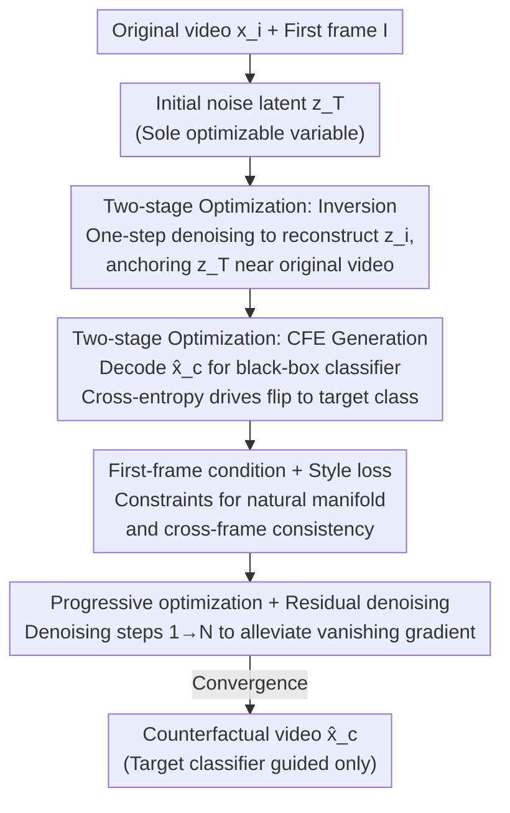

# Back to the Feature: Explaining Video Classifiers with Video Counterfactual Explanations

**Conference**: CVPR 2026  
**Paper**: [CVF Open Access](https://openaccess.thecvf.com/content/CVPR2026/html/Wang_Back_to_the_Feature_Explaining_Video_Classifiers_with_Video_Counterfactual_CVPR_2026_paper.html)  
**Code**: https://bttf.visurg.ai (Project page with code)  
**Area**: Interpretability / Video Understanding  
**Keywords**: Counterfactual Explanation, Video Classifier, I2V Diffusion Model, Spatiotemporal Feature Editing, Model Auditing  

## TL;DR
This paper proposes BTTF, a pure optimization framework that uses Image-to-Video diffusion models to generate Counterfactual Explanations (CFE) for **video classifiers**. By optimizing the initial noise latent variable solely based on the gradients of the target classifier—first anchoring the search via "inversion" near the original video and then optimizing toward the target category—it generates a "parallel video" that is most similar to the original yet classified as another category, revealing the spatiotemporal features the model relies on for decision-making.

## Background & Motivation
**Background**: Counterfactual Explanations (CFE) address the question: "What are the **minimal and semantically meaningful** changes required in the input to flip the model's prediction from the original class to a target class?" This contrastive explanation directly exposes the decisive features relied upon by the model, serving as a powerful tool for detecting spurious features or shortcuts. However, existing CFE methods almost exclusively target **image** classifiers, leaving video classifier interpretation largely unexplored.

**Limitations of Prior Work**: Directly applying image CFE to videos is ineffective. Image CFEs mostly perturb static features (texture, color), whereas the discriminative features of videos (object motion, facial expressions, human actions) are **dynamic**, spanning multiple frames with both spatial and temporal attributes. A valid video CFE must simultaneously satisfy five stringent criteria: validity (mapped to target class), proximity (minimal and local edits), actionability (semantically realistic actions rather than pixel noise), realism (residing on the natural video manifold), and spatiotemporal-consistency (smooth trajectories and physical plausibility). Independent frame-by-frame editing destroys temporal coherence.

**Key Challenge**: Mainstream image CFE approaches suffer from two fundamental flaws. First, the "noise-injection then classifier-guidance denoising" paradigm starts from **partially noisy** inputs, allowing edits only during low-noise local texture formation stages; it cannot modify global structures like motion or actions that require editing at high-noise stages. Second, to make the noise gradients of non-robust classifiers "meaningful," methods like DVCE introduce auxiliary robust classifiers for gradient alignment, while UVCE embeds target class names into prompts. Both "external aids" prevent the results from **faithfully** reflecting the target classifier's internal logic, as external priors contaminate the explanation.

**Goal**: Develop a video CFE framework that can edit **spatiotemporal features** while being **driven solely by the target classifier** (without auxiliary classifiers or class-name prompts).

**Key Insight**: The authors adopt the metaphor of the "Many-Worlds Interpretation" from quantum mechanics. Given an input video, an I2V diffusion model can generate infinite "spatiotemporal parallel videos" by denoising different initial noise latents under the same first-frame condition. The CFE task thus becomes: **searching for the parallel video closest to the original that is classified as the target class**.

**Core Idea**: Fix the first frame as a condition and **optimize only the initial noise latent $\mathbf{z}_T$**. Use the classifier's cross-entropy loss as the sole driving signal, combined with a two-stage "inversion-then-counterfactual" scheme to find the counterfactual video within the neighborhood of the original video.

## Method

### Overall Architecture
BTTF employs Wan-I2V, a SOTA Image-to-Video latent diffusion model, as the generator. The key observation is that for a fixed first-frame $\mathbf{I}$, Wan-I2V uses a deterministic flow-matching sampler so that the final output video $\mathbf{x}_0$ is a **deterministic function** of the initial noise latent $\mathbf{z}_T$. Therefore, the method keeps the diffusion model weights and prompts frozen, treating $\mathbf{z}_T$ as the only optimizable variable to "sculpt" the desired video via gradient backpropagation.

The process consists of two sequential stages. **Phase 1 (Inversion)**: The original video $\mathbf{x}_i$ is encoded into latent variables $\mathbf{z}_i$ as labels. $\mathbf{z}_T$ is optimized such that the noise-free latent $\hat{\mathbf{z}}_0$ obtained via one-step denoising reconstructs $\mathbf{z}_i$. This anchors $\mathbf{z}_T$ in the neighborhood capable of reproducing the original video, providing a starting point for the next stage. **Phase 2 (CFE Generation)**: Continued optimization of $\mathbf{z}_T$ aims to make the video $\hat{\mathbf{x}}_c$ (decoded from $\hat{\mathbf{z}}_0$ via VAE) flip to the target class $y_c$ when passed to the black-box target classifier. The objective $\mathcal{L}_C$ combines cross-entropy with a video style loss to ensure the result remains on the natural video manifold. To combat vanishing gradients in deep backpropagation chains, the denoising steps are progressively increased from 1 to $N$ during this phase.

### Key Designs

**1. Two-stage optimization: Inversion for proximity, CFE generation for validity**

The most difficult aspect of video CFE is flipping the prediction while ensuring minimal changes. Optimizing $\mathbf{z}_T$ directly toward the target class often causes the diffusion model to drift to distant parallel videos, destroying proximity. BTTF decouples these goals. Phase 1 uses an L1 reconstruction loss to calibrate $\mathbf{z}_T$:

$$\mathcal{L}_I(\hat{\mathbf{z}}_0, \mathbf{z}_i) = \lVert \hat{\mathbf{z}}_0 - \mathbf{z}_i \rVert_1$$

The denoising step is fixed at 1 here to provide an initial state close to $\mathbf{x}_i$. Phase 2 performs the counterfactual search near this anchor. Ablations (Fig. 6) show that without inversion, a "Salute→Cheer" edit might include an unnecessary step to the right before raising hands; the full version raises arms in place—both achieve 0.98 confidence, but the full version has fewer edits, proving inversion is key to suppressing irrelevant feature changes.

**2. First-frame conditioning + Video Style Loss: Realism on the natural manifold**

Relying solely on classifier gradients often results in unnatural videos filled with noise (similar to adversarial attacks). BTTF applies two constraints. First, it always uses the original first-frame $\mathbf{I}$ as the I2V condition to ensure identity and scene layout remains constant. Second, it introduces a video style loss $\mathcal{L}_S$—the squared Frobenius norm of the difference between Gram matrices of frames:

$$\mathcal{L}_S(\hat{\mathbf{x}}_c, \mathbf{x}_i) = \frac{1}{N_f C^2}\sum_{n=1}^{N_f} \lVert G(\hat{\mathbf{x}}_{c,n}) - G(\mathbf{x}_{i,n}) \rVert_F^2$$

where $N_f$ is the number of frames and $C=3$ (RGB). Since Gram matrices discard absolute coordinates, this loss is **translation-invariant**. This is critical as it enforces consistent appearance without penalizing the motion of objects, naturally supporting counterfactuals involving spatial shifts (as seen in Shape-Moving experiments). The total objective for Phase 2 is:

$$\mathcal{L}_C(\mathbf{x}_i, \hat{\mathbf{x}}_c, y_c, \hat{y}) = -\sum_{k=1}^{K} y_{c,k}\log\hat{y}_k + \lambda\,\mathcal{L}_S(\hat{\mathbf{x}}_c, \mathbf{x}_i)$$

The regularization coefficient is set to $\lambda = 1\times10^5$.

**3. Progressive optimization + Residual denoising: Alleviating vanishing gradients**

Propagating gradients through the long "VAE decoding + multi-step denoising" chain usually leads to vanishing gradients. BTTF employs two mechanisms: **Residual denoising**, which treats each denoising step as a residual block $\mathbf{z}_{t-1} \approx \mathbf{z}_t - \boldsymbol{\epsilon}_\phi(\mathbf{z}_t)$ to provide a gradient shortcut, and **Progressive optimization**, where the number of denoising steps starts at 1 and increases to $N=15$. Early shallow chains allow $\mathbf{z}_T$ to move quickly in the right direction, while later deep chains refine visual quality.

**4. Pure classifier guidance: Ensured faithfulness**

Unlike DVCE or UVCE, the gradient signals in BTTF **originate only from the target classifier** and the reconstruction loss. No auxiliary robust classifiers are used to "clean" the gradient. Furthermore, while Wan-I2V accepts text, the authors use **class-agnostic fixed prompts** (e.g., "This is a synthetic video") to prevent class priors from leaking into the generation. The resulting counterfactual is shaped purely by the interaction between the target classifier and the original video.

### Loss & Training
The diffusion model weights are frozen; LoRA is used for **domain adaptation**. For Shape-Moving and NTU RGB+D, Wan-I2V is fine-tuned on their respective training sets. For MEAD (facial expressions), it is fine-tuned on the larger CelebV-Text dataset. The target classifier is a Video Swin Transformer. During inference, only $\mathbf{z}_T$ is optimized.

## Key Experimental Results

### Main Results
Testing on Shape-Moving (pure spatiotemporal motion), MEAD (facial expressions), and NTU RGB+D (human actions). Target classifier performance:

| Dataset | Classifier | Standard Acc. | Robust Acc. (RA) ($\ell_2$-PGD, $\epsilon=20$) |
|--------|--------|------|------|
| Shape-Moving | M-swin | 100.0 | 28.8 |
| MEAD | E-swin | 98.9 | 0 |
| NTU RGB+D | A-swinR (Robust) | 54.2 | 35.8 |

Quantitative comparison with PGD Attack (on non-robust E-swin, "Angry→Happy"):

| Method | FR↑ | SSIM↑ | LPIPS↓ | FID↓ | FVD↓ |
|------|-----|-------|--------|------|------|
| PGD Attack | 1.00 | 0.99 | 0.02 | 0.68 | 0.53 |
| Ours | 0.99 | 0.81 | 0.17 | 19.03 | 275.44 |

⚠️ Note: PGD "crushing" BTTF in metrics actually exposes the **failure of current metrics**. Since E-swin is non-robust, PGD produces imperceptible and non-semantic noise that flips the label; BTTF generates physically plausible actions. This highlights that video CFE lacks a fair quantitative evaluation system.

### Ablation Study
Qualitative ablation results (Fig. 6, "Salute→Cheer"):

| Configuration | Observation | Explanation |
|------|------|------|
| Full | Raises both arms in place, SSIM 0.91 | Minimal edits, closest to original video |
| w/o Inversion | Steps right before raising arms, SSIM 0.83 | Irrelevant motion introduced; poor proximity |
| w/o Style Loss | Substantial quality degradation, SSIM 0.40 | Realism fails; style regularization is essential |

### Key Findings
- **Inversion maintains proximity, style loss maintains realism**: Removing either does not cause validity to fail (which is ensured by cross-entropy) but compromises minimal editing and natural appearance.
- **Pure spatiotemporal editing**: In Shape-Moving, BTTF precisely changes object motion direction (Down→Left/Up/Right), proving it can modify motion features that image CFEs cannot.
- **Model auditing/debugging tool**: When generating "kicking" counterfactuals for A-swinR, the model showed a person **stepping back** instead of kicking. Investigation revealed that the "kicking" training videos often featured two people where one person retreats. The classifier learned to use "retreating" as a shortcut for "kicking"—a spurious feature discovered by BTTF.

## Highlights & Insights
- **Reformulating CFE as an optimization of initial noise**: Leveraging the deterministic function of the sampler makes the process "clean" (no weight/prompt tuning) and guarantees faithfulness.
- **Style loss translation invariance**: The property of Gram matrices—discarding coordinates—is a "feature, not a bug" here; it allows appearance consistency to coexist with object displacement.
- **Actionable auditing**: Progresses interpretability from heatmaps to actionable audits by uncovering specific failure modes in SOTA classifiers.

## Limitations & Future Work
- **High computational cost**: Generating a 4-second video takes ≈2 hours on an 80GB A100 due to large parameters and deep backprop chains.
- **Domain alignment requirements**: Requires LoRA fine-tuning for specific domains.
- **Lack of standardized evaluation**: FID/FVD cannot measure semantic or causal validity. New metrics aligned with human perception of spatiotemporal logic are needed.

## Related Work & Insights
- **vs Image CFE (DiME/ACE)**: These modify local textures but cannot tap into global spatiotemporal structures; BTTF's full $\mathbf{z}_T$ optimization reaches high-noise structural edits.
- **vs DVCE**: DVCE aligns gradients using auxiliary robust models, potentially biasing the explanation away from the target model's actual logic; BTTF remains faithful.
- **vs UVCE**: UVCE relies on class-name prompts and text-to-video priors; BTTF uses neutral prompts to avoid language prior leakage.
- **vs PGD Attack**: PGD provides non-actionable pixel noise; BTTF provides semantic actions, exposing the flaw in using adversarial metrics for CFE evaluation.

## Rating
- Novelty: ⭐⭐⭐⭐⭐ First video CFE framework driven solely by the target classifier, capable of spatiotemporal editing/auditing.
- Experimental Thoroughness: ⭐⭐⭐⭐ Three tasks plus ablation and auditing cases, though quantitative metrics are weak due to industry-wide evaluation gaps.
- Writing Quality: ⭐⭐⭐⭐⭐ Logical flow from the five criteria to specific design choices.
- Value: ⭐⭐⭐⭐ High utility for model auditing, though compute requirements limit widespread adoption.

<!-- RELATED:START -->

<!-- RELATED:END -->

## Related Papers

- [\[ICLR 2026\] Action-Guided Attention for Video Action Anticipation](../../ICLR2026/causal_inference/action-guided_attention_for_video_action_anticipation.md)
- [\[ACL 2025\] Reasoning is All You Need for Video Generalization: A Counterfactual Benchmark with Sub-question Evaluation](../../ACL2025/causal_inference/reasoning_is_all_you_need_for_video_generalization_a_counterfactual_benchmark_wi.md)
- [\[CVPR 2026\] MaskDiME: Adaptive Masked Diffusion for Precise and Efficient Visual Counterfactual Explanations](maskdime_adaptive_masked_diffusion_for_precise_and_efficient_visual_counterfactu.md)
- [\[ICLR 2026\] Counterfactual Explanations on Robust Perceptual Geodesics](../../ICLR2026/causal_inference/counterfactual_explanations_on_robust_perceptual_geodesics.md)
- [\[ACL 2025\] Counterfactual Explanations for Aspect-Based Sentiment Analysis](../../ACL2025/causal_inference/counterfactual_explanations_for_aspect-based_sentiment_analysis.md)

<!-- RELATED:END -->
