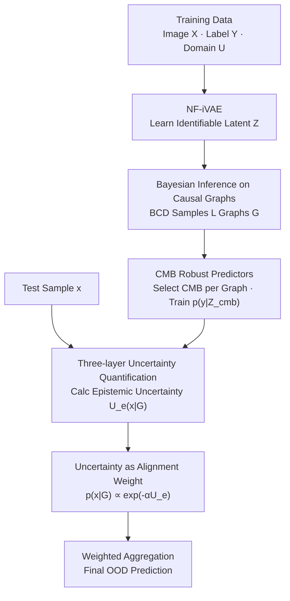

# CGU-Bayes: Causal Graph Uncertainty-Guided Bayesian Inference for Domain Generalization

**Conference**: CVPR 2026  
**Paper**: [CVF Open Access](https://openaccess.thecvf.com/content/CVPR2026/html/Yin_CGU-Bayes_Causal_Graph_Uncertainty-Guided_Bayesian_Inference_for_Domain_Generalization_CVPR_2026_paper.html)  
**Code**: None (Not provided by paper)  
**Area**: Causal Inference / Domain Generalization  
**Keywords**: Causal Graph, Bayesian Inference, Domain Generalization, Uncertainty Quantification, Causal Markov Blanket  

## TL;DR
Addressing the issue that "causal graphs are inaccurately estimated under data scarcity or noise when using Structural Causal Models (SCM) for domain generalization," this paper moves away from point-estimating a single causal graph. Instead, it performs **Bayesian inference on the causal graph posterior**, selects a set of Causal Markov Blanket (CMB) features from each sampled graph to train predictors, and performs a weighted ensemble using the "alignment uncertainty" between each graph and the test samples. This approach achieves SOTA performance on datasets with strong distribution shifts, such as BLT and CMNIST.

## Background & Motivation
**Background**: A mainstream approach in Domain Generalization (DG) involves using Structural Causal Models to characterize the data generation process, distinguishing between "cross-domain stable causal representations" and "cross-domain drifting spurious representations," and using only the former for prediction to resist distribution shifts. In this line of work, early methods relied on expert knowledge to manually construct SCMs and impose causal constraints, while recent methods (e.g., iCaRL, CMBRL) instead **learn SCM structures from observational data** and select target-causal-related features via independence tests.

**Limitations of Prior Work**: These "SCM learning" methods are essentially **point estimates**—learning only one causal graph and selecting just one set of causal features. Their DG performance highly depends on the accuracy of the estimated causal graph. However, independence tests are highly unreliable when **data is limited or noisy**. If the graph is misestimated, the selected causal features become contaminated by domain-related information, leading to the collapse of generalization. This is precisely the most common situation in real-world vision tasks.

**Key Challenge**: Point estimation of a single graph works fine when "data is sufficient," but the truly difficult scenarios for DG are data-scarce or noisy—where a single graph is both unreliable and overconfident. Existing Bayesian DG methods (e.g., BiteBayes) introduce posteriors, but they estimate the posterior of **invariant features or model parameters**; none estimate the posterior of the **causal graph structure itself**, nor do they truly integrate uncertainty into prediction.

**Goal**: (1) Improve OOD performance under scarce/noisy data; (2) Provide uncertainty metrics that reflect "whether the method is reliable on this dataset, whether the learned graph aligns with the unseen domain, and how confident a single prediction is"; (3) Ensure this uncertainty is not just "measured" but **actually participates in prediction**.

**Key Insight**: Since a single graph is unreliable, do not bet on one—sample **multiple credible graphs** from the causal graph posterior, provide a predictor for each graph, and weight them based on "which graph better fits the current test sample." In data-scarce scenarios, Bayesian causal discovery yields more **diverse** graphs, and this diversity helps dilute the domain-related noise present in individual graphs.

**Core Idea**: Shift Bayesian inference from "feature posterior" to "**causal graph posterior**" and use the epistemic uncertainty of a single graph $\mathcal{U}_e(\bm x^t|\mathcal{G})$ as alignment weights to perform a "weighted Bayesian ensemble."

## Method

### Overall Architecture
CGU-Bayes aims to calculate the prediction $p(y|\bm x^t, \mathcal{D})$ for test samples in unseen domains. It expands this quantity according to the causal graph posterior as shown in Eq. (1):

$$p(y|\bm x^t, \mathcal{D}) \propto \mathbb{E}_{\mathcal{G}\sim p(\mathcal{G}|\mathcal{D})}\big[\,p(y|\bm x^t, \mathcal{G})\,p(\bm x^t|\mathcal{G})\,\big]$$

This formula decomposes the task into three parts: the **graph posterior** $p(\mathcal{G}|\mathcal{D})$ (sampling multiple causal graphs from data), the **single-graph predictor** $p(y|\bm x^t,\mathcal{G})$ (each graph provides a robust prediction), and the **alignment term** $p(\bm x^t|\mathcal{G})$ (how well this graph fits the test sample, determining its weight in the ensemble).

The implementation consists of three training phases and one inference phase: Phase 1 uses NF-iVAE to learn identifiable latent variables $\bm Z$ from images $\bm X$ and samples observations $\{\bm Z, Y, U\}$; Phase 2 utilizes DAG-GFlowNet, a **Bayesian Causal Discovery (BCD)** method, to estimate $p(\mathcal{G}|\mathcal{D})$ and sample the top $L=5$ compliant graphs; Phase 3 selects CMB features for each graph $\mathcal{G}^l$ and trains a robust predictor. During inference, uncertainty is calculated per graph for the test sample → converted to weights → weighted aggregation.

### Key Designs

**1. Bayesian Inference on Causal Graph Posterior: From Betting on One Graph to Sampling Multiple**

To address the pain point where "single-graph point estimation fails completely if the estimation is wrong under scarce/noisy data," this paper elevates the target of Bayesian inference to the **causal graph structure itself**. Eq. (1) shows that calculating $p(y|\bm x^t,\mathcal{D})$ requires only the graph posterior $p(\mathcal{G}|\mathcal{D})$, single-graph predictors, and the alignment term. Instead of creating a new BCD, the authors chose DAG-GFlowNet after evaluating multiple SOTA methods to estimate $p(\mathcal{G}|\mathcal{D})$. Since the SCM in this paper has structural assumptions (e.g., prohibiting edges like $U\to Y$), **graphs violating these assumptions are discarded** after sampling, leaving only the top $L=5$ compliant graphs.

The key insight for this effectiveness is that when data is abundant, sampled graphs mostly fall into the same Markov equivalence class, leading to convergence of CMB and predictors, where Bayesian inference degrades to a single deterministic model—but deterministic methods are sufficient in that scenario. In **scarce/noisy** settings, BCD yields more diverse graphs, each less likely to encode domain-related noise, resulting in more stable generalization after ensemble. In other words, the advantage of this approach lies precisely in the range where single-graph methods suffer most.

**2. CMB Robust Predictors: Using Causal Markov Blanket as Cross-Domain Invariant Prediction Features**

Each sampled graph $\mathcal{G}$ requires a "domain-invariant, transferable" predictor $p(y|\bm x^t,\mathcal{G})$. This paper follows the SCM setting of Yin et al., categorizing latent variables $\bm Z$ based on their relationship with $Y$ into parent variables $\bm Z_p$, child variables $\bm Z_c$, spouse variables $\bm Z_s$, and spurious variables $\bm Z_o$. The first three form the **Causal Markov Blanket** $\bm Z_{cmb}$. Conditioning on $\bm Z_{cmb}$ can d-separate $Y$ from domain-related variables ($\bm Z_o$, $U$), ensuring robustness across environments while retaining maximum information about the target due to containing direct causes/effects/indirect causes. Thus, the predictor is approximated to take only the CMB as input (Eq. 2):

$$p(y|\bm x^t, \mathcal{G}) \approx p\big(y|(\bm z^{\mathcal{G}}_{cmb})^*\big),\quad (\bm z^{\mathcal{G}}_{cmb})^* =\arg\max p(\bm z^{\mathcal{G}}_{cmb}|\bm x^t,\mathcal{G})$$

Since the CMB is determined by the graph $\mathcal{G}$, each sampled graph identifies its own set $\bm Z^{\mathcal{G}}_{cmb}$ and trains a predictor. Classification uses cross-entropy, while regression uses Gaussian Negative Log-Likelihood (the network predicts both mean and variance).

**3. Alignment Weights via Epistemic Uncertainty: Letting "Graphs Fitting Test Samples" Speak Louder**

This is the core differentiator of the paper, solving the problem of "how much weight each graph should have in the ensemble." The alignment term $p(\bm x^t|\mathcal{G})$ measures how well a test sample fits a specific graph, but it cannot be calculated directly (test samples lack $U$ and $Y$, and test domain parameters are unknown). This paper approximates it using the **epistemic uncertainty** $\mathcal{U}_e(\bm x^t|\mathcal{G})$ of the predictor, adopting a standard exponential form (Eq. 3):

$$p(\bm x^t|\mathcal{G}) \propto e^{-\alpha\,\mathcal{U}_e(\bm x^t|\mathcal{G})}$$

The intuition is: a small $\mathcal{U}_e$ indicates the graph is well-aligned with the test sample and generalizes stably in that domain, thus contributing more to the aggregation; $\alpha$ controls the dispersion of weights—tuning it prevents weights from being nearly uniform (degradation to naive ensemble) or overly sharp (degradation to a single deterministic model). Finally, $p(\bm x^t|\mathcal{G}^l)$ for each graph is normalized as weights and combined with each predictor per Eq. (1). This step allows the Bayesian ensemble to **automatically favor predictors that generalize best to the current test domain**, rather than using a rigid equal-weight average.

**4. Three-layer Uncertainty Quantification: Categorizing "Reliability" across Graph, Sample, and Dataset Scales**

The paper uses three types of uncertainty, each serving a specific purpose, calculated via the decomposition of epistemic uncertainty: "Total Entropy - Aleatoric Entropy." **Single-graph prediction uncertainty** $\mathcal{U}_e(\bm x^t|\mathcal{G})$ (Eq. 5) is induced by sampling $\bm Z^{\mathcal{G}}_{cmb}$, representing the total entropy of the predictive distribution minus the average entropy given the CMB. It reuses quantities already calculated in Eq. (2) with almost zero overhead and serves as the source of alignment weights in Design 3. **Bayesian inference uncertainty** $\mathcal{U}_e(\bm x^t|\mathcal{D})$ (Eq. 6) characterizes the confidence of the entire weighted ensemble predictor and can be used to **filter out high-uncertainty, low-confidence predictions** at test time. **Causal graph uncertainty** $U(\mathcal{G})$ measures the difference between sampled graphs: for each graph, "whether variable $Z_i$ is in the CMB" is encoded as a 0/1 vector, and the average distance between all pairs of vectors is calculated. A larger $U(\mathcal{G})$ indicates higher graph diversity and a higher likelihood that the Bayesian approach will outperform deterministic methods, serving as an indicator for "whether the method is suitable for this dataset."

### Loss & Training
- **Phase 1 (Eq. 7)**: Train NF-iVAE with the objective of ELBO plus a score-matching term $\mathcal{L}_{SM}$. To match the inference process, the original encoder $q(\bm Z|\bm X,Y,U)$ is replaced with $q(\bm Z|\bm X)$. The authors claim (theoretically and empirically) that the learned $\bm Z$ remains component-wise identifiable—crucial for cross-domain transfer of CMB indices and encoders. ⚠️ The identifiability proof is in the appendix; the main text does not provide the full derivation.
- **Phase 3 (Eq. 8)**: Minimize prediction loss (classification cross-entropy / regression Gaussian NLL) for each graph. CMB representations are sampled from $q_{\hat{\psi}}(\bm z|\bm x)$.
- **Efficiency**: Only the top $L=5$ compliant graphs are taken. Phase 1/2 complexities are $O(|Z|^2)$ and $O((|Z|+2)^2)$, respectively. Phase 3 grows linearly with the size of each CMB set. Single-sample inference is approximately $O(SM_e + LSM_p)$ ($S$ is the number of encoder samples). The authors state that under parallel inference, the total overhead is comparable to baselines, and the extra training time is worthwhile for the precision gain in difficult data regions.

## Key Experimental Results

### Main Results
Evaluation covers the synthetic CMNIST, the complex real-world regression set BLT (biaxial loading of porcine heart valves with 7 stress ratio protocols as domains), and three standard distribution shift benchmarks: PACS, VLCS, and OfficeHome, all using leave-one-domain-out.

BLT (Regression, OOD Relative MSE%, lower is better, $|Z|=50$):

| Method | 1:1 | 0.05:1 | 1:0.1 | Average |
|------|-----|--------|-------|------|
| ERM | 68.3 | 111.0 | 214.5 | 76.4 |
| CMBRL (Strong Causal Baseline) | 58.3 | 85.0 | 179.2 | 62.9 |
| BiteBayes (Bayesian Baseline) | 65.3 | 89.0 | 182.1 | 64.6 |
| CGU-Bayes (w/o Weights) | 50.7 | 80.6 | 166.0 | 59.7 |
| **CGU-Bayes** | **41.4** | **73.2** | **150.2** | **54.2** |
| $U(\mathcal{G})$ | 12.3 | 25.1 | 37.6 | - |

Domains with stronger shifts (1:1, 0.05:1, 1:0.1) show greater gains, decreasing by 9.3 / 7.4 / 15.8 percentage points relative to the best baseline. Gains in domains with light shifts are smaller but remain positive. $U(\mathcal{G})$ is significantly larger in difficult domains, confirming that "more diverse graphs lead to more Bayesian benefits."

Standard Benchmarks (OOD Accuracy%, higher is better):

| Method | VLCS | PACS | OfficeHome |
|------|------|------|------------|
| CMBRL | 82.3 | 89.1 | 67.1 |
| BiteBayes | 79.1 | 85.5 | 66.4 |
| CGU-Bayes | 82.5 | 89.5 | 69.5 |
| **CGU-Bayes++** | **82.9** | **90.5** | **69.5** |

### Ablation Study

| Configuration | Key Phenomenon | Explanation |
|------|---------|------|
| CGU-Bayes vs. w/o Weights | BLT 0.05:1 error 80.6 → 73.2 | Removing uncertainty alignment weights significantly worsens results in difficult domains, validating Design 3. |
| CGU-Bayes++ vs. Uniform Ensemble | CMNIST/VLCS/PACS: 74.2/82.9/90.5 vs. 55.7/80.5/87.2 | Equal-weight averaging is dragged down by weak OOD models (ERM); the weighting mechanism adaptively reduces ERM weights. |
| Sufficient Clean Data (CMNIST) | CGU-Bayes matches CMBRL; CGU-Bayes++ is slightly better | When data is sufficient, CMB variation is small, degrading to a deterministic model, matching expectations in Design 1. |
| Filtering top 5/10/15% by $\mathcal{U}_e(\bm x^t|\mathcal{D})$ | OOD accuracy increases monotonically | High-uncertainty predictions are indeed more likely to be wrong, validating the utility of confidence in Design 4. |

### Key Findings
- **Uncertainty alignment weights contribute the most**: Performance drops significantly in strong shift domains without them, indicating that CGU-Bayes' gains come primarily from "weighting by graph-sample alignment" rather than simple multi-graph ensembles.
- **Benefits from "Difficult Data"**: On CMNIST with 500/1000 samples, it outperforms the Bayesian baseline by 8.3% / 5.9%; under strong noise ($\sigma^2=10/1$), it wins by 4.3% / 5.4%. On clean, abundant data, it merely matches deterministic methods—the advantage zone perfectly matches the motivation.
- **CGU-Bayes standalone is not universally superior**: On standard benchmarks, it often matches the strongest baselines. The stable winner is the boosted variant CGU-Bayes++, which uses multiple SOTA methods as base models.

## Highlights & Insights
- **Elevating Bayesian inference to the "Causal Graph" level** is a key dimensional upgrade: Previous Bayesian DG estimated feature/parameter posteriors; this paper estimates graph structure posterior, enabling the selection of CMB features that are theoretically guaranteed to be invariant and maximally predictive—marking the first convergence of "Bayesian" and "Causal" paths in DG this way.
- **Using predictor epistemic uncertainty to approximate the uncalculable alignment term $p(\bm x^t|\mathcal{G})$** is a clever engineering shortcut: $\mathcal{U}_e(\bm x^t|\mathcal{G})$ reuses CMB sampling and $p(y|\bm z_{cmb})$ already computed during prediction, obtaining weights with almost zero extra cost.
- **$U(\mathcal{G})$ as an "applicability indicator"** is highly transferable: Any method involving "multi-model/multi-structure ensembles" could borrow the idea of "measuring structural diversity first to determine if an ensemble is worthwhile," avoiding unnecessary overhead when data is sufficient.

## Limitations & Future Work
- **Strong dependence on upstream $\bm Z$ identifiability**: The authors note that if the NF-iVAE fails to fully disentangle $\bm Z$, the graph posterior from BCD will be inaccurate, and the selected CMB will be contaminated by domain-related information—capping the entire pipeline's performance at representation learning.
- **Unstable standalone gains**: CGU-Bayes often only matches baselines on standard benchmarks like PACS/VLCS/OfficeHome where data is relatively sufficient. Comprehensive leadership depends on CGU-Bayes++, a variant dependent on other SOTA models, weakening the standalone competitiveness of the method.
- **Fixed $L=5$ graphs** and sensitive $\alpha$ tuning; the weighting dispersion is sensitive to results. The paper does not provide a systematic sensitivity analysis for $L$ and $\alpha$ in the main text (moved to the appendix). ⚠️ Refer to the original appendix.
- **Future directions**: Replacing "discarding non-compliant graphs" with soft constraints or making $L$ adaptive to $U(\mathcal{G})$ could further improve efficiency/accuracy on difficult data.

## Related Work & Insights
- **vs. CMBRL / iCaRL (SCM-based Causal DG)**: These perform point estimation of a single graph and single CMB set; this paper samples multiple graphs and CMB sets from the posterior. The difference lies in diluting the risk of "misestimated graphs" via ensemble, making it more stable on scarce/noisy data at the cost of BCD and multiple predictor overhead.
- **vs. BiteBayes / PTG (Bayesian DG)**: These estimate posteriors for invariant features or classifier parameters; this paper estimates the **causal graph structure** posterior and uses uncertainty as alignment weights rather than just for diagnosis. On BLT, CGU-Bayes averages 54.2 vs. BiteBayes' 64.6 (relative MSE, lower is better).
- **vs. Naive Ensemble / GroupDRO / Mixup**: Uniform ensembles are dragged down by weak OOD base models. This paper uses $p(\bm x^t|\mathcal{G})\propto e^{-\alpha\mathcal{U}_e}$ for adaptive weighting, suppressing weights for base models like ERM under distribution shifts while retaining their in-domain advantages.

## Rating
- Novelty: ⭐⭐⭐⭐⭐ Elevated Bayesian inference to the causal graph structure layer and used single-graph uncertainty as alignment weights; clear logic with theoretical support.
- Experimental Thoroughness: ⭐⭐⭐⭐ Covered synthetic/real regression/three major benchmarks with detailed scarcity and noise settings, but standalone CGU-Bayes has limited gains on standard benchmarks, relying on the ++ variant.
- Writing Quality: ⭐⭐⭐⭐ Clear description of the three components (graph posterior/predictor/alignment) and three layers of uncertainty, though many derivations were moved to the appendix, and main text formulas are dense.
- Value: ⭐⭐⭐⭐ Provided an interpretable and diagnostic (three-layer uncertainty) practical framework for "causal domain generalization under data scarcity/noise."

<!-- RELATED:START -->

## Related Papers

- [\[AAAI 2026\] Causal Inference Under Threshold Manipulation: Bayesian Mixture Modeling and Heterogeneous Treatment Effects](../../AAAI2026/causal_inference/causal_inference_under_threshold_manipulation_bayesian_mixtu.md)
- [\[ECCV 2024\] Integrating Markov Blanket Discovery into Causal Representation Learning for Domain Generalization](../../ECCV2024/causal_inference/integrating_markov_blanket_discovery_into_causal_representation_learning_for_dom.md)
- [\[ICML 2026\] Controllable Generative Sandbox for Causal Inference](../../ICML2026/causal_inference/controllable_generative_sandbox_for_causal_inference.md)
- [\[CVPR 2026\] A Polynomial Chaos Framework for Causal Discovery in Nonlinear Uncertain Systems](a_polynomial_chaos_framework_for_causal_discovery_in_nonlinear_uncertain_systems.md)
- [\[ACL 2026\] iTAG: Inverse Design for Natural Text Generation with Accurate Causal Graph Annotations](../../ACL2026/causal_inference/itag_inverse_design_for_natural_text_generation_with_accurate_causal_graph_annot.md)

<!-- RELATED:END -->
