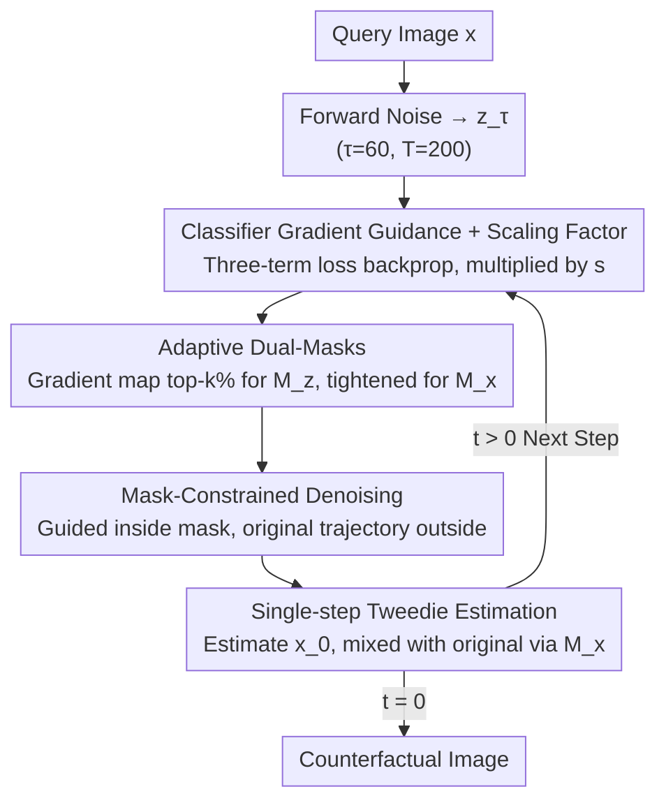

# MaskDiME: Adaptive Masked Diffusion for Precise and Efficient Visual Counterfactual Explanations

**Conference**: CVPR 2026  
**arXiv**: [2602.18792](https://arxiv.org/abs/2602.18792)  
**Code**: Coming soon  
**Area**: Causal Inference  
**Keywords**: Visual Counterfactual Explanations, Diffusion Models, Adaptive Masking, Explainable AI, Classifier Guidance

## TL;DR

MaskDiME is proposed, a training-free diffusion framework that transforms global classifier guidance into decision-driven local editing via an adaptive dual-masking mechanism. This achieves precise and efficient visual counterfactual explanations, with inference speeds over 30 times faster than DiME and GPU memory consumption only one-tenth that of ACE/RCSB.

## Background & Motivation

Visual Counterfactual Explanations (VCE) aim to answer "What must change in the image for the model to make a different decision?" — providing more intuitive and causal insights than attribution methods like heatmaps. While diffusion models have become the mainstream paradigm for VCE due to their superior generation quality, existing methods face two core challenges:

**Challenge 1: High computational cost**. DiME pioneered diffusion counterfactual generation but relies on nested denoising and step-by-step backpropagation, resulting in $O(T^2)$ complexity, slow speeds, and high memory usage. Multi-stage methods such as ACE and RCSB also suffer from high GPU memory consumption.

**Challenge 2: Poor spatial precision**. Most methods use global classifier guidance or implicit conditioning, causing signals to propagate indiscriminately and results in edits scattered across the image, making it difficult to identify which regions explain the decision. FastDiME accelerates the process but uses coarse pixel-difference masks; the fixed masks in ACE/RCSB cannot adapt to the dynamic changes of semantic regions (e.g., changes in facial expressions) during the reverse diffusion process.

**Key Insight**: Allowing the model to adaptively focus on decision-relevant regions at each step of reverse diffusion is the key to achieving precise and semantically consistent counterfactual explanations.

## Method

### Overall Architecture

The **Key Challenge** MaskDiME addresses is the need for "accurate modification" (affecting only decision-relevant regions) while maintaining "high execution speed" (avoiding the nested denoising and iterative backpropagation of DiME). It follows the classifier gradient guidance paradigm of DiME but modifies the workflow into a single-pass reverse diffusion. First, the query image $x$ is forward-diffused to timestep $\tau$ (default $\tau=60, T=200$), and then denoised step-by-step from $\tau$. Each step uses classifier gradients to push the image toward the target class, while a pair of adaptive masks restricts modifications to decision-relevant regions. Finally, the Tweedie formula provides a single-step estimation of the clean image. The entire process is training-free, directly reusing pre-trained unconditional DDPMs and target classifiers.

Forward diffusion:

$$\tilde{z}_t = \sqrt{\bar{\alpha}_t}\, x + \sqrt{1-\bar{\alpha}_t}\, \epsilon, \quad \epsilon \sim \mathcal{N}(0, I)$$

Mask-constrained denoising at each reverse step — performing gradient guidance inside the mask and preserving the original diffusion trajectory outside:

$$z_{t-1} = M_t^z \odot \mathcal{N}\!\big(\mu_\theta(z_t) - \Sigma_\theta(z_t) \nabla z_t,\, \Sigma_\theta(z_t)\big) + (1 - M_t^z) \odot \tilde{z}_{t-1}$$

### Key Designs

**1. Classifier Gradient Guidance + Scaling Factor: Precise Adjustment of Semantic Direction**

DiME is slow due to multi-stage recursive backpropagation. MaskDiME changes this to single-step estimation; however, if the guidance signal is weak, the counterfactual fails to flip the class (flipping rate is only 55.2% when $s=1$). Thus, it retains DiME's triple-joint loss and adds a scaling factor $s$ to boost guidance intensity. The loss is defined as $L(x_t; y, x) = \lambda_c L_{\text{class}}(C(y|x_t)) + \lambda_p L_{\text{perc}}(x_t, x) + \lambda_l L_{L1}(x_t, x)$, where $L_{\text{class}}$ drives the semantics toward the target, $L_{\text{perc}}$ preserves structure, and $L_{L1}$ stabilizes pixel-level differences. The gradient is backpropagated to the noise space and scaled by $s$:

$$\nabla z_t = s \cdot \frac{1}{\sqrt{\bar{\alpha}_t}} \nabla_{x_t} L(x_t; y, x)$$

Hyperparameters are $\lambda_c \in \{8,10,15\}$, $\lambda_p=30$, $\lambda_l=0.05$, and $s$ is set per dataset (8/10/14/6.5 for CelebA / CelebA-HQ / BDD / ImageNet). $s$ and masking are complementary: $s$ controls magnitude, while masks control spatial scope.

**2. Adaptive Dual-Masking: Tracking Decision Regions per Step**

Older methods either propagate gradients globally or use fixed masks (e.g., ACE/RCSB), which fail to capture dynamic semantic drifts like forming expressions. MaskDiME calculates two nested masks $M_t^x \subseteq M_t^z$ at each step. First, it computes the spatial gradient map $G_t = \left|\nabla_{z_t}^{\text{class}}\right|_{\text{avg}} \in \mathbb{R}^{1 \times H \times W}$ using the absolute value of the classification loss gradient — this requires only a single backpropagation pass, unlike the dozens required by Integrated Gradients in RCSB. The noise-level mask $M_t^z$ takes the top-$k\%$ ($k=0.05$ for smile, $0.1$ for age) of $G_t$, determining which regions undergo denoising. The clean-level mask $M_t^x$ is further tightened to the top-$\rho k\%$ ($\rho=0.25$ for CelebA-HQ, $0.5$ otherwise). Both undergo $5 \times 5$ morphological dilation. This dual-layer approach allows $M_t^x$ to prevent non-decision regions from being corrupted by perceptual/L1 gradients when the classification gradient weakens as $x_t$ approaches the target.

**3. Single-step Tweedie Clean Image Estimation: Reducing $O(T^2)$ to $O(T)$**

DiME's recursive reconstruction at each step drives its $O(T^2)$ complexity and memory overhead. MaskDiME uses the Tweedie formula to estimate the clean image in one step:

$$\hat{x}_0^{(t-1)} = \frac{z_{t-1} - \sqrt{1-\bar{\alpha}_{t-1}}\, \epsilon_\theta(z_{t-1})}{\sqrt{\bar{\alpha}_{t-1}}}$$

It then blends this with the original image using the clean-level mask, ensuring non-edited areas remain strictly unchanged: $x_{t-1} = M_t^x \odot \hat{x}_0^{(t-1)} + (1-M_t^x) \odot x$. This step provides the 30× speedup and 1/10 memory usage, with the scaling factor $s$ compensating for the reduced estimation quality.

### Loss & Training

Ours is completely training-free: it directly reuses unconditional DDPM weights and target classifier weights without additional training or fine-tuning. The only adjustable parameters are $s$, $k$, and $\rho$, where $k$ and $\rho$ are highly consistent across datasets.

## Key Experimental Results

### Main Results: CelebA Smile Attribute (128×128)

| Method | FID↓ | sFID↓ | FVA↑ | FS↑ | MNAC↓ | CD↓ | COUT↑ | FR↑ |
|------|------|-------|------|-----|-------|-----|-------|-----|
| DiME | 3.17 | 4.89 | 98.3 | 0.73 | 3.72 | 2.30 | 0.53 | 97.2 |
| ACE $\ell_1$ | 1.27 | 3.97 | 99.9 | 0.87 | 2.94 | 1.73 | 0.78 | 97.6 |
| FastDiME-2+ | 3.24 | 5.23 | 99.9 | 0.79 | 2.91 | 2.02 | 0.41 | 98.9 |
| RCSB | 2.98 | 4.79 | 100.0 | 0.91 | 2.24 | 2.78 | 0.87 | 99.8 |
| **MaskDiME** | **0.71** | **3.29** | **100.0** | **0.91** | 2.78 | 2.41 | **0.87** | **100.0** |

MaskDiME achieves the lowest FID (0.71) and sFID (3.29), a perfect flipping rate (FR=100%), and optimal or near-optimal FVA/FS/COUT.

### Ablation Study: CelebA Smile

| Config | FID↓ | FS↑ | MNAC↓ | CD↓ | COUT↑ | FR↑ |
|------|------|-----|-------|-----|-------|-----|
| DiME (baseline) | 3.17 | 0.73 | 3.72 | 2.30 | 0.53 | 97.2 |
| $s$=1 & No Mask | 95.76 | 0.63 | 6.15 | 2.43 | -0.16 | 55.2 |
| $s$=8 & No Mask | 15.94 | 0.77 | 5.71 | 4.20 | 0.96 | 100.0 |
| Fixed Mask | 4.21 | 0.86 | 2.98 | 2.03 | 0.70 | 99.7 |
| $s$=8 & Adaptive Mask ($\rho$=1) | 0.71 | 0.90 | 2.66 | 2.25 | 0.81 | 100.0 |
| **MaskDiME** ($\rho$=0.5) | **0.71** | **0.91** | 2.78 | 2.41 | **0.87** | **100.0** |

The ablation clearly reveals the contribution of each component: single-step estimation without masks ($s=1$) results in a massive FID (95.76) and low FR (55.2%); increasing $s$ restores FR but introduces artifacts (FID=15.94); introducing adaptive masking drops FID to 0.71; and the dual-mask ($\rho=0.5$) improves COUT from 0.81 to 0.87.

### Key Findings

- **30×+ Acceleration**: MaskDiME is 30x faster than DiME and 2.5x faster than FastDiME, with only 1/10 the GPU memory of ACE/RCSB.
- **Strong Generalization**: Achieves state-of-the-art or competitive results across five datasets: Faces (CelebA/CelebA-HQ), Autonomous Driving (BDD100K/BDD-OIA), and General Classification (ImageNet).
- **On BDD100K and BDD-OIA**, it achieves 100% FR, COUT of 0.85/0.80, and $S^3$ of 0.99.
- Heatmap visualizations show adaptive masks gradually focusing on decision-relevant regions such as mouths (smiling) or traffic lights (driving).
- Gradient scaling $s$ and the masking mechanism are complementary: $s$ controls guidance strength, while masks ensure spatial focus and semantic consistency.
- Diversity evaluation: $\sigma_L=0.0395$, which is higher than ACE $\ell_1$ (0.0174) but lower than DiME (0.2139) — DiME's high diversity stems from unconstrained background modifications rather than true semantic diversity.

## Highlights & Insights

- **Elegant Dual-Mask Design**: The noise-level mask defines the denoising region, while the clean-level mask is more compact to handle classifier gradient decay, effectively addressing different requirements in noise and clean spaces.
- **High Practicality**: Training-free, linear complexity, and low memory footprint make VCE feasible for real-world deployment.
- **Rigorous Visualization**: Comparisons (pixel-difference vs. fixed vs. adaptive masks) intuitively demonstrate the behavioral differences of different masking strategies.
- **Clever Ablation Logic**: The step-by-step addition of $s$, masks, and $\rho$ clearly reveals the independent contribution of each component.

## Limitations & Future Work

- Since masks are based on single-step gradients rather than Integrated Gradients, gradient noise in multi-class ImageNet scenarios leads to less accurate localization, resulting in higher FID/sFID than RCSB.
- Only supports pixel-space DDPM; not yet extended to Latent Diffusion, limiting applicability in high-resolution scenarios.
- Lack of ground-truth labels for counterfactual explanations makes it difficult to strictly verify correctness from a causal perspective.

## Rating

- Novelty: ⭐⭐⭐⭐ The adaptive dual-masking mechanism is elegantly designed, offering a new perspective on gradient-diffusion dynamics.
- Experimental Thoroughness: ⭐⭐⭐⭐ Covers five datasets across three visual domains with complete ablation and visualization analyses.
- Writing Quality: ⭐⭐⭐⭐ Excellent visualization (heatmaps, efficiency plots) with clear, logical progression.
- Value: ⭐⭐⭐⭐ 30x speedup and 1/10 memory usage make VCE practically deployable, significantly advancing the XAI field.

<!-- RELATED:START -->

## Related Papers

- [\[CVPR 2026\] Retrieving Counterfactuals Improves Visual In-Context Learning](retrieving_counterfactuals_improves_visual_in-context_learning.md)
- [\[CVPR 2026\] Back to the Feature: Explaining Video Classifiers with Video Counterfactual Explanations](back_to_the_feature_explaining_video_classifiers_with_video_counterfactual_expla.md)
- [\[ACL 2025\] Counterfactual Explanations for Aspect-Based Sentiment Analysis](../../ACL2025/causal_inference/counterfactual_explanations_for_aspect-based_sentiment_analysis.md)
- [\[ICCV 2025\] A Visual Leap in CLIP Compositionality Reasoning through Generation of Counterfactual Sets](../../ICCV2025/causal_inference/a_visual_leap_in_clip_compositionality_reasoning_through_gen.md)
- [\[ICLR 2026\] Counterfactual Explanations on Robust Perceptual Geodesics](../../ICLR2026/causal_inference/counterfactual_explanations_on_robust_perceptual_geodesics.md)

<!-- RELATED:END -->
