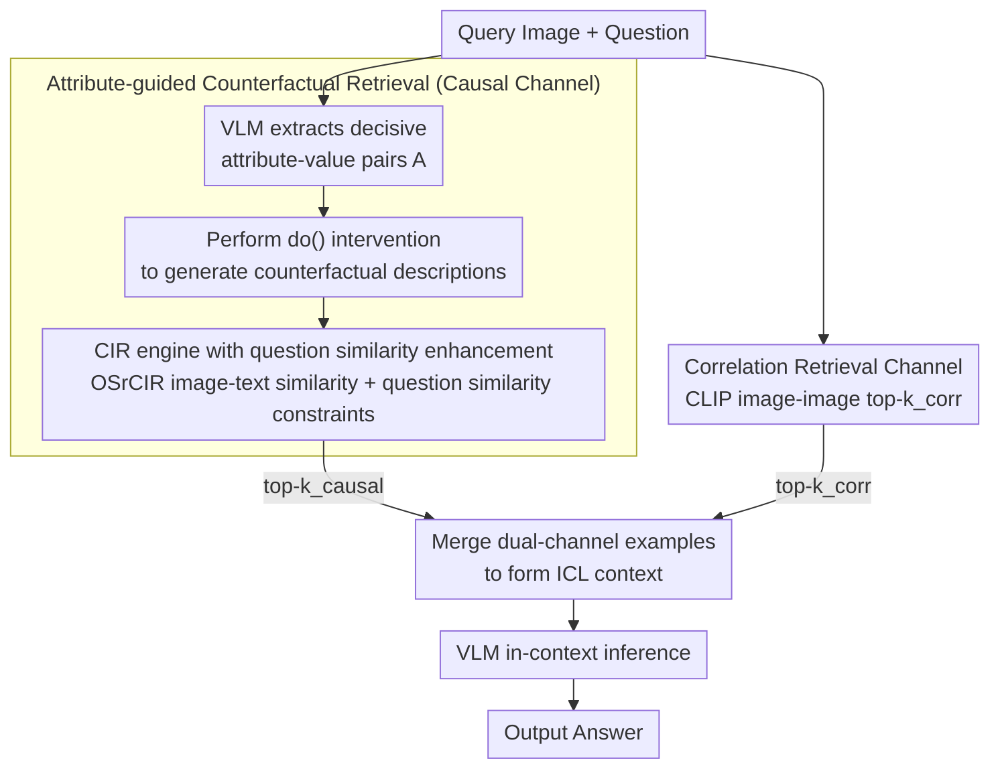

# Retrieving Counterfactuals Improves Visual In-Context Learning

**Conference**: CVPR 2026  
**arXiv**: [2603.16737](https://arxiv.org/abs/2603.16737)  
**Code**: [github.com/gzxiong/CIRCLES](https://github.com/gzxiong/CIRCLES)  
**Area**: Causal Inference  
**Keywords**: visual in-context learning, counterfactual reasoning, composed image retrieval, vision-language models, demonstration selection

## TL;DR

The CIRCLES framework is proposed to retrieve counterfactual examples through attribute-guided composed image retrieval, constructing a dual-channel in-context demonstration of "causality + correlation" to significantly enhance the fine-grained visual reasoning capabilities of VLMs.

---

## Background & Motivation

**Shortcomings of VLMs in Fine-grained Reasoning**: Vision-Language Models (VLMs) perform well on tasks like VQA and image captioning but often rely on spurious correlations in scenarios requiring differentiation of subtle visual attributes (e.g., feather color differences in bird classification), making accurate reasoning difficult.

**Key Bottlenecks of In-Context Learning**: ICL allows VLMs to quickly adapt to new tasks through a few examples, but its effectiveness is highly dependent on the selection strategy of those examples—the quality of demonstrations directly determines the reasoning quality.

**Systemic Flaws in Existing Retrieval Methods**: Similarity-based retrieval methods like RICES tend to select examples that are visually similar but share irrelevant confounding attributes, leading the model to learn surface correlations rather than true causal relationships.

**Essential Difference Between Correlation and Causality**: Similarity retrieval finds images that "look alike," but it cannot inform the model "which attribute change will change the answer"—which is the core of causal reasoning.

**Fragility in Information-Scarce Scenarios**: When relevant samples in the training set are limited, the performance of pure similarity retrieval drops sharply, lacking robustness.

**New Application Opportunities for CIR Technology**: Composed Image Retrieval was originally used for retrieval tasks themselves. This paper is the first to utilize it as a causal intervention tool to construct counterfactual examples for ICL.

---

## Method

### Overall Architecture

CIRCLES (Composed Image Retrieval for Causal Learning Example Selection) consists of three modules: (1) a causal understanding channel based on attribute-guided CIR; (2) a correlation understanding channel based on standard image similarity; and (3) retrieval-augmented inference combined from the dual channels. Given a query image and a question, the two channels retrieve $k_{\text{causal}}$ and $k_{\text{corr}}$ examples respectively, which are merged and used as the ICL context for VLM reasoning.

### Key Designs

**1. Attribute-guided counterfactual example retrieval: Showing the model that "changing one attribute changes the answer"**

The failure of VLMs on fine-grained tasks stems from their inability to distinguish "which attribute truly determines the label," leading them to take shortcuts using co-occurring irrelevant attributes. This channel addresses this pain point through counterfactual intervention: the VLM first extracts a set of decisive attribute-value pairs $\mathcal{A} = \{a_1, \dots, a_m\}$ from the query image (e.g., for a bird image, extracting "beak shape=pointed", "feather color=red", "size=small"). Then, for each attribute $a_i$, an alternative value $v_i'$ is sampled, and the VLM generates a counterfactual description $c^{\text{do}(a_i=v_i')}$ where "everything else remains the same, but $a_i$ is changed to $v_i'$" (e.g., "change feather color to blue"). During retrieval, CLIP calculates the image-text similarity $s_j^{\text{img}}$ between candidate images and this description, overlaid with a question-question semantic similarity constraint to rank and select the top-$k$. This step is essentially a $\text{do}(\cdot)$ intervention: isolating the causal effect of a single attribute from co-occurrence noise. The model directly observes paired contrasts of "change this attribute → label changes" in the context, rather than being fed another image that "looks similar but misses the point."

**2. Correlation retrieval channel: Recovering the global visual context lost in counterfactual examples**

Counterfactual examples focus on attribute differences, but the trade-off is that they often highlight only one local change, lacking coverage of overall visual patterns. Therefore, CIRCLES runs a standard correlation channel in parallel, using CLIP image-image cosine similarity $s_j^{\text{corr}} = \mathbf{z}_q^{I\top} \mathbf{z}_j^I$ to select the $k_{\text{corr}}$ most similar examples, providing the global context needed for identification and localization. The two channels form a division of labor: the causal channel handles "which attributes are important," while the correlation channel handles "what the overall appearance is." The merged results from both channels are fed as the ICL context to the VLM.

**3. CIR engine and question similarity enhancement: Ensuring counterfactual images are both realistic and relevant**

The quality of counterfactual examples depends on the underlying composed image retrieval engine. CIRCLES utilizes the training-free OSrCIR: it generates target descriptions conditioned directly on "query image + modified text," which is more precise than the two-stage "description then edit" approach like CIReVL, yielding a ~5.4% accuracy improvement on CUB. However, pure image-text retrieval might find images that are visually correct but irrelevant to the reasoning task. Thus, an additional question-question text similarity term $s_j^{\text{txt}} = \mathbf{z}_q^{Q\top} \mathbf{z}_j^Q$ is added to lock retrieval onto samples from the same task origin—this term alone contributes up to a 14.3% EM improvement on datasets with high question diversity like OK-VQA.

---

## Loss & Training

CIRCLES is a **training-free** framework:

- No fine-tuning or gradient updates are performed on the VLM.
- The CLIP encoder is frozen and used only for pre-calculating embeddings.
- The CIR module (OSrCIR) also requires no training.
- All computations are performed at inference time: attribute extraction → counterfactual description generation → retrieval → ICL inference.
- CLIP embeddings for training set samples can be pre-calculated and stored; inference overhead primarily comes from VLM calls for attribute extraction and description generation.

---

## Key Experimental Results

**Table 1: Main Results (4 datasets × 4 models)**

| Model | Method | CUB Acc | Flowers Acc | OK-VQA EM | VizWiz EM | Avg EM |
|------|------|---------|-------------|-----------|-----------|---------|
| Gemma3-4B | RICES | 65.40 | 86.70 | 26.65 | 56.08 | 58.71 |
| Gemma3-4B | **CIRCLES** | **71.97** | **93.32** | **31.27** | **57.61** | **63.54** |
| Gemma3-12B | RICES | 76.37 | 96.44 | 36.86 | 73.98 | 70.91 |
| Gemma3-12B | **CIRCLES** | **77.03** | **97.77** | **37.75** | **74.30** | **71.71** |
| Qwen2.5-VL-3B | RICES | 72.26 | 93.06 | 42.57 | 70.80 | 69.67 |
| Qwen2.5-VL-3B | **CIRCLES** | **74.89** | **94.70** | **43.24** | **72.93** | **71.44** |
| Qwen2.5-VL-7B | RICES | 82.15 | 98.83 | 43.66 | 73.79 | 74.61 |
| Qwen2.5-VL-7B | **CIRCLES** | **82.17** | **98.99** | **43.54** | **77.63** | **75.58** |

**Table 2: Ablation of Question Similarity Term (OK-VQA EM)**

| Model | w/o Q-Q Similarity | w/ Q-Q Similarity | Relative Gain |
|------|--------------|--------------|----------|
| Gemma3-4B | 27.72 | 31.27 | +12.8% |
| Gemma3-12B | 33.02 | 37.75 | +14.3% |
| Qwen2.5-VL-3B | 41.12 | 43.24 | +5.2% |
| Qwen2.5-VL-7B | 40.80 | 43.54 | +6.7% |

**Key Findings**:

- Information Scarcity Experiment: When 75% of the training set is removed, the advantage of CIRCLES over RICES on Gemma3-4B expands from 10.05% to 16.28%.
- CIR Method Comparison: OSrCIR vs. CIReVL provides a relative accuracy improvement of 5.39%-5.56%.
- Budget Allocation: With a total budget of 32 examples, a configuration of CIR 16 + IR 16 is optimal; with a small budget, broad attribute coverage is better, whereas large budgets benefit from focusing on a few specific attributes.

---

## Highlights & Insights

- **Introduction of Causal Perspective to ICL**: Systematically integrates causal intervention into VLM in-context example selection for the first time, upgrading from "finding similarities" to "finding contrasts."
- **Training-Free**: The entire framework is training-free and can be used out-of-the-box with any VLM, offering high practical utility.
- **Significant Gains for Small Models**: Improvement is particularly prominent for smaller models with limited internal knowledge (Gemma3-4B, Qwen2.5-VL-3B), with average EM gains of ~8%, indicating that counterfactual examples effectively compensate for model capacity deficiencies.
- **Robustness Under Information Scarcity**: The fewer the data, the greater the relative advantage of CIRCLES—this is highly valuable in practical applications.
- **Enhanced Explainability**: Counterfactual examples intuitively demonstrate "what to change → how the result changes," making the ICL process more transparent.

---

## Limitations

- **Increased Inference Overhead**: Each query requires VLM calls to extract attributes and generate counterfactual descriptions, increasing inference time and API costs.
- **Attribute Extraction Quality Depends on VLM**: If the VLM itself cannot accurately identify key attributes, the foundation of the framework's causal reasoning becomes unreliable.
- **Non-strict Causal Inference**: The paper acknowledges that CIRCLES is an approximate intervention rather than formal causal identification; it may fail when complex interactions exist between attributes.
- **Diminishing Returns on Large Models**: The improvement on Qwen2.5-VL-7B is relatively limited, suggesting that powerful models already possess certain internal causal reasoning capabilities.
- **Evaluated Only on Classification and VQA**: Lacks verification on more complex generative tasks (e.g., image captioning, visual grounding).

---

## Related Work & Insights

- **RICES / MUIER / MMICES** are primary baselines, all based on similarity retrieval without considering causal structures—CIRCLES differentiates itself by introducing a counterfactual dimension.
- **Composed Image Retrieval (CIR)** techniques like CIReVL and OSrCIR are innovatively repurposed from "retrieval tasks" to "causal intervention tools"—this "new use for old technology" approach is worth learning from.
- **Insights**: This paradigm can be extended to other scenarios requiring ICL (e.g., few-shot NLP, tool-use agents). The core idea is to replace pure similarity examples with contrastive/counterfactual examples, allowing the model to learn "change → impact" instead of "looks similar → answer is the same."

---

## Rating

| Dimension | Rating |
|------|------|
| Novelty | ⭐⭐⭐⭐ |
| Technical Depth | ⭐⭐⭐⭐ |
| Experimental Thoroughness | ⭐⭐⭐⭐ |
| Practical Value | ⭐⭐⭐⭐ |

<!-- RELATED:START -->

## Related Papers

- [\[CVPR 2026\] MaskDiME: Adaptive Masked Diffusion for Precise and Efficient Visual Counterfactual Explanations](maskdime_adaptive_masked_diffusion_for_precise_and_efficient_visual_counterfactu.md)
- [\[NeurIPS 2025\] Do-PFN: In-Context Learning for Causal Effect Estimation](../../NeurIPS2025/causal_inference/do-pfn_in-context_learning_for_causal_effect_estimation.md)
- [\[NeurIPS 2025\] Cyclic Counterfactuals under Shift–Scale Interventions](../../NeurIPS2025/causal_inference/cyclic_counterfactuals_under_shift-scale_interventions.md)
- [\[ICML 2025\] RATE: Causal Explainability of Reward Models with Imperfect Counterfactuals](../../ICML2025/causal_inference/rate_causal_explainability_of_reward_models_with_imperfect_counterfactuals.md)
- [\[ICCV 2025\] A Visual Leap in CLIP Compositionality Reasoning through Generation of Counterfactual Sets](../../ICCV2025/causal_inference/a_visual_leap_in_clip_compositionality_reasoning_through_gen.md)

<!-- RELATED:END -->
