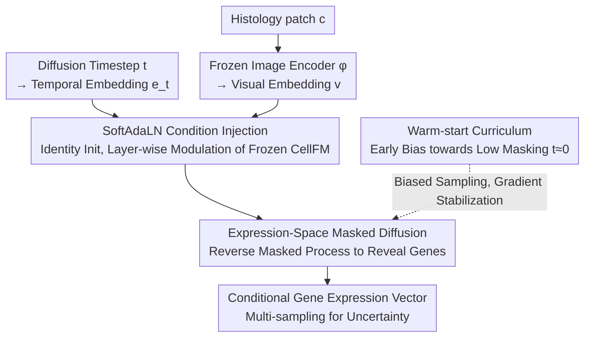

# HINGE: Adapting a Pre-trained Single-Cell Foundation Model to Spatial Gene Expression Generation from Histology Images

**Conference**: CVPR 2026  
**arXiv**: [2603.19766](https://arxiv.org/abs/2603.19766)  
**Code**: [https://github.com/donghaifang/HINGE](https://github.com/donghaifang/HINGE)  
**Area**: Biomedical Images / Generative Models  
**Keywords**: Spatial Transcriptomics, Single-cell Foundation Models, Masked Diffusion, Histology-conditioned Generation, SoftAdaLN

## TL;DR
The HINGE framework is proposed to adapt a pre-trained expression-space single-cell foundation model (sc-FM, CellFM) into a histology image-conditioned spatial gene expression generator. This is achieved by lightweight injection of visual context via identity-initialized SoftAdaLN modulation, alignment with pre-training objectives through an expression-space masked diffusion process, and training stabilization via a warm-start curriculum. It achieves SOTA results across three ST datasets while maintaining superior gene co-expression consistency.

## Background & Motivation

**Background**: Spatial Transcriptomics (ST) enables in situ measurement of gene expression but is limited by high costs and low throughput. Directly predicting spatial gene expression from H&E histology slides (which are routinely obtained) serves as a practical alternative.

**Limitations of Prior Work**: Existing methods fall into two categories: (1) Deterministic regression (ST-Net/HisToGene/TRIPLEX), which maps histology patches to expression vectors but ignores inherent biological stochasticity; (2) Conditional generation (Stem/STFlow), which models conditional distributions more flexibly but fails to capture gene-gene dependencies that are difficult to infer from histology images alone.

**Potential of Single-Cell Foundation Models (sc-FM)**: Models such as scGPT and CellFM are pre-trained on large-scale scRNA-seq data, encoding rich gene-gene regulatory and co-expression relationships. However, they are pure expression-space models and lack visual pathways.

**Key Challenge**: Adapting these models faces four challenges: (a) **Modality gap**—sc-FM has no visual pathway; (b) **Objective mismatch**—sc-FM uses masked autoencoding, while standard diffusion models perturb inputs with Gaussian noise; (c) **Compositional shift**—scRNA-seq represents single cells, while ST represents mixed cell clusters; (d) **Limited supervision**—Small ST datasets and noise lead to catastrophic forgetting during full fine-tuning.

**Core Idea**: Freeze the sc-FM backbone + inject histology and timestep conditions via identity-initialized SoftAdaLN + align with masked autoencoding pre-training using a masked diffusion process + stabilize early training via a warm-start curriculum.

## Method

### Overall Architecture
Ours aims to transfer a foundation model (CellFM) pre-trained on single-cell data to the task of "predicting spatial gene expression from histology image patches" without destroying learned gene relationship knowledge. The mechanism involves **freezing the CellFM backbone and inserting lightweight conditional modules**, framing the task as a masked diffusion process aligned with the pre-training objective (masked autoencoding). Histology patches pass through a frozen encoder $\phi$ to obtain visual embeddings, which are injected as conditions into newly inserted SoftAdaLN modules in each layer. Diffusion "gradually reveals masked genes" in the expression space; the reverse process yields conditional gene expression vectors.

### Key Designs

**1. SoftAdaLN Condition Injection: Identity Initialization Prevents Initial Forgetting**

The greatest risk in transfer learning is that fine-tuning on small datasets may wash away pre-trained gene relationships. SoftAdaLN inserts a lightweight modulation module before each Transformer sub-layer (MHA, SGLU) in CellFM and **seeds it as an identity transformation** to gradually inject histology information. Specifically, the visual embedding $\mathbf{v}=\phi(\mathbf{c})$ and timestep embedding $\mathbf{e}_t$ are concatenated and passed through a shared transformation $\mathbf{c}_t = \varphi_{cond}([\mathbf{v}; \mathbf{e}_t])$, followed by sub-layer modulation:

$$\text{SoftAdaLN}(\mathbf{h}|\mathbf{c}_t) = \text{SoftNorm}(\mathbf{h}) \odot (1+\mathbf{s}(\mathbf{c}_t)) + \boldsymbol{\kappa}(\mathbf{c}_t), \quad \text{SoftNorm}(\mathbf{h}) = (1-\eta)\mathbf{h} + \eta \cdot \tfrac{\mathbf{h}-\mu}{\sigma+\varepsilon}$$

Identity initialization sets $\eta=0$ (SoftNorm becomes identity), $\mathbf{s}=\mathbf{0}$, $\boldsymbol{\kappa}=\mathbf{0}$, and gating $\boldsymbol{\tau}\approx\mathbf{1}$, precisely replicating the original CellFM behavior at the start. Only the modulation parameters $\{\eta, \theta_\varphi, \theta_s, \theta_\kappa, \theta_\tau\}$ are updated, while CellFM and the image encoder remain frozen.

**2. Expression-Space Masked Diffusion: Aligning Diffusion with Pre-training Objectives**

Standard Gaussian diffusion adds noise to all components, causing the input distribution to differ from sc-FM’s masked autoencoding pre-training. Ours uses **masked diffusion** to bridge this gap: the forward process applies Bernoulli masks to gene expression components independently. The masking rate increases according to a power schedule $\bar{\alpha}_t = (1-t/T)^\zeta$, ranging from fully visible ($t=0$) to fully masked ($t=T$). The reverse process starts from a full mask and predicts masked components step-by-step. The loss is calculated only at masked positions:

$$\mathcal{L}(\theta) = \mathbb{E}\big[w_t \|(1-\mathbf{m}_t) \odot (f_\theta(\mathbf{x}_t, t, \phi(\mathbf{c})) - \mathbf{x}_0)\|_2^2\big]$$

Since the input format (partially masked observations) and supervision (mask-based prediction) match CellFM’s pre-training, it effectively reuses pre-trained knowledge.

**3. Warm-start Curriculum: Bias towards Low Masking to Stabilize Gradients**

Even with alignment, high-masking timesteps can cause instability in early fine-tuning. The warm-start curriculum biases the sampler toward $t\approx0$ (fewer genes masked) during early epochs before transitioning to uniform sampling. Low masking ensures inputs are closer to what CellFM encountered during pre-training, stabilizing early gradients.

### A Complete Example (from Histology Patch to Gene Expression)
Given a histology patch $\mathbf{c}$:
1. Initialize $\mathbf{x}_T=\mathbf{0}, \mathbf{m}_T=\mathbf{0}$ (fully masked, all zeros).
2. Extract visual embedding $\mathbf{v}=\phi(\mathbf{c})$ with the frozen encoder and inject it via SoftAdaLN.
3. At each step, sample unmasking probability $\pi_t$ to reveal new genes, predict their expression, and update the vector while keeping revealed genes unchanged.
4. Complete $T$ steps to obtain the full gene expression vector.
5. Re-sampling the mask trajectory allows for multiple "histology-consistent but varied" samples to characterize uncertainty.

## Key Experimental Results

### Main Results (Three ST Datasets)

| Method | Type | cSCC PCC-50↑ | Her2ST PCC-50↑ | Kidney PCC-50↑ |
|------|------|:---:|:---:|:---:|
| ST-Net | Regression | 0.548 | 0.439 | 0.327 |
| BLEEP | Regression | 0.643 | 0.520 | 0.404 |
| TRIPLEX | Regression | 0.683 | 0.536 | 0.410 |
| MERGE | Regression | 0.609 | 0.483 | 0.242 |
| Stem | Generation | 0.676 | 0.559 | 0.388 |
| STFlow | Generation | 0.678 | 0.543 | 0.391 |
| **HINGE** | **Generation** | **0.710** | **0.571** | **0.424** |

HINGE consistently outperforms all regression and generative baselines across the three datasets.

### Co-expression Consistency Analysis
Gene expressions generated by HINGE show significantly higher consistency with real ST data in terms of pairwise gene Pearson correlation matrices, proving that sc-FM’s gene relationship knowledge is successfully preserved and transferred.

### Spatial Marker Gene Expression Patterns
HINGE's spatial distribution of marker gene expression is closer to the ground truth compared to baselines, demonstrating superior spatial consistency.

### Ablation Study

| Configuration | cSCC PCC-50 | Note |
|------|:---:|------|
| w/o sc-FM (Random Init) | Significant Drop | Value of gene relationship knowledge |
| Gaussian Diffusion (Non-masked) | ~0.68 | Objective mismatch hinders transfer |
| w/o SoftAdaLN (Concat) | Drop | Crude injection disrupts pre-trained features |
| w/o warm-start | Unstable | Gradient spikes at high mask levels |
| Full Fine-tuning CellFM | Drop | Catastrophic forgetting on small data |
| **Full HINGE** | **0.710** | All components are complementary |

### Key Findings
- **Quantifiable Value of sc-FM Pre-training**: Random initialization vs. CellFM shows a clear gap in PCC-50 and a larger gap in co-expression consistency.
- **Necessity of Objective Alignment**: Masked diffusion provides a ~3% PCC gain over Gaussian diffusion and significantly better gene co-expression, proving the importance of matching the pre-training input format.
- **Freezing > Fine-tuning**: Full fine-tuning of CellFM on limited ST data performs worse; freezing with SoftAdaLN is the optimal strategy.
- **Crucial Identity Initialization**: Non-identity initialization disrupts pre-trained behavior; progressive adaptation is essential.

## Highlights & Insights
- **Universal Paradigm for Cross-modal Foundation Model Adaptation**: HINGE demonstrates a clear path—frozen backbone + identity-initialized modulation + objective alignment—to adapt pure-text or pure-expression models into conditional generators.
- **Biological Intuition of Masked Diffusion**: Generating gene expression resembles "gradually revealing gene values" rather than "denoising all genes from Gaussian noise," naturally aligning with the masked autoencoding paradigm.
- **Knowledge Preservation > New Information**: Under limited ST supervision, maintaining learned gene relationships is more important than forcibly injecting histology info, challenging the "more conditioning = better" intuition.
- **Advantages of Generative over Regression**: HINGE excels in spatial consistency and co-expression patterns, producing more biologically meaningful predictions beyond simple PCC improvements.

## Limitations & Future Work
- Currently only instantiates CellFM as the backbone; other models like scGPT or scFoundation remain to be tested.
- H&E histology resolution limits the capture of fine cellular subtype variations; higher resolution (e.g., IF) could be explore.
- Small scale of current ST datasets; larger data may further unlock sc-FM potential.
- Inference requires multiple samples for averaging, increasing computational cost.
- Future work could explore combining HINGE with spatial-aware sc-FMs (e.g., scGPT-spatial).

## Related Work & Insights
- **vs Stem/STFlow**: These methods do not utilize sc-FM knowledge, leading to poor co-expression consistency.
- **vs TRIPLEX**: Multi-scale regression is competitive in PCC but ignores biological stochasticity.
- **vs scGPT-spatial**: Uses spatial pre-training without histology conditioning; HINGE is complementary.
- **vs AdaLN (DiT)**: While DiT’s AdaLN is trained from scratch, SoftAdaLN uses identity initialization to preserve pre-training.

## Rating
- Novelty: ⭐⭐⭐⭐⭐ First adaptation of sc-FM for histology-conditioned generation; elegant alignment design.
- Experimental Thoroughness: ⭐⭐⭐⭐ Three datasets, six baselines, and comprehensive co-expression/ablation analyses.
- Writing Quality: ⭐⭐⭐⭐⭐ Clear mapping from challenges to solutions with complete derivations.
- Value: ⭐⭐⭐⭐⭐ Significant contribution to both computational biology and AI methodology for foundation model adaptation.

<!-- RELATED:START -->

## Related Papers

- [\[CVPR 2026\] From Spots to Pixels: Dense Spatial Gene Expression Prediction from Histology Images](from_spots_to_pixels_dense_spatial_gene_expression_prediction_from_histology_ima.md)
- [\[CVPR 2026\] Predicting Spatial Transcriptomics from Histology Images via High-Order Multi-Cell Interaction Modeling](predicting_spatial_transcriptomics_from_histology_images_via_high-order_multi-ce.md)
- [\[CVPR 2026\] Cell-Type Prototype-Informed Neural Network for Gene Expression Estimation from Pathology Images](cell-type_prototype-informed_neural_network_for_gene_expression_estimation_from_.md)
- [\[CVPR 2026\] Cross-Slice Knowledge Transfer via Masked Multi-Modal Heterogeneous Graph Contrastive Learning for Spatial Gene Expression Inference](cross-slice_knowledge_transfer_via_masked_multi-modal_heterogeneous_graph_contra.md)
- [\[ICML 2026\] Scalable Single-Cell Gene Expression Generation with Latent Diffusion Models](../../ICML2026/computational_biology/scalable_single-cell_gene_expression_generation_with_latent_diffusion_models.md)

<!-- RELATED:END -->
