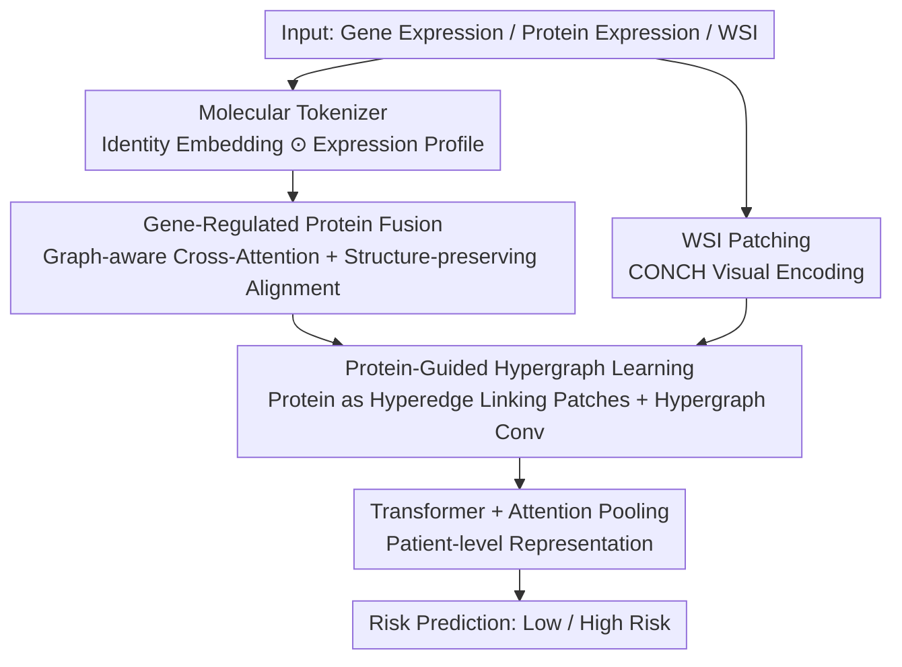

# Advancing Cancer Prognosis with Hierarchical Fusion of Genomic, Proteomic and Pathology Imaging Data from a Systems Biology Perspective

**Conference**: CVPR 2026  
**Paper**: [CVF Open Access](https://openaccess.thecvf.com/content/CVPR2026/html/Zhou_Advancing_Cancer_Prognosis_with_Hierarchical_Fusion_of_Genomic_Proteomic_and_CVPR_2026_paper.html)  
**Code**: None  
**Area**: Computational Biology / Multimodal Survival Prediction  
**Keywords**: Cancer Prognosis, Multi-omics Fusion, Proteome, Hypergraph Learning, Whole Slide Imaging  

## TL;DR
HFGPI explicitly models the "gene → protein → tissue morphology" systems biology cascade as a hierarchical fusion pipeline. It utilizes graph-aware cross-attention to characterize gene-to-protein regulation and hypergraphs to link proteins to pathology patches. On 5 TCGA cohorts, it achieves an average C-index of 0.753 for survival prediction, outperforming all Prev. SOTA.

## Background & Motivation
**Background**: The mainstream of cancer survival prediction is multimodal fusion—combining **gene expression** obtained from sequencing with pathology **Whole Slide Images (WSI)**. WSIs provide phenotypic information such as cellular tissue morphology but lack molecular mechanisms; gene expression reveals molecular subtypes and pathway dysregulation. Representative works such as MCAT (Co-attention Transformer), MOTCat (Optimal Transport), and SurvPath (Pathway Knowledge) have validated that multimodal approaches outperform unimodal ones.

**Limitations of Prior Work**: The authors point out two overlooked gaps in existing frameworks. First is the **omission of the proteome**—genes are merely "instructions," while proteins are the actual executors of cellular functions and the direct determinants of tissue morphology. Clinically, HER2 protein overexpression (rather than ERBB2 mRNA levels) determines pathological membrane staining patterns, and decisions are made by observing protein status via immunohistochemistry. Gene signatures alone cannot characterize post-transcriptional/translational regulation. Second is **flat fusion**: existing methods align all modalities within the same hierarchy, failing to reflect the hierarchical dependencies of biological tissues.

**Key Challenge**: Biological information essentially **cascades along a hierarchy**—genes encode instructions, proteins execute functions, and functions manifest as tissue morphology (gene → protein → phenotype). Existing architectures flatten this directed cascade into "peer-level alignment," naturally losing the path of "how molecular abnormalities mechanistically lead to morphological outcomes." Furthermore, existing methods treat expression profiles as isolated numerical vectors, completely ignoring the inherent biological attributes of genes/proteins such as functional annotations and co-expression.

**Goal**: (1) To introduce the proteome as an intermediate layer connecting genotype and phenotype; (2) To replace flat fusion with an explicit hierarchical fusion pipeline modeling biological levels; (3) To involve the "identity semantics" of molecules in representation learning, rather than just expression values.

**Key Insight**: Redesign the architecture from a **systems biology perspective**—since biological information is a directed cascade of gene → protein → phenotype, the fusion pipeline should advance layer-by-layer in this order.

**Core Idea**: A triplet of "Molecular Tokenizer (injecting identity semantics into genes/proteins) + Gene-Regulated Protein Fusion + Protein-Guided Hypergraph" is used to explicitly model the gene→protein→morphology hierarchical cascade step-by-step for progressive fusion in survival prediction.

## Method

### Overall Architecture
Given a patient's WSI, gene expression, and protein expression data, HFGPI advances through four stages following the biological hierarchy. **First Stage (Feature Extraction)**: The WSI is tiled into 20× non-overlapping patches, and patch features are extracted using a pre-trained visual encoder (CONCH); genes and proteins pass through their respective **Molecular Tokenizer**, fusing "identity embeddings" and "expression profiles" into biologically informed molecular representations. **Second Stage**: **Gene-Regulated Protein Fusion (GRPF)** uses graph-aware cross-attention + structure-preserving alignment to explicitly model the directed regulation of "gene → protein," outputting gene-regulated protein representations. **Third Stage**: **Protein-Guided Hypergraph Learning (PGHL)** treats each protein as a hyperedge connecting semantically related patches, using hypergraph convolution to capture higher-order many-to-many "protein-morphology" relationships. **Fourth Stage**: The hierarchically fused features pass through a Transformer encoder + gated attention pooling to aggregate into patient-level representations for predicting hazard. The three contributory modules are linked in an upward chain following the gene→protein→image hierarchy.

### Key Designs

**1. Molecular Tokenizer: Injecting "Identity Semantics" into genes and proteins, rather than just feeding expression values**

This addresses the limitation where existing methods treat expression profiles as isolated numerical vectors, losing the functional annotations and co-expression relationships of the genes/proteins themselves. The Molecular Tokenizer performs element-wise multiplication fusion of the **quantitative expression profile** and **qualitative identity embedding**. For genes, Gene2Vec generates a 200-dimensional identity embedding $G \in \mathbb{R}^{N_g \times d_g}$ (functionally related genes are close in the embedding space), which is then modulated by the patient's expression $e^{(k)}$: $X_g^{(k)} = e^{(k)} \odot G$. This allows the expression level to modulate the identity embedding at a single-gene granularity, resulting in a representation that encodes both "what this gene is" and "how much it is expressed." For proteins, the ingenious design is to **naturally align protein identity embeddings with the pathological image space**—an LLM (GPT-5) is used to generate text descriptions for each protein (function + its potential corresponding morphological features on H&E slides), which are then encoded into $P$ by a VLM (CONCH) text encoder, similarly $X_p^{(k)} = q^{(k)} \odot P$. Because protein identity embeddings and patch features come from the same CONCH, a shared semantic space is available for subsequent protein-patch association.

**2. Gene-Regulated Protein Fusion (GRPF): Characterizing "Gene-Regulated Protein" with directed cross-attention and preserving biological topology via structural constraints**

Biological regulation flows unidirectionally from genes to proteins (transcription + translation); flat alignment fails to capture this directionality. GRPF consists of three steps. First, **molecular graph construction + GCN refinement**: k-NN ($k_g{=}100, k_p{=}20$) is used to build a gene graph $A_g$ and protein graph $A_p$ based on cosine similarity, followed by GCN to propagate network context into $X_g, X_p$. Next is **directed cross-attention**—letting the protein act as the query to retrieve regulatory information from genes (reflecting "gene control over protein activity"):

$$T = \mathrm{softmax}\!\left(\frac{Q K^\top}{\sqrt{d}}\right) \in \mathbb{R}^{N_p \times N_g},\quad Q = X_p W_Q,\ K = X_g W_K,\ V = X_g W_V$$

where $T_{ij}$ quantifies the strength of regulation of protein $i$ by gene $j$. The third step is **structure-preserving alignment**: since functionally coupled proteins are often encoded by co-regulated genes, the attention matrix $T$ is constrained to respect the network topology of both sides—$L_{struct} = \frac{1}{N_g N_p}\lVert C_g - T^\top C_p T\rVert_F^2$, where $C_g = 1 - A_g$ and $C_p = 1 - A_p$ are structural cost matrices (low cost = high functional similarity). The final fusion is $X_p^{regulated} = X_p + TV$, where the first term retains original protein information and the second term injects gene regulatory signals. This step explicitly embeds the "gene→protein" dependency into the representation.

**3. Protein-Guided Hypergraph Learning (PGHL): Linking a protein to multiple tissue patches via hyperedges to model many-to-many "protein-morphology" higher-order relationships**

Proteins execute functions through spatially dispersed morphological changes: one protein may be expressed across multiple tissue regions, while a single patch often reflects the activities of multiple proteins—this is a **many-to-many** relationship that ordinary pairwise cross-attention cannot capture. PGHL builds this as a hypergraph $H=(V,E)$: nodes $V$ are patches, and **hyperedges $E$ are proteins**. Each protein $i$ defines a hyperedge connecting the top-$k$ ($k{=}32$) patches most semantically related to it—based on the cosine similarity $S = \mathrm{sim}(Y, X_p^{regulated})$ between patch features $Y$ and gene-regulated protein embeddings $X_p^{regulated}$, forming an incidence matrix $H_{ji}$. **Hypergraph convolution** is then performed to allow patches sharing protein associations to aggregate context: $Z = \sigma(D_v^{-1/2} H W_e D_e^{-1} H^\top D_v^{-1/2} Y W_p)$. **Hyperedge aggregation** follows to obtain protein-driven morphological representations $E = H^\top Z / \deg(E)$, which are finally fused with gene-regulated protein embeddings $F = E + X_p^{regulated}$. This yields a hybrid representation encoding gene regulation, protein semantics, and tissue morphology, completing the final "protein→morphology" jump in the hierarchical chain.

### Loss & Training
The total loss combines the survival loss and structural constraints: $L = L_{surv} + \lambda L_{struct}$. $L_{surv}$ is the standard negative log-likelihood (NLL) loss for survival analysis, calculating likelihood for censored and event samples based on the hazard function $h^{(k)}(t)$ and survival function $S^{(k)}(t)=\prod_{u=1}^{t}(1-h^{(k)}(u))$; $\lambda=0.3$ balances prediction performance and structural consistency. Fused features $F$ pass through a Transformer encoder to capture global dependencies, then gated attention pooling adaptively aggregates indices into a patient-level representation $h$ according to prognostic relevance, and finally a prediction head estimates the hazard. Training for 20 epochs, AdamW, learning rate $1\times10^{-4}$, batch size 1 + 16-step gradient accumulation, RTX 3090. Top $N_g=2000$ highly variable genes are selected.

## Key Experimental Results

### Main Results
5 TCGA cohorts (BLCA/BRCA/GBMLGG/LUAD/UCEC), 5-fold cross-validation, metric is C-index (mean ± std, higher is better). HFGPI achieves an average C-index of 0.753, reaching SOTA on all datasets.

| Model | Modality (G/P/I) | BLCA | BRCA | GBMLGG | LUAD | UCEC | Average |
|-------|------------------|------|------|--------|------|------|---------|
| WiKG (Strongest Unimodal) | I | 0.691 | 0.699 | 0.808 | 0.601 | 0.631 | 0.686 |
| MCAT | G+I | 0.686 | 0.685 | 0.835 | 0.639 | 0.716 | 0.712 |
| CMTA | G+I | 0.693 | 0.681 | 0.839 | 0.643 | 0.702 | 0.712 |
| MoME | G+I | 0.704 | 0.688 | 0.835 | 0.651 | 0.714 | 0.718 |
| PS3† | G+P+I | 0.708 | 0.702 | 0.851 | 0.659 | 0.757 | 0.735 |
| ICFNet† | G+P+I | 0.705 | 0.692 | 0.846 | 0.664 | 0.739 | 0.729 |
| **HFGPI (Ours)** | G+P+I | **0.717** | **0.715** | **0.873** | **0.680** | **0.782** | **0.753** |

> † denotes variants where the text modality in original methods was replaced with proteomic data. HFGPI is 6.7% higher than the strongest unimodal WiKG, 1.8% higher than the strongest trimodal PS3, and 2.4% higher than ICFNet. Trimodal methods with proteins generally outperform two-modal versions by 1.1%~5.4%, validating the complementary value of the proteome as an intermediate phenotype.

### Ablation Study
Average C-index (mean over five datasets):

| Configuration | Ave. C-index | Description |
|---------------|--------------|-------------|
| Full HFGPI | 0.753 | Complete trimodal model |
| Remove protein (g, i only) | 0.713 (−4.0%) | Removing proteome causes a major drop |
| g, p only | 0.708 (−4.5%) | Removing image |
| p, i only | 0.708 (−4.5%) | Removing genes |
| Tokenizer → Protein Family | 0.739 (−1.4%) | Replace identity embedding with family coding |
| Tokenizer → Pathway | 0.743 (−1.0%) | Replace with pathway coding |
| GRPF → Standard Cross-Attn | 0.730 (−2.3%) | Remove graph-awareness + structural alignment |
| PGHL → Standard Cross-Attn | 0.735 (−1.8%) | Remove hypergraph higher-order modeling |
| w/o $L_{struct}$ | 0.737 (−1.6%) | Remove structure-preserving alignment |

Encoder selection experiments: VLM using CONCH (0.753) is significantly better than CLIP (−6.5%), PLIP (−2.8%), and QUILT (−3.7%), indicating the criticality of pathology-specific foundation models; LLM using GPT-5 (0.753) is slightly better, but gaps with DeepSeek/Qwen-3/Claude-3.7 are within 1%, suggesting framework robustness to LLM choice.

### Key Findings
- **All Three Modalities are Essential**: Removing any single modality drops the performance by about 4%, indicating they capture complementary biological information; removing the protein leads to a significant drop, confirming the core thesis that the "proteome is an indispensable intermediate layer."
- **GRPF Contribution is Significant (−2.3%)**: Replacing graph-aware cross-attention with standard cross-attention causes the largest drop, showing that explicit modeling of gene→protein directed regulation + structural topology constraints yields actual Gains.
- **Identity Semantics vs. Expression Values**: Molecular Tokenizer outperforms gene family/pathway encoding by 1.4%/1.0%, proving the utility of fine-grained molecular identity information at the single-gene scale.
- **Encoder Alignment is Crucial**: VLM pre-trained on pathology image-text pairs like CONCH aligns protein text with patches in the same space, which is the prerequisite for PGHL's protein-patch association; switching to general CLIP causes a 6.5% drop.

## Highlights & Insights
- **Drafting the "Systems Biology Cascade" into Network Architecture**: "Gene → protein → phenotype" is not just a slogan but implemented via Tokenizer → GRPF → PGHL modules, making the architecture an embodiment of biological hypotheses with inherent interpretability.
- **Using LLM to generate "morphological descriptions" of proteins and VLM to encode them** cleverly pulls protein embeddings into the pathological image space—this cross-modal alignment trick is key to PGHL linking proteins and patches, a strategy transferable to any task aligning symbolic biological entities with images.
- **Hypergraph Modeling for Many-to-Many Relationships**: One protein = one hyperedge connecting multiple patches, which fits the biological reality better than pairwise attention; this "entity as hyperedge" paradigm is applicable to other higher-order relationship scenarios.
- **Structure-preserving Alignment** uses $\lVert C_g - T^\top C_p T\rVert_F^2$ to turn biological priors (functionally coupled proteins encoded by synergistic genes) into a regularization term, offering a lightweight way to inject domain knowledge into attention.

## Limitations & Future Work
- **Dependency on paired multi-omics + pathology data**: The 5 cohorts were selected precisely because all three types of data were available (UCEC only n=122); in reality, proteome (RPPA) coverage is far lower than transcriptome, posing a bottleneck for deployment. This paper does not handle missing modalities (unlike LD-CVAE/GHANet).
- **Quality of protein identity embeddings is dominated by LLM descriptions**: While experiments show robustness to LLM choice, descriptions may contain hallucinations or outdated knowledge, lacking independent validation of accuracy. ⚠️ Protein set size ($N_p$) is not explicitly stated in the main text; refer to supplementary materials.
- **RPPA covers limited cancer-related and phosphorylated proteins**, not the full proteome; the coverage of the "proteomic intermediate layer" is restricted. Whether this hierarchical hypothesis remains robust for mass spectrometry-based full proteomes deserves validation.
- Future Directions: Combining missing modality imputation (e.g., LD-CVAE style) with the hierarchical fusion of Ours; or extending the "gene→protein→morphology" chain to clinical/radiomics data for longer cascades.

## Related Work & Insights
- **vs MCAT / MOTCat / SurvPath (Two-modal G+I)**: These use co-attention / optimal transport / pathway knowledge to align genes and images but lack the protein layer and use flat fusion. Ours explicitly inserts the protein intermediate layer and follows the hierarchy, increasing average C-index from 0.712 to 0.753.
- **vs CMTA / PIBD (Flat Multimodal)**: CMTA uses parallel encoding-decoding + cross-modal attention, and PIBD learns prototypes for discriminative info—both treat modalities as peer levels. HFGPI's difference lies in making "hierarchical dependency" a first-class citizen.
- **vs PS3† / ICFNet† (Trimodal)**: These can handle three modalities (where the third is typically report text, replaced with proteome in experiments), but still use flat fusion. HFGPI Gains another 1.8%~2.4% under the same trimodal input, showing that improvement comes from "how to fuse" rather than "how many to fuse."

## Rating
- Novelty: ⭐⭐⭐⭐⭐ First to use the proteome as an intermediate layer + use systems biology cascades to guide fusion architecture; GRPF/PGHL have clear biological motivations.
- Experimental Thoroughness: ⭐⭐⭐⭐ 5 TCGA cohorts, comparison with 15+ methods, ablation of every module and encoder; however, limited to TCGA and small cohorts (UCEC n=122).
- Writing Quality: ⭐⭐⭐⭐⭐ Biological motivation-architecture-formula correspondence is excellent; the logic chain is smooth.
- Value: ⭐⭐⭐⭐ Provides a clear paradigm of "hierarchical fusion + protein layer" for multi-omics survival prediction with strong interpretability, though limited by the availability of paired multi-omics data.

<!-- RELATED:START -->

## Related Papers

- [\[AAAI 2026\] SpaCRD: Multimodal Deep Fusion of Histology and Spatial Transcriptomics for Cancer Region Detection](../../AAAI2026/computational_biology/spacrd_multimodal_deep_fusion_of_histology_and_spatial_transcriptomics_for_cance.md)
- [\[AAAI 2026\] HiFusion: Hierarchical Intra-Spot Alignment and Regional Context Fusion for Spatial Gene Expression Prediction from Histopathology](../../AAAI2026/computational_biology/hifusion_hierarchical_intra-spot_alignment_and_regional_context_fusion_for_spati.md)
- [\[CVPR 2026\] Cell-Type Prototype-Informed Neural Network for Gene Expression Estimation from Pathology Images](cell-type_prototype-informed_neural_network_for_gene_expression_estimation_from_.md)
- [\[CVPR 2026\] Multi-View Hierarchical Alignment Learning for Spatial Transcriptomics](multi-view_hierarchical_alignment_learning_for_spatial_transcriptomics.md)
- [\[CVPR 2026\] HyperST: Hierarchical Hyperbolic Learning for Spatial Transcriptomics Prediction](hyperst_hierarchical_hyperbolic_learning_for_spatial_transcriptomics_prediction.md)

<!-- RELATED:END -->
