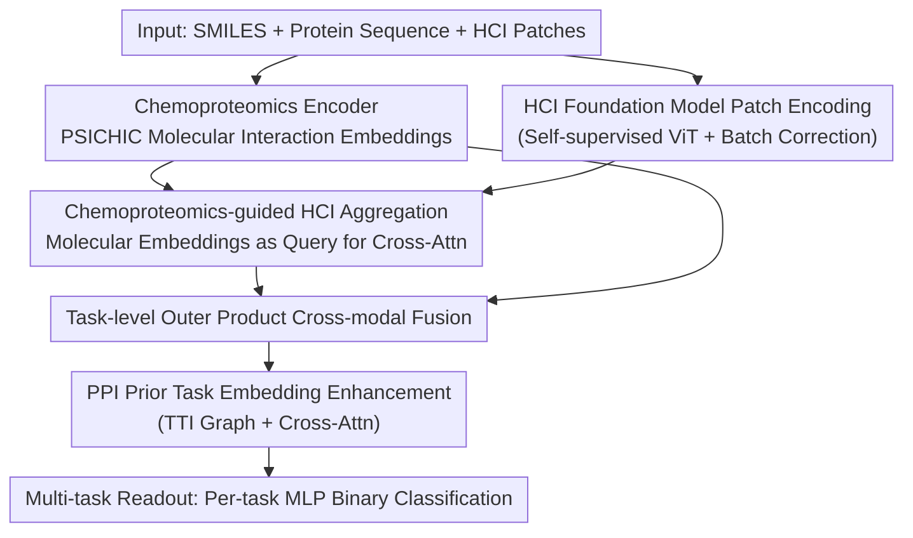

# BiGMINT: Biologically-guided Hierarchical Multimodal Integration for Modeling Multiple Compound Activities in Drug Discovery

**Conference**: CVPR 2026  
**Paper**: [CVF Open Access](https://openaccess.thecvf.com/content/CVPR2026/html/Pati_BiGMINT_Biologically-guided_Hierarchical_Multimodal_Integration_for_Modeling_Multiple_Compound_Activities_CVPR_2026_paper.html)  
**Code**: None  
**Area**: Multimodal Omics Fusion / Drug Discovery / Computational Biology  
**Keywords**: Compound activity prediction, High-content imaging, Chemoproteomics, Multimodal fusion, PPI prior  

## TL;DR
BiGMINT utilizes a three-stage hierarchical fusion—"chemoproteomics-guided high-content imaging (HCI) feature aggregation + outer product cross-modal fusion + protein-protein interaction (PPI) prior-based task-level information sharing"—to unify molecular mechanism signals and cellular phenotypic signals for compound activity prediction. On two large private datasets (~99K / ~40K compound-image pairs), it improves average AUCROC over state-of-the-art single-modal/multimodal baselines by up to 10.0% / 4.2%, with the coverage of high-performance tasks nearly doubling.

## Background & Motivation
**Background**: In drug discovery, using machine learning for "compound activity prediction" (in silico prediction of whether a compound modulates a protein target) significantly reduces expensive and time-consuming wet-lab screening. Existing methods generally follow two paradigms: **chemoproteomics-centric**, using compound SMILES + protein sequence/structure to model molecular-level binding (e.g., DrugBAN, PSICHIC); and **phenotype-centric**, using high-content imaging (HCI, such as Cell Painting) or transcriptomics to capture system-level cellular responses.

**Limitations of Prior Work**: Both paradigms have "blind spots." Chemoproteomics focus solely on molecular docking strength, ignoring real downstream phenotypic consequences in cells. Phenotypic methods observe morphological changes, but HCI captures **all** cellular changes caused by the compound (including off-target and indirect pathways), not just those resulting from target protein binding, leading to severe confounding. A few existing multimodal methods concatenate the two, but their fusion strategies are shallow (mostly late-fusion/simple concatenation) and fail to adapt to biological response sensitivity or incorporate biological prior knowledge.

**Key Challenge**: Molecular mechanism signals and cellular phenotypic signals should be complementary—but simple concatenation cannot allow one modality to "guide" or "purify" the other. Furthermore, activity labels are extremely sparse (compound-task matrix fill rate is only ~3%), making it difficult for models to learn from raw data alone.

**Goal**: (1) Allow molecular signals to actively guide HCI feature extraction, amplifying the portion of confounded phenotypic signals "relevant to the target protein"; (2) Utilize biological priors (PPI networks) to enable information sharing between related tasks under label sparsity.

**Key Insight**: The authors observed that HCI reflects both the direct effects of compound-protein interaction and indirect effects transmitted through PPI. Thus, **molecular signals can serve as a prior to guide HCI feature aggregation**, decoupling "true target activity" from "irrelevant effects." Simultaneously, as proteins are interconnected in networks, tasks for related proteins can share labels.

**Core Idea**: Use chemoproteomics embeddings as queries to aggregate HCI patches via cross-attention, apply outer products for task-level fusion, and finally enhance embeddings using a Task-Task Interaction (TTI) graph derived from PPI—a hierarchical fusion pipeline that "guides phenotype via molecules and addresses sparsity via biological priors."

## Method

### Overall Architecture
The input to BiGMINT is a compound (SMILES), a target protein (amino acid sequence), and a set of HCI image patches $\{x^n_c\}_{n=1}^{N_c}$ treated with that compound. The output is the binary activity $y_{c,(p,z)}$ of the compound on multiple concentration tasks $t_{p,z}$ for that protein. The pipeline consists of three hierarchical stages: **① Chemoproteomics Encoder** $F_{chemprot}$ encodes SMILES + protein sequence into molecular interaction embeddings $d^{chemprot}_{c,p}$; **② Chemoproteomics-guided HCI Encoder** $F_{hci}$ uses this molecular embedding as a query to aggregate patch features, obtaining task-related phenotypic embeddings $d^{hci}_{c,(p,z)}$; **③ Cross-modal Fusion** $F_{fusion}$ utilizes an outer product to fuse molecular and phenotypic embeddings into $d^{fusion}_{c,(p,z)}$ at the task level. Subsequently, the **PPI Prior Enhancement** module $F_{aug}$ uses a TTI graph to allow related tasks to share signals, before a multi-task MLP classification head reads out the activity.

### Key Designs

**1. Chemoproteomics-guided HCI Aggregation: Using molecular signals as queries to "purify" target signals from confounded phenotypes**

Phenotypic changes in HCI include effects unrelated to the target protein; mean or attention pooling would incorporate this noise. BiGMINT first uses $F_{chemprot}$ (based on PSICHIC, converting SMILES to molecular graphs via RDKit and protein sequences to graphs via ESM2, followed by physico-chemically constrained GNNs) to obtain compound-protein interaction signals $q_{c,p}$, projected via MLP into molecular embeddings $d^{chemprot}_{c,p}=F_\beta(F_\alpha(p,c))$. For HCI, a self-supervised pre-trained ViT foundation model $F_\omega$ encodes each patch with batch correction and a shared projection $F_\phi$ to obtain patch features $b^n_c$. Crucially, each task has an aggregation head $F_{\psi_{p,z}}$ performing **cross-attention: $d^{chemprot}_{c,p}$ acts as the query, while patch features $\{b^n_c\}$ act as keys/values**, outputting task-related phenotypic embeddings $d^{hci}_{c,(p,z)}$. Conditioning attention on molecular embeddings allows the model to focus on "mechanism-related" cellular patches.

**2. Task-level Outer Product Cross-modal Fusion: Capturing multiplicative interactions under label sparsity**

Parametric fusion (gating, attention) often suffers from overfitting when labels are extremely sparse (~3%). The authors compared various operators (concat, gating, attention, outer product) and found the **per-task outer product** consistently best: $F^{fusion}_{p,z}:=\mathrm{MLP}(d^{chemprot}_{c,p}\otimes d^{hci}_{c,(p,z)})$. The outer product non-parametrically models rich correlations between modality embedding dimensions, capturing multiplicative, non-linear dependencies (e.g., a molecular feature only being effective when combined with a specific phenotypic feature). Using a **per-task operator** $F^{fusion}_{p,z}$ instead of a shared one allows adaptation to different sensitivities related to protein and concentration.

**3. PPI Prior Task Embedding Enhancement: Sharing labels via protein networks to combat sparse supervision**

Supervision is sparse because few compound-protein-concentration triplets are measured. Biological priors suggest a protein $p$'s activity is influenced by its interaction partners $p'$. Thus, information for task $t_{p,z}$ is hidden in tasks involving related proteins. A binarized PPI adjacency $B_P$ is transformed into a **Task-Task Interaction (TTI) graph** $B_T(t_{p,z},t_{p',z'}):=B_P(p,p')$. $B_T$ is sparsified to keep only the top-$K$ most correlated tasks. For a fused embedding $d^{fusion}_{c,(p,z)}$, the model performs cross-attention over its related task embeddings $d^{fusion}_{c,T^{as}_c}$. This allows signals to propagate along the directions of related proteins, which is particularly beneficial for low-performance tasks where direct evidence is scarce.

### Loss & Training
The problem is formulated as multi-task learning (MTL). Each task $t_{p,z}$ uses an MLP head $F^{cls}_{p,z}$ to map $d^{aug}_{c,(p,z)}$ to a binary classification. The weighted binary cross-entropy loss is computed only on observed labels:

$$\mathcal{L}=\frac{1}{|\mathcal{T}|}\sum_{t_{p,z}}\sum_{c} \mathbb{I}_{c,(p,z)}\cdot \mathcal{L}^{BCE}_{p,z}\big(y_{c,(p,z)}, F^{cls}_{p,z}(d^{aug}_{c,(p,z)})\big)$$

where $\mathbb{I}_{c,(p,z)}=1$ if the label is observed. BCE is weighted by the inverse of class frequency. $F_\alpha$ is initialized from PSICHIC and frozen with a learnable adapter $F_\beta$. The HCI foundation model $F_\omega$ (ViT-B/16) is self-supervisedly pre-trained on disjoint datasets like JUMP-CP.

## Key Experimental Results

### Main Results
On two large private datasets, U2OS (~99K compound-HCI pairs) and iNeuron (~40K), covering 170 tasks across 65 proteins with ~3% fill rate. 5-scaffold cross-validation results (AUCROC %):

| Category | Method | U2OS AUCROC | iNeuron AUCROC |
|------|------|------|------|
| HCI-only | MIL→MTL | 71.17 | 69.51 |
| HCI-only | MIL+TTI→MTL | 72.09 | 69.96 |
| Chemprot-only | DrugBAN | 68.99 | 69.59 |
| Chemprot-only | PSICHIC | 71.11 | 72.62 |
| Multimodal | MM-Union (Optimistic Upper Bound) | 75.10 | 74.99 |
| Multimodal | Concatenate(HCI, P)→MTL | 73.34 | 73.19 |
| Multimodal | CA(H, d^chemprot)→MTL | 73.51 | 70.54 |
| **Ours** | **BiGMINT (Outer+TTI)** | **78.23** | **76.51** |

BiGMINT significantly outperforms all benchmarks (p < 0.001), with a +10.0% / +5.4% AUCROC gain over the strongest single modality and +4.2% / +2.0% over the strongest multimodal baseline. High-performance task coverage (AUCROC ≥ 0.8) reached 67 and 59 tasks, outperforming the optimistic MM-Union by 56% / 5%.

### Ablation Study
(Excerpt from Table 1, U2OS / iNeuron AUCROC %)

| Configuration | U2OS | iNeuron | Description |
|------|------|------|------|
| **BiGMINT Full: Outer(CA(H,·),·)+TTI** | **78.23** | **76.51** | Full Model |
| Outer(CA(H,·),·)→MTL (w/o TTI) | 77.02 | 74.94 | No PPI prior, -1.2 / -1.6 |
| Outer(MIL(H),·)+TTI (w/o Guided Aggregation) | 77.72 | 75.80 | Standard MIL aggregation, -0.5 / -0.7 |
| Outer(MIL(H),·)→MTL (w/o Agg & TTI) | 76.41 | 74.66 | Both removed, -1.8 / -1.9 |
| CA(H, d^chemprot)→MTL (Guided Agg only) | 73.51 | 70.54 | No outer product/TTI |

### Key Findings
- **Synergistic Components**: Removing TTI, Guided Aggregation, or both led to consistent performance drops. Outer product fusion consistently outperformed concatenation.
- **PPI Prior and "Hard Tasks"**: TTI improved performance for the majority of tasks. The gain-vs-baseline slope was negative, indicating that tasks with lower baseline performance and fewer direct labels benefited most from the prior.
- **Modality Complementarity**: HCI models were stronger for "hub" proteins with high connectivity (Spearman ρ=0.46), while chemoproteomics was insensitive to connectivity. BiGMINT maintained high performance across the entire spectrum, effectively fusing morphological sensitivity with molecular robustness.

## Highlights & Insights
- **"Molecular query for phenotypic aggregation" is the most clever step**: Using chemoproteomics embeddings to "purify" HCI signals via cross-attention outperforms pure HCI models—a strategy transferable to any scenario where a strong modality guides a confounded/weak one.
- **Mapping Knowledge Graphs to Task Attention**: Translating protein interactions into a task-sharing topology ($B_T$) and sparsifying via label correlation is an elegant way to inject structural priors into sparse multi-task learning.
- **Outer Product Victory in Sparse Supervision**: Non-parametric, multiplicative cross-modal interactions are often more robust than complex learnable fusion in small-sample or sparse-label settings.

## Limitations & Future Work
- **Generalization**: The framework currently struggles with "unseen proteins" and needs extension for generalizeability to novel protein-compound pairs.
- ⚠️ **Data & Reproducibility**: Core datasets (U2OS/iNeuron) are proprietary to J&J. The lack of open-source code and data makes external validation and fair comparison difficult.
- ⚠️ **Dependency on Pre-trained Components**: Performance relies heavily on PSICHIC and large-scale ViT backbones. The incremental gains from TTI/Outer product (~1-2 points) are smaller compared to the contribution of the pre-trained backbones.

## Related Work & Insights
- **vs. PSICHIC / DrugBAN**: These single-modal methods ignore downstream phenotypes. BiGMINT uses PSICHIC as a frozen encoder and layers phenotype/priors, lifting AUCROC from 71.11 to 78.23 on U2OS.
- **vs. MM-Union**: BiGMINT's integration provides new gains that surpass the "modality selection" upper bound, especially in high-performance tasks.
- **vs. CLOOME / MolPhenix (Alignment methods)**: Contrastive alignment often loses modality-specific information due to the semantic gap. BiGMINT's integration approach proved consistently superior for activity modeling.

## Rating
- Novelty: ⭐⭐⭐⭐
- Experimental Thoroughness: ⭐⭐⭐⭐
- Writing Quality: ⭐⭐⭐⭐
- Value: ⭐⭐⭐⭐

<!-- RELATED:START -->

## Related Papers

- [\[ICML 2025\] GenMol: A Drug Discovery Generalist with Discrete Diffusion](../../ICML2025/computational_biology/genmol_a_drug_discovery_generalist_with_discrete_diffusion.md)
- [\[ACL 2026\] AROMA: Augmented Reasoning Over a Multimodal Architecture for Virtual Cell Genetic Perturbation Modeling](../../ACL2026/computational_biology/aroma_augmented_reasoning_over_a_multimodal_architecture_for_virtual_cell_geneti.md)
- [\[CVPR 2026\] Multimodal Protein Language Models for Enzyme Kinetic Parameters: From Substrate Recognition to Conformational Adaptation](multimodal_protein_language_models_for_enzyme_kinetic_parameters_from_substrate_.md)
- [\[ICLR 2026\] Efficient Prediction of Large Protein Complexes via Subunit-Guided Hierarchical Refinement](../../ICLR2026/computational_biology/efficient_prediction_of_large_protein_complexes_via_subunit-guided_hierarchical_.md)
- [\[ICLR 2026\] Extending Sequence Length is Not All You Need: Effective Integration of Multimodal Signals for Gene Expression Prediction](../../ICLR2026/computational_biology/extending_sequence_length_is_not_all_you_need_effective_integration_of_multimoda.md)

<!-- RELATED:END -->
