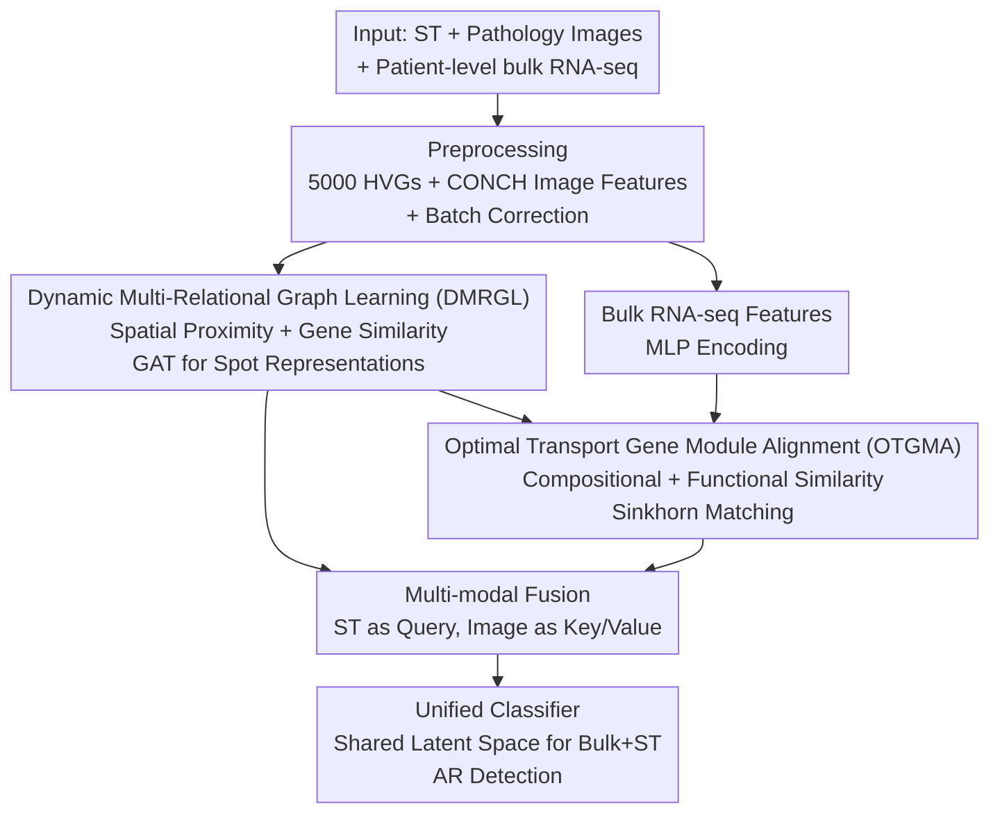

# Bulk RNA-seq Guided Multi-modal Detection of Anomalous Regions in Human Cancer via Spatial Transcriptomics

**Conference**: CVPR 2026  
**Paper**: [CVF Open Access](https://openaccess.thecvf.com/content/CVPR2026/html/Shi_Bulk_RNA-seq_Guided_Multi-modal_Detection_of_Anomalous_Regions_in_Human_CVPR_2026_paper.html)  
**Code**: https://github.com/shihangjs/BRGMAR (Available)  
**Area**: Computational Biology / Multi-modal  
**Keywords**: Spatial Transcriptomics, Anomalous Region Detection, Optimal Transport, Gene Module Alignment, Multi-modal Fusion

## TL;DR
BRGMAR utilizes a dynamic multi-relational graph to characterize spatial proximity and gene similarity between spots in spatial transcriptomics (ST). It transfers diagnostic information from patient-level bulk RNA-seq to ST through "gene module alignment" based on optimal transport. Combined with cross-attention fusion of pathological images, it significantly advances AUC/F1 scores for tumor anomalous region detection across BRCA, HCC, and ccRCC datasets.

## Background & Motivation
**Background**: Identifying "anomalous regions" (AR, i.e., cancerous or dysplastic areas) in tissue is a core task in personalized medicine. Early methods relied on H&E pathological images to observe morphological differences. Recently, the mainstream has shifted to spatial transcriptomics (ST), which provides gene expression profiles for each spot while preserving spatial positions, enabling the discovery of molecular-level anomalies invisible to morphology. These methods typically use Graph Neural Networks (GNNs) to model spot relationships, with newer works integrating pathological images and ST for multi-modal analysis.

**Limitations of Prior Work**: The authors identify three specific deficiencies. First, existing ST methods only use **local** molecular features of individual spots, completely ignoring the accompanying patient-level **bulk RNA-seq**, which contains diagnostic labels (e.g., cancer vs. normal control) and serves as a global molecular profile of the tissue. Second, aligning bulk RNA-seq (cross-platform data) to ST using existing transfer learning often relies on matching **individual gene expression values**, but functional tissue anomalies often manifest as global disturbances in **gene co-expression patterns** rather than changes in single genes. Third, mainstream graph models assume "spatial proximity implies expression similarity" and build graphs based only on Euclidean distance, missing non-local biological relationships where distant spots share molecular similarities.

**Key Challenge**: Diagnostic information (bulk RNA-seq) is patient-level, cross-platform, and global, while AR detection must be performed at the spot level in ST. There is a mismatch in both granularity and domain; simple gene-by-gene alignment destroys the co-expression network structure, failing to transfer diagnostic knowledge effectively.

**Goal**: (1) Reliably transfer patient-level diagnostic information from bulk RNA-seq to ST; (2) Simultaneously model spatial proximity and non-local gene similarity in ST; (3) Fuse ST with pathological images for precise AR detection.

**Core Idea**: Use "**gene co-expression modules**" as the unit for cross-domain alignment. Shared genes are partitioned into several latent functional modules, and Optimal Transport (OT) is used to match them based on **compositional and functional similarity**. This transfers diagnostic signals from bulk RNA-seq to ST, complemented by a dynamic graph capturing non-local relations and a cross-attention fusion mechanism for pathology and transcriptomics.

## Method

### Overall Architecture
BRGMAR takes three heterogeneous data streams: ST (spot × gene expression), corresponding H&E images, and patient-level bulk RNA-seq for the cancer type (with normal/cancer labels). The output is a classification of whether each spot belongs to an anomalous region. The pipeline consists of four serial steps: data preprocessing (selecting 5000 highly variable genes (HVGs), extracting image patch features using the vision-language foundation model CONCH, and removing batch effects), spot representation learning via **DMRGL**, diagnostic knowledge transfer via **OTGMA**, and finally, **cross-attention fusion** of ST and image representations for classification. Bulk and ST domains share a classifier and are supervised in the same latent space, allowing bulk labels to constrain ST representations.

### Key Designs

**1. DMRGL: Dynamic Multi-Relational Graph for Spatial and Non-local Gene Similarity**

Addressing the limitation that graph models often miss molecularly similar but spatially distant spots. DMRGL represents an ST slide as $X^s=[x^s_1,\dots,x^s_n]^\top\in\mathbb{R}^{N_s\times D}$ and defines a **dynamic graph at stage $t$** as $G=(V,E^{(t)})$. At $t=0$, edges are built based on **spatial proximity** using KNN ($k_n=5$). For $t>0$, the graph is augmented in the gene embedding space by selecting the $k_s=5$ spots with the highest cosine similarity, connecting spatially distant but molecularly similar spots. Representation learning uses GAT, with attention weights:

$$\alpha_{vu}=\frac{\exp\big(\text{LeakyReLU}(a^\top[W\vec{h}^s_v\,\Vert\,W\vec{h}^s_u])\big)}{\sum_{k\in N(v)}\exp\big(\text{LeakyReLU}(a^\top[W\vec{h}^s_v\,\Vert\,W\vec{h}^s_k])\big)}$$

Updated as $h^s_v=\sigma\big(\sum_{u\in N(v)}\alpha_{vu}W\vec{h}^s_u\big)$. The "dynamic" nature allows the graph to adapt during training based on gene similarities, discovering underlying organizational patterns.

**2. OTGMA: Aligning ST and Bulk RNA-seq via "Composition + Function" of Gene Modules**

This addresses the core challenge of preserving co-expression networks during alignment. Instead of individual genes, both ST and bulk domains partition $D$ shared genes into $K_m$ latent functional modules using a soft assignment matrix $R^m\in\mathbb{R}^{D\times K_m}$ ($m\in\{b,s\}$). Each module constructs a Topological Overlap Matrix (TOM) for internal co-expression:

$$\text{TOM}^m_k[i,j]=\hat{A}^m_{ij}\cdot R^m_{ik}\cdot R^m_{jk}$$

where $\hat{A}^m$ is the normalized gene similarity. Cross-domain module costs are calculated via:

- **Compositional Alignment**: Treating $\text{TOM}^m_k$ as a weighted graph, the structural difference is measured by the squared Wasserstein-2 distance between the Laplacians $L^m_k$: $C^{org}_{ij}=\text{Tr}\big((L^b_i)^\dagger+(L^s_j)^\dagger\big)-2\,\text{Tr}\sqrt{((L^b_i)^\dagger)^{1/2}(L^s_j)^\dagger((L^b_i)^\dagger)^{1/2}}$.
- **Functional Alignment**: Using OpenAI `text-embedding-3-large` to encode NCBI gene descriptions into functional embeddings $e_i$. Functional centroids are $p^m_k=\frac{\sum_i R^m_{ik}e_i}{\sum_i R^m_{ik}}$, and the distance is $C^{fun}_{ij}=d(p^b_i,p^s_j)$.

The total cost $C^{total}_{ij}=C^{org}_{ij}+C^{fun}_{ij}$ is solved as an OT problem with uniform marginals $a_i=1/K_b,\;b_j=1/K_s$, yielding the Sinkhorn loss:

$$L_{OT}(C^{total})=\sum_{ij}P_{ij}C^{total}_{ij}-\lambda_{reg}H(P)$$

This allows diagnostic knowledge to be transferred "by functional module" while preserving regulatory structures.

**3. Multi-modal Cross-Attention Fusion + Shared Classifier**

For each spot $v$, ST features $h^s_v$ act as the query, and image features $x^{img}_v$ act as the key/value. Cross-attention yields $\hat{h}^s_v$, fused as $z^s_v=\text{MLP}([h^s_v\Vert\hat{h}^s_v])$. A **cross-domain shared** classifier uses common weights $W^m$ for both domains. This ensures bulk label supervision and ST detection are coupled in the same latent space, allowing bulk "cancer/normal" priors to constrain ST representations effectively.

## Key Experimental Results

### Main Results
Testing on BRCA (Breast Cancer), HCC (Liver Cancer), and ccRCC (Renal Cancer) datasets using Leave-One-Out Cross-Validation (LOOCV). Average AUC and F1 results:

| Dataset | Metric | BRGMAR | MEATRD | STANDS | STGIC | Bulk2Space | STEM |
|---------|--------|--------|--------|--------|-------|------------|------|
| BRCA | AUC | **0.801** | 0.764 | 0.723 | 0.769 | 0.740 | 0.721 |
| BRCA | F1 | **0.775** | 0.732 | 0.742 | 0.744 | 0.735 | 0.742 |
| HCC | AUC | **0.897** | 0.861 | 0.854 | 0.803 | 0.831 | 0.836 |
| HCC | F1 | **0.863** | 0.838 | 0.835 | 0.749 | 0.824 | 0.811 |
| ccRCC | AUC | **0.724** | 0.681 | 0.705 | 0.648 | 0.663 | 0.704 |
| ccRCC | F1 | **0.732** | 0.707 | 0.669 | 0.676 | 0.709 | 0.705 |

BRGMAR leads across all datasets. In HCC, the AUC of 0.897 is ~3.6 points higher than the runner-up MEATRD. Notably, pure ST methods outperform image-only methods, and the ST-only variant **BRGMAR-G** also outperforms all ST baselines.

### Ablation Study
$C^{org}/C^{fun}$ denotes compositional/functional alignment in OTGMA; $E_{sp}/E_{sim}$ denotes spatial/similarity edges in DMRGL:

| Configuration | BRCA AUC | HCC AUC | ccRCC AUC | Note |
|---------------|----------|---------|-----------|------|
| Full | **0.801** | **0.897** | **0.724** | Complete Model |
| w/o $C^{org}$ | 0.767 | 0.854 | 0.694 | HCC drops 4.3 pts |
| w/o $C^{fun}$ | 0.752 | 0.877 | 0.690 | BRCA drops 4.9 pts |
| w/o $C^{org}$&$C^{fun}$ | 0.748 | 0.830 | 0.643 | ccRCC drops 8.1 pts |
| w/o $E_{sp}$ | 0.763 | 0.841 | 0.721 | HCC drops 5.6 pts |
| w/o $E_{sim}$ | 0.785 | 0.860 | 0.716 | Drop across all sets |

### Key Findings
- Both compositional and functional parts of OTGMA are essential; removing both leads to the most significant drop (ccRCC AUC 0.724 → 0.643), proving that module-level alignment is the primary performance driver.
- Both spatial and gene similarity edges in DMRGL contribute. Removing gene similarity edges dropped BRCA AUC from 0.801 to 0.785, verifying that non-local relations provide complementary information.
- The model is robust to parameters like $k_n, k_s$, $N_m$ (modules), and HVG count.

## Highlights & Insights
- **Knowledge Transfer via Module-level OT**: Recasting patient-level knowledge transfer as "Optimal Transport matching of gene co-expression modules" is a key innovation. It avoids the noise of single-gene alignment and preserves gene regulatory network structures.
- **LLM-based Functional Priors**: Encoding NCBI descriptions using `text-embedding-3-large` is a simple yet effective way to inject biological semantics into the model, a technique applicable to various bioinformatics tasks.
- **Shared Latent Space**: The unified classifier ensures that bulk labels directly supervise the spot-level detection task, which is more effective than simple feature concatenation.

## Limitations & Future Work
- Dependency on paired patient-level bulk RNA-seq (e.g., from TCGA). Performance reverts to BRGMAR-G without this prior.
- Evaluation is limited to three cancer types with relatively small sample sizes per set. Cross-cancer generalization needs further validation.
- The pipeline is computationally heavy, involving foundation models (CONCH), LLM embeddings, Sinkhorn iterations, and dynamic graphs; deployment costs remain an concern.

## Related Work & Insights
- **vs. Pure ST Methods (SEDR / FICT / SpaGIC)**: These use only local expression and spatial graphs. BRGMAR adds non-local edges (DMRGL) and bulk RNA-seq priors (OTGMA), leading even its ST-only variant to outperform these baselines.
- **vs. Multi-modal ST+Image (MEATRD / STANDS)**: While they fuse images, they lack the diagnostic signal from bulk RNA-seq. BRGMAR's transfer path leads to superior performance and better boundary alignment.
- **vs. Traditional Transfer Learning (Bulk2Space / STEM)**: These perform gene-level alignment, ignoring co-expression. BRGMAR's module-level OT alignment is the root cause of its superior cross-domain transfer capability.

## Rating
- Novelty: ⭐⭐⭐⭐⭐ 
- Experimental Thoroughness: ⭐⭐⭐⭐ 
- Writing Quality: ⭐⭐⭐⭐ 
- Value: ⭐⭐⭐⭐ 

<!-- RELATED:START -->

## Related Papers

- [\[AAAI 2026\] SpaCRD: Multimodal Deep Fusion of Histology and Spatial Transcriptomics for Cancer Region Detection](../../AAAI2026/computational_biology/spacrd_multimodal_deep_fusion_of_histology_and_spatial_transcriptomics_for_cance.md)
- [\[CVPR 2026\] HyperST: Hierarchical Hyperbolic Learning for Spatial Transcriptomics Prediction](hyperst_hierarchical_hyperbolic_learning_for_spatial_transcriptomics_prediction.md)
- [\[CVPR 2026\] Predicting Spatial Transcriptomics from Histology Images via High-Order Multi-Cell Interaction Modeling](predicting_spatial_transcriptomics_from_histology_images_via_high-order_multi-ce.md)
- [\[CVPR 2026\] Deciphering Genotype-Phenotype Mechanisms from High-Content Profiling via Knowledge-Guided Multi-modal Graph Learning](deciphering_genotype-phenotype_mechanisms_from_high-content_profiling_via_knowle.md)
- [\[CVPR 2026\] Cross-Slice Knowledge Transfer via Masked Multi-Modal Heterogeneous Graph Contrastive Learning for Spatial Gene Expression Inference](cross-slice_knowledge_transfer_via_masked_multi-modal_heterogeneous_graph_contra.md)

<!-- RELATED:END -->
