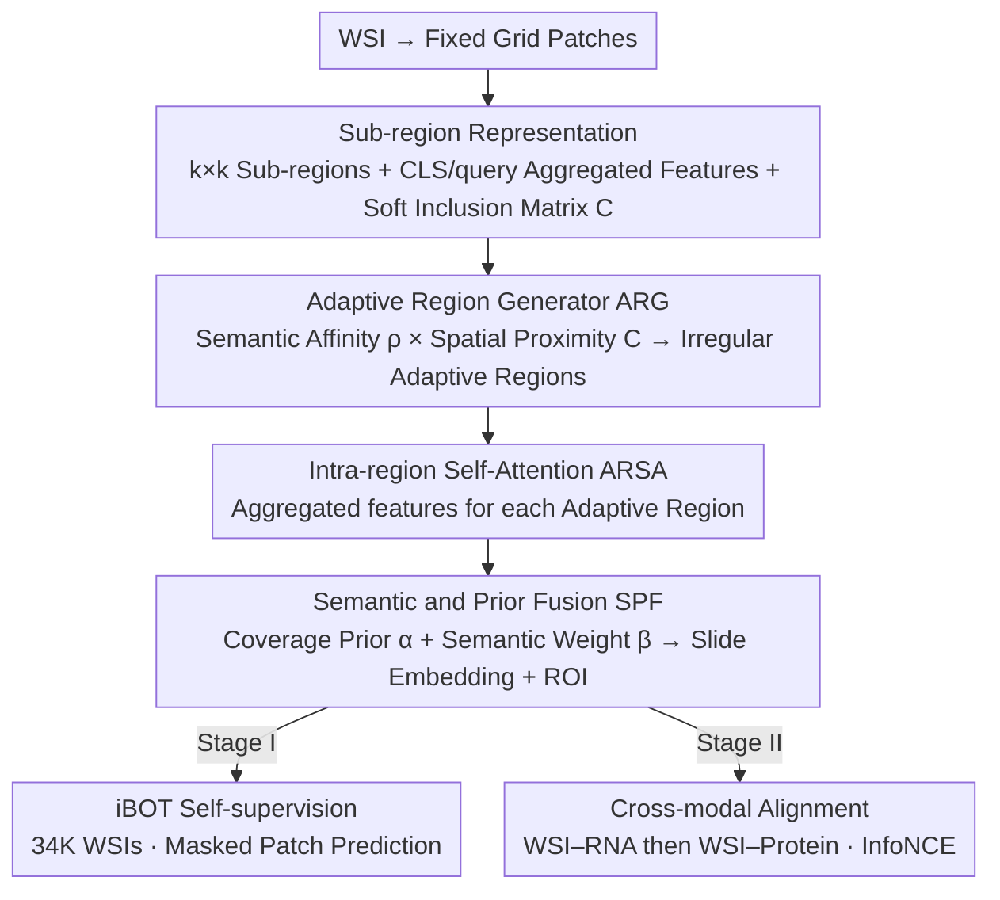

# CARE: A Molecular-Guided Foundation Model with Adaptive Region Modeling for Whole Slide Image Analysis

**Conference**: CVPR2026  
**arXiv**: [2602.21637](https://arxiv.org/abs/2602.21637)  
**Code**: [zdipath/CARE](https://github.com/zdipath/CARE)  
**Area**: Computational Biology  
**Keywords**: Computational Pathology, Whole Slide Image Analysis, Foundation Model, Adaptive Region Modeling, Cross-modal Alignment, RNA/Protein Guidance

## TL;DR

CARE is proposed as a pathology slide-level foundation model that partitions WSIs into morphologically relevant irregular regions via an Adaptive Region Generator (ARG)—analogous to word-level tokens in NLP. By combining cross-modal alignment with RNA/protein expression profiles in a two-stage pre-training paradigm, CARE achieves optimal average performance across 33 downstream tasks while using only approximately 1/10 of the data required by mainstream models.

## Background & Motivation

**Limitations of Prior Work: Patch dependency in existing pathology foundation models**: Current slide-level foundation models follow natural image backbones, treating a WSI as a collection of fixed-size patches, which lacks the capability to model histomorphological heterogeneity and spatial structures.

**Key Challenge: Lack of explicit ROI concepts**: Clinical pathologists first locate diagnostically critical ROIs when reading slides. Typical foundation models either perform global attention on all patches or impose fixed-rule partitioning, failing to simulate this clinical workflow.

**Mechanism: Difficulty in direct patch-to-WSI aggregation**: Aggregating features directly from thousands of patches to the WSI level creates ultra-long-distance interactions, making it difficult for the aggregator to learn. A hierarchical patch $\rightarrow$ region $\rightarrow$ WSI scheme is more consistent with tissue structure.

**Key Insight: Existing region partitioning is too coarse**: Fixed-grid patch chunks (character-level tokens) are semantically short-sighted, and fixed-size region chunks (fixed-length segmentation) easily cause semantic misalignment. Neither can align with true tissue boundaries.

**Goal: Disconnection between molecular information and morphology**: Region construction in existing models is not guided by biological signals, failing to ensure that learned regions are consistent with underlying molecular patterns (gene expression, protein abundance).

**Experimental Thoroughness: Inefficient data usage**: Mainstream pathology foundation models typically require hundreds of thousands of WSIs for pre-training, resulting in extremely high data acquisition and computational costs. A more efficient pre-training paradigm is urgently needed.

## Method

### Overall Architecture

CARE (Cross-modal Adaptive Region Encoder) addresses a long-standing issue in pathology slide-level foundation models: treating WSIs as collections of fixed-size patches, which neither fits the morphological heterogeneity of tissues nor learns the hierarchy of "locating ROIs first" used by clinicians. The core idea is an analogy to "word-level tokenization"—initially preparing sub-region "building blocks" (sub-region representations) with spatial priors on a fixed grid, then reorganizing patches into morphologically consistent irregular Adaptive Regions (ARG) based on semantic and spatial affinity. Intra-region features are extracted via self-attention (ARSA), and regions are aggregated into slide-level embeddings (SPF) using coverage priors and semantic attention. Region construction is guided by RNA/protein expression profiles, imparting biological significance to region boundaries. Pre-training consists of two stages: Stage I involves iBOT-style self-supervision (34,277 WSIs), and Stage II involves cross-modal contrastive learning (first WSI-RNA alignment, then WSI-protein alignment).

### Key Designs

**1. Sub-region Representation: Preparing "building blocks" with spatial priors for adaptive regions**

The ARG cannot partition regions from scratch; it requires a set of basic units with features and spatial relationships. CARE defines $M$ non-overlapping $k \times k$ square sub-regions on the patch grid. Each sub-region obtains two sets of aggregated features through intra-region self-attention: CLS aggregated features $g_i^{\text{CLS}}$ and query aggregated features $g_i^Q$ using learnable queries for cross-attention. Simultaneously, a soft inclusion matrix $C$ based on anchor distances quantifies the spatial relationship between patches and sub-regions. These features and spatial priors provide the necessary components to determine the assignment of patches to regions.

**2. Adaptive Region Generator (ARG): Reassigning patches based on "semantic similarity + spatial proximity"**

Fixed grid slicing can bisect integral tissue structures, causing semantic misalignment. ARG instead selects the top-3 candidate sub-regions with the highest soft inclusion scores for each patch. It calculates 4-way cosine similarity (original/augmented patch features $\times$ CLS/query sub-region features), which is averaged after softmax normalization to obtain semantic affinity $\rho_{ji}$. This is multiplied by spatial proximity to get a selection score $w_{ji} = \rho_{ji} \cdot C_{ji}$. Patches are assigned to the sub-region with the highest score, forming irregular adaptive regions. The multiplication of semantics and space is key: relying only on semantics leads to spatial fragmentation, while relying only on space reverts to a fixed grid.

**3. Semantic and Prior Fusion (SPF): Aggregating slide embeddings while simultaneously selecting ROIs**

Aggregating thousands of patches directly to the WSI level creates long-range interactions that are difficult to learn. CARE aggregates at the region level, fusing two types of weights—the coverage prior $\alpha_i$ (proportion of patches in a region) and the gated attention semantic weight $\beta_i$:

$$z_{\text{WSI}} = \sum_i (\lambda_{\text{SPF}} \alpha_i + (1 - \lambda_{\text{SPF}}) \beta_i) g_i^{\text{AR}}$$

The prior ensures large regions are not ignored, while semantic weights highlight diagnostically critical areas. Regions with the largest SPF weights naturally become ROIs, supporting ROI-level analysis without extra supervision.

**4. Cross-modal Alignment: Back-calibrating regions with molecular signals**

If region construction is not guided by biological signals, the learned regions may not align with underlying molecular patterns (gene expression, protein abundance). The RNA branch of CARE selects 3,999 genes guided by the Hallmark gene set, encoded using a Transformer initialized with scGPT. The protein branch takes the 10 most abundant proteins per sample, using ESM-2 for initial embeddings. Both stages use CLIP-style symmetric InfoNCE for alignment. Unlike models that only perform feature alignment, molecular signals here influence region boundaries through contrastive gradient backpropagation.

### Loss & Training

- **Main Loss $\mathcal{L}_{\text{main}}$**: In Stage I, this is the iBOT masked patch prediction + multi-view consistency loss; in Stage II, it is the InfoNCE contrastive loss.
- **Regional Structural Loss $\mathcal{L}_{\text{RSL}}$**: Prevents degradation where patches always choose the nearest region by pulling the global average expected rank $\bar{E}$ toward a target value $E^\star$: $\mathcal{L}_{\text{RSL}} = (\bar{E} - E^\star)^2$.
- **Total Loss**: $\mathcal{L}_{\text{total}} = \mathcal{L}_{\text{main}} + \lambda_{\text{RSL}} \mathcal{L}_{\text{RSL}}$.

## Key Experimental Results

### Main Results

Average performance across 33 downstream tasks (Morphology Classification, Molecular Prediction, Survival Analysis):

| Task Category | Evaluation | CHIEF | GigaPath | TITAN | **CARE** |
|---------------|------------|-------|----------|-------|----------|
| Morphology    | LR         | 75.6  | 78.3     | 85.4  | **85.7** |
| Morphology    | FT         | 81.4  | 84.9     | 87.7  | 87.0     |
| Molecular     | LR         | 69.1  | 66.6     | 67.8  | **69.5** |
| Molecular     | kNN        | 65.2  | 62.0     | 66.9  | **68.0** |
| Survival      | linear     | 42.1  | 49.8     | 47.2  | **58.0** |

Among 33 LR benchmarks, CARE achieved SOTA on 7 tasks and second place on 15; in terms of AUC/F1/C-index, it achieved SOTA on 12 tasks and second on 9.

### ROI Feature Analysis

| Method | CCRCC-BAP1 AUC | HNSCC-CASP8 AUC | Cross-LUNG AUC |
|--------|----------------|-----------------|----------------|
| WSI Feature | 65.8 | 58.7 | 77.0 |
| ROI Feature | **69.1** | **61.5** | **81.2** |

ROI features outperform global WSI features in tasks dependent on local signals, consistent with clinical knowledge.

### Ablation Study

- **Novelty of ARG**: Removing adaptive regions (using fixed sub-regions) dropped ACC from 72.5 $\rightarrow$ 71.6 on EBRAINS-fine and 64.8 $\rightarrow$ 61.4 on BCNB-HER2.
- **Hyperparameters**: Optimal configuration was found at $k=8$, $\lambda_{\text{RSL}}=0.1$, $E^\star=0.5$, $\lambda_{\text{SPF}}=0.5$.
- **Pre-training Stages**: Sequential improvement from iBOT $\rightarrow$ RNA $\rightarrow$ Protein; expanding self-supervised data volume yields significant initial performance gains.

### Key Findings

- CARE achieves optimal average performance using only ~34K WSIs (about 1/10 of mainstream models), proving the data efficiency of adaptive region modeling.
- Molecular-guided pre-training shows a distinct advantage in molecular prediction tasks without compromising morphology classification performance.
- Heatmap visualizations show that regions focused on by CARE align with high-frequency areas of nuclear atypia/mitosis annotated by pathologists.
- On RCC subtype classification, CARE's balanced accuracy is 3.8 percentage points higher than the runner-up, with an F1 score 0.7 points higher.
- In survival analysis, CARE's C-index of 58.0 significantly outperforms all baselines (second best PRISM 55.7), indicating the value of molecular guidance for prognostic modeling.
- Improvements from RNA alignment were greater than from protein alignment, though proteins provided highly specific complementary signals.

## Highlights & Insights

- **Adaptive Regions $\approx$ Word-level Tokenization**: The partitioning of patches in pathology image analysis is analogized to NLP tokenization. The proposed adaptive region scheme is more semantically coherent and consistent with tissue structure.
- **Molecular-guided Region Construction**: RNA/protein expression profiles are used not only for feature alignment but also to back-optimize region boundaries, giving learned regions biological significance.
- **Extreme Data Efficiency**: Pre-training with ~34K WSIs surpasses models like GigaPath and CHIEF that use hundreds of thousands of WSIs.
- **Automatic ROI Selection**: Adaptive regions with the largest SPF weights naturally serve as ROIs, supporting ROI-level analysis without additional supervision.

## Limitations & Future Work

- ROI features do not outperform WSI features in all tasks, suggesting that the "most important region" defined by adaptive regions might not perfectly match the requirements of certain tasks.
- Pre-training data sources (TCGA + GTEx) are dominated by Western populations; generalization to other ethnicities, rare cancers, and non-H&E stained tissues remains to be verified.
- The DBSCAN strategy for sub-WSI partitioning introduces extra hyperparameters ($\le360$ patches), and its effectiveness on fragmented tissues is not discussed in detail.
- The protein branch only utilizes the top-10 most abundant proteins, possibly underutilizing information; the amount of protein data (8,225 pairs) is also relatively small.
- Comparison with the latest vision-language pathology models (e.g., report/dialogue-based PRISM) on generative tasks was not performed.
- The patch encoder is fixed as CONCH v1.5; combinations with other patch encoders (e.g., UNI, Virchow) were not explored.

## Related Work & Insights

- **Patch-level Foundation Models**: UNI, CONCH, PLIP, BiomedCLIP — provide high-quality patch encoding but lack slide-level reasoning.
- **Slide-level Foundation Models**: CHIEF (anatomy-aware attention), GigaPath (LongNet for ultra-long sequences), TITAN (coordinate-aware feature grids), FEATHER (lightweight ABMIL), PRISM (report supervision), TANGLE (transcriptome alignment).
- **Hierarchical Methods**: HIPT introduced region-level Transformers but used fixed partitioning; CARE's adaptive regions represent a significant improvement over this.
- **MIL Aggregators**: ABMIL, DSMIL, DTFD-MIL, etc., focus on patch interactions but all operate on fixed patch sets.
- **Cross-modal Pathology**: MUSK (vision-language tile encoder) and TANGLE (transcriptome alignment) are the most relevant cross-modal works; CARE further utilizes molecular signals for region construction rather than just feature alignment.

## Rating

- Novelty: ⭐⭐⭐⭐ — Adaptive Region Generator and molecular-guided region construction are meaningful innovations.
- Experimental Thoroughness: ⭐⭐⭐⭐⭐ — 33 downstream tasks + multiple evaluation settings + detailed ablations.
- Writing Quality: ⭐⭐⭐⭐ — Clear structure, intuitive NLP tokenization analogy.
- Value: ⭐⭐⭐⭐ — Provides a more efficient and clinically consistent region modeling paradigm for pathology foundation models.

<!-- RELATED:START -->

## Related Papers

- [\[CVPR 2025\] Unsupervised Foundation Model-Agnostic Slide-Level Representation Learning](../../CVPR2025/computational_biology/unsupervised_foundation_model-agnostic_slide-level_representation_learning.md)
- [\[ICML 2025\] Scalable Generation of Spatial Transcriptomics from Histology Images via Whole-Slide Flow Matching](../../ICML2025/computational_biology/scalable_generation_of_spatial_transcriptomics_from_histology_images_via_whole-s.md)
- [\[ICLR 2026\] Structural Prognostic Event Modeling for Multimodal Cancer Survival Analysis](../../ICLR2026/computational_biology/structural_prognostic_event_modeling_for_multimodal_cancer_survival_analysis.md)
- [\[NeurIPS 2025\] Uncertainty-Guided Model Selection for Tabular Foundation Models in Biomolecule Efficacy Prediction](../../NeurIPS2025/computational_biology/uncertainty-guided_model_selection_for_tabular_foundation_models_in_biomolecule_.md)
- [\[CVPR 2026\] BiGMINT: Biologically-guided Hierarchical Multimodal Integration for Modeling Multiple Compound Activities in Drug Discovery](bigmint_biologically-guided_hierarchical_multimodal_integration_for_modeling_mul.md)

<!-- RELATED:END -->
