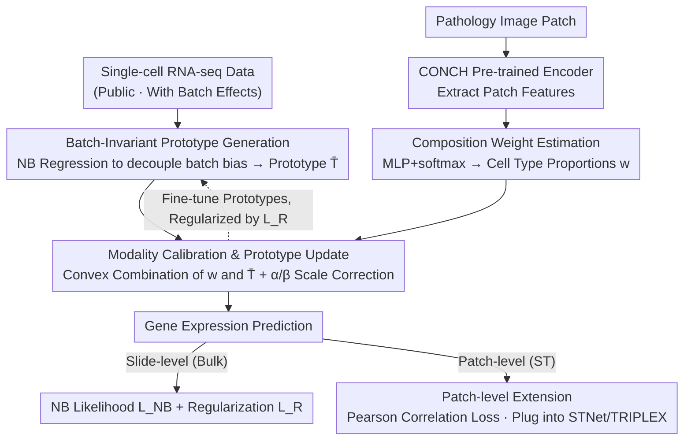

# Cell-Type Prototype-Informed Neural Network for Gene Expression Estimation from Pathology Images

**Conference**: CVPR 2026  
**arXiv**: [2603.18461](https://arxiv.org/abs/2603.18461)  
**Code**: [https://github.com/naivete5656/CPNN](https://github.com/naivete5656/CPNN)  
**Area**: Computational Biology  
**Keywords**: Gene Expression Estimation, Pathology Images, Single-cell RNA sequencing, Cell-Type Prototypes, Multiple Instance Learning

## TL;DR

Ours proposes CPNN, which leverages public single-cell RNA-seq data to construct cell-type prototypes. It models slide/patch-level gene expression as a weighted combination of these prototypes, achieving Prev. SOTA performance in gene expression estimation while providing interpretability.

## Background & Motivation

Directly predicting gene expression from whole-slide images (WSI) is a low-cost alternative to RNA sequencing. Existing methods fall into two categories: slide-level (bulk transcriptomics, using MIL architectures) and patch-level (spatial transcriptomics, using Transformers/GNNs). However, these methods only learn at an aggregated level and **do not explicitly model the data generation process of gene expression**—that is, observed expression is an aggregation of expression from underlying individual cells.

**Key Challenge**: Single-cell RNA-seq data provides cell-level expression information, but it is noisy, suffers from batch effects, and lacks corresponding pathology images, making it unsuitable for direct WSI regression.

**Core Idea**: Extract **stable cell-type prototypes** (average expression profiles across cell types) from single-cell data to serve as prior constraints on the prediction space. The model estimates cell-type composition weights for each patch from images, then obtains gene expression predictions via matrix multiplication of weights and prototypes.

## Method

### Overall Architecture

CPNN addresses the specific problem of black-box mapping from "aggregated image features to aggregated expression values," which ignores the biological fact that observed expression is a superposition of individual cell expressions. CPNN explicitly integrates this generation process: first, stable prototypes $\bar{T}$ representing "what each cell type looks like" are refined from public scRNA-seq data. The network then focuses on identifying "which cell types exist and in what proportions" from the image. Finally, the two are multiplied to reconstruct gene expression. The pipeline consists of three steps: prototype estimation $\bar{T}$, composition weight estimation $w$, and end-to-end optimization using Negative Binomial likelihood. This converts a regression task into "prior knowledge + interpretable composition estimation"; in patch-level (spatial transcriptomics) scenarios, this mechanism can use a noise-resistant loss and serve as a plug-and-play module.

### Key Designs

**1. Batch-Independent Prototype Generation: Removing technical noise from single-cell data to retain biological signals.**

Single-cell data serves as a "dirty prior"—sequencing depth and reagent conditions vary across batches, causing readings for the same cell type to differ significantly. CPNN avoids simple averaging and instead uses Negative Binomial regression to explicitly model systematic bias for each batch: $\mu_{c,g}^{\mathrm{sc}} = (t_{c,g} + b_d)s_d$, where $t_{c,g}$ is the "ground truth" expression of cell type $c$ for gene $g$, and $s_d, b_d$ are the scale and shift for experimental condition $d$. After fitting, $s_d$ and $b_d$ are removed, leaving $\bar{T}$ as a prototype that preserves stable biological gene co-variation patterns. This step is the foundation of the method's credibility.

**2. Composition Weight Estimation: Forcing the network to estimate cell types and proportions rather than memorizing expression values.**

The image branch task is deliberately narrow: use the pre-trained pathology encoder CONCH to extract patch features $\mathbf{h}_i^{(n)}$, which pass through an MLP + softmax to output cell-type proportions $w(\mathbf{x}_i^{(n)})$—a composition vector on a simplex. Gene expression is not directly output by the network but is a linear combination of prototypes using these weights:

$$\mu_g^{\mathrm{b}}(\mathcal{X}^{(n)}) = \alpha_g \sum_i \sum_c w(\mathbf{x}_i^{(n)})_c \bar{T}_{c,g} + \beta_g$$

Here, $\alpha_g, \beta_g$ are gene-specific scaling/offset parameters used to bridge the modality gap between single-cell scales and bulk/ST scales. This design constrains the search space; the output must be a convex combination of real cell profiles, making it more stable than high-dimensional regression and providing natural interpretability.

**3. Modality Calibration & Prototype Update: Allowing prototype fine-tuning to fit the target distribution without losing semantic meaning.**

Since scRNA-seq prototypes and bulk/ST expressions do not share the same distribution, frozen prototypes may not fit the target. However, unconstrained updates would degrade them into standard learnable parameters, losing the "cell type" semantics. CPNN allows $\bar{T}$ to be fine-tuned during training but adds a regularization term to pull it back to initial values:

$$L_R = \|\bar{T}^0 - \bar{T}\|^2 + \mathbb{E}_n\big[\|\mathbf{W}^{(n)} - \bar{\mathbf{W}}^{(n)}\|^2\big]$$

The first term prevents prototypes from deviating too far from scRNA-seq estimates; the second constrains patch weights from deviating too far from the slide average. This ensures that weights remain interpretable as real cell compositions.

**4. Patch-Level Extension: Using a noise-friendly loss as a plug-and-play module.**

Spatial transcriptomics (ST) is patch-level, single-spot sequencing, which is noisier than bulk data. NB likelihood is unstable in such sparse, high-noise scenarios. In ST settings, CPNN replaces the likelihood loss with a Pearson correlation loss, focusing on trend consistency rather than absolute values. Crucially, the prototype mechanism is backbone-agnostic and can be integrated into existing ST models like STNet or TRIPLEX.

### Loss & Training

The total loss is $L_{\text{total}} = L_{\text{NB}} + \lambda L_R$, where $L_{\text{NB}}$ is the Negative Binomial negative log-likelihood and $L_R$ is the regularization for prototypes and weights. Optimizer: AdamW, batch size 16, 500 epochs, $\lambda = 10^3$. 4-fold cross-validation.

## Key Experimental Results

### Main Results

**Slide-level Gene Expression Estimation**

| Dataset | Metric (SCC) | Ours (CPNN) | Prev. SOTA | Gain |
|---------|--------------|-------------|------------|------|
| BRCA    | SCC          | **0.338**   | 0.314 (MOSBY) | +0.024 |
| KIRC    | SCC          | **0.318**   | 0.292 (HE2RNA)| +0.026 |
| LUAD    | SCC          | **0.304**   | 0.286 (SRMambaMIL) | +0.018 |

**Patch-level Gene Expression Estimation (Embedded in TRIPLEX)**

| Dataset | Metric (SCC) | TRIPLEX+CPNN | TRIPLEX | Gain |
|---------|--------------|--------------|---------|------|
| CSCC    | SCC          | **0.1821**   | 0.1239  | +0.0582 |
| Her2st  | SCC          | **0.1194**   | 0.0861  | +0.0333 |
| STNet   | SCC          | **0.0621**   | 0.0546  | +0.0075 |

### Ablation Study

| Configuration | SCC (BRCA) | Description |
|---------------|------------|-------------|
| w/o PI, MC, R (Train from scratch) | 0.305 | No prototype guidance, similar to MOSBY |
| w/o MC, U, R (No update/calibration) | 0.174 | Modality gap causes breakdown |
| w/o U, R (With calibration) | 0.248 | Calibration alone is insufficient |
| w/o R (Prototypes updatable) | 0.336 | Close to full model |
| **Full CPNN** | **0.338** | Regularization maintains interpretability |

### Key Findings

- **Cell-Type Label Granularity**: Coarse-grained (8 types) SCC=0.317, medium (29 types) 0.336, fine-grained (49 types) 0.338. Excessive coarseness loses informatics.
- **Biological Validation**: Composition weights for BRCA subtypes align with known biological features—Basal-like shows the highest "Cycling" prototype weight (high proliferation), and LumB > LumA.

## Highlights & Insights

- **"Indirect Utilization" of Single-cell Data**: Instead of direct pairing, it extracts stable prototypes as priors, bypassing noise and modality mismatch.
- **Inherent Interpretability**: Weights can be directly interpreted as "which cell type drives this patch," providing practical value for pathological analysis.
- **Plug-and-play Design**: Allows integration with existing ST methods, offering flexibility in application.

## Limitations & Future Work

- Dependency on labeled single-cell datasets; not applicable to tissue types without public scRNA-seq.
- Prototypes represent mean expression of cell types, failing to capture intra-type expression variation.
- Absolute SCC values remain relatively low (~0.3), indicating the inherent difficulty of mapping morphology to expression.
- Advanced MIL aggregators (e.g., graph-based) were not explored.

## Related Work & Insights

- **Difference from Cell Deconvolution**: Deconvolution estimates cell proportions to reconstruct known expression; Ours inversely uses proportions and prototypes to predict unknown expression from images.
- **Inspiration from PINNs**: Incorporating prior knowledge (cell-type prototypes) to constrain the model's output space.
- **Extensibility**: Potential for other scenarios involving auxiliary data with modality mismatches.

## Rating

- **Novelty**: ⭐⭐⭐⭐ Structural innovation using cell-type prototypes for expression prediction.
- **Experimental Thoroughness**: ⭐⭐⭐⭐ 6 datasets, slide/patch settings, comprehensive ablation.
- **Writing Quality**: ⭐⭐⭐⭐ Clear problem modeling and rigorous formulation.
- **Value**: ⭐⭐⭐⭐ Interpretability and performance gains are significant for computational pathology.

<!-- RELATED:START -->

## Related Papers

- [\[NeurIPS 2025\] Learning Relative Gene Expression Trends from Pathology Images in Spatial Transcriptomics](../../NeurIPS2025/computational_biology/learning_relative_gene_expression_trends_from_pathology_images_in_spatial_transc.md)
- [\[CVPR 2026\] From Spots to Pixels: Dense Spatial Gene Expression Prediction from Histology Images](from_spots_to_pixels_dense_spatial_gene_expression_prediction_from_histology_ima.md)
- [\[CVPR 2026\] HINGE: Adapting a Pre-trained Single-Cell Foundation Model to Spatial Gene Expression Generation from Histology Images](adapting_a_pre-trained_single-cell_foundation_model_to_spatial_gene_expression_g.md)
- [\[CVPR 2026\] Predicting Spatial Transcriptomics from Histology Images via High-Order Multi-Cell Interaction Modeling](predicting_spatial_transcriptomics_from_histology_images_via_high-order_multi-ce.md)
- [\[CVPR 2026\] Cross-Slice Knowledge Transfer via Masked Multi-Modal Heterogeneous Graph Contrastive Learning for Spatial Gene Expression Inference](cross-slice_knowledge_transfer_via_masked_multi-modal_heterogeneous_graph_contra.md)

<!-- RELATED:END -->
