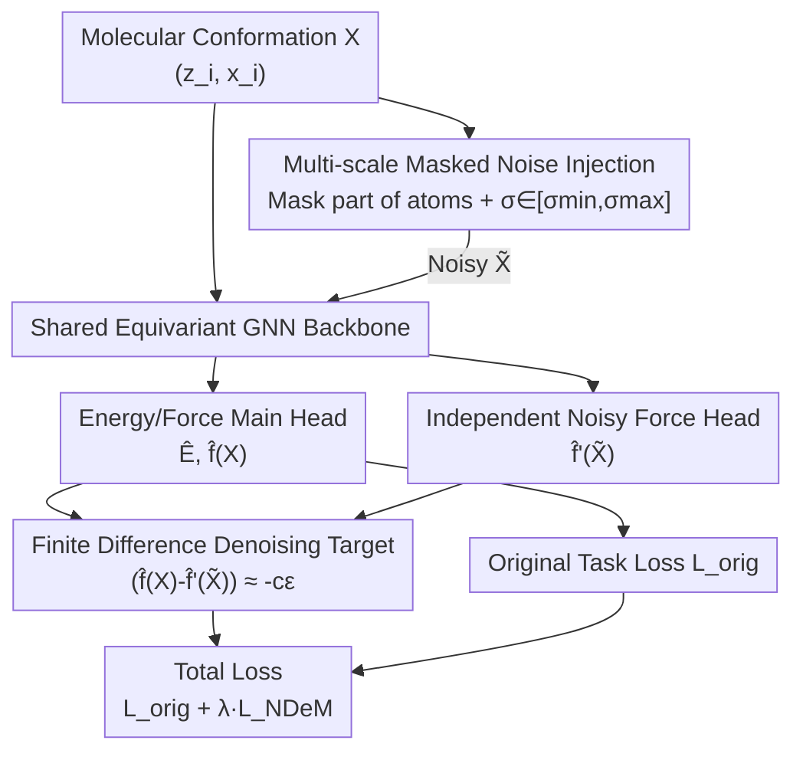

# Coordinate Denoising for Non-Equilibrium Molecular Representation Learning

**Conference**: CVPR 2026  
**Paper**: [CVF Open Access](https://openaccess.thecvf.com/content/CVPR2026/html/Tang_Coordinate_Denoising_for_Non-Equilibrium_Molecular_Representation_Learning_CVPR_2026_paper.html)  
**Code**: None  
**Area**: Molecular Representation Learning / Computational Chemistry  
**Keywords**: Coordinate Denoising, Non-Equilibrium Molecules, Force Field Learning, Finite Difference, Auxiliary Task  

## TL;DR
Addressing the flaw that the conclusion "coordinate denoising is equivalent to force field learning" only holds in equilibrium, this paper derives a denoising target NDeM valid for any conformation using second-order finite differences of the potential energy surface. This is implemented as a plug-and-play auxiliary task without pre-training, consistently improving force prediction accuracy for various equivariant GNNs on MD17, QM9, and OC20.

## Background & Motivation

**Background**: In 3D molecular representation learning, coordinate denoising is an elegant self-supervised paradigm. By adding Gaussian noise to atomic coordinates and training a network to predict the noise, it can be proven under statistical mechanics to be equivalent to Score Matching—learning the gradient of the potential energy surface (PES), which is the atomic force field. Methods like Frad, SliDe, and SE(3)-DDM have achieved strong results in force/energy prediction using this approach.

**Limitations of Prior Work**: This equivalence carries an **implicit assumption**: the clean structure $X$ must be at an energy minimum (equilibrium), where the intrinsic net force of atoms is approximately zero. However, in reality, a large number of molecules are not in equilibrium: molecular dynamics (MD) trajectories, transition states of chemical reactions, catalysis, and transient conformations in protein folding all involve atoms subjected to significant non-zero intrinsic forces pushing them towards lower-energy configurations.

**Key Challenge**: Under non-equilibrium states, predicting the artificially added noise $\epsilon$ essentially attempts to "restore" the molecule to a transient state $X$ that is not an energy minimum. Here, the denoising target is "polluted" by the molecule's own intrinsic dynamics and is no longer equivalent to the true force field (Figure 1 in the paper: in equilibrium, the noise direction $\approx$ force direction; in non-equilibrium, the two are misaligned by the intrinsic force). Consequently, representations learned via denoising on general MD data suffer from reduced quality and robustness.

**Goal**: Derive a denoising target that is **valid for both** equilibrium and non-equilibrium states, without increasing architectural burden or requiring a separate pre-training phase.

**Key Insight**: Since the problem arises from the "denoising assumes zero intrinsic force" hypothesis, this assumption should be discarded—the intrinsic force $F(X)$ must be explicitly **decoupled** from the noise. The authors use a second-order Taylor expansion of the PES around an arbitrary conformation $X$ to describe the "change in force before and after adding noise." This change is the physical quantity truly determined by the noise and can be used for supervision.

**Core Idea**: Replace "original noise" with the "difference in forces before and after perturbation" as the denoising supervision target—$F(\tilde X) - F(X) \approx -c\,\epsilon$—thereby generalizing denoising from equilibrium to arbitrary conformations.

## Method

### Overall Architecture

NDeM (Node Denoising on non-Equilibrium Molecules) does not modify the backbone or the main task; instead, it attaches an auxiliary task to the standard "equivariant GNN energy + force prediction" training pipeline.

Main Task: The original molecule $M = \{(z_i, x_i)\}$ enters the equivariant GNN to output energy $\hat E$ and per-atom force $\hat f_i$. It is supervised by normalized energy loss $\mathcal L_E$ and force loss $\mathcal L_F$ (the paper uses $\lambda_E:\lambda_F = 1:100$, as forces are harder to learn).

Auxiliary Task: The same molecule is perturbed with noise to obtain $\tilde X$ and fed into the **same backbone**, but connected to an **independent Noisy Force Head** to output the "noisy force" $\hat f'_i(\tilde X)$. The supervision signal is not the raw noise, but the constraint derived from finite differences: "the force difference should be proportional to the negative noise." Both tasks share the backbone and are optimized jointly; essentially, the model learns the absolute force values while simultaneously learning the local force gradient (PES curvature).

The pipeline follows a "shared backbone + dual output heads + dual branch input" structure, as shown in the following diagram:

### Key Designs

**1. Finite Difference Denoising Target: Decoupling Intrinsic Force from Noise**

This is the theoretical core of the paper, directly addressing the pain point that "denoising is no longer equivalent to force field learning in non-equilibrium." Instead of predicting noise directly as in classic denoising, the authors apply a second-order Taylor expansion to the PES at an arbitrary conformation $X$:

$$E(\tilde X) \approx E(X) + \nabla E(X)^\top \epsilon + \tfrac12\,\epsilon^\top \mathbf H(X)\,\epsilon$$

where $\epsilon = \tilde X - X$ is the perturbation, $\nabla E(X) = -F(X)$ is the negative force field, and $\mathbf H(X) = \nabla^2 E(X)$ is the Hessian characterizing PES curvature. Taking the gradient with respect to $\tilde X$ and substituting $F = -\nabla E$ yields the relation between forces before and after perturbation:

$$-F(\tilde X) \approx -F(X) + \mathbf H(X)\,\epsilon$$

Since calculating the Hessian is computationally expensive during training, the authors use an **isotropic curvature approximation**: for small local perturbations $\epsilon$, assume $\mathbf H(X) \approx c\mathbf I$ (where $c$ is a scalar representing local curvature). The relationship simplifies to a computable finite difference form:

$$F(\tilde X) - F(X) \approx -c\,\epsilon$$

The elegance of this formula lies in its **explicit isolation of the intrinsic force $F(X)$**. The denoising supervision target is now only the "force change induced by perturbation $-c\epsilon$", which is independent of whether the molecule is in equilibrium. In equilibrium ($F(X) \approx 0$), it automatically reverts to classic denoising $F(\tilde X) \approx -c\epsilon$ as a special case; in non-equilibrium ($F(X) \neq 0$), it remains strictly valid. Notably, the authors do not set $c$ as a fixed hyperparameter but let it **implicitly become a learnable quantity within the auxiliary force head**, allowing the model to adapt to the PES curvature of different conformations.

**2. Independent Noisy Force Head: Avoiding Interference between Perturbation Force and True Force**

The finite difference target requires obtaining both the "true force on the clean molecule $\hat f_i(X)$" and the "perturbation force on the noisy molecule $\hat f'_i(\tilde X)$." A natural question is: why not reuse the main force head since both output dimensions are identical? The authors' ablation (analysis below Table 6) provides a clear answer—**using the main head to simultaneously output noisy forces degrades original force prediction accuracy.**

The reason is that in non-equilibrium states, the directions of perturbation forces and unperturbed forces diverge significantly (Figure 1). Forcing the same equivariant head to represent these two physically different quantities induces optimization interference within the shared backbone. Therefore, NDeM uses a **dedicated auxiliary equivariant head $\text{GNN}_{F'}$**, which shares the backbone with the main head but has independent parameters. The NDeM loss is formulated as a regression of the force difference before and after perturbation against the negative noise:

$$\mathcal L_{\text{NDeM}} = \mathbb E_{X,\epsilon} \Big[ \tfrac1N \sum_{i=1}^N \big\| (\hat f_i(X) - \hat f'_i(\tilde X)) - \epsilon^*_i \big\|^2 \Big]$$

where $\epsilon^*_i$ is the normalized ground truth noise. The auxiliary head can also leverage implicit representations of the original molecular forces in the backbone to better align noisy forces with true forces, reciprocally enhancing force field learning. The total objective is $\mathcal L_{\text{total}} = \mathcal L_{\text{orig}} + \lambda_{\text{NDeM}} \mathcal L_{\text{NDeM}}$.

**3. Multi-scale Masked Noise Injection: Keeping Taylor Approximation Valid while Retaining Exploration**

The finite difference target relies on the second-order Taylor expansion, which requires the perturbation $\epsilon$ to be sufficiently small—excessive noise destroys the molecular structure, making the approximation fail, while too little noise lacks exploratory power. To balance these, the authors randomly **mask a subset of atoms and only add noise to them** each iteration, with the noise standard deviation $\sigma$ sampled from the interval $[\sigma_{\min}, \sigma_{\max}]$ for each batch. This multi-scale masking strategy allows the model to learn robust representations across different perturbation scales while keeping the noise magnitude within the valid range for the Taylor expansion (ablations show accuracy degrades significantly when $\sigma$ is as large as 0.5).

## Key Experimental Results

### Main Results

On MD17 (non-equilibrium MD trajectories, force prediction, 950/50 train/val), NDeM uses TorchMD-NET as the backbone. Compared to Frad and SliDe, which are designed for equilibrium and require pre-training, NDeM achieves the best force MAE in 5 out of 8 molecules:

| Molecule (MD17) | TorchMD-NET | Frad | SliDe | NDeM |
| :--- | :--- | :--- | :--- | :--- |
| Aspirin | 0.2450 | 0.2087 | 0.1740 | **0.1654** |
| Ethanol | 0.1067 | 0.0910 | 0.0882 | **0.0868** |
| Malonaldehyde | 0.1667 | 0.1415 | 0.1538 | **0.1439**⚠️ (SliDe 0.1538 is higher; NDeM is second-best in this col; text says "best 5/8") |
| Naphthalene | 0.0593 | 0.0530 | 0.0483 | **0.0480** |
| Salicylic Acid | 0.1284 | 0.1081 | 0.1006 | **0.1004** |
| Toluene | 0.0644 | 0.0540 | 0.0540 | **0.0536** |
| Uracil | 0.0887 | 0.0760 | 0.0825 | **0.0806** |

On the S2EF task of the large-scale catalysis dataset OC20, using EquiformerV2 as the backbone, NDeM reduces force MAE further than DeNS:

| Model (OC20 S2EF test) | Energy MAE (meV)↓ | Force MAE (meV/Å)↓ |
| :--- | :--- | :--- |
| EquiformerV2 ($\lambda_E=4$, 153M) | 219 | 14.2 |
| EquiformerV2 + DeNS (160M) | 216 | 13.4 |
| EquiformerV2 + NDeM ($\lambda_E=2$, 157M) | 227 | **12.9** |

Additionally, on the primarily equilibrium QM9 dataset, NDeM performs comparably or better than Frad/SliDe across most properties (e.g., $\mu$ 0.0082, $\alpha$ 0.0356, gap 26.0 meV), demonstrating its general applicability to both equilibrium and non-equilibrium data.

### Ablation Study

| Configuration | Aspirin MAE↓ | Description |
| :--- | :--- | :--- |
| $\lambda_{\text{NDeM}} = 0$ | 0.2087 | No auxiliary task (reverts to pure supervision) |
| $\lambda_{\text{NDeM}} = 0.1$ | 0.1688 | Significant improvement upon adding auxiliary task |
| $\lambda_{\text{NDeM}} = 1$ | **0.1654** | Optimal weight |
| $\lambda_{\text{NDeM}} = 10$ | 0.1671 | Slight drop when too large |
| $\lambda_{\text{NDeM}} = 100$ | 0.1722 | Auxiliary task overpowers the main task |

Noise scale ablation: $\sigma = 0.05$ is optimal (0.1654); at $\sigma = 0.5$, it degrades to 0.1887, verifying that "perturbations must be small enough to maintain the Taylor approximation."

Compatibility with pre-training (Table 6): Fine-tuning from Frad pre-trained weights gives 0.2088 for standard training → 0.1774 with NDeM; from SliDe gives 0.1698 → 0.1648 with NDeM, performing similarly to or better than NDeM trained from scratch (0.1654).

### Key Findings
- The weight of the auxiliary task ($ \lambda = 0.1 $) immediately slashes the Aspirin MAE from 0.2087 to 0.1688, indicating the gain stems mainly from the "existence of the physical constraint" rather than fine hyperparameter tuning; however, excessively large $\lambda$ (100) interferes with the main task.
- The independent noisy force head is a necessary design: reusing the main head causes optimization interference due to divergent directions of perturbation and true forces, dragging down original force prediction.
- NDeM is orthogonally complementary to pre-training—it can both reach SOTA from scratch and be stacked onto Frad/SliDe pre-trained weights for further refinement.

## Highlights & Insights
- **Generalizing the "Equilibrium Special Case" to a "General Form for All States"**: Classic denoising is merely a special case where $F(X) \approx 0$. NDeM uses a first-order Taylor force relation + isotropic Hessian approximation to generalize it to arbitrary conformations. This logic of "covering old conclusions with a more general physical derivation" is elegant and backward-compatible.
- **Learnable Curvature $c$**: Instead of treating the local PES curvature as a fixed hyperparameter, it is implicitly embedded into the auxiliary force head. This allows the model to adapt per conformation, avoiding manual tuning while better fitting the true curvature of different molecular regions.
- **Plug-and-play, Architecture-agnostic, Zero Pre-training**: Optimized as an auxiliary loss in parallel with the main task, it can be attached to any equivariant backbone like TorchMD-NET or EquiformerV2. The transferability of "achieving comprehensive gains via a single loss term" is highly valuable—it can be directly moved to any molecular model for force/energy regression.

## Limitations & Future Work
- **Strong Isotropic Hessian Approximation**: Simplifying $\mathbf{H}(X)$ to a scalar $cI$ discards anisotropic curvature information of the PES, which might be imprecise in transition state regions where curvature directions vary greatly. The authors list "higher-order Hessian approximation" as a future direction.
- **Dependence on Small Perturbations**: The finite difference target only holds when $\epsilon$ is small ($\sigma$ at 0.5 leads to significant degradation), meaning the conformation neighborhood it can explore is limited, providing little help for large deformations far from the current conformation.
- **Modest Improvement Magnitude**: On MD17, the improvements over SliDe are mostly in the third decimal place; on OC20, the energy MAE is even slightly worse than the baseline (227 vs 219). Gains are primarily reflected in force prediction. The method serves more as a "robust general gain" than a disruptive leap.
- ⚠️ The paper does not provide an open-source code link; reproduction requires self-implementation of the auxiliary head and multi-scale masked noise.

## Related Work & Insights
- **vs. Classic Coordinate Denoising / Frad / SliDe**: They establish the equivalence "denoising $\iff$ force field learning" but implicitly assume the clean structure is at an energy minimum, making them equilibrium-oriented and often requiring separate pre-training. NDeM explicitly decouples the intrinsic force, holds strictly for non-equilibrium states, and functions as an auxiliary task without pre-training. The two can be combined.
- **vs. DeNS (denoising strategy on OC20)**: Also performs denoising-style augmentation on large-scale catalytic data, but NDeM achieves lower force MAE (test 12.9 vs 13.4 meV/Å) via multi-scale masked noise and the finite difference target.
- **vs. Noisy Nodes**: The earliest use of noise injection as an auxiliary task for attribute prediction, but mostly at a regularization level. NDeM provides the physical basis for the denoising auxiliary task in non-equilibrium states (second-order Taylor + Hessian approximation).

## Rating
- Novelty: ⭐⭐⭐⭐ Generalizes denoising-force equivalence from equilibrium to arbitrary conformations with a clear and practical theoretical starting point.
- Experimental Thoroughness: ⭐⭐⭐⭐ Comprehensive evaluation on MD17/QM9/OC20 across multiple backbones, with complete ablations on weight/noise/pre-training compatibility.
- Writing Quality: ⭐⭐⭐⭐ The theoretical derivation progresses logically, with motivations clearly linked to the formulas.
- Value: ⭐⭐⭐⭐ Plug-and-play, architecture-agnostic, and requires no pre-training; offers direct transfer value to the molecular force field modeling community.

<!-- RELATED:START -->

## Related Papers

- [\[ICML 2026\] Flow Sampling: Learning to Sample from Unnormalized Densities via Denoising Conditional Processes](../../ICML2026/computational_biology/flow_sampling_learning_to_sample_from_unnormalized_densities_via_denoising_condi.md)
- [\[NeurIPS 2025\] Curly Flow Matching for Learning Non-gradient Field Dynamics](../../NeurIPS2025/computational_biology/curly_flow_matching_for_learning_non-gradient_field_dynamics.md)
- [\[ICLR 2026\] Learning Molecular Chirality via Chiral Determinant Kernels](../../ICLR2026/computational_biology/learning_molecular_chirality_via_chiral_determinant_kernels.md)
- [\[ICML 2026\] Learning Protein Structure-Function Relationships through Knowledge-guided Representation Decomposition](../../ICML2026/computational_biology/learning_protein_structure-function_relationships_through_knowledge-guided_repre.md)
- [\[AAAI 2026\] S2Drug: Bridging Protein Sequence and 3D Structure in Contrastive Representation Learning for Virtual Screening](../../AAAI2026/computational_biology/s2drug_bridging_protein_sequence_and_3d_structure_in_contrastive_representation_.md)

<!-- RELATED:END -->
