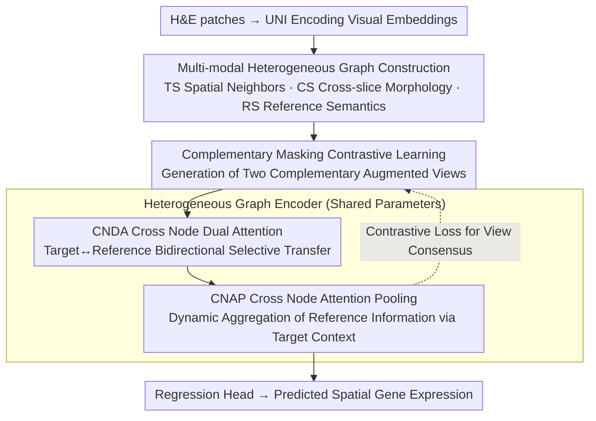

# Cross-Slice Knowledge Transfer via Masked Multi-Modal Heterogeneous Graph Contrastive Learning for Spatial Gene Expression Inference

**Conference**: CVPR 2026  
**arXiv**: [2603.22821](https://arxiv.org/abs/2603.22821)  
**Code**: [https://github.com/wenwenmin/SpaHGC](https://github.com/wenwenmin/SpaHGC)  
**Area**: Medical Image Analysis / Spatial Transcriptomics  
**Keywords**: Spatial Transcriptomics, Heterogeneous Graph Learning, Cross-Slice Knowledge Transfer, Contrastive Learning, Gene Expression Prediction

## TL;DR
SpaHGC is proposed, a multi-modal heterogeneous graph-based framework that integrates intra-target slice, cross-slice, and intra-reference slice subgraphs. Combined with masked graph contrastive learning and a cross-node dual attention mechanism, it predicts spatial gene expression from H&E pathology images, achieving a PCC improvement of 7.3%-27.1% across seven datasets.

## Background & Motivation

**Background**: Spatial transcriptomics (ST) technology can precisely quantify the spatial distribution of gene expression in tissues, but high experimental costs limit large-scale application. Predicting ST gene expression from H&E pathology images is a promising alternative.

**Limitations of Prior Work**: (1) ST data is sparse and noisy—gene expression in certain positions is missing or extremely low; (2) Existing methods only model the spatial structure within a single slice, ignoring expression patterns shared between different slices; (3) Individual differences and disease progression introduce cross-sample heterogeneity, making it difficult for single-slice models to learn generalized representations.

**Key Challenge**: Similar tissues/diseases usually share common expression patterns, but individual differences make direct alignment across slices difficult—how to effectively integrate shared information while handling individual differences?

**Goal**: How to model cross-slice spatial relationships and transfer prior knowledge from multiple reference slices to gene expression prediction in target slices?

**Key Insight**: Constructing a multi-modal heterogeneous graph, using pathology foundation model (UNI) image embeddings to connect spots across slices, and enhancing representation robustness through contrastive learning.

**Core Idea**: Heterogeneous Graph + Cross-Slice Knowledge Transfer + Masked Contrastive Learning = More accurate gene expression prediction.

## Method

### Overall Architecture
The core problem SpaHGC addresses is that single-slice models only observe one slice and fail to learn shared expression patterns among different samples. The strategy is to weave target slices and several reference slices into the same heterogeneous graph, allowing target spots to "borrow" prior knowledge from morphologically similar patches in reference slices. The pipeline is as follows: first, encode each H&E patch into visual embeddings using the pathology foundation model UNI; then establish three types of edges around each target spot—spatial neighbors within the slice, morphologically similar patches across slices, and semantic connections within the reference slice—forming a heterogeneous graph; then apply complementary masking to node features to obtain two augmented views, which are fed into a shared-parameter heterogeneous graph encoder—where intra-target/intra-reference edges are aggregated by GraphSAGE, and cross-slice edges are handled by CNDA for bidirectional transfer, followed by CNAP pooling reference information according to target context; finally, a regression head predicts gene expression from the aggregated target node representations, supplemented by contrastive loss during training to maintain consistency between the two complementary views.

### Key Designs

**1. Multi-modal Heterogeneous Graph Construction: Weaving "Local Space—Cross-slice Morphology—Reference Semantics" into one graph**

ST data is sparse and information from a single slice is limited. SpaHGC constructs three types of connections for each target spot. The Target-slice (TS) graph connects $Q$ nearest neighbor spots within the target slice by Euclidean distance to capture local spatial continuity. The Cross-slice (CS) graph retrieves the Top-K patches with highest cosine similarity from the reference slices for each target patch embedding $\mathbf{z}_t^{(i)}$, pulling morphologically similar cross-slice spots together. Note that reference nodes carry joint features $\mathbf{h}_r = [\mathbf{z}_r \| \mathbf{y}_r]$, concatenating visual embeddings with ground-truth gene expression, so this edge transfers both morphology and expression labels. The Reference-slice (RS) graph establishes Top-K connections among reference nodes based on joint feature similarity, building a global semantic scaffold. These three types of edges integrate hierarchical information—local spatial, cross-slice morphology, and reference global semantics—in a heterogeneous manner.

**2. Complementary Masking Contrastive Learning: Forcing robust consistent representations against noise through intentional omission**

After the graph is constructed, ST sequencing itself contains significant feature loss and noise. SpaHGC introduces this missingness into training: feature masking is applied to target node neighbors and reference nodes based on node types, generating two augmented views with identical topology but strictly complementary features ($\mathbf{M}_t^{(1)} + \mathbf{M}_t^{(2)} = \mathbf{1}$). The two views share encoder parameters during the forward pass, and a cosine distance contrastive loss is used to pull the representations of the same node together. By forcing the model to produce consistent representations from half the features, it learns to recover stable semantics from incomplete inputs.

**3. Cross Node Dual Attention (CNDA): Selective cross-slice transfer via bidirectional attention**

The masked views enter the heterogeneous graph encoder: intra-target (TS) and intra-reference (RS) edges are aggregated via GraphSAGE, while cross-slice (CS) edges are handled by CNDA. Since reference spots may include irrelevant noise, CNDA performs bidirectional attention between target and reference nodes. Target nodes attend to reference nodes to absorb visual and genetic knowledge:

$$\mathbf{A}_{t \leftarrow r} = \text{softmax}\!\left(\frac{\mathbf{Q}_t \mathbf{K}_r^\top}{\sqrt{d'}}\right), \qquad \bar{\mathbf{L}}_t = \mathbf{A}_{t \leftarrow r} \mathbf{V}_r$$

where $\bar{\mathbf{L}}_t$ is the aggregated transferred representation. Simultaneously, reference nodes attend to target nodes to update themselves. This data-adaptive mechanism allows the model to selectively amplify relevant morphology/expression information and suppress cross-slice noise.

**4. Cross Node Attention Pooling (CNAP): Dynamic aggregation of auxiliary information based on target context**

CNAP uses multi-head unidirectional cross-node attention, using target node representations as queries to aggregate reference node representations. Unlike fixed exemplar retrieval, CNAP's aggregation weights change with the target node's context. The same set of reference spots will result in different auxiliary representations for target spots in tumor areas versus stromal areas, providing flexibility across different tissue regions.

### Loss & Training
The training objective consists of contrastive loss and regression loss. The contrastive loss pulls representations of the two complementary views together for each node:

$$\mathcal{L}_{\text{con}} = \frac{1}{N} \sum_j \big(2 - 2 \cdot \text{Cos}(\hat{L}_j^1, \hat{L}_j^2)\big)$$

The regression loss supervises the final gene expression prediction. The contrastive part uses an asymmetric design where one view employs stop-gradient as a stable target to prevent representation collapse.

## Key Experimental Results

### Main Results (7 Public ST Datasets)

| Method | HER+ PCC% | cSCC PCC% | Lymph Node PCC% | Pancreas2 PCC% |
|------|----------|----------|----------------|---------------|
| STNet | 5.61 | 9.2 | 3.4 | 31.56 |
| HisToGene | 7.89 | 17.56 | 19.24 | 26.13 |
| mclSTExp | 23.15 | 31.88 | 21.64 | 31.61 |
| M2OST | 18.24 | 24.88 | 30.97 | 38.35 |
| **Ours (SpaHGC)** | **27.86** | **38.79** | **35.02** | **41.36** |

### Ablation Study

Effectiveness was verified by progressively removing components:
- Removing CNDA → Significant PCC drop, verifying the key role of cross-slice attention.
- Removing CS graph → Significant PCC drop, verifying the necessity of cross-slice connections.
- Removing Masking → Reduced robustness, verifying the contribution of contrastive learning.
- Replacing UNI with ResNet → PCC decreased significantly, verifying the importance of the pathology foundation model.

### Key Findings
- Across all 7 datasets, SpaHGC's PCC improvement ranged from 7.3% to 27.1%, which is highly significant.
- Prediction results are significantly enriched in multiple cancer-related pathways, verifying biological relevance.
- Cross-slice knowledge transfer is effective across different platforms (10x Visium, ST 1000, etc.), tissue types, and cancer subtypes.

## Highlights & Insights
- **Cross-Slice Knowledge Transfer**: Unlike existing methods that only look at a single slice, utilizing prior knowledge from multiple reference slices represents a significant paradigm shift.
- **Deep Integration of Pathology Foundation Model (UNI)**: Using pre-trained strong embeddings to establish cross-slice connections leverages large-scale pre-trained knowledge.
- **Biological Downstream Validation**: Beyond numerical metrics, biological validation such as pathway enrichment analysis was performed.

## Limitations & Future Work
- Requires multiple reference slices as training data, which may be limited for extremely rare tissue types.
- Top-K connection in graph construction depends on the quality of UNI embeddings.
- Fine-grained ways of incorporating spatial position information into the heterogeneous graph construction were not explored.

## Related Work & Insights
- The contrastive alignment ideas of BLEEP and mclSTExp are inspiring, but SpaHGC's heterogeneous graph framework is more flexible.
- The exemplar retrieval idea of EGGN is similar to SpaHGC's CS graph, but SpaHGC's graph structuring is more systematic.
- The complementary masking strategy can be generalized to other multi-modal graph learning tasks.

## Rating
- Novelty: ⭐⭐⭐⭐ The idea of modeling cross-slice relationships via heterogeneous graphs is valuable, though the basic components are combinations of mature techniques.
- Experimental Thoroughness: ⭐⭐⭐⭐⭐ 7 datasets + 9 baselines + biological downstream analysis is very comprehensive.
- Writing Quality: ⭐⭐⭐⭐ Clear structure and rich visualizations.
- Value: ⭐⭐⭐⭐ Significant push for the field of spatial transcriptomics; cross-slice knowledge transfer is the correct direction.

<!-- RELATED:START -->

## Related Papers

- [\[CVPR 2026\] From Spots to Pixels: Dense Spatial Gene Expression Prediction from Histology Images](from_spots_to_pixels_dense_spatial_gene_expression_prediction_from_histology_ima.md)
- [\[CVPR 2026\] Deciphering Genotype-Phenotype Mechanisms from High-Content Profiling via Knowledge-Guided Multi-modal Graph Learning](deciphering_genotype-phenotype_mechanisms_from_high-content_profiling_via_knowle.md)
- [\[CVPR 2026\] Multi-View Hierarchical Alignment Learning for Spatial Transcriptomics](multi-view_hierarchical_alignment_learning_for_spatial_transcriptomics.md)
- [\[CVPR 2026\] HyperST: Hierarchical Hyperbolic Learning for Spatial Transcriptomics Prediction](hyperst_hierarchical_hyperbolic_learning_for_spatial_transcriptomics_prediction.md)
- [\[CVPR 2026\] Bulk RNA-seq Guided Multi-modal Detection of Anomalous Regions in Human Cancer via Spatial Transcriptomics](bulk_rna-seq_guided_multi-modal_detection_of_anomalous_regions_in_human_cancer_v.md)

<!-- RELATED:END -->
