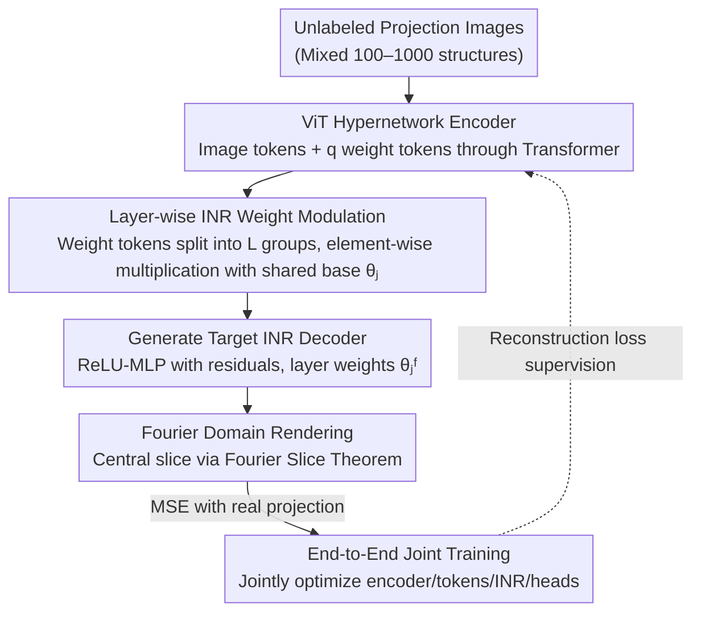

# CryoHype: Reconstructing a Thousand Cryo-EM Structures with Transformer-Based Hypernetworks

**Conference**: CVPR 2026  
**arXiv**: [2512.06332](https://arxiv.org/abs/2512.06332)  
**Code**: [https://cryohype.cs.princeton.edu/](https://cryohype.cs.princeton.edu/)  
**Area**: Computational Biology  
**Keywords**: Cryo-EM, heterogeneous reconstruction, Hypernetwork, Transformer, Implicit Neural Representation

## TL;DR
Ours proposes CryoHype, a Cryo-EM reconstruction method based on a Transformer hypernetwork, which reduces parameter sharing by dynamically adjusting the weights of Implicit Neural Representations (INR), achieving simultaneous reconstruction of 1000 different protein structures from unlabeled Cryo-EM images for the first time.

## Background & Motivation

**Background**: Cryo-electron microscopy (Cryo-EM) is a key technology for resolving the 3D structures of biological macromolecules. Traditional methods mainly handle conformational heterogeneity (different conformations of the same molecule), but the technology is increasingly applied to complex heterogeneous mixture scenarios.

**Limitations of Prior Work**: (1) 3D classification methods (EM algorithms) grow linearly in memory and computation with the number of classes, making them unscalable to many classes (typically $K<10$); (2) Methods based on continuous implicit representations (e.g., cryoDRGN) force all different structures to share a single set of network weights, which fails to capture high-frequency details under extreme compositional heterogeneity; (3) cryoDRGN uses concatenation conditioning, which is mathematically equivalent to modifying only the bias of the first INR layer, resulting in limited expressivity.

**Key Challenge**: Shared decoder weights vs. the need to generate unique high-resolution details for each structure—excessive parameter sharing limits model capacity.

**Goal**: How to achieve high-quality reconstruction for each structure when facing extreme compositional heterogeneity (100–1000 different structures)?

**Key Insight**: Utilize a Transformer hypernetwork to dynamically generate weights for the INR, significantly reducing parameter sharing between different structures.

**Core Idea**: Hypernetwork conditioning (modifying weights of all INR layers) $\gg$ concatenation conditioning (modifying only the first layer bias), providing a larger representation space under extreme heterogeneity.

## Method

### Overall Architecture
The core problem CryoHype addresses is how to allow a single model to simultaneously reconstruct 100–1000 **completely different** protein structures when they are mixed in a batch of unlabeled projection images. The mechanism is to replace "using one decoder and relying on conditional inputs to distinguish structures" with "dynamically generating structure-specific decoder weights for each image." The pipeline is as follows: projection images are first processed by a ViT encoder (tokenizer + Transformer) to extract a set of weight descriptions; these descriptions are modulated via linear heads to produce layer-wise weights for an Implicit Neural Representation (INR) decoder; this INR renders 3D volumes into projections in the Fourier domain, which are compared with ground truth projections using MSE. Specifically, it consists of five components: a ViT encoder, learnable weight tokens $\{w_i\}_{i=1}^q$, an INR decoder in the form of a ReLU-MLP with residual connections (sharing base parameters $\{\theta^j\}_{j=1}^L$), and one linear head per layer $\{\text{Head}_j\}_{j=1}^L$. The process operates entirely in the Fourier domain, leveraging the Fourier Slice Theorem to transform projection/back-projection into slice sampling, thus avoiding expensive numerical integration.

### Key Designs

**1. Layer-wise Modulation of INR Weights via Hypernetwork: Upgrading from "Modifying first-layer bias" to "Modifying all-layer weights"**

Methods like cryoDRGN force all structures to share the same INR weights, distinguishing them only by concatenating latent variables into the input—Ours points out that this is mathematically equivalent to only modifying the bias of the first INR layer, leaving extremely limited "individualized space" for each structure, which causes high-frequency details to be smoothed out under extreme heterogeneity. CryoHype's approach is to let the hypernetwork modify the weights of **every** INR layer: ViT-output weight tokens are split into $L$ groups, and the $j$-th group, after passing through its respective head and normalization, performs element-wise multiplicative modulation on the shared base parameters $\theta_j$: $\theta_j^F = \text{Norm}(\text{Head}_j([w_1^{F,j}, \ldots, w_{a_j}^{F,j}])) \otimes \theta_j$. Multiplicative modulation of a shared base is chosen over generating entire weight matrices from scratch because the former reduces the hypernetwork's burden to "scaling a shared base," making training more stable; meanwhile, modulating all layers provides orders of magnitude more effective conditioning dimensions than just the first layer bias, which is the source of its ability to distinguish details across 1000 structures.

**2. Using ViT instead of CNN/MLP as Hypernetwork Encoder**

The quality of the hypernetwork depends on how much structural information the encoder can extract from projections. Instead of the U-Net common in structural biology, ViT was chosen: projection images are first tokenized and then concatenated with $q$ learnable weight tokens to pass through a Transformer, allowing weight tokens to aggregate global evidence from the image via attention to directly carry information on "what weights to generate." In ablation experiments, ViT's FSC_AUC was 0.346, whereas U-Net was only 0.208 and MLP was 0.234, despite the latter two having more parameters—demonstrating that for "image $\to$ weight set" mappings requiring global aggregation, the attention mechanism is significantly more sample/parameter efficient than convolution or fully connected layers, providing the prerequisite for scaling to thousands of structures.

**3. End-to-End Joint Training**

The ViT encoder, weight tokens, INR base parameters, and linear heads are all optimized together without stages. The training signal is simple: MSE in the Fourier domain between the rendered projections and the ground truth projections. This avoids the error accumulation common in multi-stage pipelines—the weight representation learned by the encoder is directly supervised by the final reconstruction quality rather than an intermediate objective.

### Loss & Training
- The reconstruction loss is MSE in the Fourier domain: frequency-by-frequency comparison between rendered and real projections.
- Projections are modeled as central slices of a 3D Fourier volume using the Fourier Slice Theorem, avoiding numerical integration.
- Latent Space Analysis: The output of weight tokens is treated as a high-dimensional latent space, reduced to 100 dimensions via PCA and then to 2 dimensions via UMAP for visualization to check if different structures are clustered clearly.

## Key Experimental Results

### Main Results—Tomotwin-100 (100 Structures)

| Method | Mean FSC_AUC↑ | Mean CD↓ | Mean vIoU↑ |
|------|-------------|---------|----------|
| cryoDRGN | 0.316 (0.046) | 2.26 | 0.63 |
| DRGN-AI-fixed | 0.202 (0.044) | 32.60 | 0.13 |
| Opus-DSD | 0.237 (0.049) | 33.48 | 0.14 |
| RECOVAR | 0.258 (0.109) | 27.22 | 0.16 |
| **CryoHype** | **0.346 (0.033)** | **2.18** | 0.61 |
| Backprojection (Upper Bound) | 0.364 (0.023) | 1.50 | 0.71 |

### Sim2Struct-1000 Expansion

| Method | #Structures | FSC_AUC↑ | CD↓ | vIoU↑ |
|------|-------|---------|------|-------|
| cryoDRGN | 100 | 0.361 | 2.34 | 0.47 |
| CryoHype | 100 | **0.409** | **1.99** | **0.49** |
| cryoDRGN | 500 | 0.216 | 4.64 | 0.39 |
| CryoHype | 500 | **0.305** | **2.41** | **0.45** |
| cryoDRGN | 1000 | 0.139 | 9.07 | 0.26 |
| CryoHype | 1000 | **0.232** | **3.02** | **0.42** |

### Ablation Study

| Configuration | Tomotwin-100 FSC_AUC↑ | Description |
|------|---------------------|------|
| Concatenation Conditioning | 0.255 | Equivalent to cryoDRGN style |
| U-Net Encoder | 0.208 | CNN encoder |
| MLP Encoder | 0.234 | More parameters but worse performance |
| **CryoHype (ViT + Hypernetwork)** | **0.346** | Full model |

### Key Findings
- CryoHype significantly outperforms cryoDRGN at all levels of heterogeneity, with its advantage widening as heterogeneity increases.
- In the extreme setting of 1000 structures, cryoDRGN's latent space begins to degrade (blurred UMAP clusters), while CryoHype maintains clear clustering.
- Visualization of INR activation distributions reveals that CryoHype generates more diverse network activations, confirming that reducing parameter sharing leads to greater expressivity.
- Standard FSC metrics can be misleading in heterogeneous reconstruction; real-space metrics (CD, vIoU) provide a more accurate evaluation of shape differences.

## Highlights & Insights
- **Paradigm Innovation**: Shifting from "shared network + conditional input" to "dynamically generated network weights," hypernetworks offer a new paradigm for Cryo-EM heterogeneous reconstruction.
- **Scalability**: Demonstrated simultaneous reconstruction of 1000 structures for the first time, pushing Cryo-EM toward high-throughput structural discovery.
- **New Dataset Sim2Struct-1000**: Provides a standardized benchmark for research into extreme compositional heterogeneity.
- **New Evaluation Metrics**: Introduced Chamfer Distance and vIoU as supplements to FSC to better assess differences in shape.

## Limitations & Future Work
- **Requires Known Poses**: Currently assumes particle poses are known, which is not the case in real experiments. Integrating pose estimation is a critical next step.
- Only addresses compositional heterogeneity, not the joint conformational + compositional heterogeneity.
- Computation-heavy requirements for large data volumes (1000 projections per structure).

## Related Work & Insights
- The success of hypernetworks in NeRF/INR fields (pi-GAN, Transformers as Meta-Learners) inspired this work.
- The theoretical analysis proving that cryoDRGN's concatenation conditioning is equivalent to a linear hypernetwork modifying the first-layer bias is a valuable contribution.
- The "from purified samples to complex mixtures" trend in Cryo-EM demands higher capabilities from reconstruction methods.

## Rating
- Novelty: ⭐⭐⭐⭐⭐ Bringing hypernetworks into Cryo-EM reconstruction is a first, with clear theoretical motivation.
- Experimental Thoroughness: ⭐⭐⭐⭐⭐ Multiple datasets + multiple baselines + ablations + new dataset + new metrics.
- Writing Quality: ⭐⭐⭐⭐⭐ Clear derivations, distinct motivation, and smooth logical flow.
- Value: ⭐⭐⭐⭐⭐ Highly significant for high-throughput discovery in structural biology.

<!-- RELATED:START -->

## Related Papers

- [\[CVPR 2026\] CryoKRAQEN: Kernel-Regularized Annealing for Quantized Embedding Networks in Cryo-EM Heterogeneous Reconstruction](cryokraqen_kernel-regularized_annealing_for_quantized_embedding_networks_in_cryo.md)
- [\[CVPR 2026\] cryoSENSE: Compressive Sensing Enables High-throughput Microscopy with Sparse and Generative Priors on the Protein Cryo-EM Image Manifold](cryosense_compressive_sensing_enables_high-throughput_microscopy_with_sparse_and.md)
- [\[ICCV 2025\] CryoFastAR: Fast Cryo-EM Ab initio Reconstruction Made Easy](../../ICCV2025/computational_biology/cryofastar_fast_cryoem_ab_initio_reconstruction_made_easy.md)
- [\[ICLR 2026\] CryoNet.Refine: A One-step Diffusion Model for Rapid Refinement of Structural Models with Cryo-EM Density Map Restraints](../../ICLR2026/computational_biology/cryonetrefine_a_one-step_diffusion_model_for_rapid_refinement_of_structural_mode.md)
- [\[NeurIPS 2025\] Multiscale Guidance of Protein Structure Prediction with Heterogeneous Cryo-EM Data](../../NeurIPS2025/computational_biology/multiscale_guidance_of_protein_structure_prediction_with_heterogeneous_cryo-em_d.md)

<!-- RELATED:END -->
