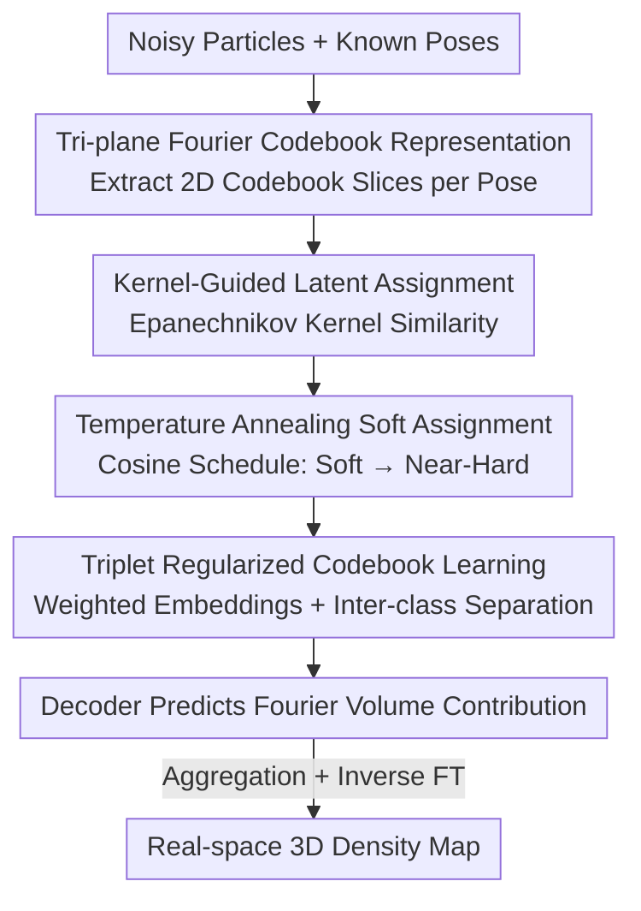

# CryoKRAQEN: Kernel-Regularized Annealing for Quantized Embedding Networks in Cryo-EM Heterogeneous Reconstruction

**Conference**: CVPR 2026  
**Paper**: [CVF Open Access](https://openaccess.thecvf.com/content/CVPR2026/html/Gao_CryoKRAQEN_Kernel-Regularized_Annealing_for_Quantized_Embedding_Networks_in_Cryo-EM_Heterogeneous_CVPR_2026_paper.html)  
**Code**: Project page only (referred to as "CryoKRAQEN" project page in the paper, no public repository found)  
**Area**: Computational Biology / Cryo-EM Heterogeneous Reconstruction / Neural Implicit Representations  
**Keywords**: Cryo-EM Heterogeneous Reconstruction, Tri-plane Implicit Representation, Quantized Codebook, Kernel-Guided Annealing, Triplet Regularization  

## TL;DR
CryoKRAQEN utilizes an **encoder-free (decoder-only) tri-plane Fourier codebook** for cryo-EM heterogeneous reconstruction. By measuring the similarity between particle images and codebook prototypes using an Epanechnikov kernel, gradually tightening soft assignments to near-hard clustering via temperature annealing, and stabilizing the codebook with triplet regularization, the method accurately assigns noisy 2D projections to different 3D conformations/components without relying on encoders or Gaussian priors. It performs on par with SOTA on CryoBench and demonstrates significantly better performance on data with strong compositional heterogeneity.

## Background & Motivation
**Background**: Single-particle cryo-EM reconstruction recovers 3D structures by averaging tens of thousands of noisy 2D projections. However, as many macromolecules exhibit conformational flexibility (movement within the same molecule) or compositional heterogeneity (mixtures of different molecules), **heterogeneous reconstruction** has become a critical requirement. Prevailing neural methods fall into two categories: encoder-decoder frameworks (e.g., CryoDRGN) that encode images into low-dimensional latent variables and then decode them into Fourier volumes, and decoder-only frameworks (e.g., DRGN-AI) that maintain a fixed latent codebook for each structure and optimize directly via gradient descent.

**Limitations of Prior Work**: Encoder-decoder approaches are constrained by **Gaussian latent priors**, making it difficult to characterize discrete conformational jumps and multimodal distributions; additionally, they incur high computational overhead and their expressive power is bottlenecked by the encoder. Decoder-only approaches often use randomly initialized codebooks without explicit structural regularization, making them **extremely sensitive to initialization and prone to local minima or collapse**, particularly in compositional heterogeneity scenarios. Methods relying on preset structural priors (3DFlex, CryoSTAR) introduce bias when priors are inaccurate, while classical covariance methods (RECOVAR) are interpretable but limited by linear assumptions in highly non-linear scenarios.

**Key Challenge**: The fundamental difficulty of heterogeneous reconstruction lies in **unsupervised assignment of noisy particle images to unknown 3D conformations**. Assignments that are too "hard" lead to mode collapse (all images crowded into a few dominant structures), while assignments that are too "soft" cause different conformations to blur together, reducing resolution. This is a dilemma between hard and soft assignments, and existing methods either reside at one extreme or lack an explicit mechanism to schedule this transition.

**Goal**: To design a heterogeneous reconstruction framework that avoids the constraints of encoders and Gaussian priors, stabilizes codebook learning, and adaptively balances soft and hard assignments, allowing the assignment process to transition smoothly from "exploring multiple conformational hypotheses" to "converging to the most probable prototype."

**Key Insight**: The authors view "assignment" as an **annealable quantization problem with kernels**. Specifically, they use the compactly supported Epanechnikov kernel for local, noise-resistant similarity weighting, temperature annealing to control the soft-to-hard transition, and triplet loss to push different conformations apart within the codebook.

**Core Idea**: Replace the "encoder + Gaussian prior" with a "tri-plane Fourier codebook + kernel-guided annealing quantization." This allows for the soft-to-near-hard assignment of particle images to structural prototypes in Fourier space, achieving both stability and the ability to resolve conformational and compositional heterogeneity.

## Method

### Overall Architecture
CryoKRAQEN is a **unified quantized inference framework**. The input is a batch of noisy cryo-EM particle images (each with a known pose $\phi_i$), and the output is the 3D density map corresponding to each particle. It represents molecular density using a **tri-plane implicit field** in 3D Fourier space and maintains a learnable Fourier codebook where each entry acts as a "structural prototype." For each particle, pose-specific 2D Fourier slices are extracted from the codebook. The distance between the observed image and each codebook slice is measured in Fourier space, mapped through an Epanechnikov kernel, and passed through a temperature-annealed softmax to obtain "soft-to-near-hard" assignment weights. These weights combine codebook entries into a latent 3D embedding for the particle, which is then fed into a decoder to predict its contribution to the 3D Fourier volume. Aggregating all particles' contributions and performing an inverse Fourier transform yields the real-space density.

The pipeline is a clear multi-stage serial process with an annealing loop:

### Key Designs

**1. Tri-plane Fourier Codebook: Eliminating Encoders and Gaussian Priors with a Decoder-only Implicit Field**

To address the high computational cost and Gaussian prior constraints of encoder-decoders, CryoKRAQEN adopts a decoder-only approach. The 3D Fourier density of a molecule is parameterized by a tri-plane implicit field $P=\{P_{xy}, P_{yz}, P_{zx}\}$, where each plane encodes low-frequency features on orthogonal axes. Given a pose $\phi_i$, the model extracts a **central Fourier slice** aligned with the particle's view. For each 3D coordinate $\mathbf{r}=(x,y,z)$ on the slice, features are sampled from the three planes, concatenated, and passed through a lightweight MLP to obtain a point-level latent representation:

$$f_{\text{tri}}(\mathbf{r}) = \text{MLP}\big([P_{xy}(x,y);\, P_{yz}(y,z);\, P_{zx}(z,x)]\big).$$

By evaluating only the central slice, pose-specific 2D codebook slices $C^{(2D)}_i$ are constructed, naturally aligning 3D latent structures with particle imaging orientations for direct comparison with observed image features. This removes the need for an encoder and avoids Gaussian assumptions. The tri-plane decomposition is more compact and expressive for 3D structural changes compared to voxel fields or Fourier positional encoding (switching to voxels dropped performance from 0.375 to 0.324 in ablations).

**2. Kernel-Guided Latent Assignment: Robust Local Similarity using the Epanechnikov Kernel**

To address the issue where "distant noise is incorrectly weighted" in low SNR conditions, the model maintains a Fourier codebook $C=\{c_1,\dots,c_K\}$, where each entry is a structural prototype across conformations. For a particle image $X_i$, codebook entries are sliced into 2D slices $C^{(2D)}_k(\phi_i) = \mathcal{S}(c_k; \phi_i)$ based on the pose. Distance is calculated using normalized cosine similarity:

$$d_{ik} = \frac{1}{2}\Big(1 - \frac{\langle X_i, C^{(2D)}_k(\phi_i)\rangle}{\|X_i\|_2\,\|C^{(2D)}_k(\phi_i)\|_2}\Big).$$

Crucially, the distance is passed through an **Epanechnikov kernel** $K(d_{ik}) = \max(0, 1 - d_{ik}^2)$. Unlike the Gaussian kernel with infinite support, the Epanechnikov kernel is **compactly supported**—it drops to zero beyond a threshold. This emphasizes the local neighborhood and suppresses long-range noise contributions, allowing better differentiation of structurally similar states under low SNR. Ablations show a drop to 0.353 with a Gaussian kernel and 0.336 without a kernel, highlighting the importance of "local, distance-sensitive" weighting.

**3. Temperature Annealing Soft Assignment: Using Cosine Scheduling to Tighten Assignments**

To resolve the "soft-hard dilemma," the authors do not choose between soft and hard assignments but rather anneal the temperature $T$ using a cosine schedule during training:

$$T(t) = T_{\min} + \frac{1}{2}(T_{\max}-T_{\min})\Big(1 + \cos(\pi t / t_{\max})\Big).$$

Kernel responses are converted into assignment probabilities via a temperature-modulated softmax: $p_{ik} = \dfrac{\exp(K(d_{ik})/T(t))}{\sum_j \exp(K(d_{ij})/T(t))}$. The particle representation is a weighted combination of codebook entries: $\tilde{f}_i = \sum_k p_{ik} c_k$. Early in training, high temperatures result in soft assignments, allowing exploration of multiple conformational hypotheses; as the temperature decreases, assignments tighten into near-hard clustering, converging to the most probable prototype. This unifies "early exploration" and "late convergence" into a single schedule. Removing annealing resulted in significant performance drops in ablations.

**4. Triplet Regularized Codebook Learning: Pushing Conformations Apart with Bi-directional Triplet Margin**

To ensure quantized embeddings are separable and do not converge to poor configurations, a **bi-directional triplet margin loss** is applied. Let $c_{k^*}$ be the codebook entry with the highest assignment weight for a particle. A "negative representation" $\tilde{f}_i^-$ is defined as the combination of entries weighted by inverted kernel responses: $p_{ik}^- = \dfrac{\exp((1-K(d_{ik}))/T(t))}{\sum_j \exp((1-K(d_{ij}))/T(t))}$. The triplet loss requires the particle to be closer to its assigned codebook entry while pushing the code successfully away from the negative representation:

$$\mathcal{L}^{\text{pos}}_{\text{triplet}} = \max\big(0, \|f_i - c_{k^*}\|_2^2 - \|f_i - \tilde{f}_i\|_2^2 + m\big),$$
$$\mathcal{L}^{\text{neg}}_{\text{triplet}} = \max\big(0, \|c_{k^*} - f_i\|_2^2 - \|c_{k^*} - \tilde{f}_i^-\|_2^2 + m\big),$$

where $m>0$ is the margin. This encourages inter-class separation and intra-class compactness within the codebook, complementing the kernel-guided annealing to stabilize the codebook and preserve conformational separability. Removing this loss caused the largest performance drop in ablations (from 0.375 to 0.295).

### Loss & Training
The decoder provides each particle's contribution to the 3D Fourier volume. The reconstruction loss is an L1 constraint in Fourier space: $\mathcal{L}_{\text{rec}} = \frac{1}{B}\sum_{i=1}^B \|X_i - \hat{X}_i\|_1$ (where $\hat{X}_i$ is the predicted projection). The total objective combines reconstruction and codebook regularization: $\mathcal{L}_{\text{total}} = \mathcal{L}_{\text{rec}} + \beta \mathcal{L}_{\text{triplet}}$, where $\mathcal{L}_{\text{triplet}}$ includes a stop-gradient codebook alignment term and $\beta$ controls relative weight. Training follows a 50-epoch cosine annealing schedule for temperature. **Inference** calculates $\{p_{ik}\}$ for each particle, weights the tri-plane embeddings to get the Fourier representation $F_i(\mathbf{q}) = \sum_k p_{ik} f_{\text{tri}}(\mathbf{q})_k$, and applies an inverse Fourier transform $\rho_i = \mathcal{F}^{-1}[F_i]$ to obtain real-space density. Implementation used PyTorch on A40 GPUs, batch size 32, Adam optimizer ($1\times10^{-4}$),- and dataset-specific cosine schedules.

## Key Experimental Results

### Main Results
Evaluated on the synthetic CryoBench benchmark (5 datasets, covering conformational and compositional heterogeneity) using **Per-Image FSC** (AUC-FSC). Results (Mean↑):

| Dataset | Heterogeneity Type | CryoKRAQEN | CryoDRGN | DRGN-AI-fixed | RECOVAR |
|---------|---------------------|------------|----------|---------------|---------|
| IgG-1D | Conformation (1D) | **0.375** | 0.351 | 0.364 | 0.386 |
| IgG-RL | Conformation (Flex) | **0.352** | 0.331 | 0.348 | 0.363 |
| Ribosembly | Comp. (16 states) | 0.418 | 0.412 | 0.372 | **0.429** |
| Tomotwin-100 | Comp. (100 types) | **0.335** | 0.316 | 0.202 | 0.258 |
| Spike-MD | Conformation (MD) | 0.328 | **0.340** | 0.301 | 0.362 |

CryoKRAQEN is competitive with SOTA, notably **leading all neural methods on the highly heterogeneous Tomotwin-100**. While RECOVAR (linear) performs better on some metrics, CryoKRAQEN maintains superior diversity without mode collapse.

### Ablation Study
On IgG-1D, reporting Masked Per-Image AUC-FSC (Full model: 0.375):

| Configuration | Mean↑ | Description |
|---------------|-------|-------------|
| Full CryoKRAQEN | 0.375 | Full model |
| w/o Triplane (voxel) | 0.324 | Switch to voxel field, -0.051 |
| w/o Triplane (Fourier PE) | 0.368 | Switch to Fourier PE, minor drop |
| w/ Gaussian kernel | 0.353 | Switch to Gaussian kernel, -0.022 |
| w/o kernel | 0.336 | Remove kernel weighting, -0.039 |
| w/o annealing (low $T_0$) | 0.309 | No annealing, low initial T, -0.066 |
| w/o annealing (high $T_0$) | 0.339 | No annealing, high initial T, -0.036 |
| w/o triplet loss | 0.295 | Remove triplet loss, -0.080 (Largest drop) |

### Key Findings
- **Triplet loss is the most critical component**: Removing it caused the largest drop (−0.080), confirming that explicitly pushing conformations apart is essential for preventing collapse.
- **Annealing is indispensable**: Lack of annealing led to significant performance loss, proving the necessity of the soft-to-hard transition schedule.
- **Epanechnikov > Gaussian**: Compact support (0.375) outperformed the Gaussian kernel (0.353), validating the suppression of long-range noise in low SNR environments.
- **Strength in compositional heterogeneity**: On Tomotwin-100, where other neural baselines collapsed, CryoKRAQEN preserved structural diversity via kernel-guided annealing.

## Highlights & Insights
- **Encoding the soft-hard trade-off**: Converting the assignment dilemma into a cosine temperature annealing curve is an insightful perspective applicable to various clustering/assignment tasks.
- **Epanechnikov vs. Gaussian**: In high-noise scenarios, the zeroing-out property of compactly supported kernels is more robust than the infinite tails of Gaussian kernels.
- **Clever Negative Representation**: Constructing $\tilde{f}_i^-$ by inverting kernel responses avoids the need for explicit negative sampling and naturally fits the codebook structure.
- **Decoder-only + Tri-plane**: Proves that heterogeneous reconstruction can succeed without VAE-style architectures, offering more compact and per-particle reconstruction capabilities.

## Limitations & Future Work
- **Ours acknowledges**: Discrete quantization may limit the modeling of extremely fine continuous motions. Removing the encoder might reduce representation capacity for ultra-complex systems.
- ⚠️ **Not a universal SOTA**: RECOVAR still leads in some metrics (e.g., Spike-MD). CryoKRAQEN positions itself as a robust solution for diversity, particularly in high compositional heterogeneity.
- **Synthetic vs. Real**: Evaluations are largely synthetic (CryoBench). Real-world results are primarily qualitative; quantitative advantages in real scenarios require further validation.

## Related Work & Insights
- **vs. CryoDRGN**: CryoDRGN is limited by Gaussian priors; Ours uses a decoder-only tri-plane approach, excelling in strong compositional heterogeneity.
- **vs. DRGN-AI**: DRGN-AI lacks explicit structural regularization; Ours adds kernel-guided annealing and triplet loss to stabilize the codebook.
- **vs. RECOVAR**: RECOVAR is linear; Ours is non-linear and implicit, though RECOVAR remains highly competitive on specific metrics.
- **vs. VQ-VAE/VQ-GAN**: Adopts the concept of codebook discretization but replaces traditional nearest-neighbor similarity with a kernel-guided soft-to-hard annealing process tailored for low SNR data.

## Rating
- Novelty: ⭐⭐⭐⭐ 
- Experimental Thoroughness: ⭐⭐⭐⭐ 
- Writing Quality: ⭐⭐⭐⭐ 
- Value: ⭐⭐⭐⭐ 

<!-- RELATED:START -->

## Related Papers

- [\[ICLR 2026\] CryoSplat: Gaussian Splatting for Cryo-EM Homogeneous Reconstruction](../../ICLR2026/computational_biology/cryosplat_gaussian_splatting_for_cryo-em_homogeneous_reconstruction.md)
- [\[CVPR 2026\] CryoHype: Reconstructing a Thousand Cryo-EM Structures with Transformer-Based Hypernetworks](cryohype_reconstructing_a_thousand_cryo-em_structures_with_transformer-based_hyp.md)
- [\[NeurIPS 2025\] Multiscale Guidance of Protein Structure Prediction with Heterogeneous Cryo-EM Data](../../NeurIPS2025/computational_biology/multiscale_guidance_of_protein_structure_prediction_with_heterogeneous_cryo-em_d.md)
- [\[ICCV 2025\] CryoFastAR: Fast Cryo-EM Ab initio Reconstruction Made Easy](../../ICCV2025/computational_biology/cryofastar_fast_cryoem_ab_initio_reconstruction_made_easy.md)
- [\[CVPR 2026\] cryoSENSE: Compressive Sensing Enables High-throughput Microscopy with Sparse and Generative Priors on the Protein Cryo-EM Image Manifold](cryosense_compressive_sensing_enables_high-throughput_microscopy_with_sparse_and.md)

<!-- RELATED:END -->
