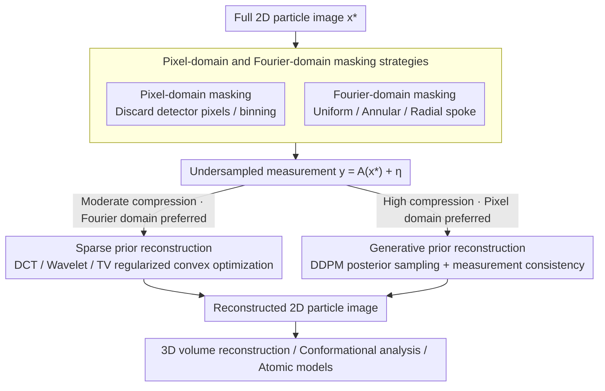

# cryoSENSE: Compressive Sensing Enables High-throughput Microscopy with Sparse and Generative Priors on the Protein Cryo-EM Image Manifold

**Conference**: CVPR 2026  
**arXiv**: [2511.12931](https://arxiv.org/abs/2511.12931)  
**Code**: [https://cryosense.github.io](https://cryosense.github.io)  
**Area**: Medical Image Analysis / Cryo-EM  
**Keywords**: Cryo-EM, Compressive Sensing, Diffusion Models, Sparse Priors, High-throughput Microscopy

## TL;DR
Ours proposes cryoSENSE, the first computational framework for compressive imaging in cryo-EM. It demonstrates that protein cryo-EM images can be reconstructed with high fidelity from undersampled measurements using both sparse priors (DCT/Wavelet/TV) and generative priors (Diffusion Models), achieving up to 2.5× throughput gain while maintaining 3D reconstruction resolution.

## Background & Motivation

**Background**: Cryo-EM is a core tool in structural biology, but modern direct electron detectors generate several GB of data per second, far exceeding storage and transmission bandwidth. Current mitigation strategies include: (1) sub-frame summation, (2) idling transmission after shortened acquisition times, and (3) post-acquisition compression—none of which solve the real-time bandwidth bottleneck.

**Limitations of Prior Work**: The data flood limits practical throughput—equipment spends most of the time waiting for data transmission rather than acquisition. Sub-frame summation sacrifices temporal resolution, and post-acquisition compression does not alleviate real-time bandwidth issues.

**Key Challenge**: Raw cryo-EM image data is highly structured (protein images reside on a low-dimensional manifold), but existing workflows utilize full-resolution acquisition and transmission, wasting redundancy in the data.

**Goal**: Can compressive sensing be performed during the acquisition stage to reconstruct high-fidelity 2D particle images from undersampled measurements, thereby maintaining 3D reconstruction resolution?

**Key Insight**: Utilize two types of low-dimensional structures in cryo-EM images—(1) sparsity under predefined bases and (2) location on a low-dimensional manifold learnable via diffusion models—to design two complementary reconstruction strategies.

**Core Idea**: Sparse priors + Generative priors = Complementary operational regimes for compressive cryo-EM imaging.

## Method

### Overall Architecture
cryoSENSE formalizes "compression at the acquisition stage" as a standard inverse problem: the detector only captures undersampled measurements $\mathbf{y} = \mathcal{A}(\mathbf{x}^*) + \boldsymbol{\eta}$, where $\mathcal{A}$ is a known linear projection operator (discarding a subset of pixels or Fourier coefficients). The objective is to recover the full high-fidelity 2D particle image $\mathbf{x}^*$ from $\mathbf{y}$. The framework is organized along two orthogonal axes: whether sampling occurs in the **pixel domain** or **Fourier domain**, and whether reconstruction utilizes **sparse priors** or **generative priors**. The core contribution of the paper is not a single specific algorithm, but a systematic comparison of these four combinations to provide an operational guide on "which prior to pair with which sampling domain at specific compression ratios."

### Key Designs

**1. Dual Masking Strategies in Pixel and Fourier Domains: Discarding data from two physically realizable interfaces**

The premise of compression is an interface that truly allows for reduced data acquisition in hardware; otherwise, "acquisition-stage compression" remains theoretical. Ours provides two paths corresponding to existing microscope components: pixel-domain masking directly discards a subset of detector pixels, which can be implemented using physical coded apertures or nanofabricated patterns, essentially maximizing the existing binning capabilities of detectors. Fourier-domain masking modulates the back focal plane using devices such as phase plates or holographic gratings to select specific frequency coefficients, further divided into uniform undersampling, annular, and radial spoke patterns. These two domains are not redundant; they have distinct preferences—Fourier-domain sampling naturally aligns with sparse priors, while pixel-domain spatial structures are more conducive to generative prior completion.

**2. Sparse Prior Reconstruction: A convex optimization fallback independent of training data**

Raw cryo-EM images are highly sparse under predefined bases like DCT or Wavelets. This implies that even if most measurements are lost, the image can be recovered by constraining the solution to be sparse in a specific basis. Specifically, this is achieved by solving a regularized least squares problem:

$$\hat{\mathbf{x}} = \arg\min_{\mathbf{x}} \|\mathcal{A}(\mathbf{x}) - \mathbf{y}\|_2^2 + \lambda \Psi(\mathbf{x}),$$

where the data fidelity term recovers measurements and the regularization term $\Psi$ represents sparsity in DCT, Wavelet (WT), or Total Variation (TV). Proximal gradient descent is used to alternate between gradient steps and proximal operators (soft thresholding) until convergence. Its primary advantage is that it requires no training data and makes no prior assumptions about the protein type, making it particularly suitable for moderate compression ratios ($\le 2.5\times$) and Fourier-domain sampling—the coefficients captured in the frequency domain directly feed the basis sparsity assumption, yielding higher SSIM in the Fourier domain than in the pixel domain.

**3. Generative Prior Reconstruction: Forcing details at high compression using image manifolds learned by diffusion models**

When the compression ratio exceeds the limits of sparse assumptions, stronger priors are required. Ours trains a DDPM on EMPIAR cryo-EM data to learn the low-dimensional manifold of "what a real protein image looks like." During reconstruction, measurement consistency gradients are injected at each step of reverse diffusion, pulling the sampling trajectory toward directions that resemble real images and align with $\mathbf{y}$. This step uses the Tweedie formula to map the noisy state $\mathbf{x}_t$ to a clean estimate $\hat{\mathbf{x}}_0$, followed by calculating the guidance term from the data term:

$$\nabla_{\mathbf{x}_t} \log p(\mathbf{y}|\mathbf{x}_t) \simeq -\frac{1}{\sigma^2} \nabla_{\mathbf{x}_t} \|\mathcal{A}(\hat{\mathbf{x}}_0) - \mathbf{y}\|_2^2,$$

with Nesterov accelerated gradients used to enhance sampling efficiency. Compared to the relatively weak sparse prior assumption, the generative prior directly memorizes the shape of the data manifold. With stronger assumptions and more information, it significantly outperforms in scenarios involving higher compression ratios and pixel-domain sampling—where preserved local structures provide "anchor points" for the diffusion model to hallucinate plausible details.

### Loss & Training
- Sparse reconstruction: Pure optimization, no training required; only the regularization weight $\lambda$ and number of proximal iterations are tuned.
- DDPM training: An unconditional diffusion model is trained using standard score matching on EMPIAR cryo-EM data.
- Posterior sampling: Reconstruction is achieved by combining the unconditional score with the measurement consistency gradient for step-wise denoising.

## Key Experimental Results

### Main Results — 2D Reconstruction Quality

**Pixel-domain Masking (K=4, C≈2):**

| Prior | LPIPS↓ | SSIM↑ |
|------|--------|-------|
| Sparse-DCT | 0.11 | 0.59 |
| Sparse-WT | 0.13 | 0.59 |
| Sparse-TV | 0.20 | 0.64 |
| **Gen-DDPM** | **0.12** | 0.50 |

**Fourier-domain Masking (Radial spoke, C≈2.5):**

| Prior | LPIPS↓ | SSIM↑ |
|------|--------|-------|
| **Sparse-DCT** | **0.12** | **0.72** |
| Sparse-WT | 0.11 | 0.71 |
| Sparse-TV | 0.30 | 0.37 |
| Gen-DDPM | 0.11 | 0.63 |

### 3D Volume Reconstruction

| Compression Factor | Best Prior (Pixel) | Best Prior (Fourier) | 3D FSC Resolution Retention |
|---------|------------|---------------|----------------|
| 1.5× | Gen-DDPM | Sparse-DCT | Near Perfect |
| 2.5× | - | Sparse-DCT | Maintained |
| >2.5× | Degraded | Degraded | Reduced |

### Ablation Study / Key Comparison

| Feature | Sparse Prior | Generative Prior |
|------|---------|---------|
| Best Sampling Domain | **Fourier Domain** | **Pixel Domain** |
| Best Compression Range | Moderate (≤2.5×) | Higher (Extreme undersampling) |
| Training Required | No | Yes |
| Biological Signal Retention | ✓ | ✓ |

### Key Findings
- **Core Finding**: Sparse priors prefer Fourier-domain sampling + moderate compression, while generative priors prefer pixel-domain sampling + high compression—the two are complementary.
- At a 2.5× compression factor, Fourier-domain sparse reconstruction maintains near-perfect FSC resolution.
- CryoDRGN conformational heterogeneity analysis maintains 80-88% clustering consistency on reconstructed images.
- ModelAngelo atomic model construction on reconstructed images yields a backbone RMSD of only 2.1-2.3 Å.

## Highlights & Insights
- **Hardware-Software Co-design**: Rather than post-acquisition compression, ours implements front-end compressive sensing—addressing bandwidth bottlenecks at the data source.
- **Complementary Prior Framework**: Systematically evaluates two major classes of priors under two sampling schemes, providing clear operational guidelines.
- **Biological Downstream Validation**: Focuses not only on 2D reconstruction quality but also validates core biological tasks such as 3D reconstruction, conformational analysis, and atomic model building.
- **Implementability**: Fourier-domain masking is achievable via existing phase plate technology, and pixel-domain binning is already a standard detector feature.

## Limitations & Future Work
- Currently utilizes computational validation rather than physical hardware experiments.
- DDPM training requires existing cryo-EM datasets, which may not be suitable for entirely new types of proteins.
- All methods degrade under extreme compression ratios (>2.5×).
- Adaptive sampling strategies (dynamically adjusting masking patterns based on image content) have not been explored.

## Related Work & Insights
- Compressive sensing is mature in MRI (CS-MRI); ours extends this to cryo-EM.
- CS work in 4D-STEM provides precedents in the electron microscopy field.
- The framework for DDPM posterior sampling (DPS, DDRM) is effectively adapted to the cryo-EM context.

## Rating
- Novelty: ⭐⭐⭐⭐⭐ First cryo-EM CS framework, opening a new research direction.
- Experimental Thoroughness: ⭐⭐⭐⭐⭐ Extremely detailed—multiple priors × multiple sampling × multiple compression ratios × downstream biological validation.
- Writing Quality: ⭐⭐⭐⭐⭐ Clear theoretical derivation and systematic experimental design.
- Value: ⭐⭐⭐⭐⭐ Transformative potential for high-throughput cryo-EM imaging.

<!-- RELATED:START -->

## Related Papers

- [\[CVPR 2026\] CryoHype: Reconstructing a Thousand Cryo-EM Structures with Transformer-Based Hypernetworks](cryohype_reconstructing_a_thousand_cryo-em_structures_with_transformer-based_hyp.md)
- [\[ICLR 2026\] CryoSplat: Gaussian Splatting for Cryo-EM Homogeneous Reconstruction](../../ICLR2026/computational_biology/cryosplat_gaussian_splatting_for_cryo-em_homogeneous_reconstruction.md)
- [\[CVPR 2026\] CryoKRAQEN: Kernel-Regularized Annealing for Quantized Embedding Networks in Cryo-EM Heterogeneous Reconstruction](cryokraqen_kernel-regularized_annealing_for_quantized_embedding_networks_in_cryo.md)
- [\[NeurIPS 2025\] Multiscale Guidance of Protein Structure Prediction with Heterogeneous Cryo-EM Data](../../NeurIPS2025/computational_biology/multiscale_guidance_of_protein_structure_prediction_with_heterogeneous_cryo-em_d.md)
- [\[ICCV 2025\] CryoFastAR: Fast Cryo-EM Ab initio Reconstruction Made Easy](../../ICCV2025/computational_biology/cryofastar_fast_cryoem_ab_initio_reconstruction_made_easy.md)

<!-- RELATED:END -->
