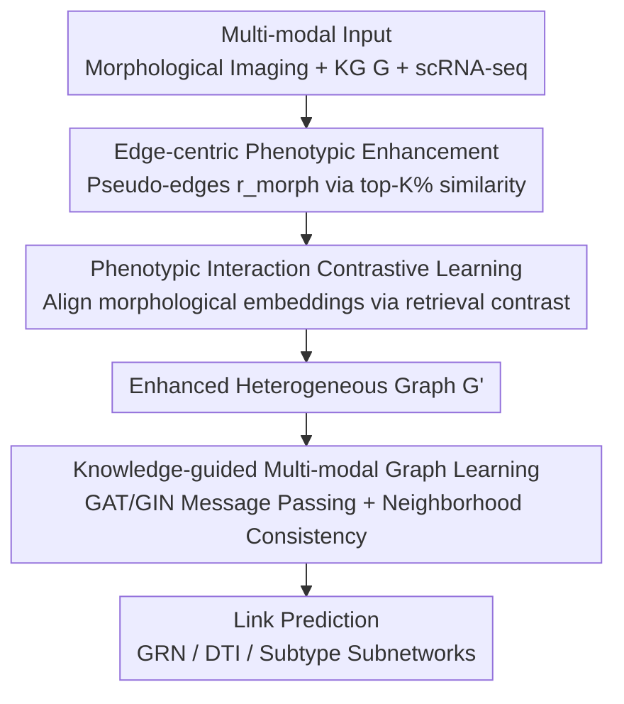

# Deciphering Genotype-Phenotype Mechanisms from High-Content Profiling via Knowledge-Guided Multi-modal Graph Learning

**Conference**: CVPR 2026  
**Paper**: [CVF Open Access](https://openaccess.thecvf.com/content/CVPR2026/html/Lin_Deciphering_Genotype-Phenotype_Mechanisms_from_High-Content_Profiling_via_Knowledge-Guided_Multi-modal_Graph_CVPR_2026_paper.html)  
**Code**: Paper not yet public  
**Area**: Computational Biology / Multi-modal Graph Learning  
**Keywords**: Genotype-Phenotype, High-Content Imaging, Knowledge Graph, Edge-Centric Enhancement, Heterogeneous Graph Neural Networks

## TL;DR
KERNEL treats high-content cellular morphological imaging as "relational evidence" rather than node features. By using morphological similarity to dynamically augment "pseudo-edges" with learnable confidence on biological knowledge graphs, it performs Gene Regulatory Network (GRN) inference, Drug-Target Interaction (DTI) prediction, and disease subtype subnetwork discovery, achieving a Gain of up to 38.1% in AUPR for GRNs.

## Background & Motivation
**Background**: Understanding the genotype $\to$ phenotype mapping is central to precision medicine and drug discovery. High-content phenomics (e.g., Cell Painting) provides massive, unbiased morphological readouts at the whole-cell scale, reflecting cellular responses from superimposed molecular and regulatory processes. Simultaneously, structured biological knowledge graphs (KGs) like STRING and PrimeKG provide explicit frameworks of relationships between genes, pathways, and phenotypes. Integrating both should provide cell-scale evidence for gene regulation and drug mechanisms.

**Limitations of Prior Work**: High-content phenotypic data is high-dimensional, heterogeneous, and extremely noisy, making it difficult to extract useful signals directly. Crucially, mainstream integration methods (e.g., MOTIVE, PolyGene, KGDRP) adopt a **node-centric** perspective: treating genes as nodes and cramming phenotype/knowledge into **node features**. This introduces noise, lacks mechanisms to filter or rank key biological signals, results in weak interpretability of subgraph patterns, and fails to incorporate the cellular biological context.

**Key Challenge**: The essence of phenotypic signals is misapplied. The authors argue that phenotypic data primarily conveys **cell-scale relational signals**—i.e., "how a perturbation reshapes interactions between molecules"—rather than attributes of a molecule itself. Forcing this relational signal into node features discards its most valuable "relationship" dimension.

**Goal**: Design a framework that transforms noisy phenotypic morphological signals into **edges** on a KG, using learnable confidence to filter noise, align mechanistic pathways, and support GRN inference, DTI prediction, and subtype subnetwork discovery.

**Key Insight**: The authors hypothesize that functionally related molecules (e.g., a transcription factor and its target gene, or a drug and its protein target) tend to induce **correlated cellular morphologies** when perturbed. Therefore, morphological similarity itself serves as relational evidence for "augmenting edges" on a graph.

**Core Idea**: Replace node-centric feature concatenation with **edge-centric** phenotypic knowledge enhancement—dynamically mining task-related edges from morphological embedding similarity, explicitly learning edge confidence, and using knowledge-guided graph learning to align graph topology with mechanistic pathways.

## Method

### Overall Architecture
KERNEL inputs three modalities: high-content morphological imaging knowledge (morphological embeddings of cell images via ViT), genotype KG (heterogeneous molecular graph $G$ from STRING/PrimeKG), and single-cell transcriptome knowledge. The output consists of interaction predictions between molecular pairs (link prediction) for GRN, DTI, and subtype subnetwork tasks.

The pipeline comprises two modules in series. **Step 1: Edge-centric phenotypic knowledge enhancement**. For each molecular node in graph $G$, "pseudo-edges" of a new relationship $r_{morph}$ are created by connecting to the top-K% most similar heterogeneous nodes based on cosine similarity of morphological embeddings, with similarity values as edge weights. A retrieval-based contrastive loss $\mathcal{L}_{contrast}$ constrains the morphological embeddings to ensure augmented edges reflect meaningful biological relationships, resulting in an enhanced graph $G'$. **Step 2: Knowledge-guided multi-modal graph learning**. Relation-specific message passing (GAT/GIN for different molecular types) is performed on $G'$, injecting morphological similarity as edge weights during propagation. A structural-aware regularization $\mathcal{L}_{sim}$ based on neighborhood overlap (Jaccard) is added. Finally, Link Prediction is executed via supervised cross-entropy $\mathcal{L}_{sup}$.

### Key Designs

**1. Edge-centric Phenotypic Knowledge Enhancement: Morphological Similarity as Pseudo-Edges with Confidence**
This is the core contribution, addressing the loss of relational signals in node-centric views. For each node $v_i^s$ of molecular type $s$, its morphological embedding $m_i$ is compared with every node $v_j^t$ of type $t$ using cosine similarity. Edges for relationship $r_{morph}$ are established with the top-K% most similar nodes $V_{itop}^t$: $E_{r_{morph}}^s = \{(v_i^s, r_{morph}, v_j^t) \mid v_i^s \in V^s, v_j^t \in V_{itop}^t\}$. This is applied to TF-gene, drug-protein pairs, etc., expanding the original edge set $E$ to $E' = E \cup E_{r_{morph}}^s \cup E_{r_{morph}}^t$.

This translates the biological hypothesis that "functionally related molecules induce related morphologies" into computable graph edges. The top-K% selection and learnable confidence avoid drowning the model in noise; ablation shows this module contributes the most to performance.

**2. Phenotypic Interaction Contrastive Learning: Ensuring Reliable Augmented Edges**
Similarity-based augmentation requires aligned morphological embeddings. A retrieval-style contrastive objective optimizes these embeddings: projection heads $\text{MLP}_s$ map embeddings to a shared space. Positive pairs $E_{pos}$ are **known connections** between different types, while negative pairs $E_{neg}$ are randomly sampled.
$$\mathcal{L}_{contrast} = \sum_{(v_i^s, v_j^t)\in E_{pos}} S_c(\text{MLP}_s(m_i^s), \text{MLP}_t(m_j^t)) - \sum_{(v_i^s, v_j^t)\in E_{neg}} S_c(\text{MLP}_s(m_i^s), \text{MLP}_t(m_j^t))$$
where $S_c$ is cosine similarity. This ensures related molecules are closer in morphological space before augmentation.

**3. Knowledge-Guided Multi-modal Graph Learning + Neighborhood Consistency Regularization**
On $G'$, relation-specific message passing $f$ is used: edges from TFs/drugs use GAT, while those from genes/proteins use GIN. For $r_{morph}$ edges, cosine similarity is injected as edge weights to obtain node embeddings $H = f(G')$.
To maintain global structure, a **structural-aware neighborhood consistency regularization** is added. For node pairs $(v_i^s, v_j^s)$ of the same type, structural similarity $S_j$ is measured by the Jaccard index of their type-$t$ neighbors.
$$\mathcal{L}_{sim}^s = \sum_{(i,j)\in P} S_c(h_i^s, h_j^s) - \sum_{(i,j)\in N} S_c(h_i^s, h_j^s)$$
where $P$ are pairs with $S_j \geq \sigma$ and $N$ have zero overlap. This forces nodes sharing many neighbors—often part of the same pathway—to have similar representations.

### Loss & Training
Total loss: $\mathcal{L} = \lambda_1 \mathcal{L}_{contrast} + \lambda_2 \mathcal{L}_{sim} + \mathcal{L}_{sup}$. $\mathcal{L}_{sup}$ is supervised cross-entropy for link prediction. Implemented in PyTorch v1.10.2, NVIDIA 4090, Adam optimizer, LR 0.0005, results averaged over 5 runs.

## Key Experimental Results

### Main Results
**GRN Inference** (BEELINE benchmark, hESC / hHEP cell lines, vs. Prev. SOTA GENELink):

| Dataset | Metric | KERNEL | GENELink (2nd) | Gain |
|--------|------|--------|----------------|------|
| hESC + 500 genes | AUC / AUPR / Hit@500 | 0.902 / 0.381 / 0.366 | 0.896 / 0.243 / 0.202 | AUPR +56.8% |
| hHEP + 1000 genes | AUC / AUPR / Hit@500 | 0.923 / 0.424 / 0.243 | 0.917 / 0.312 / 0.141 | AUPR +38.1% |

While AUC gains are marginal (+0.6~6%), AUPR and Hit@500—metrics sensitive to top-ranking accuracy—show massive Gains (up to 171% relative AUPR on hESC+1000).

**DTI Prediction** (MOTIVE dataset, JUMP-CP image profiles, vs. Prev. SOTA MOTIVE):

| Dataset | Metric | KERNEL | MOTIVE (2nd) | Gain |
|--------|------|--------|--------------|------|
| CRISPR | AUC / F1 | 0.950 / 0.700 | 0.842 / 0.509 | AUC +12.8% / F1 +37.5% |
| ORF | AUC / F1 / Hit@500 | 0.942 / 0.623 / 0.503 | 0.826 / 0.524 / 0.455 | AUC +14.0% / F1 +18.9% |

### Ablation Study
Removing components in GRN inference (based on Fig. 5):

| Configuration | Metric Trend | Description |
|------|----------------------------|------|
| KERNEL (Full) | Optimal | Full model |
| w/o $r_{morph}$ | Largest drop | Removing dynamic phenotypic edges causes the most significant performance loss. |
| w/o $\mathcal{L}_{contrast}$ | AUPR/Hit@500 ↓ | Misaligned embeddings lead to poor quality augmented edges. |
| w/o $\mathcal{L}_{sim}$ | AUPR/Hit@500 ↓ | Loss of local structural consistency hinders recovery of relevant interactions. |

### Key Findings
- **Edge Augmentation is Key**: Removing $r_{morph}$ causes the largest drop, validating the "phenotype as relational signal" hypothesis.
- **Robustness to Missing Modalities**: In hESC+500, only 39.3% of links have images. Even with **zero imaging data**, KERNEL outperforms GENELink in AUPR due to edge-centric denoising and KG gating.
- **Effective Cold Start**: In drug cold-start settings (unseen drugs), KERNEL leads significantly (AUC 0.811 vs. MOTIVE 0.715), as morphological profiles provide inductive bias for new entities.
- **Biologically Meaningful Subnetworks**: In BRCA cases, identified subtype subnetworks showed higher Graph Edit Distance (GED 0.659 vs GeSubNet 0.285) and enriched BRCA-related pathways (e.g., hsa05225), aligning with known luminal-basal mechanisms.

## Highlights & Insights
- **Perspective Shift**: Reframing phenotype from "node feature" to "relational evidence" is a profound shift that explains why node-centric methods waste phenotypic signals.
- **Strategic Alignment**: Contrastive learning calibrates the morphological space before augmentation, preventing the "augmenting with noise" trap.
- **Relational Robustness**: Modeling via relational evidence rather than node attributes provides superior inductive bias for missing data and cold-start entities.
- **Relation-specific Architectures**: Using different GNNs (GAT vs GIN) for different relationship types is a practical trick for heterogeneous graph modeling.

## Limitations & Future Work
- Dependency on input data quality; noise in clinical settings may affect performance.
- Ablation results were presented via bar charts without precise numerical values in the text.
- Hyperparameters $K$ and $\sigma$ require grid search and have narrow optimal intervals; an adaptive selection strategy is missing.
- Future Work: Incorporate more biological modalities, improve scalability, and explore clinical deployment for precision medicine.

## Related Work & Insights
- **vs MOTIVE**: MOTIVE uses phenotype as node features with **static edges**; KERNEL uses **dynamic learnable edges**, yielding F1 +37.5% in DTI.
- **vs GENELink**: GENELink focuses on expression data without phenotypic imaging or KGs; KERNEL mines interactions invisible to expression profiles via morphological edges.
- **vs PolyGene/KGDRP**: These emphasize "enriching node representations" at different levels; KERNEL focuses on fine-grained **relational modeling** via edges.

## Rating
- Novelty: ⭐⭐⭐⭐⭐ "Phenotype = Relational Evidence" is a sharp reframing.
- Experimental Thoroughness: ⭐⭐⭐⭐ Covers GRN/DTI/Subnetworks plus missing data/cold start, though quantitative ablation data is sparse.
- Writing Quality: ⭐⭐⭐⭐ Logical flow and complete formulations.
- Value: ⭐⭐⭐⭐⭐ Provides a unified framework for high-content imaging and KG integration with high utility for drug discovery.

<!-- RELATED:START -->

## Related Papers

- [\[CVPR 2026\] Cross-Slice Knowledge Transfer via Masked Multi-Modal Heterogeneous Graph Contrastive Learning for Spatial Gene Expression Inference](cross-slice_knowledge_transfer_via_masked_multi-modal_heterogeneous_graph_contra.md)
- [\[CVPR 2026\] Bulk RNA-seq Guided Multi-modal Detection of Anomalous Regions in Human Cancer via Spatial Transcriptomics](bulk_rna-seq_guided_multi-modal_detection_of_anomalous_regions_in_human_cancer_v.md)
- [\[CVPR 2026\] Predicting Spatial Transcriptomics from Histology Images via High-Order Multi-Cell Interaction Modeling](predicting_spatial_transcriptomics_from_histology_images_via_high-order_multi-ce.md)
- [\[ICCV 2025\] G2PDiffusion: Cross-Species Genotype-to-Phenotype Prediction via Evolutionary Diffusion](../../ICCV2025/computational_biology/g2pdiffusion_cross-species_genotype-to-phenotype_prediction_via_evolutionary_dif.md)
- [\[ICML 2026\] Learning Protein Structure-Function Relationships through Knowledge-guided Representation Decomposition](../../ICML2026/computational_biology/learning_protein_structure-function_relationships_through_knowledge-guided_repre.md)

<!-- RELATED:END -->
