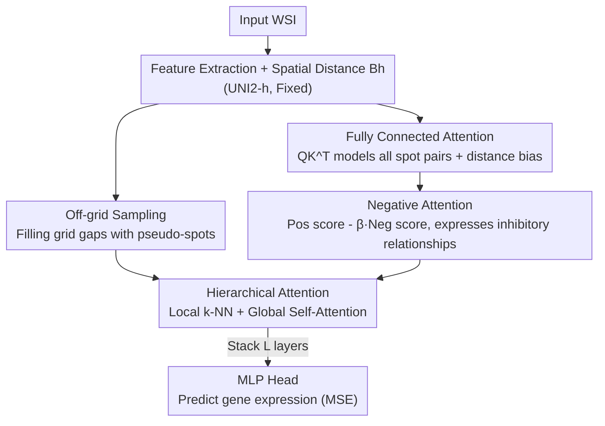

# FEAST: Fully Connected Expressive Attention for Spatial Transcriptomics

**Conference**: CVPR 2026  
**Paper**: [CVF Open Access](https://openaccess.thecvf.com/content/CVPR2026/html/Jeong_FEAST_Fully_Connected_Expressive_Attention_for_Spatial_Transcriptomics_CVPR_2026_paper.html)  
**Code**: https://github.com/starforTJ/FEAST  
**Area**: Computational Biology / Medical Imaging  
**Keywords**: Spatial Transcriptomics, Gene Expression Prediction, Attention Mechanism, Fully Connected Graph, Negative Attention

## TL;DR
FEAST transforms the task of "predicting spatial gene expression from large H&E pathology images" from a GNN paradigm relying on predefined sparse graphs into a fully connected attention framework. It utilizes self-attention to naturally model pairwise interactions between all spots, supplemented by negative attention to express "inhibitory relationships" and off-grid sampling to complete information in grid gaps. It achieves SOTA on 7 out of 9 metrics across three public ST datasets.

## Background & Motivation
**Background**: Spatial Transcriptomics (ST) enables the quantification of mRNA expression while preserving tissue spatial structure, but high acquisition costs hinder its widespread use. Consequently, the mainstream approach is to infer gene expression from cheap and accessible H&E-stained Whole Slide Images (WSIs): the tissue is divided into spots (position + expression), and the image patch of each spot is used to predict its corresponding gene expression profile. Since the tissue microenvironment arises from complex interactions between spots, mainstream methods (Hist2ST, MERGE, etc.) generally use GNNs, treating spots as nodes and pre-connecting edges based on "spatial proximity" or "morphological similarity."

**Limitations of Prior Work**: These methods are rooted in a **predefined sparse graph**. A sparse graph only connects a limited number of neighbors; most spot pairs are naturally disconnected, meaning any potential biological interactions between these spots are ignored by design. The problem is—one cannot know beforehand which two spots will interact. Forcing pruning based on the priors of "proximity/similarity" essentially sacrifices the ability to model tissue-level global interactions structurally.

**Key Challenge**: The tissue microenvironment involves global interactions where "every spot may influence any other spot," yet the upper bound of sparse graph modeling is artificially constrained within a few neighbors. Furthermore, two long-ignored details exist: ① Standard attention/similarity can only express "positive correlation or irrelevance," but **inhibitory (negative) relationships** clearly exist in biological systems (e.g., the PD-L1/PD-1 pathway in the tumor microenvironment suppresses immune-related gene expression in surrounding cells); ② Fixed-size patch cropping loses the morphology between spots and structures truncated by grid boundaries.

**Goal**: ① Model interactions of all spot pairs without pruning; ② Enable the model to express negative "inhibitory" relationships; ③ Recover morphological context lost between patches—all without exploding computational costs.

**Core Idea**: Model the tissue as a **fully connected graph**, which is naturally realized by the $QK^T$ inner product of self-attention. Thus, attention replaces the sparse graph of GNNs. Two "surgeries" are then performed on the attention mechanism (negative attention + off-grid pseudo-spots), and hierarchical attention is used to keep costs acceptable.

## Method

### Overall Architecture
The input to FEAST is a WSI, and the output is the target gene expression for each original spot. The pipeline is: first, a fixed feature extractor (UNI2-h) extracts spot features from the WSI while calculating the spatial distance matrix $B_h$ between spots. Features then pass through $L$ stacked **hierarchical attention layers**. Each layer consists of two stages: first, a FEAST Block is applied to the local k-nearest neighbors of "original spots + pseudo-spots" to absorb spatial context; then, a global self-attention FEAST Block is applied to "original spots" only. Finally, the representations of original spots are fed into an MLP head to predict gene expression, with the framework trained using MSE loss.

The key lies in three nested designs: ① **Fully connected attention** as the foundation (replacing sparse graphs); ② **FEAST Block** upgrading each attention operation to a negative attention that can express both positive and negative relationships; ③ **Off-grid sampling + hierarchical attention** to resolve the conflict between "supplementing information" and the resulting $O(N^2)$ cost explosion.

### Key Designs

**1. Fully Connected Attention: Replacing predefined sparse graphs with $QK^T$ to allow every spot pair to interact**

Addressing the fundamental pain point of "sparse graphs pruning most spot pairs," FEAST discards explicit graph construction and instead uses self-attention to model a fully connected graph. Given $N$ spots in a WSI, the raw attention scores are computed and normalized: $\mathbf{S} = \frac{\mathbf{Q}\mathbf{K}^T}{\sqrt{d_k}}$, $\mathbf{A} = \mathrm{softmax}(\mathbf{S})$. Here, $\mathbf{A}$ acts as a dynamically weighted fully connected graph—the $QK^T$ inner product is a learnable, dynamic version of the "morphological similarity edge construction" used in GNNs, but without manual pruning thresholds.

However, standard attention is permutation invariant and ignores the spatial arrangement and distance of spots, violating the assumption that "closer proximity implies higher correlation." FEAST borrows from ALiBi/TITAN by adding a **static, non-learnable positional bias** to the $h$-th attention head, added to the raw scores before softmax: $\mathbf{B}_h(i,j) = m_h \cdot \sqrt{(i_x-j_x)^2+(i_y-j_y)^2}$, i.e., the Euclidean distance between two spots multiplied by a fixed negative scalar $m_h$ specific to the head. Heads with large $|m_h|$ heavily penalize long-distance spots and focus on local interactions, while heads with $m_h$ near 0 are free to learn tissue-level long-range relationships. This allows a **single attention block to model both local and global interactions simultaneously**, effectively injecting the "spatial proximity" prior from GNNs in a soft, head-specific manner rather than hard pruning.

**2. Negative Attention: Allowing attention weights to take negative values to explicitly model "inhibitory" relationships**

Standard softmax restricts attention weights to $[0,1]$, where high weight equals strong positive correlation and low weight only represents "irrelevance," failing to express the active suppression of "A inhibits B" found in biological systems. Based on the assumption that a spot pair won't be both positive and negative simultaneously, FEAST computes two sets of scores in parallel within each FEAST Block: positive scores use raw scores $\mathbf{S}_{\text{pos},h} = \mathbf{S}_h + \mathbf{B}_h$, while negative scores **flip the sign** of the feature dot product and add the same positional bias $\mathbf{S}_{\text{neg},h} = -\mathbf{S}_h + \mathbf{B}_h$. Thus, spot pairs with low positive scores can achieve high negative scores, corresponding to "strongly inhibited" relationships.

The two sets of scores are passed through softmax respectively, with negative weights introducing a temperature $\tau_{\text{neg}}$: $\mathbf{A}_{\text{neg},h} = \mathrm{softmax}\!\left(\frac{\mathbf{S}_{\text{neg},h}}{\tau_{\text{neg}}}\right)$. The paper chooses $\tau_{\text{neg}}<1$ (0.6 in experiments) to sharpen the distribution and focus on the strongest negative relationships. The final weight subtracts the negative part scaled by coefficient $\beta$:

$$\mathbf{A}_{\text{final},h} = \mathbf{A}_{\text{pos},h} - \beta \cdot \mathbf{A}_{\text{neg},h}$$

Consequently, $\mathbf{A}_{\text{final},h}$ can take negative values, enabling the model to distinguish between "positively correlated / irrelevant / negatively correlated." This change incurs almost zero additional computational overhead (reusing the same $QK^T$) while improving accuracy and making attention maps interpretable—allowing direct identification of excitatory and inhibitory regions.

**3. Off-grid Sampling + Hierarchical Attention: Recovering lost morphological information without cost explosion**

Fixed-size square patch cropping based on grid centers leads to two types of information loss: gaps between adjacent spots are ignored (sometimes the spot spacing is larger than the patch size), and complete morphological structures are truncated by grid boundaries. Directly using higher resolution (like Visium HD) is too expensive, and using large patches with downscaling erases morphological details. FEAST **extra-samples "pseudo-spots" from intermediate positions between original spots** to retrieve these missed, information-rich areas, providing the model with a more continuous context.

However, pseudo-spots cause the total number of points $N$ to surge, making the $O(N^2)$ cost of attention unsustainable. Therefore, FEAST splits each attention block into two stages: **Local k-NN Attention** allows both original and pseudo-spots to attend only to their respective $k$-nearest neighbors, modeling local spatial interactions and letting original spots efficiently "absorb" the rich context of nearby pseudo-spots; **Global Self-Attention** is then performed only among original spots already enriched by local context. The complexity thus only grows with the number of original spots (much smaller than the total count including pseudo-spots). Both stages use the negative attention and positional bias described above. This recovers gap information while keeping costs constrained to the scale of original spots.

### Loss & Training
After stacking $L$ hierarchical attention blocks, the final representation of original spots is fed into an MLP head to predict target gene expressions, trained globally with Mean Squared Error $\mathcal{L}_{\text{MSE}}$. The feature extractor UNI2-h is fixed; hyperparameters are $k=32$, $\tau_{\text{neg}}=0.6$, $\beta=1.5$, trained on an NVIDIA RTX A6000.

## Key Experimental Results

### Main Results
8-fold cross-validation was conducted on three public ST datasets: two breast cancer datasets (ST-Net, Her2ST) and one skin cancer dataset (SCC), with an average of approximately 450/378/723 intra-tissue spots per sample. Patches are 256×256 ($20\times$ magnification); the top 250 high-expression genes were selected per dataset, labels smoothed with SPCS; metrics are MSE↓ / MAE↓ / PCC↑. Baseline values are cited directly from the MERGE paper. FEAST achieved SOTA in 7 out of 9 metrics.

| Dataset | Metric | FEAST | Prev. SOTA | Gain |
|--------|------|-------|----------|------|
| ST-Net | MSE↓ / PCC↑ | 0.1177 / 0.7155 | 0.1347 / 0.6795 (MERGE) | MSE -0.017, PCC +0.036 |
| Her2ST | MSE↓ / PCC↑ | 0.5761 / 0.5524 | 0.6422 / 0.5037 (MERGE) | MSE -0.066, PCC +0.049 |
| SCC | PCC↑ | 0.5811 | 0.5512 (MERGE) | +0.030 (HisToGene better on MSE/MAE) |

In the two breast cancer datasets, FEAST outperformed all baselines across all metrics, with the most significant gain on Her2ST. On SCC, while MSE/MAE were behind HisToGene, PCC remained the highest, indicating the strongest linear correlation between predicted and ground truth values.

### Ablation Study
Verification of the two core components (Negative Attention, Off-grid pseudo-spots) on Her2ST:

| Negative Attention | off-grid | MSE↓ | MAE↓ | PCC↑ |
|:---:|:---:|------|------|------|
| ✗ | ✗ | 0.5878 | 0.5875 | 0.5396 |
| ✓ | ✗ | 0.5778 | 0.5829 | 0.5464 |
| ✗ | ✓ | 0.5829 | 0.5831 | 0.5458 |
| ✓ | ✓ | **0.5761** | **0.5782** | **0.5524** |

Adding either component individually yields slight PCC gains (0.5464 / 0.5458), but only their combination achieves the best 0.5524, indicating they are complementary.

| $k$ (Local k-NN neighbors) | MSE↓ | MAE↓ | PCC↑ |
|:---:|------|------|------|
| 8 | 0.5821 | 0.5819 | 0.5453 |
| 16 | 0.5796 | 0.5784 | 0.5504 |
| **32** | **0.5761** | 0.5782 | **0.5524** |
| 64 | 0.5793 | 0.5818 | 0.5481 |
| 100 | 0.5768 | 0.5807 | 0.5484 |

Metrics peak at $k=32$ and decline thereafter, thus $k=32$ is chosen to balance accuracy and efficiency.

### Key Findings
- The two core components yield limited individual gains but show **significant synergy when combined**—Negative Attention and Off-grid sampling address different dimensions (relationship expression vs. info integrity).
- An optimal $k$ exists (32): too small provides insufficient context, while too large introduces irrelevant noise, a typical "neighborhood size trade-off."
- Qualitatively, pseudo-spots provide the largest boost in difficult scenarios where "original spots are sparse around the target or morphological structures are truncated" (e.g., PCC 0.6284→0.7203, 0.7694→0.8349).
- Negative attention allows the attention map to correctly label spots that are spatially close but have distinct expression patterns (e.g., adipose tissue) as negative, whereas standard attention would ignore or misjudge this strong negative correlation.

## Highlights & Insights
- **The "Fully Connected Graph = Attention" observation is the pivot of the paper**: It reframes the saturated line of "designing smarter sparse graphs" in the ST field to "no graph construction needed, attention is naturally a fully connected graph." This paradigm shift is elegant and hits the mark.
- **Negative Attention brings large gains at near-zero cost**: By simply flipping signs and reusing $QK^T$, it achieves both accuracy gains and interpretability (mapping attention to excitatory/inhibitory biological relationships). This "small change, big impact" design is highly commendable.
- **Using positional bias $m_h$ for head-specific local/global modeling** is a clever way to softly inject GNN-like spatial priors into attention without relying on hard pruning, maintaining the "closer is more relevant" inductive bias.
- **The "Off-grid pseudo-spots + Hierarchical Attention" combo** provides a strategy for any task needing denser sampling without suffering $O(N^2)$ explosion.

## Limitations & Future Work
- Negative attention is built on the simplified assumption that "a spot pair won't be both positive and negative simultaneously" ⚠️—in real biological systems, cells may exhibit both excitatory and inhibitory interactions through different pathways, an nuance this binary assumption might lose.
- Off-grid pseudo-spots are sampled images **without ground truth gene expression** and serve only as context; the quality of their morphological info depends on the feature extractor. The paper lacks a deep sensitivity analysis on sampling positions/densities.
- The evaluation follows the MERGE protocol and cites their baseline figures; the three datasets are relatively small (max 68 samples). FEAST's advantage is not universal, as seen in SCC's MSE/MAE results.
- While hierarchical attention controls cost, the addition of pseudo-spots and two-stage attention still introduces overhead compared to pure GNNs. The main text lacks an explicit efficiency comparison with baselines ⚠️.

## Related Work & Insights
- **vs. GNN based (Hist2ST / MERGE)**: Their main focus is designing smarter sparse graphs (k-NN, hierarchical, hypergraphs). FEAST discards graph construction entirely, using attention for dynamic interaction learning, avoiding structural info loss from prior pruning.
- **vs. ViT based (HisToGene)**: HisToGene applies ViT naively to ST, which may suffer from data scarcity/heterogeneity. FEAST specifically injects distance biases and negative relationship modeling tailored for ST biological priors.
- **vs. TRIPLEX**: TRIPLEX uses rigid multi-resolution views (target/neighbor/full slide); FEAST's fully connected attention naturally supports data-driven discovery of flexible long-range interactions between morphologically similar spots.
- **Borrowing from ALiBi / TITAN**: The positional bias $B_h$ (distance × head-specific negative scalar) is derived from ALiBi, which FEAST successfully migrates from NLP sequence positions to 2D spatial coordinates.

## Rating
- Novelty: ⭐⭐⭐⭐⭐ Reframing "Full-Graph=Attention" + near-zero cost negative attention is a paradigm shift for ST.
- Experimental Thoroughness: ⭐⭐⭐⭐ 8-fold cross-validation on 3 datasets + component/hyperparameter ablation + qualitative analysis, though dataset scale is small and efficiency comparison is missing.
- Writing Quality: ⭐⭐⭐⭐⭐ Logical flow from pain points to mechanism to formulas. Clear diagrams.
- Value: ⭐⭐⭐⭐ Low-cost ST inference is clinically significant; the interpretability of positive/negative attention maps adds extra value for biological analysis.

<!-- RELATED:START -->

## Related Papers

- [\[CVPR 2026\] HyperST: Hierarchical Hyperbolic Learning for Spatial Transcriptomics Prediction](hyperst_hierarchical_hyperbolic_learning_for_spatial_transcriptomics_prediction.md)
- [\[CVPR 2026\] Predicting Spatial Transcriptomics from Histology Images via High-Order Multi-Cell Interaction Modeling](predicting_spatial_transcriptomics_from_histology_images_via_high-order_multi-ce.md)
- [\[CVPR 2026\] Multi-View Hierarchical Alignment Learning for Spatial Transcriptomics](multi-view_hierarchical_alignment_learning_for_spatial_transcriptomics.md)
- [\[CVPR 2026\] Bulk RNA-seq Guided Multi-modal Detection of Anomalous Regions in Human Cancer via Spatial Transcriptomics](bulk_rna-seq_guided_multi-modal_detection_of_anomalous_regions_in_human_cancer_v.md)
- [\[CVPR 2026\] From Spots to Pixels: Dense Spatial Gene Expression Prediction from Histology Images](from_spots_to_pixels_dense_spatial_gene_expression_prediction_from_histology_ima.md)

<!-- RELATED:END -->
