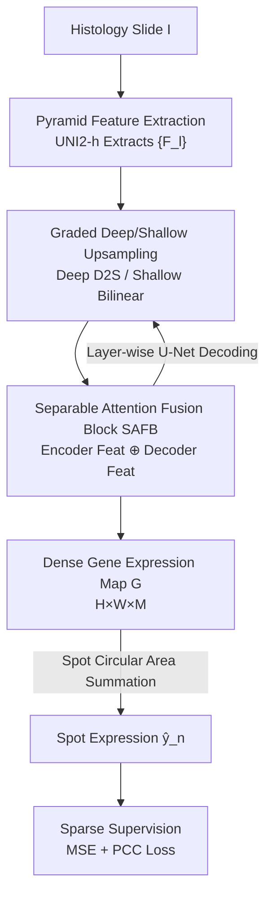

# From Spots to Pixels: Dense Spatial Gene Expression Prediction from Histology Images

**Conference**: CVPR 2026  
**Paper**: [CVF Open Access](https://openaccess.thecvf.com/content/CVPR2026/html/Zhang_From_Spots_to_Pixels_Dense_Spatial_Gene_Expression_Prediction_from_CVPR_2026_paper.html)  
**Code**: https://github.com/wangzrk/From-Spots-to-Pixels  
**Area**: Computational Biology / Medical Imaging  
**Keywords**: Spatial Transcriptomics, Gene Expression Prediction, Dense Prediction, Histology Images, Multi-scale Decoding

## TL;DR
This paper reframes the task of "predicting spatial gene expression from pathology slides" from a spot-wise regression task to a dense prediction task. It proposes PixNet: first, a pathology foundation model extracts pyramid features; then, a U-Net-style decoder progressively generates a full-image dense gene expression map; finally, expression values for spots of any position or radius are obtained through circular region aggregation. This approach outperforms existing SOTA methods across multiple spatial scales (from 2µm single-cell level to 100µm).

## Background & Motivation
**Background**: Spatial Transcriptomics (ST) can measure gene expression at specific spatial locations on a slide, but experiments are expensive and have low throughput. Consequently, many studies have turned to directly predicting gene expression from more accessible H&E stained Whole Slide Images (WSI). The mainstream approach models this task as regression: cropping individual "spots" (circular patches) from the slide and training a network to map each spot to its corresponding gene expression vector (e.g., ST-Net, HisToGene, TRIPLEX, SGN).

**Limitations of Prior Work**: This "spot-wise regression" paradigm has two fundamental flaws. First, **spatial resolution is lost during cropping**—to provide sufficient visual/spatial context, spot sizes are typically $>100$µm. A single spot actually contains multiple cells with different expression profiles, yet the model compresses the entire patch into a single expression vector, losing cell-level spatial resolution. Second, **scales are fixed**—models trained on a specific spot size fail when scales change. A model trained on 100µm spots becomes almost entirely ineffective when migrated to 2µm (approximately single-cell level, occupying only ~20 pixels in image space), whereas new technologies like Visium HD provide high-resolution expression at exactly 2µm, which old methods cannot handle.

**Key Challenge**: The old paradigm couples the "minimum unit of prediction" with the "physical size of the spot"—the model can only predict the sizes seen during training, and the prediction granularity can never be finer than the spot itself. Both spatial resolution and model usability are bottlenecked by this coupling.

**Goal**: To enable a single model to accurately predict gene expression at any spatial resolution and for any spot size.

**Key Insight**: The authors' key observation is that since a spot is merely a circular region on a slide, it is better to first map the entire slide into a **pixel-wise dense gene expression map**. The expression of any spot can then be aggregated from the pixel values within its covered region. In this way, the "prediction unit" is decoupled from the spot into pixels. The spot size only appears during the final aggregation, naturally supporting arbitrary scales.

**Core Idea**: Rewrite spot-wise regression as dense prediction—"Slide $\rightarrow$ Dense Expression Map $\rightarrow$ Circular Region Aggregation"—replacing discrete spot mappings with a continuous expression map. Simultaneously, sparse supervision is used to solve the training puzzle where "only a few spots have ground truth."

## Method

### Overall Architecture
Given a slide image $I \in \mathbb{R}^{H\times W\times 3}$ and $N$ spots $\{(x_n,y_n,r_n),\,y_n\}_{n=1}^N$ (center coordinates, circular radius, and ground truth expression vectors $y_n\in\mathbb{R}^M$ for $M$ genes), PixNet follows a three-step process: ① A pathology foundation model encoder extracts $L$-layer pyramid features $\{F_l\}_{l=1}^L$; ② A U-Net-style decoder progressively fuses and upsamples the pyramid features into a dense gene expression map $G\in\mathbb{R}^{H\times W\times M}$ with the same resolution as the original image; ③ For each spot, pixels within the circle centered at $(x_n,y_n)$ with radius $r_n$ on $G$ are summed to obtain the predicted expression $\hat y_n$. During training, losses are calculated only on spots with ground truth (sparse supervision); during testing, the location and radius of the spots can be arbitrarily changed, allowing the same model to perform cross-scale prediction.

The key to the decoding stage lies in the combination of "two types of upsampling (deep and shallow) + Attention Fusion Blocks": deep layers use Depth-to-Space Upsampling (DSUB) to minimize information loss, while shallow layers use bilinear interpolation to preserve details. Each layer utilizes a Separable Attention Fusion Block (SAFB) to align and fuse the pyramid features from the encoder side with the upsampled features from the decoder side.

### Key Designs

**1. Dense Prediction Reconstruction: From Spot-wise Regression to a Global Expression Map**

This is the paradigm shift of the paper, directly addressing the pain points of "lost spatial resolution" and "fixed scales." Old methods learned a function $f:\text{spot}\mapsto \mathbb{R}^M$, where prediction granularity is never finer than the spot. This paper learns $f:I\mapsto G$, mapping the entire slide to a pixel-wise expression map $G\in\mathbb{R}^{H\times W\times M}$. The expression of any spot is no longer predicted individually but aggregated from the corresponding region in $G$:

$$\hat y_n = \sum_{(\Delta x,\Delta y)} G(\Delta x,\Delta y),\quad (\Delta x-x_n)^2+(\Delta y-y_n)^2 \le r_n^2$$

This sums the pixel expressions within a disk of radius $r_n$ centered at $(x_n,y_n)$. This aggregation is parameter-free. The critical advantage is that spot size/position only enters during inference/aggregation and is not part of the training; thus, the trained $G$ can be "sampled" by disks of any size—supporting 2µm/8µm/16µm/100µm natively. Compared to super-resolution approaches like iStar, this method avoids ill-posed upsampling of pathology slides (guessing details from coarse data, which often creates artifacts inconsistent with real tissue morphology) by predicting directly at the original image resolution.

**2. Pyramid Feature Extraction: Capturing Multi-scale Morphology with Pathology Foundation Models**

Histology images are inherently multi-scale (nuclei, glands, and tissue regions span vast scales). Single-scale features are insufficient for predictions ranging from single-cell to tissue levels. This paper uses the UNI2-h encoder pretrained on large-scale WSIs: first, $I$ is projected into token embeddings $Z_0$, passing through $L$ groups of ViTs to progressively deepen semantic abstraction, $Z_L = \text{ViT}_L\circ\cdots\circ\text{ViT}_1(Z_0)$; then, tokens from several intermediate groups (e.g., groups 2/4/6) are reshaped back to 2D and downsampled to obtain pyramid features $F_l = \text{Downsample}(R(Z_l))$. Shallow $F_l$ layers retain more spatial detail, while deep layers retain more semantics—forming the basis for the "deep-shallow split" in decoding. Ablations show that pathology-specific foundation models (UNI2) significantly outperform general encoders like ResNet-18.

**3. Graded Deep/Shallow Upsampling: Preventing Information Loss while Preserving Spatial Detail**

When restoring pyramid features to the original image resolution, the "how" of upsampling directly determines spatial fidelity—and gene expression prediction is extremely sensitive to spatial information. This paper uses two strategies based on feature depth. Deep layers ($L\ge l>3$) use **Depth-to-Space Upsampling Blocks (DSUB)**: first a convolution, then reshaping the channel dimension into higher spatial resolution (D2S operation), with required filters $K = C_{F_l}\times 2^d$ ($d=2$ is the downsampling factor). D2S merely moves channels to space without altering content, thus losing almost no information:

$$U_{l-1} = \text{CB}\big(\text{ReLU}(\text{Conv}(\text{D2S}(\text{ReLU}(\text{Conv}(F_l))),K))\big)$$

Shallow layers ($3\ge l>1$) switch to **bilinear interpolation**: shallow features are already rich in spatial detail, requiring smooth resolution recovery rather than complex semantic transformation. Composite Convolutional Blocks (CB) are added before and after interpolation for denoising and refinement: $\hat U_{l-1}=\text{CB}(\text{BlIntp}(\text{CB}(F_l)))$. This "deep for content fidelity, shallow for smooth detail" approach ensures reconstruction neither loses spatial information from the encoder nor sacrifices spatial continuity.

**4. Separable Attention Fusion Block (SAFB): Aligning Encoder Details with Decoder Context**

Each layer must fuse pyramid features $F_{l-1}$ from the encoder side with upsampled features $U_{l-1}/\hat U_{l-1}$ from the decoder side. However, the former emphasizes high-resolution detail while the latter emphasizes contextual semantics; direct addition causes conflicts. SAFB first refines pyramid features using a separable residual block (Depth-wise Convolution DWC + Point-wise Convolution + LayerNorm):

$$\hat F_{mid}=\text{LN}(\text{Conv}_{1\times1}(\text{SiLU}(\text{DWC}(F_{l-1})))),\quad \hat F_{l-1}=\text{BN}(\text{SiLU}(\text{DWC}(F_{l-1})+\hat F_{mid}))$$

Then, the refined $\hat F_{l-1}$ is concatenated with upsampled features to form $F_u$, followed by lightweight attention enhancement: $\text{Attention}=\text{softmax}(QK^T/\beta)V$. Finally, the residual output is $D_{l-1}=F_u+\text{Attention}(\text{Conv}_{1\times1}(F_u))$, where $\beta$ is the square root of the latent dimension for normalization. Depth-wise separable convolution combined with lightweight attention allows SAFB to aggregate features in a relation-aware manner while maintaining low complexity. Ablations show it boosts PCC@M from 0.169 (Plain Conv) / 0.213 (ResNet18) / 0.188 (ViT) to 0.325, making it the most significant module on the decoder side.

**5. Sparse Supervision Loss: Backpropagating Gradients Only on Ground Truth Spots**

ST data is inherently sparse—the vast majority of pixels on a slide have no measured ground truth expression, making dense supervision of the entire $G$ impossible. This paper uses a sparse loss module: loss is calculated only between the aggregated $\{\hat y_n\}$ from ground truth spots and the actual ground truths $\{y_n\}$, combining Mean Squared Error $L_{mse}$ (value-wise fidelity) and in-batch Pearson Correlation Coefficient loss $L_{pcc}$ (encouraging consistent trends in the gene dimension):

$$L = L_{mse} + \lambda L_{pcc},\quad \lambda=0.5$$

The PCC term is particularly crucial because gene expression prediction prioritizes capturing "relative high/low expression changes" over absolute values. In ablations, using only MSE yields a PCC@M of 0.293; using only PCC yields 0.319; combining both yields 0.325, achieving the best balance between fidelity and correlation.

### Loss & Training
Trained from scratch (no additional pretraining outside the frozen or fine-tuned encoder), using the AdamW optimizer for 200 epochs with a learning rate of $5\times10^{-4}$ and weight decay of $1\times10^{-4}$. $\lambda=0.5$ with a fixed random seed of 42. Decoder filter configuration is [64, 128, 256, 512, 512, 512]. Following ST convention, the 250 genes with the highest average expression in the dataset are selected as prediction targets; expression values are normalized by total expression per spot and then log-transformed. Each experiment is repeated 5 times to take the mean. Training was conducted on a single RTX A6000.

## Key Experimental Results

### Main Results
Four ST datasets: STNet (68 slides, 30K spots, 100µm), Her2ST (36 slides, 13K spots, 100µm), Breast Cancer Visium HD, and Brain Cancer Visium HD (providing million to ten-million level spots across 2µm/8µm/16µm multi-scales). Metrics include MSE↓, MAE↓, and three variants of PCC↑ (PCC@F 1st quartile, PCC@S median, PCC@M mean, calculated per gene across all spots).

Comparison with 13 SOTAs on Visium HD (high-resolution multi-scale):

| Dataset | Metric | Ours | Prev. SOTA | Gain |
|--------|------|------|----------|------|
| Breast Visium HD | PCC@M ↑ | **0.325** | 0.226 (SGN) | +43.8% |
| Breast Visium HD | MSE ↓ | **0.153** | 0.229 (ScstGCN) | -33% |
| Brain Visium HD | PCC@M ↑ | **0.304** | 0.195 (SGN) | +56% |
| STNet (100µm) | PCC@M ↑ | **0.409** | 0.357 (BG-TRIPLEX) | +14.6% |
| Her2ST (100µm) | PCC@M ↑ | **0.453** | 0.404 (TRIPLEX) | +12.1% |

SOTA achieved across all four datasets, with PCC metrics showing significant leads, indicating the model captures relative expression trends better.

### Cross-scale Generalization (Mechanism)
All models were trained on STNet (100µm) and migrated to Breast Visium HD at 2µm/8µm/16µm for testing (Tab. 5). Old methods trained on fixed spot sizes degrade severely; Ours, being dense prediction, can aggregate at any scale:

| Test Scale | Metric | Ours | Second Best SGN |
|----------|------|------|----------|
| 2µm | PCC@M ↑ | **0.198** | 0.118 |
| 8µm | PCC@M ↑ | **0.219** | 0.136 |
| 16µm | PCC@M ↑ | **0.226** | 0.123 |

At the most challenging 2µm single-cell level, PCC@M is nearly 1.7x that of the second-best method, verifying the generalization advantage of "decoupling spot size."

### Ablation Study

| Configuration | MSE↓ | MAE↓ | PCC@M↑ | Description |
|------|------|------|--------|------|
| Decoder = Conv | 0.368 | 0.470 | 0.169 | Plain convolutional decoder |
| Decoder = ResNet18 | 0.226 | 0.374 | 0.213 | Residual decoder |
| Decoder = ViT | 0.297 | 0.435 | 0.188 | Pure Transformer decoder |
| Decoder = **SAFB** | **0.153** | **0.274** | **0.325** | Full model |
| Only $L_{mse}$ | 0.170 | 0.286 | 0.293 | Lacks correlation constraint |
| Only $L_{pcc}$ | 0.192 | 0.305 | 0.319 | Lacks fidelity constraint |
| $L_{mse}+L_{pcc}$ | **0.153** | **0.274** | **0.325** | Combined loss |

Training spot size ablation (Tab. 6): Training on 16µm/8µm/2µm individually yields PCC@M of 0.244/0.288/0.299 respectively; mixed multi-scale training (16+8+2µm) boosts it to 0.325—multi-scale joint training is significantly complementary.

### Key Findings
- **SAFB is the largest contributor on the decoder side**: Replacing it with plain Conv drops PCC@M from 0.325 to 0.169 (−48%), indicating that "separable attention aligning encoder details with decoder context" is key to dense expression map quality.
- **Dense reconstruction is the root of generalization**: On extreme scales like 2µm (single-cell level, ~20 pixels), old methods fail (PCC@M ~0.1), while Ours maintains 0.198 because the prediction unit is pixels, not spots.
- **The PCC loss term is indispensable**: Gene expression evaluation values relative ranking; removing the PCC term drops PCC@M by 0.032. The two losses are complementary.
- **Pathology foundation encoders are important**: UNI2 outperforms ResNet-18 and other pathology-specific models (Virchow2, UNI, H-Optimus-0); multi-scale morphological priors provide substantial help for dense prediction.

## Highlights & Insights
- **Paradigm Reconstruction**: Translating "spot-wise regression" into "dense prediction + region aggregation" is a simple yet brilliant perspective shift that simultaneously solves spatial resolution loss and fixed-scale issues. This decoupled aggregation is parameter-free.
- **Spot size is delayed until inference**: Training only learns $G$ without being bound to spot geometry. This decoupling makes "one model for multiple scales" almost free, allowing for migration to any task where "discrete labels require continuous output" (e.g., sparse point cloud regression).
- **Graded Upsampling** is a reusable trick: Using D2S for deep layers to preserve content and bilinear for shallow layers to preserve smoothness respects the different properties of features across levels.
- **Sparse Supervision** elegantly handles the reality that "most pixels have no ground truth" in ST data, naturally bridging dense output and sparse labels via region aggregation. This can be adapted for other sparse-label dense-prediction scenarios.

## Limitations & Future Work
- Under sparse supervision, regions $G$ not covered by any spot are entirely unsupervised; their prediction quality lacks direct constraints and is only indirectly evaluated via aggregated regions. Reliability in uncovered areas remains uncertain ⚠️.
- Aggregation uses **direct summation** within the disk rather than averaging/weighting; larger spot radii lead to larger sums, necessitating normalization. Adaptability to irregular shapes or overlapping spots is not fully discussed.
- Prediction targets are fixed to the 250 highest-expression genes; biologically important low-expression genes (e.g., certain markers) are excluded from evaluation, leaving performance on "long-tail" genes unknown.
- Still relies on large-scale pathology foundation models (UNI2) as encoders; performance might drop when migrating to other modalities/stains lacking dedicated foundation models.

## Related Work & Insights
- **vs. Spot-wise Regression (ST-Net / HisToGene / TRIPLEX / SGN / MERGE)**: These map each fixed-size spot to an expression vector, pinning prediction granularity to the spot and failing if scales change. Ours learns a global dense expression map then aggregates—the prediction unit is the pixel, natively cross-scale.
- **vs. iStar (Super-resolution style pixel mapping)**: iStar also pursues pixel-level expression but follows a super-resolution route, which is an ill-posed problem prone to artifacts. Ours predicts directly at the original resolution without ill-posed upsampling, ensuring consistency with morphology.
- **vs. Medical Image Dense Prediction (U-Netmer / SelfReg-UNet / Deform-Mamba)**: This work borrows mature U-Net-style dense decoding architectures from segmentation/SR but swaps the output from segmentation masks/SR images to multi-channel gene expression maps, serving as a bridge between dense prediction technology and the ST field.

## Rating
- Novelty: ⭐⭐⭐⭐⭐ Reframing spot-wise regression into dense prediction + aggregation is clean and completely solves the scale-binding problem.
- Experimental Thoroughness: ⭐⭐⭐⭐⭐ Four datasets, multi-scale analysis, 13 SOTA comparisons, cross-scale generalization, and 4 ablation studies provide a complete chain of evidence.
- Writing Quality: ⭐⭐⭐⭐ Methodology and motivation are clear; slight typos in formulas, but overall easy to read.
- Value: ⭐⭐⭐⭐⭐ Directly serves high-resolution ST technologies like Visium HD; single-cell gene expression prediction has significant clinical value.

<!-- RELATED:START -->

## Related Papers

- [\[CVPR 2026\] HINGE: Adapting a Pre-trained Single-Cell Foundation Model to Spatial Gene Expression Generation from Histology Images](adapting_a_pre-trained_single-cell_foundation_model_to_spatial_gene_expression_g.md)
- [\[CVPR 2026\] Predicting Spatial Transcriptomics from Histology Images via High-Order Multi-Cell Interaction Modeling](predicting_spatial_transcriptomics_from_histology_images_via_high-order_multi-ce.md)
- [\[CVPR 2026\] HyperST: Hierarchical Hyperbolic Learning for Spatial Transcriptomics Prediction](hyperst_hierarchical_hyperbolic_learning_for_spatial_transcriptomics_prediction.md)
- [\[CVPR 2026\] Cross-Slice Knowledge Transfer via Masked Multi-Modal Heterogeneous Graph Contrastive Learning for Spatial Gene Expression Inference](cross-slice_knowledge_transfer_via_masked_multi-modal_heterogeneous_graph_contra.md)
- [\[CVPR 2026\] Cell-Type Prototype-Informed Neural Network for Gene Expression Estimation from Pathology Images](cell-type_prototype-informed_neural_network_for_gene_expression_estimation_from_.md)

<!-- RELATED:END -->
