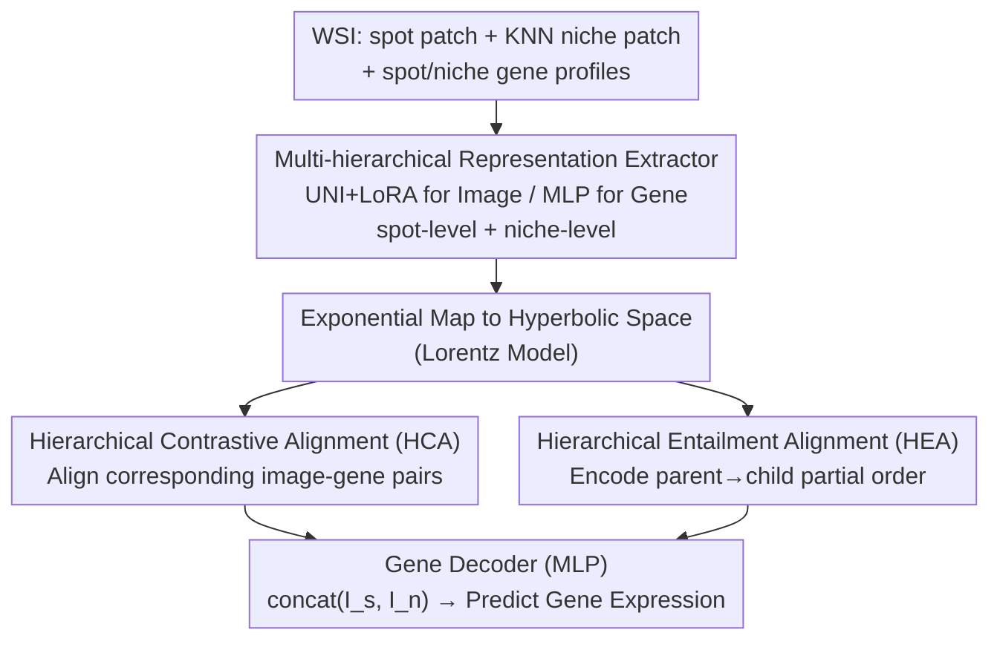

# HyperST: Hierarchical Hyperbolic Learning for Spatial Transcriptomics Prediction

**Conference**: CVPR 2026  
**Paper**: [CVF Open Access](https://openaccess.thecvf.com/content/CVPR2026/html/Zhang_HyperST_Hierarchical_Hyperbolic_Learning_for_Spatial_Transcriptomics_Prediction_CVPR_2026_paper.html)  
**Code**: https://github.com/liesgame/HyperST  
**Area**: Computational Biology / Pathology Images / Spatial Transcriptomics  
**Keywords**: Spatial Transcriptomics, Gene Expression Prediction, Hyperbolic Geometry, Hierarchical Alignment, Multimodal  

## TL;DR
When predicting gene expression in Spatial Transcriptomics (ST) directly from H&E pathology images, existing methods typically perform only spot-level image-to-gene matching and ignore the inherent hierarchical structure of ST data. This paper proposes HyperST, which employs a multi-hierarchical representation extractor to capture both spot-level and niche-level image/gene features. These features are aligned in **hyperbolic space** using Hierarchical Contrastive Alignment (HCA) and Hierarchical Entailment Alignment (HEA). By injecting molecular semantics into image representations, HyperST achieves new SOTA performance across four tissue datasets.

## Background & Motivation
**Background**: Spatial Transcriptomics (ST) enables the simultaneous acquisition of tissue morphology (pathology images) and gene expression at the micrometer scale, aligning molecular profiles with tissue structure. This is highly valuable for disease diagnosis and target discovery. However, ST experiments are expensive and cumbersome, limiting clinical adoption. Thus, directly predicting spatially resolved gene expression from H&E images using deep learning has become a cost-effective alternative.

**Limitations of Prior Work**: Existing methods (regression via StNet, multi-scale fusion via TRIPLEX, contrastive alignment via BLEEP, generative via Stem) mostly focus on **spot-level** image-to-gene matching. They fail to **utilize the complete hierarchical structure of ST data**, particularly the gene expression side which spans multiple scales from cell-level to tissue-level. These methods either assume a bijective morphology-to-transcriptome mapping (ignoring biological heterogeneity) or use multi-scale visual features without explicit constraints to preserve this intrinsic hierarchy.

**Key Challenge**: There is an inherent **information asymmetry**—molecular details in gene expression profiles often lack obvious visual counterparts in pathology images (two visually similar patches may have distinct gene expressions). This "visual similarity vs. molecular heterogeneity" gap prevents standard image encoders from capturing the subtle morphological cues needed for molecular prediction. The authors raise two core questions: (1) Can the introduction of broader pathology/gene contexts improve spot-level prediction? (2) How can image encoders be made to encode more molecular information given the visual-molecular asymmetry?

**Goal**: Rather than modeling the problem as a rigid "one-to-many mapping," the goal is to learn a **stronger, molecular-infused image representation** while explicitly modeling the hierarchical relationships of ST data.

**Key Insight**: The authors define hierarchy based on **information specificity**—concept A "entails" concept B when B is a more semantically rich and specific instance of A (e.g., "dog on the beach" is a sub-concept of "dog"). Based on this, two hierarchies are established: (1) spot-level features entail their context-rich niche-level features; (2) morphological images entail their corresponding gene expression profiles (profiles are more fine-grained and specific than images).

**Core Idea**: Hierarchical data is naturally suited for **hyperbolic space** (negative curvature, volume grows exponentially with radius like a tree). By projecting image-gene representations into hyperbolic space and structurally regularizing the latent space with contrastive and entailment losses, the model learns hierarchy-aware, molecular-infused representations to decode gene expression.

## Method

### Overall Architecture
The workflow of HyperST is as follows: it crops a spot-level patch for each spot from a WSI and concatenates it with neighbors to form a larger niche-level patch. On the image side, UNI (a pathology foundation model, fine-tuned with LoRA) extracts spot/niche image features. On the gene side, a trainable MLP extracts spot/niche gene features. These four sets of Euclidean features are projected into hyperbolic space (Lorentz model) via exponential mapping. Two types of hierarchical alignment are performed—Hierarchical Contrastive Alignment (HCA) pulls corresponding image-gene pairs together, and Hierarchical Entailment Alignment (HEA) encodes the "parent → child" partial order structure into the latent space. Finally, only the aligned, molecular-infused image representations (spot+niche concatenation) are fed to a gene decoder (MLP) to predict spot-level gene expression. HEA serves as a **structural regularizer** rather than a generative model, imposing a meaningful inductive bias on the latent space.

### Key Designs

**1. Multi-hierarchical Representation Extractor: Captures spot-level and niche-level hierarchical features across both modalities**

Addressing the limitation of ignoring hierarchy. Image side: For each spot, it crops a center-aligned spot-level patch $X_s$. It then uses KNN to concatenate the center spot and its neighbors in the Visium hexagonal layout to form a larger niche-level patch $X_n$, providing broader tissue microenvironment context. Features are extracted using the pathology foundation model UNI. Since UNI is not natively adapted for large niche patches, the authors use **LoRA** ($W_{new}=W_{origin}+BA$, where $B\in\mathbb{R}^{d\times r}, A\in\mathbb{R}^{r\times d}, r\ll d$) for low-rank fine-tuning to obtain $I_s, I_n\in\mathbb{R}^d$. Gene side: Spot-level profile $Y_s\in\mathbb{R}^N$ is used directly; the niche-level profile is the mean of the center and neighbor profiles $Y_n=\frac{1}{|S|}\sum_{z\in S}z$, processed through a trainable MLP to get $G_s, G_n$. These four features $\{I_s, I_n, G_s, G_n\}$ cover two scales and two modalities, providing the material for hierarchical alignment.

**2. Hierarchical Contrastive Alignment (HCA): Aligns image-gene pairs in hyperbolic space**

Addressing the issue that direct distance minimization in Euclidean space (like BLEEP) is unsuitable for hierarchical data. First, the four Euclidean features are projected to hyperbolic space with curvature $-c<0$ via exponential mapping $\exp^c_O(\cdot)$ to obtain $\hat I_s,\hat I_n,\hat G_s,\hat G_n$. A **modified InfoNCE** loss is then used, replacing cosine similarity with negative Lorentz distance $-d_{\mathbb{L}}(\cdot,\cdot)$: $\mathcal{L}_{align}(\hat I_s,\hat G_s)=-\frac{1}{B}\sum_i\log\frac{\exp(-d_{\mathbb{L}}(\hat I_s^i,\hat G_s^i)/\tau)}{\sum_j\exp(-d_{\mathbb{L}}(\hat I_s^i,\hat G_s^j)/\tau)}$, where $\tau$ is a learnable temperature. HCA operates in four directions: bidirectional spot image $\leftrightarrow$ spot gene, and cross-level alignment niche $\rightarrow$ spot $\mathcal{L}_{align}(\hat G_n,\hat I_s)$, $\mathcal{L}_{align}(\hat I_n,\hat G_s)$ (**unidirectional niche $\rightarrow$ spot only**, as one spot-level feature might correspond to multiple niches within a batch, and reverse would introduce false negatives): $\mathcal{L}_{HCA}=\frac{1}{4}(\mathcal{L}_{align}(\hat I_s,\hat G_s)+\mathcal{L}_{align}(\hat G_s,\hat I_s)+\mathcal{L}_{align}(\hat G_n,\hat I_s)+\mathcal{L}_{align}(\hat I_n,\hat G_s))$.

**3. Hierarchical Entailment Alignment (HEA): Encodes "parent entails child" partial orders**

Addressing the information asymmetry between images and genes via explicit structural constraints. Based on the concept that genes are more fine-grained "sub-concepts" of images, the authors use a **hyperbolic entailment loss** to constrain partial orders. Each parent node $y$ defines an entailment cone $R_y$ with a half-angle $\mathrm{aper}(y)=\sin^{-1}\!\big(\frac{2Q}{\sqrt{c}\,\|y_{space}\|}\big)$ ($Q=0.1$). If a child node $x$ falls outside the cone, it is penalized: $\mathcal{L}_{entail}(y,x)=\max(0,\,\mathrm{ext}(y,x)-\mathrm{aper}(y))$, where $\mathrm{ext}(y,x)$ is the external angle of $x$ relative to $y$. HEA constrains four entailment relations: spot image entails niche image, spot gene entails niche gene, spot image entails spot gene, and niche image entails niche gene: $\mathcal{L}_{HEA}=\frac{1}{4}(\mathcal{L}_{entail}(\hat I_s,\hat I_n)+\mathcal{L}_{entail}(\hat G_s,\hat G_n)+\mathcal{L}_{entail}(\hat I_s,\hat G_s)+\mathcal{L}_{entail}(\hat I_n,\hat G_n))$. This explicitly embeds the "general $\rightarrow$ specific" direction into hyperbolic geometry, serving as a key driver of HyperST's performance.

### Loss & Training
The gene decoder feeds concatenated aligned image representations into an MLP: $Y^{pred}=\mathrm{Decoder}_{gene}(\mathrm{concat}(I_s, I_n))$, using MSE as the prediction loss $\mathcal{L}_{pred}=\|Y^{pred}-Y_s\|_2^2$. The total objective combines prediction loss with weighted hyperbolic hierarchical alignment losses: $\mathcal{L}=\mathcal{L}_{pred}+\alpha(\mathcal{L}_{HCA}+\beta\,\mathcal{L}_{HEA})$, where $\alpha$ balances alignment and prediction, and $\beta$ controls the strength of entailment loss. For data, each spot takes the top-200 high mean high variable genes (HMHVG) with log-transformed expression counts. Patches are cropped with "physics-awareness" corresponding to their physical diameter (55 µm) and resized to 224×224. The curvature $c$ of UNI is trainable, and LoRA tunes the final attention layers.

## Key Experimental Results

### Main Results
Evaluated on four tissue datasets derived from HEST-1K (Kidney / Colorectum / Skin / Lung). Metrics include average Pearson Correlation Coefficient PCC@k (higher is better), and MSE / MAE (lower is better). Mean results from five random splits (80/10/10) are reported.

| Dataset | Model | PCC@10↑ | PCC@200↑ | MSE↓ | MAE↓ |
|------|------|------|------|------|------|
| Kidney | TRIPLEX (runner-up) | 0.579 | 0.351 | 1.122 | 0.855 |
| Kidney | **HyperST** | **0.617** | **0.390** | **1.077** | **0.817** |
| Colorectum | TRIPLEX | 0.701 | 0.462 | 1.869 | 1.056 |
| Colorectum | **HyperST** | **0.721** | **0.477** | **1.498** | **0.958** |
| Skin | TRIPLEX | 0.831 | 0.740 | 0.981 | 0.685 |
| Skin | **HyperST** | **0.839** | **0.758** | **0.932** | **0.657** |
| Lung | TRIPLEX | 0.567 | 0.393 | 1.537 | 0.849 |
| Lung | **HyperST** | **0.637** | **0.459** | **1.182** | **0.757** |

HyperST outperforms the runner-up TRIPLEX across all four datasets and all metrics. The relative gains in PCC@200 are approximately 10.95% (Kidney), 3.24% (Colorectum), 2.52% (Skin), and 16.7% (Lung).

### Main Results (Zero-shot MSI Status Classification)
A model trained on Colorectum was used for zero-shot inference on an external dataset (TCGA-COADREAD). Predicted spot-level expressions were averaged into slide-level pseudo-bulk profiles. A Random Forest was trained to predict Microsatellite Instability (MSI) status (AUROC):

| Model | MSI-H↑ | MSS↑ |
|------|------|------|
| TRIPLEX | 0.630 | 0.567 |
| **HyperST** | **0.719** | **0.601** |

HyperST improved AUROC for MSI-H / MSS to 0.719 / 0.601 in a zero-shot setting, exceeding TRIPLEX by ~14% / 6%, suggesting that predicted gene profiles capture more clinically relevant signals.

### Ablation Study (Kidney Dataset)
| Configuration | PCC@200↑ | Notes |
|------|------|------|
| Full HyperST | 0.390 | — |
| w/o G-I HEA | 0.378 | Remove gene-image entailment regularization, −3.24% |
| w/o HEA | 0.368 | Remove entire entailment loss, −6.01% |
| w/o HEA + HCA (total HHA) | 0.344 | Remove entire hierarchical alignment, −13.26% (largest drop) |
| Euclidean counterpart | 0.369 | Revert same architecture to Euclidean space |
| MERU variant | 0.355 | Hyperbolic but no multi-hierarchy |
| CLIP variant | 0.321 | Euclidean + no hierarchy |
| only spot (decoder input) | 0.353 | Use spot image only |
| only niche | 0.356 | Use niche image only |
| spot+niche | 0.390 | Best with two-level concatenation |

### Key Findings
- **Hierarchical Alignment Module (HHA) is most critical**: Removing HCA+HEA leads to a 13.26% drop in PCC@200. HEA (entailment loss) alone contributes 6.01%, highlighting the importance of explicit partial order constraints.
- **Hyperbolic geometry is superior**: Reverting to Euclidean space or using CLIP results in significant performance drops. CLIP performed worst (0.321), confirming that negative curvature naturally fits the tree-like hierarchy of ST.
- **Entailment direction matters**: Reversing the direction of spot–niche or image–gene entailment causes performance degradation, supporting the "general → specific" design.
- **Multi-hierarchical input is effective**: Using both spot + niche for decoding is superior to either single level. Fine-tuning UNI layers via LoRA generally helps performance.

## Highlights & Insights
- **Mapping "Information Specificity" to Geometric Hierarchy**: By using "parent entails more specific child" to characterize both spot→niche and image→gene hierarchies, the authors create a self-consistent and transferable abstraction for hyperbolic space.
- **HEA as a Structural Regularizer**: Instead of modeling a rigid one-to-many mapping, HEA uses entailment cones to bias the latent space. This approach is elegant and proven by ablation to be a primary performance driver.
- **Zero-shot Clinical Downstream Migration**: Improving MSI classification on external TCGA data via zero-shot predicted gene profiles demonstrates that the learned representations carry transferable clinical signals.

## Limitations & Future Work
- Validation was limited to four HEST-1K derived datasets and Visium hexagonal layouts; generalizability to other platforms (e.g., higher-resolution imaging-based ST) is unknown.
- The model involves many hyperparameters like curvature $c$, $\alpha/\beta$, and cone parameter $Q$. Numerical stability in hyperbolic operations is a known challenge not fully discussed.
- Niche context is fixed by KNN/six-neighbor definitions, which may not adapt to different tissue microenvironment scales.
- Gene selection is limited to the top-200 HMHVG, potentially missing clinically critical low-expression genes.

## Related Work & Insights
- **vs BLEEP**: BLEEP performs spot-level image-gene contrastive alignment in Euclidean space. HyperST moves alignment to hyperbolic space and adds multi-hierarchy + entailment constraints.
- **vs TRIPLEX**: TRIPLEX fuses multi-scale visual features but lacks explicit hierarchical constraints. HyperST constructs spot $\leftrightarrow$ niche hierarchies in both modalities, leading to superior PCC@200.
- **vs MERU / HyCoCLIP**: MERU models image-text hierarchies in hyperbolic space. HyCoCLIP relies on object detectors to extract boxes for intra-modal hierarchy. HyperST directly utilizes the intrinsic spot $\rightarrow$ niche structure of ST.

## Rating
- Novelty: ⭐⭐⭐⭐⭐ First application of hyperbolic hierarchical learning to ST gene expression prediction with self-consistent design.
- Experimental Thoroughness: ⭐⭐⭐⭐ Four datasets + zero-shot clinical task + detailed ablation, though data is limited to HEST-1K/Visium.
- Writing Quality: ⭐⭐⭐⭐ Clear logic connecting two problems to two components; complete hyperbolic geometry background.
- Value: ⭐⭐⭐⭐ Predicting ST from pathology has clear clinical value; zero-shot validation provides strong evidence.

<!-- RELATED:START -->

## Related Papers

- [\[CVPR 2026\] From Spots to Pixels: Dense Spatial Gene Expression Prediction from Histology Images](from_spots_to_pixels_dense_spatial_gene_expression_prediction_from_histology_ima.md)
- [\[CVPR 2026\] FEAST: Fully Connected Expressive Attention for Spatial Transcriptomics](feast_fully_connected_expressive_attention_for_spatial_transcriptomics.md)
- [\[AAAI 2026\] HiFusion: Hierarchical Intra-Spot Alignment and Regional Context Fusion for Spatial Gene Expression Prediction from Histopathology](../../AAAI2026/computational_biology/hifusion_hierarchical_intra-spot_alignment_and_regional_context_fusion_for_spati.md)
- [\[CVPR 2026\] Predicting Spatial Transcriptomics from Histology Images via High-Order Multi-Cell Interaction Modeling](predicting_spatial_transcriptomics_from_histology_images_via_high-order_multi-ce.md)
- [\[CVPR 2026\] Hyperbolic Busemann Neural Networks](hyperbolic_busemann_neural_networks.md)

<!-- RELATED:END -->
