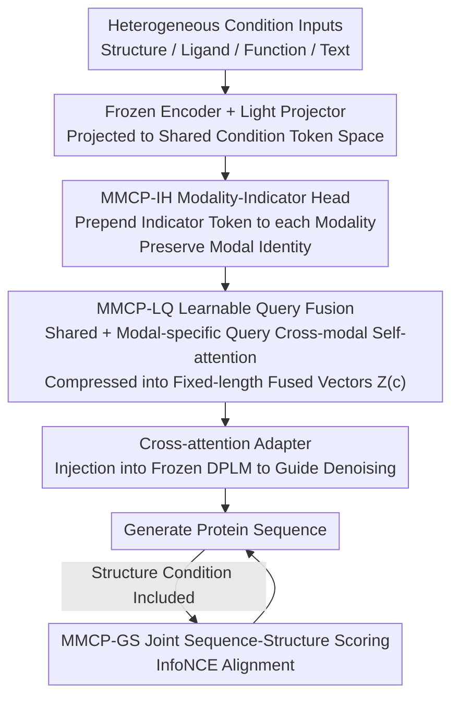

# MMCP-GEN: A Modality-Extensible Diffusion Language Model for Conditional Protein Sequence Generation

**Conference**: CVPR 2026  
**Paper**: [CVF Open Access](https://openaccess.thecvf.com/content/CVPR2026/html/An_MMCP-GEN_A_Modality-Extensible_Diffusion_Language_Model_for_Conditional_Protein_Sequence_CVPR_2026_paper.html)  
**Code**: https://github.com/WanyuGroup (Claimed to be public in the paper; ⚠️ the repository address is general, refer to the original text)  
**Area**: Computational Biology / Diffusion Language Models / Multimodal Conditional Generation  
**Keywords**: Protein design, Diffusion language model, Multimodal conditions, Learnable queries, Modality extensibility

## TL;DR
Building upon the discrete diffusion protein language model DPLM, MMCP-GEN designs a composable conditional mechanism featuring a "Modality-Indicator Head + Learnable Query fusion." This mechanism unifies heterogeneous biological conditions—such as structure, ligands, functional annotations, and free text—into a shared condition space. It allows for the addition of new modalities without retraining the backbone. Combined with a joint sequence-structure scoring objective, it sets new SOTAs across functional generation, inverse folding, and multi-objective design tasks (with sequence recovery rates improved by up to ~5%).

## Background & Motivation

**Background**: Controllable protein design using diffusion models is a recent focal point. These methods treat amino acid sequences as discrete tokens and generate sequences via iterative denoising. Compared to traditional Protein Language Models (PLMs), they demonstrate greater controllability, structural fidelity, and sequence diversity. Representative works include EvoDiff, RFdiffusion, and DPLM.

**Limitations of Prior Work**: Real-world protein design often necessitates satisfying multiple modalities of biological conditions simultaneously—folding into a specific 3D structure, binding to particular ligands, and possessing specific GO/EC functions. However, existing methods either support only a single condition (e.g., ZymCTRL for EC, ProteoGAN for GO) or equip each modality with an independent encoder + adapter pair (e.g., DPLM-2, CFP-GEN). The latter approach partitions different modalities into isolated parallel modules, leading to weak cross-modal interaction and requiring new designs or even backbone retraining for every new modality added.

**Key Challenge**: Protein sequences, structures, and functions are inherently coupled; optimizing any single modality in isolation is insufficient. Yet, current architectures lack a good compromise between "modality isolation" and "cross-modal fusion"—if fusion is effective, it is often not extensible; if it is extensible, the fusion tends to be shallow.

**Goal**: Construct a controllable protein generation framework that enables both deep cross-modal fusion and plug-and-play extensibility for new modalities, requiring only lightweight fine-tuning without modifying the backbone.

**Key Insight**: Rather than providing dedicated channels for each modality, it is better to project all modalities into a shared condition token space. A set of learnable queries can then be used to extract and aggregate information across modalities, while modality-indicator tokens ensure that the semantics of different modalities are not conflated.

**Core Idea**: Use a "Modality-Indicator Head (MMCP-IH) + Learnable Query fusion (MMCP-LQ)" to compress heterogeneous conditions into a set of fixed-length fused tokens, which are injected into a frozen DPLM backbone via cross-attention adapters. Adding a new modality only requires attaching an encoder + projector + indicator + a few modality-specific queries.

## Method

### Overall Architecture
MMCP-GEN is built on the absorbing discrete diffusion paradigm of DPLM. The forward process gradually replaces residues in a sequence with MASK tokens, while the reverse process reconstructs the sequence from an all-MASK state guided by multimodal conditions $c$. The pipeline is as follows: each modality first passes through a **frozen** pre-trained encoder to obtain embeddings, which are then projected into a unified $d_{\text{cond}}$-dimensional token space by a lightweight projector. A **Modality-Indicator Token** (MMCP-IH) is prepended to each modality's token sequence to preserve modal identity during fusion. Subsequently, all modality tokens are concatenated with a set of **Learnable Queries** (MMCP-LQ) and fed into a small Transformer for cross-modal self-attention, outputting a set of fixed-length fused vectors $Z(c)$. Finally, these vectors are injected into various layers of the frozen DPLM via cross-attention adapters to guide denoising. If the conditions include a target structure, a joint sequence-structure scoring objective (MMCP-GS) is layered on. In the entire framework, only the projectors, indicators, queries, and adapters are trainable; the backbone and all modality encoders remain frozen—this is the source of "extensibility without retraining."

### Key Designs

**1. MMCP-IH Modality-Indicator Head: Protecting Modal Identity with a Dedicated Token**

The pain point is that after projecting all modalities into the same token space, a Transformer can easily mix the semantics of different modalities, becoming unable to distinguish whether a token originates from structure or text. MMCP-IH addresses this directly by introducing a trainable vector $t^{(m)} \in \mathbb{R}^{d_{\text{cond}}}$ for the $m$-th modality, prepended to its projected token sequence: $\tilde{z}_m = [t^{(m)}; z^{(m)}_1, \dots, z^{(m)}_{n_m}]$. This indicator token acts as an identity label, allowing subsequent attention mechanisms to process tokens differentially "by modality," preventing accidental cross-modal semantic conflation. The beauty lies in its minimal cost (one vector per modality) while laying the foundation for extensibility: adding a new modality only requires creating another $t^{(m_{\text{new}})}$.

**2. MMCP-LQ Learnable Query Fusion: Fixed-length Query Extraction Supporting Missing Modalities**

Once all modality tokens are concatenated into a global stream $C=[\tilde{z}_1; \dots; \tilde{z}_M]$, the length varies with the number of modalities and conditions, making it incompatible with a fixed-structure backbone. MMCP-LQ maintains a set of learnable queries categorized into: shared queries $Q_s$ (modality-agnostic, attending to all) and modality-specific queries $Q_m$ (0–4 per modality, guided by indicator tokens to focus on their respective modalities). The combined sequence $T_0=[C;Q]$ is processed by a Transformer stack for self-attention $T_{\text{LQ}}=\text{Transformer}_{\text{LQ}}(T_0)$. The updated queries $Q'$ are extracted and mapped to the DPLM embedding space via a linear projection $W$, resulting in a fixed-length fusion set $Z(c)\in\mathbb{R}^{K\times d_{\text{DPLM}}}$. Two key designs are involved: first, the **fixed-length output** decouples condition injection from the specific number of modalities; second, the handling of **missing modalities**—if a modality is absent, a learnable missing-modality token $z^{(m)}_{\text{miss}}$ is inserted, ensuring that the corresponding $Q_m$ remains active and "aware" of the absence rather than simply failing. Lightweight cross-attention adapters are inserted into selected DPLM layers: $\hat{H}=\text{XAttn}(H,S),\ H\leftarrow H+\gamma\cdot\hat{H}$, where $\gamma$ controls condition strength. The same $S$ is reused across all diffusion timesteps, and classifier-free style condition dropout can be used to adjust guidance strength during inference.

**3. Modality-Extensible Mechanism: Adding New Modalities via Four Tiny Components**

This is the core selling point of the paper. To introduce an entirely new condition modality, one only needs: ① a pre-trained frozen encoder $E(m_{\text{new}})$; ② a lightweight projector $P_{m_{\text{new}}}$; ③ a modality-indicator token $t^{(m_{\text{new}})}$; and ④ an instantiated set of modality-specific queries $Q_{m_{\text{new}}}$ within MMCP-LQ. These four components are fine-tuned alongside existing adapters and projectors, while the DPLM backbone and all existing encoders remain frozen. In contrast to DPLM-2/CFP-GEN, where "every new modality requires a dedicated encoder–adapter pair or backbone retraining," MMCP-GEN reduces the expansion cost to tuning just a few small modules.

**4. MMCP-GS Joint Sequence-Structure Scoring: Differentiable Structural Fidelity via Contrastive Alignment**

When a target structure $s$ is given, the ideal goal is to simultaneously optimize structure prediction $P_\theta(s|x)$ and sequence generation $P_\phi(x|s)$ (Equation 15), but joint optimization is computationally prohibitive. The paper uses a proxy: structural embeddings $z_{\text{str}}=f_{\text{str}}(s)$ and sequence embeddings (via a projection head $g(\cdot)$) are pulled into the same space using an InfoNCE contrastive loss to align positive pairs and push away negatives: $L_{\text{GS}}=-\log \frac{\exp(\text{sim}(g(h(x)),z_{\text{str}})/\tau)}{\sum_{s'}\exp(\text{sim}(g(h(x)),z'_{\text{str}})/\tau)}$. This allows differentiable alignment of sequences and structures without needing additional generative model training. The final training objective combines the diffusion denoising cross-entropy with the structural alignment term: $L=L_{\text{CE}}+\zeta L_{\text{GS}}$ (with $\zeta=0.3$), ensuring the model remains faithful to diffusion training while capturing sequence-structure coupling under structural conditions.

### Loss & Training
The primary denoising loss is a weighted cross-entropy at MASK positions: $L_{\text{CE},t}=\mathbb{E}_{x^{(0)},c}[\lambda(t)\sum_i b_i(t)(-\log p_\theta(x^{(0)}_i|x^{(t)},c))]$, where $b_i(t)$ marks MASKed positions and $\lambda(t)$ is a noise-schedule-dependent weight. The backbone uses a pre-trained DPLM-650M. Adapters are inserted after the FFN sub-layers in the final third of the Transformer (layers 24, 28, and 33 out of 33), allowing condition injection while preserving early-layer representations. The number of shared and modal-specific queries is set to $k_s=k_m=4$. The GS loss weight $\zeta=0.3$ and condition strength $\gamma=0.6$ were determined via grid search.

## Key Experimental Results

The authors constructed a large-scale multimodal dataset: sequences and functional labels (GO/IPR/EC) from UniProtKB, structures with resolution $\le 3.5$ Å from PDB, and ligand-binding information from BioLiP. After quality control and redundancy removal, 127,342 proteins with paired multimodal attributes remained (353 GO terms, 1,092 IPR domains, 419 EC numbers, and 56k+ unique ligands). Metrics: Sequence similarity was measured by MMD/MMD-G (lower is better) and MRR (Mean Reciprocal Rank, higher is better); functional consistency was measured by micro/macro F1, AUPR, and AUC (scored by DeepGO-SE / InterProScan / CLEAN).

### Main Results

Evaluation of sequence similarity and functional annotation under functional conditions (selected GO/EC groups, bold indicates best):

| Task | Model | MRR↑ | MMD↓ | mic.F1↑ | mac.F1↑ | AUC↑ |
|------|------|------|------|---------|---------|------|
| GO | CFP-GEN | 0.824 | 0.042 | 0.511 | 0.527 | 0.744 |
| GO | MMCP-GEN (w/ ALL) | **0.873** | **0.038** | **0.536** | **0.553** | **0.799** |
| EC | CFP-GEN | 0.902 | 0.045 | 0.931 | 0.915 | 0.944 |
| EC | MMCP-GEN (w/ ALL) | **0.927** | **0.043** | **0.945** | **0.928** | **0.954** |

When using all modalities, MMCP-GEN achieves the best performance across GO, IPR, and EC spaces. Conversely, when given only a single functional condition (e.g., w/ GO, w/ EC), it was outperformed by CFP-GEN, suggesting that the gains primarily stem from cross-modal joint fusion rather than simple condition aggregation.

Inverse Folding (structural condition) task, using ESMFold for refolding. Metrics include Amino Acid Recovery (AAR), self-consistency TM-score (scTM), and pLDDT:

| Model | AAR(%) | scTM | pLDDT |
|------|--------|------|-------|
| ProteinMPNN | 45.76 | 0.905 | 85.11 |
| DPLM | 67.24 | 0.876 | 84.99 |
| CFP-GEN | 77.01 | 0.887 | 84.56 |
| MMCP-GEN (Zero-shot, w/o Struct) | 73.88 | 0.885 | 84.34 |
| MMCP-GEN (SFT, w/ Struct) | 77.49 | 0.905 | 85.38 |
| MMCP-GEN (SFT, ALL) | 78.17 | 0.906 | 86.25 |
| MMCP-GEN (SFT, ALL + GS) | **78.66** | **0.912** | **86.88** |

### Ablation Study

The stepwise ablation for inverse folding clearly shows the marginal contribution of each component:

| Configuration | AAR(%) | scTM | pLDDT | Description |
|------|--------|------|-------|------|
| Zero-shot (No fine-tuning) | 73.88 | 0.885 | 84.34 | Heterogeneous conditions are inherently useful priors |
| + SFT (Structure Condition) | 77.49 | 0.905 | 85.38 | Structural supervision significantly improves recovery |
| + All Modalities | 78.17 | 0.906 | 86.25 | Multimodal synergy rather than redundancy |
| + GS Joint Scoring | 78.66 | 0.912 | 86.88 | Further enhances foldability and stability |

### Key Findings
- **Cross-Modal Fusion > Stacking Conditions**: Under single-function conditions, MMCP-GEN lags behind CFP-GEN, but completely overtakes it when all modalities are used. This proves value lies in the "fusion method"—CFP-GEN's modality modules are largely parallel with weak interaction, whereas MMCP-LQ allows modalities to influence each other in a unified space.
- **Three-Layer Synergy**: Ablations show that structural supervision, multimodal conditions, and GS alignment each provide positive contributions that do not cancel out; the GS loss pushed scTM from 0.906 to 0.912 over an already high baseline.
- **Competitive Zero-Shot Performance**: Even without fine-tuning any adapters or fusion modules, the model reaches 73.88% AAR / 0.885 scTM, indicating that the heterogeneous priors provided by frozen encoders are inherently powerful.

## Highlights & Insights
- **Combination of Indicator Tokens and Learnable Queries**: The former preserves modal identity at minimal cost, while the latter compresses any number of modalities into a fixed interface. This pair facilitates a paradigm that is both deeply fused and extensible, which is highly transferable to other multimodal conditional generation tasks (images, molecules, etc.).
- **Clever Use of Missing-Modality Tokens**: Instead of simple omission, a learnable placeholder token allows queries to explicitly perceive missing information. Treating absence as a modelable signal allows the same model to flexibly ingest any subset of conditions.
- **Reducing Expensive Joint Objectives to Contrastive Alignment**: Full joint sequence-structure prediction is costly; the authors used InfoNCE to align embeddings in a shared space as a differentiable proxy. This effective engineering approximation avoids training an additional generative model.

## Limitations & Future Work
- The authors admit that full bidirectional joint optimization of $P_\theta(s|x)$ and $P_\phi(x|s)$ is computationally heavy, and the structural fidelity gains may be limited by the upper bound of the contrastive proxy.
- ⚠️ Evaluations were primarily on a custom multimodal dataset following the CFP-GEN protocol. Generalization across datasets/distributions and the adequacy of fair comparisons with newer backbones (e.g., full ESM3) require more external validation.
- The number of modality-specific queries is fixed at 4 or heuristically chosen between 0–4 based on complexity; whether this capacity is sufficient for极其 complex new modalities remains to be explored.
- The code link is general (only leading to the group homepage); some implementation details like training steps are relegated to the Appendix, and the degree of openness remains to be confirmed.

## Related Work & Insights
- **vs DPLM / DPLM-2**: MMCP-GEN uses DPLM as its backbone, but whereas DPLM-2 equips every new modality with a dedicated encoder–adapter pair, MMCP-GEN uses a shared space + learnable queries for extensibility without retraining the backbone.
- **vs CFP-GEN**: Both perform multi-condition fusion, but CFP-GEN's modules are largely parallel with weak cross-modal interaction. MMCP-GEN allows all modalities to attend to each other in MMCP-LQ, outperforming CFP-GEN in all-modality settings.
- **vs ESM3 / ProGen2**: These PLMs rely on residue prompts or single-label control, making it difficult to satisfy multiple interactive conditions simultaneously. MMCP-GEN integrates heterogeneous conditions into a single generation process, achieving higher F1 and AUC on IPR/EC tasks.

## Rating
- Novelty: ⭐⭐⭐⭐ The combination of "Indicator Head + Learnable Query + Extensibility without Retraining" is a clear new paradigm in multimodal protein generation, though individual components have precedents in the multimodal field.
- Experimental Thoroughness: ⭐⭐⭐⭐ Covers functional generation, inverse folding, and multi-objective tasks with stepwise ablations and visualizations, though largely on a custom dataset with fewer external benchmark comparisons.
- Writing Quality: ⭐⭐⭐⭐ The motivation-method-experiment logic is smooth, with clear naming of components and formulas.
- Value: ⭐⭐⭐⭐ The "extensible without retraining" conditional mechanism is practically significant for real-world protein design (multiple constraints) and the paradigm is transferable to other controllable generation tasks.

<!-- RELATED:START -->

## Related Papers

- [\[ICML 2025\] CFP-Gen: Combinatorial Functional Protein Generation via Diffusion Language Models](../../ICML2025/computational_biology/cfp-gen_combinatorial_functional_protein_generation_via_diffusion_language_model.md)
- [\[ICLR 2026\] ProTDyn: A Foundation Protein Language Model for Thermodynamics and Dynamics Generation](../../ICLR2026/computational_biology/protdyn_a_foundation_protein_language_model_for_thermodynamics_and_dynamics_gene.md)
- [\[CVPR 2026\] Multimodal Protein Language Models for Enzyme Kinetic Parameters: From Substrate Recognition to Conformational Adaptation](multimodal_protein_language_models_for_enzyme_kinetic_parameters_from_substrate_.md)
- [\[CVPR 2026\] HINGE: Adapting a Pre-trained Single-Cell Foundation Model to Spatial Gene Expression Generation from Histology Images](adapting_a_pre-trained_single-cell_foundation_model_to_spatial_gene_expression_g.md)
- [\[ICLR 2026\] Reverse Distillation: Consistently Scaling Protein Language Model Representations](../../ICLR2026/computational_biology/reverse_distillation_consistently_scaling_protein_language_model_representations.md)

<!-- RELATED:END -->
