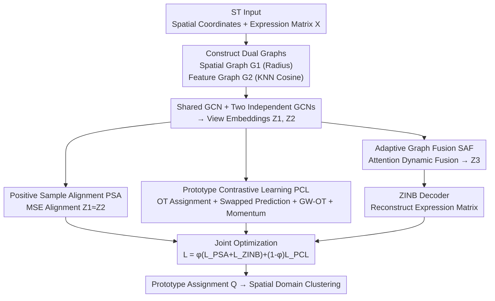

# Multi-View Hierarchical Alignment Learning for Spatial Transcriptomics

**Conference**: CVPR 2026  
**Paper**: [CVF Open Access](https://openaccess.thecvf.com/content/CVPR2026/html/Zhu_Multi-View_Hierarchical_Alignment_Learning_for_Spatial_Transcriptomics_CVPR_2026_paper.html)  
**Code**: None  
**Area**: Computational Biology / Spatial Transcriptomics / Multi-View Clustering  
**Keywords**: Spatial transcriptomics, spatial domain identification, multi-view contrastive clustering, prototype contrastive learning, optimal transport

## TL;DR
MHAL performs two levels of alignment for the "spatial coordinate view" and "gene expression view" in spatial transcriptomics: at the sample level, it employs MSE to align the dual-view embeddings of the same spot; at the semantic level, it uses a set of learnable prototypes and optimal transport for swapped prediction contrastive learning. Together with adaptive graph fusion and a ZINB decoder, MHAL significantly outperforms 11 existing methods in spatial domain identification (ARI) across three datasets: DLPFC, human breast cancer, and mouse anterior brain.

## Background & Motivation
**Background**: Spatial Transcriptomics (ST) simultaneously provides both the spatial coordinates and gene expression profiles for each spot, where "spatial domain identification" (essentially clustering spots) represents a core task. Predominant approaches utilize Graph Neural Networks (GNNs) to construct graphs from spatial adjacency and expression similarity to perform unsupervised clustering. Representative methods include SpaGCN, DeepST, GraphST, MAFN, and stGCL.

**Limitations of Prior Work**: The authors identify two unresolved flaws. First, most methods learn embeddings for the "spatial view" and "expression view" independently. Due to view-specific noise and incomplete structural information, **the embeddings learned for the same spot across the two views often fail to align**, meaning there is a lack of sample-level cross-view consistency, which reduces discriminability. Second, existing methods **lack semantic-level supervision**: GCNs can only capture local neighborhood patterns and are prone to oversmoothing or over-squashing, which destroys structure. Moreover, methods like SpaGCN implicitly assume that "spatial neighbors must belong to the same category," lacking any mechanism to depict global semantic relationships.

**Key Challenge**: There is a lack of a bridge between local consistency (where GCNs excel) and global semantic representation (which requires high-level abstraction). Prototype modeling could potentially provide such semantic abstraction, but existing methods rarely align prototypes with node representations, resulting in weak semantic consistency.

**Goal**: To simultaneously achieve two goals within an end-to-end framework: (1) ensure that the two views produce consistent embeddings for the same spot; and (2) introduce explicit semantic-level supervision to make the clustering structure more globally separable.

**Key Insight**: Divide "alignment" into two hierarchical levels (hierarchical alignment)—with the sample level responsible for local consistency and the semantic level responsible for global discrimination, progressing in a step-by-step manner.

**Core Idea**: Use a simple MSE at the sample level to directly align the dual-view embeddings (positive sample alignment), and utilize a set of learnable prototypes as semantic anchors at the semantic level to perform cross-view swapped prediction contrastive learning via Optimal Transport (OT). The combination of these two alignment levels ensures local consistency while reinforcing global semantic representation.

## Method

### Overall Architecture
The input of MHAL is the ST data of a tissue slice (spatial coordinates of spots + gene expression matrix $\mathbf{X}\in\mathbb{R}^{N\times D}$), and the output is the clustering label for each spot (spatial domains). The pipeline operates as follows: first, build two graphs from spatial coordinates and gene expression, respectively (spatial graph $\mathbf{G}_1$ and feature graph $\mathbf{G}_2$); use a shared GCN encoder to learn initial intra-view representations, which are then refined through independent GCNs into spatial view embeddings $\mathbf{Z}_1$ and expression view embeddings $\mathbf{Z}_2$; apply positive sample alignment (PSA, minimized using MSE) at the **sample level**, and prototype contrastive learning (PCL, using OT swapped prediction) at the **semantic level** on these two embeddings; simultaneously, utilize Adaptive Graph Fusion (SAF) to dynamically weight and merge the two graphs into a single fused graph to learn a fused representation $\mathbf{Z}_3$; finally, feed $\mathbf{Z}_3$ into a ZINB decoder to reconstruct the gene expression matrix as a regularizer. During training, PSA, PCL, and ZINB losses are optimized jointly. During inference, the prototype assignment $Q$ is used to obtain the clustering results.

### Key Designs

**1. Positive Sample Alignment: Enforcing dual-view consistency for the same spot with a simple MSE**

To address the issue where embeddings of the same spot in the spatial view and expression view fail to align, MHAL avoids complex correlation matrix alignment and instead directly treats the corresponding node embeddings of the two views as natural positive sample pairs, pulling them closer using a simple Mean Squared Error:

$$\mathcal{L}_{PSA} = \lVert \mathbf{Z}_1 - \mathbf{Z}_2 \rVert_2^2$$

where $\mathbf{Z}_1$ and $\mathbf{Z}_2$ are the node embeddings from the spatial graph and feature graph refined by independent GCNs, respectively. The reason this works is that it directly aligns "two descriptions of the same cell/spot" in the latent space, forcing the model to output similar representations regardless of which view is observed. This enhances both view consistency and discriminative power, while inadvertently increasing within-cluster compactness. It is a simple yet effective design—the authors' ablation studies demonstrate that removing it leads to a drop in ARI.

**2. Prototype-level Contrastive Learning: Aligning nodes with semantic prototypes using Optimal Transport**

This core design fills the gap of "semantic-level supervision". MHAL sets $S$ learnable prototypes representing semantic classes. The soft assignment of nodes to prototypes is not a simple softmax computation, but rather solved via an entropy-regularized optimal transport problem:

$$\min_{\pi\in\Pi}\ \langle\pi, -\mathbf{R}\rangle - \epsilon H(\pi)$$

where $\mathbf{R}=\mathbf{Z}\mathbf{S}^\top$ represents the contextual representation of nodes projected onto prototypes (with the cost matrix set as $-\mathbf{R}$), and $\Pi$ is constrained by the node marginal distribution $\mu$ and prototype marginal distribution $\nu$, which is solved efficiently using the scalable Sinkhorn-Knopp algorithm to yield the normalized soft assignment $Q$. The key lies in the **swapped prediction** mechanism to achieve cross-view consistency: the OT assignment $Q_1$ from the first view serves as the pseudo-label for the prediction $P_2^\tau$ of the second view, and vice versa. The prediction distribution $P^\tau$ is the temperature-scaled softmax of the similarity between node embeddings and prototypes (Eq. 10). The contrastive loss is defined as symmetric cross-entropy:

$$\mathcal{L}_{PCL} = -\frac{1}{2N}\sum_{n=1}^N\left(\langle\mathbf{q}_{1,n}, \log\mathbf{p}_{2,n}^\tau\rangle + \langle\mathbf{q}_{2,n}, \log\mathbf{p}_{1,n}^\tau\rangle\right)$$

Moving further, the authors structure the relations between prototypes as a prototype graph $\mathbf{B}=\mathbf{P}^\top\mathbf{P}$ and align the data graph $\mathbf{A}$ and the prototype graph $\mathbf{B}$ topologically using **Gromov–Wasserstein Optimal Transport (GW-OT)** (Eq. 12–13). Subsequently, Fused GW-OT (Eq. 14, with a fusion coefficient of $\alpha=0.7$) is employed to obtain the final assignment by simultaneously utilizing the contextual node embeddings $\mathbf{R}$ and graph structure $\mathbf{A}$. Why it works: Serving as semantic anchors, prototypes force nodes to not only learn local neighborhoods but also comply with a globally consistent semantic structure, thereby generating clusters with clear boundaries and high within-cluster compactness. In ablation studies, this module yields the largest contribution (removing it drops ARI by half on certain slices).

**3. Momentum Update of Prototypes: Enabling stable evolution of semantic anchors during training**

Hard updates to the prototype graph and marginal distributions at each step can cause instability; therefore, the authors employ Exponential Moving Average (EMA) to update them smoothly. The prototype graph $\mathbf{B}$ is initialized as an identity matrix and updated based on the current prediction matrix $\mathbf{P}$:

$$\mathbf{B}^{(t)} = \beta_1\mathbf{B}^{(t-1)} + (1-\beta_1)(\mathbf{P}^\top\mathbf{P})$$

The marginal distribution $\nu$ (representing the expected cluster sizes) is initialized uniformly and updated similarly: $\nu^{(t)}=\beta_2\nu^{(t-1)}+(1-\beta_2)(\mathbf{P}^\top\mathbf{1}_N/N)$, with momentum coefficients $\beta_1=0.9$ and $\beta_2=0.99$. Consequently, the prototype structure evolves stably and adaptively throughout the training process, preventing the OT assignment from drifting drastically with single-batch predictions. Serving Design 2, this ensures stable convergence of PCL.

**4. Adaptive Graph Fusion + ZINB Reconstruction: Dynamic weight allocation for graph fusion and generative noise suppression in ST**

The reliability of spatial and feature graphs varies per spot, making fixed-weight fusion sub-optimal. SAF utilizes multi-head attention over the stacked $(\mathbf{Z}_1,\mathbf{Z}_2)$ to compute a node-level attention matrix $\mathbf{A}_{\text{attn}}$, averaging across all nodes to obtain a global balancing coefficient $\eta$ (Eq. 18). The fused adjacency matrix is then defined as $\mathbf{A}_f=\eta\mathbf{A}_2+(1-\eta)\mathbf{A}_1$. The fused feature $\mathbf{H}$ is then processed by another GCN layer to obtain the topology-aware embedding $\mathbf{Z}_f$. Together with the self-attention-enhanced $\mathbf{Z}_1^a,\mathbf{Z}_2^a$, these are fused through a weight-aware layer (using $\ell_2$-normalized $\tilde{\mathbf{w}}$) and finally projected via an MLP to generate the final representation $\mathbf{Z}_3$ (Eq. 21–22).

To handle the discrete, sparse, and noisy characteristics of ST data, the authors feed $\mathbf{Z}_3$ into a **ZINB (Zero-Inflated Negative Binomial) decoder** to reconstruct the gene expression matrix. Assuming that the expression $x$ follows a ZINB distribution (Eq. 23–24, which outputs zero-inflation parameter $\pi_{ij}$, mean $v_{ij}$, and dispersion $\theta_{ij}$), the negative log-likelihood is used as the reconstruction loss $\mathcal{L}_{ZINB}$. Specially designed to model gene expression distributions with massive zeros and over-dispersion, ZINB fits the statistical nature of ST data much better than standard MSE reconstruction, thereby suppressing noise and stabilizing representations.

### Loss & Training
The total loss is a weighted combination of sample-level alignment, semantic-level contrastive learning, and expression reconstruction:

$$\mathcal{L} = \varphi(\mathcal{L}_{PSA} + \mathcal{L}_{ZINB}) + (1-\varphi)\mathcal{L}_{PCL}$$

where $\varphi$ is the weighting factor. Training is executed using PyTorch 2.1.0 on a single RTX 5090D, with a fixed learning rate of 0.001 and weight decay of $5\times10^{-4}$. Metrics are recorded after training for 250 epochs on each dataset. Preprocessing aligns with MAFN (removing spots outside the main tissue region and using SCANPY to retain the top 3000 highly variable genes).

## Key Experimental Results

### Main Results
Evaluation is conducted on three benchmark datasets: DLPFC (8 slices, 33,538 genes, 5–7 annotated regions), 10x Visium human breast cancer HBC (20 regions), and mouse anterior brain MBA (52 regions). The evaluation metric is ARI (Adjusted Rand Index, indicating clustering agreement with annotations; higher is better). It is compared against 11 baseline methods (including SpaGCN, DeepST, GraphST, MAFN, stGCL, stCluster, Spatial-MGCN, Tsctc, etc.).

| Dataset | MHAL (Ours) | stGCL | MAFN | Tsctc | Description |
|--------|-----------|-------|------|-------|------|
| DLPFC-151507 | **78.94** | 74 | 68 | 68.53 | +4.94 vs stGCL |
| DLPFC-151671 | **82.45** | 67 | 82 | 72.11 | 14–17% higher than stGCL/stCluster |
| DLPFC-151672 | **86.04** | 82 | 76 | 75.36 | Highest overall |
| HBC | **68.96** | 68 | - | 63.83 | +1.42 vs strongest baseline |
| MBA | **49.30** | 45 | - | 44.82 | Significantly outperforms stGCL (38.42)/stCluster (31.65) |

MHAL leads almost across the board on the 8 DLPFC slices, and achieves the best ARI on HBC and MBA. The ARI boxplots show its higher median and tighter distribution, indicating stronger stability across different tissue slices.

### Ablation Study
Ablation experiments decompose modules across 10 datasets (three representative slices and two datasets are selected here, unit in ARI %):

| Configuration | 151672 | 151507 | HBC | MBA | Description |
|------|--------|--------|-----|-----|------|
| Full (Ours) | **86.04** | **78.94** | **68.96** | **49.30** | Full model |
| w/o $\mathcal{L}_{PCL}$ | 24.73 | 27.77 | 53.31 | 30.46 | Removing prototype contrastive learning causes the most severe collapse |
| w/o $\mathcal{L}_{PSA}$ | 76.38 | 62.56 | 66.92 | 42.09 | Removing sample alignment leads to consistent performance drops |
| w/o SAF | 39.26 | 49.14 | 58.74 | — | Removing adaptive fusion leads to a significant decrease |
| w/o $\mathcal{L}_{ZINB}$ | 79.25 | 56.01 | 61.70 | 42.48 | Removing ZINB decoder |

### Key Findings
- **Prototype Contrastive Learning (PCL) is the most critical contributor**: Removing it causes the ARI of 151672 to plunge from 86.04 to 24.73, and 151507 from 78.94 to 27.77, virtually losing clustering capability. This confirms that "semantic-level supervision" is the cornerstone of this method.
- Removing Sample Alignment (PSA) or Adaptive Graph Fusion (SAF) consistently leads to performance drops (e.g., losing SAF drops 151672 to 39.26), demonstrating that local consistency and dynamic graph fusion both make substantive contributions.
- ⚠️ **Note on ZINB**: The main text states that "removing $\mathcal{L}_{ZINB}$ leads to an improvement of over 9.9% in average performance," yet the ablation table shows that w/o $\mathcal{L}_{ZINB}$ is consistently lower than the Full model across all columns (e.g., 56.01 < 78.94 for 151507). This phrasing directly contradicts the table. **The table should be regarded as correct**, indicating that ZINB indeed provides a positive contribution.
- Downstream visualizations (UMAP, trajectory inference, marker gene distribution) show that MHAL yields clearer cluster separation, more orderly cortical laminar structures (layers 3/4/5/6 + WM), and reconstructed marker gene spatial distributions that align better with established biological findings.

## Highlights & Insights
- **Clean and Elegant "Two-Level Alignment" Framework**: A simple MSE is used at the sample level and OT swapped prediction is used at the semantic level. One manages local consistency while the other governs global discriminative power. Their division of labor is clear, and the ablation study proves both are indispensable—this hierarchical approach of "aligning individuals first, then aligning semantics" is highly transferable to other multi-view/multi-modal clustering tasks.
- **Adapting SwAV-style Swapped Prediction + GW-OT Graph Alignment to ST**: Utilizing prototypes as semantic anchors, optimal transport for soft assignments, and Gromov–Wasserstein to topologically align the data and prototype graphs is a clever way to explicitly inject "graph structural semantics" into contrastive learning.
- **ZINB Decoder Fits Data Statistics**: ST count data is naturally zero-inflated and over-dispersed. Employing ZINB instead of MSE reconstruction is the "right tool for the job" in this domain, which is crucial for suppressing sparse noise.

## Limitations & Future Work
- The method relies on ARI as the sole primary metric, lacking cross-validation with other metrics like NMI or ACC, leaving it open to question whether the performance is merely "ARI-friendly."
- The architecture has relatively many components (dual GCNs, PSA, PCL, GW-OT, momentum, SAF, ZINB) and numerous hyperparameters ($\alpha=0.7$, $\beta_1=0.9$, $\beta_2=0.99$, $\varphi$, number of prototypes $S$). The paper lacks a comprehensive sensitivity analysis, presenting a relatively high reproduction and tuning cost.
- The main text's description of the ZINB ablation contradicts the table (as mentioned above); this self-contradiction in writing weakens the overall persuasiveness.
- The experiments are validated only on three standard benchmarks (DLPFC, HBC, MBA). Its scalability to larger-scale or higher-resolution datasets (such as Stereo-seq or Visium HD) remains unexplored.

## Related Work & Insights
- **vs MAFN / stGCL (Similar ST Clustering Methods)**: These methods also feature cross-view fusion or heterogeneous contrastive learning but lack explicit sample-level MSE alignment and prototype-level semantic supervision. MHAL addresses these shortcomings with its two-level alignment, leading to a general +5% to +17% ARI gain across multiple DLPFC slices.
- **vs SpaGCN / DeepST / GraphST**: These approaches implicitly assume that "spatial neighbors belong to the same category" and only learn local structures, failing when boundaries are fuzzy. MHAL introduces global semantic relationships via prototypes + GW-OT, producing clearer boundary identifications.
- **vs SwAV / Prototype-based Contrastive Learning Methods**: MHAL migrates swapped prediction from self-supervised image learning to ST graph data, and superimposes GW-OT graph topological alignment and momentum prototype updates, representing a concrete instantiation of prototype contrastive learning in graph clustering.

## Rating
- Novelty: ⭐⭐⭐⭐ The combination of two-level alignment + GW-OT prototype alignment is relatively novel in ST clustering, though many components are migrations or assemblages of existing techniques.
- Experimental Thoroughness: ⭐⭐⭐ Three datasets + 11 baselines + comprehensive ablation studies are well covered, but the evaluation relies solely on the ARI metric, and hyperparameter sensitivity analysis is missing.
- Writing Quality: ⭐⭐⭐ The framework is clearly explained, but the ZINB ablation description is self-contradictory, and the formula formatting (OCR) is somewhat messy.
- Value: ⭐⭐⭐⭐ Achieves a stable SOTA in spatial domain identification. The two-level alignment approach offers valuable insights for multi-view clustering.

<!-- RELATED:START -->

## Related Papers

- [\[CVPR 2026\] HyperST: Hierarchical Hyperbolic Learning for Spatial Transcriptomics Prediction](hyperst_hierarchical_hyperbolic_learning_for_spatial_transcriptomics_prediction.md)
- [\[CVPR 2026\] Bulk RNA-seq Guided Multi-modal Detection of Anomalous Regions in Human Cancer via Spatial Transcriptomics](bulk_rna-seq_guided_multi-modal_detection_of_anomalous_regions_in_human_cancer_v.md)
- [\[CVPR 2026\] Predicting Spatial Transcriptomics from Histology Images via High-Order Multi-Cell Interaction Modeling](predicting_spatial_transcriptomics_from_histology_images_via_high-order_multi-ce.md)
- [\[CVPR 2026\] FEAST: Fully Connected Expressive Attention for Spatial Transcriptomics](feast_fully_connected_expressive_attention_for_spatial_transcriptomics.md)
- [\[CVPR 2026\] Cross-Slice Knowledge Transfer via Masked Multi-Modal Heterogeneous Graph Contrastive Learning for Spatial Gene Expression Inference](cross-slice_knowledge_transfer_via_masked_multi-modal_heterogeneous_graph_contra.md)

<!-- RELATED:END -->
