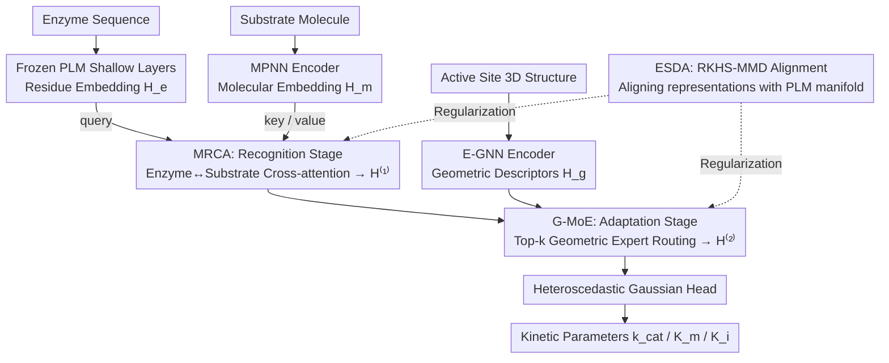

# Multimodal Protein Language Models for Enzyme Kinetic Parameters: From Substrate Recognition to Conformational Adaptation

**Conference**: CVPR 2026  
**arXiv**: [2603.12845](https://arxiv.org/abs/2603.12845)  
**Code**: None  
**Area**: Medical Imaging / Bioinformatics  
**Keywords**: Enzyme kinetic prediction, Protein language models, Multimodal fusion, Mixture-of-Experts, Cross-modal adapters  

## TL;DR

The authors propose **ERBA (Enzyme-Reaction Bridging Adapter)**, which reframes enzyme kinetic parameter prediction as a **staged multimodal conditional generation problem**. The model injects substrate information via MRCA to capture substrate recognition specificity, integrates active site 3D structures through G-MoE to capture conformational adaptation, and utilizes ESDA distribution alignment to maintain the biochemical semantic priors of the PLM.

## Background & Motivation

**Background**: High-throughput protein design and synthetic biology increasingly rely on the computational prediction of enzyme kinetic parameters ($k_\text{cat}$, $K_m$, $K_i$) to screen candidate molecules before wet-lab experiments. Existing methods have evolved from sequence-only to multimodal (sequence + substrate + structure) pipelines.

**Limitations of Prior Work**: Most pipelines independently encode the enzyme and substrate before regressing through **shallow fusion** (concatenation + single-layer cross-attention). This implicitly treats the catalytic process as a **static compatibility problem**: $\hat{y} = \psi(S_e \oplus S_m \oplus S_g)$.

**Key Challenge**: The real catalytic process is staged—the enzyme first **recognizes and positions the substrate** (substrate recognition) and then **adaptively adjusts the active pocket geometry** (conformational adaptation) to stabilize the transition state. Shallow fusion ignores this staged nature, and blindly injecting 3D information may **disrupt the biochemical semantic priors** pre-trained into the PLM.

**Goal**: To build a staged conditional framework aligned with enzymatic mechanisms that injects substrate chemistry and pocket geometry hierarchically while preserving PLM priors.

**Key Insight**: Reframing kinetic prediction as $\hat{y} = f_\theta^{(2)}(f_\theta^{(1)}(S_e, S_m), S_g)$, where $f^{(1)}$ captures substrate-conditioned molecular recognition and $f^{(2)}$ performs conformational adaptation via geometric awareness.

**Core Idea**: ERBA = MRCA (Multimodal Recognition Cross-Attention) + G-MoE (Geometric-aware MoE routing) + ESDA (Distribution alignment regularization).

## Method

### Overall Architecture

ERBA addresses a key issue: current pipelines encode enzymes and substrates separately and perform shallow fusion, treating catalysis as a "static compatibility" problem. In reality, catalysis involves two stages: substrate recognition followed by pocket configuration adjustment. ERBA does not retrain the PLM; instead, it serves as an **adapter** inserted into a frozen pre-trained PLM to explicitly decouple and sequentially inject these two stages:

$$\hat{y} = \mathcal{G}^{(2)}(\underbrace{\mathcal{M}^{(1)}(S_e, S_m)}_{\text{Substrate Recognition}}, S_g)$$

Regarding data flow: The shallow layers of the PLM provide enzyme residue embeddings $\mathbf{H}_e \in \mathbb{R}^{L_e \times D}$. The substrate molecule is processed by an MPNN encoder to obtain $\mathbf{H}_m \in \mathbb{R}^{L_m \times D}$. The 3D structure of the active site is encoded by an E-GNN into geometric descriptors $\mathbf{H}_g \in \mathbb{R}^{L_g \times D}$. In the first stage (MRCA), the enzyme absorbs substrate information to become $\mathbf{H}^{(1)}$. In the second stage (G-MoE), the pocket geometry is injected to obtain $\mathbf{H}^{(2)}$. The entire process is constrained by ESDA at the distribution level to ensure that the injected chemical and geometric information does not overwhelm the original biochemical semantics of the PLM.

### Key Designs

**1. MRCA: Primary substrate recognition stage**

The first step of catalysis is the recognition and positioning of the substrate. This stage injects substrate semantics into the enzyme representation. MRCA uses a cross-attention layer where enzyme tokens serve as queries and substrate tokens serve as keys/values, allowing each enzyme residue to "query" its relevance to specific substrate atoms:

$$\mathbf{A}_{em} = \text{Softmax}\left(\frac{(\mathbf{H}_e \mathbf{W}_Q)(\mathbf{H}_m \mathbf{W}_K)^\top}{\sqrt{d_k}}\right), \quad \mathbf{Z}_{em} = \mathbf{A}_{em}(\mathbf{H}_m \mathbf{W}_V)$$

The substrate-aware representation $\mathbf{H}^{(1)}$ is obtained via residual connections and LayerNorm. The key is that the attention matrix $\mathbf{A}_{em}$ acts as an alignment map between enzyme residues and substrate atoms, naturally highlighting residues involved in binding—a process physically closer to "recognition" than simple feature concatenation.

**2. G-MoE: Capturing conformational adaptation via sparse expert routing**

After recognition, the enzyme adjusts the active pocket's geometry to stabilize the transition state. Since pocket topologies and residue arrangements vary significantly across enzymes, forming heterogeneous geometric regimes, a single adapter is insufficient. G-MoE employs multiple experts to handle specific geometric patterns, activated by sparse gating. It concatenates the pooled recognition features of the pocket region $\mathcal{P}$ with geometric descriptors to form a routing vector $\mathbf{v}_{emg} = [\text{Pool}(\mathbf{H}^{(1)}[\mathcal{P}]) \oplus \text{Pool}(\mathbf{H}_g)]$, and uses a Top-$k$ gate to activate $k$ relevant experts: $\tilde{\boldsymbol{\alpha}} = \text{Top-}k(\text{softmax}(\mathbf{W}_\text{gate} \mathbf{v}_{emg}))$. Each selected expert performs a geometrically-modulated low-rank adaptation ($r \ll D$, GELU activation):

$$E_n(\mathbf{H}^{(1)}, \mathbf{H}_g) = \mathbf{H}^{(1)} + \mathbf{V}_n \sigma(\mathbf{U}_n \mathbf{H}^{(1)}[\mathcal{P}] + \mathbf{B}_n \Gamma(\mathbf{H}_g))$$

The outputs are weighted by gating values and passed through an MLP: $\mathbf{H}^{(2)} = \text{MLP}(\sum_{n \in \text{Top}k} \tilde{\alpha} E_n)$. This sparse routing ensures specific geometric modes are fitted by specialized parameters rather than averaging all pocket types.

**3. ESDA: Distribution-level protection for PLM priors**

Forcing 3D structures into PLMs risks allowing dominant geometric signals to override the evolutionary constraints and catalytic patterns learned during pre-training. ESDA utilizes Maximum Mean Discrepancy (MMD) with RBF kernels in a Reproducing Kernel Hilbert Space (RKHS) to regularize the distributions. It aligns the representations of "sequence-only," "sequence+substrate," and "sequence+substrate+structure" back to the original PLM manifold. This ensures new modalities are "pulled into" the semantic space rather than replacing it.

### Loss & Training

A **heteroscedastic Gaussian** prediction head is used to model the positivity and multiplicative noise of kinetic constants in $\log_{10}$ space, combined with G-MoE balancing regularization:
$$\mathcal{L}_{\text{G-MoE}} = \|\bar{\boldsymbol{\alpha}} - \frac{1}{n}\mathbf{1}\|_2^2 + \|\bar{\mathbf{n}} - \frac{k}{n}\mathbf{1}\|_2^2$$

## Key Experimental Results

### Main Results: Comparison with SOTA (Exp I)

| Method | $k_\text{cat}$ R²↑ | $k_\text{cat}$ RMSE↓ | $K_m$ R²↑ | $K_i$ R²↑ |
|------|-----|------|-----|-----|
| DLKcat (2022) | 0.01 | 1.78 | - | - |
| CatPred (2025) | 0.40 | 1.30 | 0.49 | 0.45 |
| CataPro (2025) | 0.41 | 1.33 | 0.41 | - |
| **ERBA (Ours)** | **0.54** | **1.13** | **0.61** | **0.61** |

### Ablation Study: PLM Backbones (Exp II)

| PLM Backbone | w/o ERBA $k_\text{cat}$ R² | +ERBA $k_\text{cat}$ R² | Gain |
|---------|-----------|-----------|------|
| Ankh3-1.8B | 0.41 | **0.50** | +0.09 |
| Ankh3-5.7B | 0.43 | **0.52** | +0.09 |
| ProtT5-3B | 0.39 | **0.47** | +0.08 |
| ESM2-150M | 0.30 | **0.38** | +0.08 |

### Key Findings

1. **Broad Leadership**: ERBA outperforms all existing SOTA methods across $k_\text{cat}$, $K_m$, and $K_i$ objectives, increasing $k_\text{cat}$ R² from 0.41 to 0.54.
2. **Backbone Consistency**: ERBA provides stable improvements across all tested PLM backbones (ESM2, ProtT5, Ankh3).
3. **Value of Geometric Information**: Compared to CatPred (the only other method using 3D structures), ERBA achieves significantly higher performance, suggesting that staged injection is superior to shallow concatenation.
4. Larger PLM backbones yield better base performance, while ERBA's relative gain remains consistent across scales.

## Highlights & Insights

1. **Mechanism-Aligned Modeling**: The paradigm shift from "static compatibility" to "staged conditioning" aligns perfectly with enzymatic mechanisms (recognition → adaptation → reaction), a design philosophy applicable to other scientific ML problems.
2. **MoE for Heterogeneous Geometric Regimes**: Using sparse experts to specialize in different pocket topologies is a natural solution for the high structural diversity of enzymes.
3. **ESDA Distribution Preservation**: Aligning distributions in RKHS elegantly preserves PLM semantics compared to simple KL divergence or L2 regularization.

## Limitations & Future Work

1. **Lack of Dynamic Information**: The model currently uses static structural conditioning and does not incorporate molecular dynamics (MD) trajectories or time-resolved structural cues.
2. **Cofactors and Mutation Effects**: Current inputs are limited to sequence, substrate, and pocket structure; cofactors, which are critical for many reactions, are not yet included.
3. **Dataset Scale Constraints**: Experimental data for enzyme kinetics remains scarce. While OOD generalization is improved, validation on larger scales is needed.
4. Dependency on the quality/availability of predicted or experimental pocket structures.

## Related Work & Insights

- **Adapter Paradigm**: ERBA follows the logic of Adapters/LoRA in NLP/CV, inserting lightweight modules into frozen large models to inject new modalities.
- **MoE in Scientific ML**: Geometric-aware sparse routing can be generalized to material science and drug discovery where heterogeneous structural inputs exist.
- **Enzyme Prediction Evolution**: DLKcat (CNN+GNN) → TurNup (Boosting) → UniKP/CataPro (ProtT5 + SMILES) → CatPred (Shallow 3D fusion) → ERBA (Mechanism-aligned deep fusion).

## Rating

⭐⭐⭐⭐ — The mechanism-driven modeling is sophisticated and the cross-backbone improvements are convincing, though the paper's title might be slightly misleading regarding its relationship to traditional CV.

<!-- RELATED:START -->

## Related Papers

- [\[CVPR 2026\] BiGMINT: Biologically-guided Hierarchical Multimodal Integration for Modeling Multiple Compound Activities in Drug Discovery](bigmint_biologically-guided_hierarchical_multimodal_integration_for_modeling_mul.md)
- [\[CVPR 2026\] Bulk RNA-seq Guided Multi-modal Detection of Anomalous Regions in Human Cancer via Spatial Transcriptomics](bulk_rna-seq_guided_multi-modal_detection_of_anomalous_regions_in_human_cancer_v.md)
- [\[CVPR 2026\] MMCP-GEN: A Modality-Extensible Diffusion Language Model for Conditional Protein Sequence Generation](mmcp-gen_a_modality-extensible_diffusion_language_model_for_conditional_protein_.md)
- [\[ICLR 2026\] Controlling Repetition in Protein Language Models](../../ICLR2026/computational_biology/controlling_repetition_in_protein_language_models.md)
- [\[CVPR 2026\] cryoSENSE: Compressive Sensing Enables High-throughput Microscopy with Sparse and Generative Priors on the Protein Cryo-EM Image Manifold](cryosense_compressive_sensing_enables_high-throughput_microscopy_with_sparse_and.md)

<!-- RELATED:END -->
