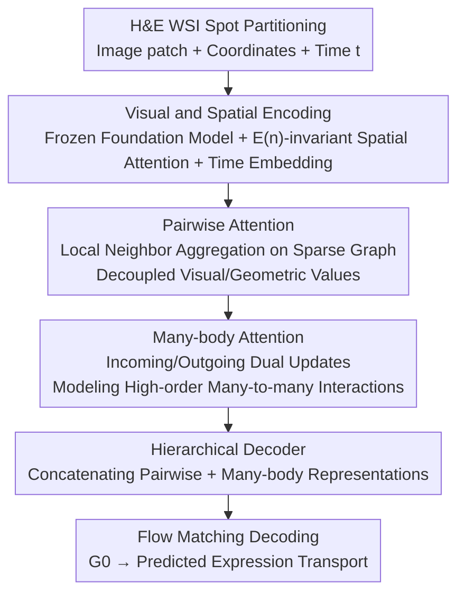

# Predicting Spatial Transcriptomics from Histology Images via High-Order Multi-Cell Interaction Modeling

**Conference**: CVPR 2026  
**Paper**: [CVF Open Access](https://openaccess.thecvf.com/content/CVPR2026/html/Sun_Predicting_Spatial_Transcriptomics_from_Histology_Images_via_High-Order_Multi-Cell_Interaction_CVPR_2026_paper.html)  
**Code**: None (Not provided in the original paper)  
**Area**: Computational Biology / Spatial Transcriptomics / Pathological Imaging  
**Keywords**: Spatial Transcriptomics, Multi-cell Interaction, Many-body Attention, Flow Matching, Gene Expression Prediction

## TL;DR
Addressing the limitation that existing methods for predicting spatial gene expression from H&E images only model single spots or pairwise neighbors—failing to capture many-to-many synergistic/antagonistic effects among multiple cells—MCToGene proposes **many-body attention** to explicitly model high-order cross-cell interactions. By utilizing a **hierarchical coupling module** to link pairwise and many-body attention, it controls combinatorial explosion, achieving an approximately 7.85% improvement over the strongest baselines on HEST-1k and STImage-1K4M.

## Background & Motivation

**Background**: Spatial Transcriptomics (ST) quantifies gene expression while preserving tissue spatial structure, revealing cell-cell communication and microenvironmental organization. However, ST acquisition is costly, low-throughput, and requires specialized equipment, whereas H&E-stained Whole Slide Images (WSI) are inexpensive and readily available. Consequently, "inferring spatial gene expression from WSI" has become a popular direction: partitioning tissue into spots (image patches with coordinates) and predicting the gene expression profile for each spot.

**Limitations of Prior Work**: Existing methods fall into two categories. **Spot-based** approaches (e.g., STNet, UNI) independently encode each local patch for regression, treating spots as conditionally independent and severely underestimating spatial dependencies. **Slide-based** approaches (e.g., HisToGene, TRIPLEX, STFlow) aggregate broader contexts but mostly rely on **pairwise message passing** or attention only over nearest neighbors. By stacking depth to approximate high-order effects, they still fail to capture explicit many-to-many multi-cell dependencies.

**Key Challenge**: In real tissue microenvironments, a cell's expression is **jointly** regulated by **multiple** neighboring cells, involving synergistic and antagonistic many-body effects. However, naively extending pairwise mechanisms to high-order leads to combinatorial explosion—the number of edges and attention tokens increases super-linearly with the interaction order $k$. Global many-body attention is computationally prohibitive and memory-intensive at the WSI scale. Thus, achieving both many-body expressivity and computational feasibility is a significant challenge.

**Goal**: Design a high-order multi-cell interaction framework that retains the expressivity of many-body modeling while remaining feasible (controlling computation and memory) at the WSI scale.

**Key Insight**: Construct a sparse spatial graph using distance priors to apply many-body attention only to selected neighbor sets. Then, use hierarchical coupling to sequence "pairwise filtering" and "many-body aggregation," avoiding global many-body attention across all spots.

**Core Idea**: Treat many-to-many cross-cell dependencies as first-class citizens using many-body attention, coupled with a pairwise $\to$ many-body hierarchical structure to control combinatorial costs, all within a flow matching generative framework to smoothly generate expression from noise.

## Method

### Overall Architecture
MCToGene models ST prediction as a **flow matching generation** problem. While tissue is a static snapshot, underlying cellular states change smoothly in space. Thus, the model learns a continuous probability flow to smoothly transport a simple base distribution (a sparse prior $G_0$ sampled from a Zero-Inflated Negative Binomial distribution, ZINB) to the target gene expression $G_1$. Given spot coordinates $C$ and image patches $I$, the model learns a time-dependent velocity field $f_\theta$ by optimizing the standard flow matching objective $\min_\theta \mathbb{E}\|f_\theta(G_t,I,C,t)-G_1\|^2$, with the intermediate state $G_t=(1-t)G_0+tG_1$. The workflow is: image patches are processed by a frozen pathology foundation model (UNI) to obtain visual features; coordinates are processed via E(n)-invariant spatial attention encoding and injected with sinusoidal time embeddings. Then, on a sparse spatial graph, it **first** uses pairwise attention to aggregate local neighbors and Readout to summarize local context, **followed** by many-body attention to model triplet/high-order interactions. Finally, a hierarchical decoder concatenates pairwise and many-body representations to decode gene expression for each spot. Training uses ground truth $G$ to learn trajectories and vector fields, while inference iteratively transports from $G_0$ to the target given only $C$ and $I$.

### Key Designs

**1. Flow Matching Framework: Expression Prediction as Smooth Transport**

The limitation is that ST samples only a single time point, but underlying cell states vary continuously in space; direct regression often loses this smooth structure. MCToGene adopts flow matching—learning a velocity field to transport the base distribution to the expression distribution. The base distribution $G_0$ is sampled from a ZINB distribution to reflect the sparsity of gene expression, while $G_1$ is the ground truth. The intermediate state is linearly interpolated as $G_t=(1-t)G_0+tG_1$. During training, the model learns the probability path and vector field. During inference, $t$ is fixed at 0, and the model iteratively transports from $G_0$ to the target. Combined with time-conditional embeddings (sinusoidal frequencies $\omega_k$ in Eq. 5–8), the model shifts its focus at different noise stages: early stages stabilize direction using global semantics, middle stages shift to relational/structural details for spatial consistency, and late stages extract fine-grained cues for high-quality synthesis.

**2. Pairwise Attention: Decoupling Visual and Geometric Values**

Accurate pairwise dependency modeling is the foundation for high-order interactions. MCToGene uses an MLP-enhanced pairwise attention: image features are projected into query $Z_{Q,i}$ and key $Z_{K,j}$. The attention weight is calculated as $A_{ij}=\text{Softmax}_i(\text{MLP}(Z_{Q,i}\|Z_{K,j}\|C_{i\to j}\|\Delta Y_{t,ij}))$, where $C_{i\to j}$ encodes relative spatial relationships and $\Delta Y_{t,ij}=Y_{t,i}-Y_{t,j}$ is the expression difference at time $t$. A key innovation is **decoupling** the value into a visual component $V_{\text{image}}$ and a geometric component $V_{\text{spatial}}$, allowing selective fusion: $Z^{\text{pair}}_i=\text{MLP}(\sum_{j\in N(i)}A_{ij}Z_{V,j}\|\sum_{j\in N(i)}A_{ij}C_{i\to j})+p_i$. Compared to standard attention, this decoupling more precisely balances visual semantics and geometric context.

**3. Many-body Attention: Explicit Many-to-Many Interaction via Bilateral Updates**

This is the core of the paper. Pairwise attention only describes direct spot-to-spot dependencies and cannot express high-order relations like "how multiple neighbors **jointly** regulate a target." Many-body attention takes pairwise outputs $Z^{\text{pair}}$ as input, first using a Readout to pool local neighborhoods into community contexts, then lifting pairwise features to triplet-level interactions. It uses two symmetric paths: **Incoming Update** associates node pair $(i,j)$ with all other nodes $k$, $o^{\text{in}}_{ij}=\sum_k a^{\text{in}}_{ijk}v^{\text{in}}_{jk}$, where the attention weight $a^{\text{in}}_{ijk}$ includes a bias $b^{\text{in}}_{ik}$ and gating $g^{\text{in}}_{ik}$ derived from the third relation $e_{ik}$ to introduce structural priors and non-linear modulation. **Outgoing Update** follows the reverse direction, associating $(i,j)$ with $(i,k)$ to enforce relational symmetry. Multi-head inner/outer outputs are concatenated and projected into many-body representations $Z^{\text{many}}_i=\text{MLP}(\frac{1}{|N(i)|}\sum_{j\in N(i)}(o^{\text{in}}_{ij}\|o^{\text{out}}_{ij}))$. This dual update allows the network to learn bi-directional multi-cell dependencies, matching the nature of synergistic/competitive biological structures.

**4. Hierarchical Coupling and Decoder: Pairwise Filtering + Many-body Aggregation**

Naively extending pairwise mechanisms to high-order increases the number of edges and tokens super-linearly with $k$, which is computationally unfeasible at the WSI scale. The hierarchical module divides the labor: pairwise attention first performs local "filtering" on a sparse graph, narrowing the scope before many-body attention performs many-to-many "aggregation." This significantly reduces computation and memory while retaining high-order expressivity. The decoder uses lightweight MLPs to align channel dimensions $\tilde Z^{\text{pair}}=\text{MLP}(Z^{\text{pair}})$ and $\tilde Z^{\text{many}}=\text{MLP}(Z^{\text{many}})$, then concatenates them to decode expression: $Y'=\text{Decoder}(\tilde Z^{\text{pair}}\|\tilde Z^{\text{many}})$. This hierarchical coupling is key to MCToGene's scalability and accuracy on high-resolution WSIs.

### Loss & Training
Training uses the standard flow matching objective $\min_\theta \mathbb{E}_{t,G_0,G_1}\|f_\theta(G_t,I,C,t)-G_1\|^2$, with $t\sim U[0,1]$ and linear interpolation for intermediate states. $G_0$ is sampled from a ZINB prior to match expression sparsity. The image encoder uses a frozen foundation model (UNI), and spatial encoding follows STFlow’s E(n)-invariant attention to resist batch effects like rotation, translation, and reflection. All experiments are run with three random seeds, reporting mean ± standard deviation.

## Key Experimental Results

Evaluations are performed on two tasks: gene expression prediction and biomarker prediction. Datasets include HEST-1k (10 official benchmarks, patient-level stratified, k-fold cross-validation) and STImage-1K4M (selected cancer types by organ, slide/patient split 8:1:1, no cross-slide/cross-patient overlap). Metric: Pearson Correlation Coefficient (PCC) between predicted and measured expression for the top-50 highly variable genes per spot, averaged across genes then across spots.

### Main Results

Gene Expression Prediction (PCC, selected cancers + average, best in bold):

| Dataset/Cancer | BLEEP | TRIPLEX | STFlow | MCToGene |
|---|---|---|---|---|
| HEST·COAD | 0.303 | 0.319 | 0.326 | **0.410** |
| HEST·LUNG | 0.588 | 0.601 | 0.610 | **0.636** |
| HEST·Average | 0.368 | 0.395 | 0.415 | **0.435** |
| STImage·Prostate | 0.167 | 0.148 | 0.210 | **0.283** |
| STImage·Average | 0.232 | 0.252 | 0.293 | **0.316** |

MCToGene achieves relative improvements of approximately 4.82% and 7.85% over the strongest baselines across the two datasets. Gains are particularly significant in difficult cancers with dense spots (e.g., COAD, >4000 spots, 0.326 $\to$ 0.410, +25.8%), validating that "explicit multi-cell modeling is more effective under high spatial complexity." In contrast, global all-to-all attention (GigaPath-slide) frequently encounters OOM errors on large slides, confirming that scalability is a critical issue.

Biomarker Prediction (Average correlation for 4 markers):

| Model | GATA3 | ERBB2 | UBE2C | VWF | Average |
|---|---|---|---|---|---|
| TRIPLEX | 0.853 | 0.832 | 0.749 | 0.612 | 0.762 |
| STFlow | 0.860 | 0.844 | 0.772 | 0.666 | 0.786 |
| MCToGene | **0.871** | **0.867** | **0.793** | **0.692** | **0.806** |

### Ablation Study

Component Ablation (PCC for parts of HEST) and Overhead Comparison:

| Configuration | SKCM | READ | HCC | LUNG | LYMPH | Description |
|---|---|---|---|---|---|---|
| Pair only | 0.697 | 0.240 | 0.116 | 0.608 | 0.302 | Pairwise attention only |
| MB only | 0.678 | 0.253 | 0.123 | 0.624 | 0.302 | Many-body attention only |
| Pair+MB, w/o coupled | 0.703 | 0.240 | 0.120 | 0.617 | 0.303 | Dual paths without coupling |
| Pair+MB, hierarchical | **0.711** | **0.255** | **0.133** | **0.636** | **0.316** | Hierarchical coupling (Full) |

Regarding overhead: MCToGene (Pair only) uses ~6166 MB VRAM and 1.21 s/epoch, comparable to STFlow (6164 MB / 1.35 s), while TRIPLEX reaches 16368 MB / 9.13 s. Adding the many-body module increases VRAM to ~8071 MB, which remains far lower than global attention methods.

### Key Findings
- **Hierarchical coupling is the primary driver of gain**: Neither Pairwise nor MB alone outperforms their hierarchical coupling. Furthermore, "Pair+MB without coupling" is nearly equivalent to Pairwise only, indicating that the **organic sequencing** of pairwise filtering and many-body aggregation is crucial.
- **Denser spots yield higher gains**: Gains are larger in datasets with higher spot density (IDC/COAD), which corresponds to scenarios with rich high-order multi-cell synergy, proving the model captures real biological signals.
- **Scalability is a hard constraint**: Global all-to-all attention results in OOM on large slides, while MCToGene keeps VRAM at the same order of magnitude as pairwise methods via sparse graphs and hierarchical coupling, making many-body modeling feasible at WSI scales.

## Highlights & Insights
- **Treating "Multi-cell Many-to-Many" as a First-Class Citizen**: Explicitly modeling triplets and higher interactions using bilateral many-body attention, combined with structural priors via bias and gating from the third relation, represents a substantial upgrade over standard GNN/attention mechanisms limited to pairwise message passing. This approach is transferable to any graph modeling task requiring high-order relations.
- **Decoupled Value Insight**: Splitting the value in pairwise attention into visual and geometric components for independent aggregation allows for selective fusion of semantics and geometry—a low-cost trick for improving accuracy.
- **Flow Matching + ZINB Prior**: Using a ZINB base distribution to match gene expression sparsity and flow matching for smooth transport naturally introduces generative perspectives into ST prediction, which aligns better with data characteristics than pure regression.

## Limitations & Future Work
- Even on sparse graphs, many-body attention uses ~30% more VRAM than pure pairwise methods (8071 vs 6166 MB). Scalability for even higher-order interactions (quadruplet and above) is not fully explored.
- ⚠️ Specific formulas for many-body attention (query/key derivation for Incoming/Outgoing, gating terms) rely partly on diagrams; refer to the original text and Appendix for details.
- Dependence on a frozen foundation model (UNI) as the image encoder means performance is capped by its representation quality; sensitivity to stronger/weaker backbones is not systematically reported.
- Sparse graphs are constructed using distance priors; the impact of neighbor set selection (radius/kNN thresholds) on the coverage of high-order interactions warrants further analysis.

## Related Work & Insights
- **vs STFlow**: Both use flow matching and E(n)-invariant spatial encoding, but STFlow only performs pairwise interactions, underperforming in cancers with complex neighborhood structures. MCToGene provides significant gains in difficult cancers like COAD (average 0.415 $\to$ 0.435).
- **vs TRIPLEX**: TRIPLEX uses a multi-resolution encoder and feature fusion but remains within a local/pairwise paradigm with high memory costs (16368 MB). MCToGene achieves higher PCC and biomarker correlation with lower overhead.
- **vs scTensor / scHyper**: These works also model high-order cell communication (tensors/hypergraphs) but scHyper stems from non-spatial scRNA-seq, lacking spatial constraints. MCToGene integrates high-order modeling into spatial tissue contexts while controlling combinatorial explosion, making it more suitable for WSI-scale ST prediction.

## Rating
- Novelty: ⭐⭐⭐⭐ Explicitly introducing many-body attention and hierarchical coupling to ST prediction is clear and well-targeted, though high-order modeling has precedence in graph learning.
- Experimental Thoroughness: ⭐⭐⭐⭐⭐ Large datasets across multiple cancers, covering both gene expression and biomarker tasks, complete with ablation, overhead comparison, and visualization. Reports mean ± variance over three seeds.
- Writing Quality: ⭐⭐⭐⭐ Clear progression from motivation to method. The many-body attention section is dense and diagram-dependent, making it slightly challenging for a first read.
- Value: ⭐⭐⭐⭐ Inferring spatial expression from inexpensive H&E has strong application value. The many-body modeling and scalable design are practically meaningful for real WSI-scale deployment.

<!-- RELATED:START -->

## Related Papers

- [\[CVPR 2026\] From Spots to Pixels: Dense Spatial Gene Expression Prediction from Histology Images](from_spots_to_pixels_dense_spatial_gene_expression_prediction_from_histology_ima.md)
- [\[CVPR 2026\] HINGE: Adapting a Pre-trained Single-Cell Foundation Model to Spatial Gene Expression Generation from Histology Images](adapting_a_pre-trained_single-cell_foundation_model_to_spatial_gene_expression_g.md)
- [\[CVPR 2026\] Multi-View Hierarchical Alignment Learning for Spatial Transcriptomics](multi-view_hierarchical_alignment_learning_for_spatial_transcriptomics.md)
- [\[CVPR 2026\] HyperST: Hierarchical Hyperbolic Learning for Spatial Transcriptomics Prediction](hyperst_hierarchical_hyperbolic_learning_for_spatial_transcriptomics_prediction.md)
- [\[CVPR 2026\] FEAST: Fully Connected Expressive Attention for Spatial Transcriptomics](feast_fully_connected_expressive_attention_for_spatial_transcriptomics.md)

<!-- RELATED:END -->
