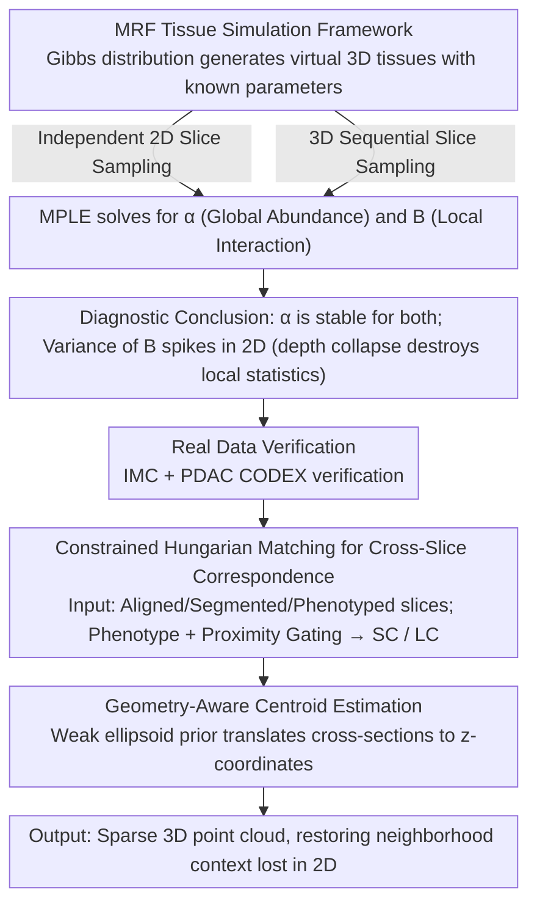

# Sampling-Aware 3D Spatial Analysis in Multiplexed Imaging

**Conference**: CVPR 2026  
**arXiv**: [2604.07890](https://arxiv.org/abs/2604.07890)  
**Code**: None  
**Area**: Computational Biology  
**Keywords**: Spatial Proteomics, 3D Reconstruction, Sampling Geometry, Multiplexed Imaging, Spatial Statistics

## TL;DR

This work systematically investigates the impact of sampling geometry (2D slices vs. 3D sequential slices) on the recovery accuracy of spatial statistics in multiplexed imaging. It proposes a geometry-aware sparse 3D reconstruction module to enable reliable depth-aware spatial analysis under limited imaging budgets.

## Background & Motivation

1. **Background**: Highly multiplexed microscopic imaging technologies (e.g., CODEX, IMC) allow for spatial analysis of dozens of molecular markers at single-cell resolution. However, most analyses still rely on 2D slices.
2. **Limitations of Prior Work**: Dense volumetric data acquisition is costly and technically challenging in spatial proteomics. In practice, researchers must choose between 2D slices (maximizing coverage) and 3D sequential slices (preserving some depth continuity) under a fixed imaging budget.
3. **Key Challenge**: 2D sampling leads to "depth collapse"—the loss of neighborhood context along the z-axis. This causes high variance in local spatial statistics (e.g., cell clustering and cell-cell interactions), while global statistics (e.g., cell type abundance) remain relatively stable. This discrepancy has not been systematically quantified before.
4. **Goal**: (1) Quantify the impact of sampling geometry on the recovery of global vs. local spatial statistics; (2) Design a lightweight reconstruction module to support sparse 3D analysis.
5. **Key Insight**: Drawing from visual sampling theory, the authors model spatial proteomics as a structured subsampling problem on a Markov Random Field (MRF).
6. **Core Idea**: Sampling geometry determines which spatial relationships are observable. Therefore, acquisition strategies should be selected based on the target statistics, and sparse 3D reconstruction should be used to compensate for the deficiencies of 2D sampling.

## Method

### Overall Architecture

This paper addresses two questions: Under a fixed imaging budget, what types of spatial information are lost in 2D slices vs. 3D sequential slices? And can the depth dimension be cost-effectively recovered when only sparse sequential slices are available? The logic chain consists of three components. The first is **controlled simulation experiments**: a virtual 3D tissue is generated using an MRF with known parameters, then "sliced" using different sampling geometries to observe which statistics are recovered or destroyed. The second is **real-world data validation**, re-examining the simulation findings on densely sampled IMC and PDAC CODEX data. The third is the **sparse 3D reconstruction module**: taking aligned, segmented, and phenotyped sequential slices as input, it produces a sparse 3D point cloud through cross-slice cell correspondence and geometric priors to restore the neighborhood context lost during 2D sampling.

### Key Designs

**1. MRF Tissue Simulation Framework: Isolating sampling geometry effects with virtual tissues.**

"Ground truth" parameters are unavailable for real tissues, making it impossible to determine if poor statistical recovery is due to sampling or other factors. Here, virtual tissues are created on a 3D lattice using a Gibbs distribution:

$$p(\mathbf{x}\mid\boldsymbol{\alpha}, \mathbf{B}) \propto \exp\Big(\sum_i \alpha_{x_i} + \sum_{(i,j)} B_{x_i, x_j}\Big),$$

where $\boldsymbol{\alpha}$ is the unary potential controlling the **global abundance** of each cell type, and $\mathbf{B}$ is the pairwise potential controlling **local interactions** between adjacent cells. After generation, the tissue is sampled via independent 2D slices and 3D sequential slices. Maximum Pseudo-Likelihood Estimation (MPLE) is then used to recover $\boldsymbol{\alpha}$ and $\mathbf{B}$ from the sampled data. Crucially, this setup explicitly separates "global" and "local" parameters, revealing their varying sensitivity to sampling geometry: experiments show $\boldsymbol{\alpha}$ is stable under both, while the error for $\mathbf{B}$ increases sharply under independent 2D sampling—providing quantitative evidence that "depth collapse destroys local statistics."

**2. Constrained Hungarian Matching for Cross-Slice Correspondence: Identifying the same cell across adjacent slices.**

Pixel-level registration for sparse sequential slices is neither feasible nor necessary; the goal is simply to know if "this point in the previous slice and that point in the next slice are the same cell." The method first calculates the in-plane Euclidean distance matrix $D_{ij}$ between cell centroids in adjacent slices, then applies two constraints to eliminate impossible pairings: (1) **Phenotypic consistency**, where distance is set to $\infty$ for cells of different types; and (2) **Cell-type-specific proximity gating**, which sets a maximum cross-slice displacement based on empirical size distributions. The constrained $D_{ij}$ is solved via the Hungarian algorithm for optimal one-to-one matching. Matched cells are labeled as Shared Cells (SC, appearing across slices), while unmatched ones are Isolated Cells (LC, appearing in a single slice). For example, a cell with an ~8 μm diameter is likely captured in two adjacent slices at 4 μm spacing (SC), while a small cell positioned between slices might appear only once (LC). This constraint-based approach is lightweight and robust against ambiguous matches in dense regions.

**3. Geometry-Aware Centroid Estimation: Translating matching into 3D coordinates using a weak ellipsoid prior.**

Identifying cell correspondences is insufficient for depth positioning; a shape hypothesis is needed to translate cross-sectional information into z-coordinates. Cells are approximated as ellipsoids, where the cross-sectional area decreases as the cutting plane moves away from the centroid. Size parameters for each cell type are estimated from empirical area distributions. These parameters serve two purposes: setting distance tolerances for Design 2 and regularizing depth inference. For SCs, multiple cross-sections provide multiple constraints to estimate the centroid's z-coordinate. For LCs, in-plane coordinates are kept, and depth is constrained to the interval adjacent to its slice. While the ellipsoid prior is simple, the goal is not precise volumetric reconstruction but restoring neighborhood-level spatial relationships. Experiments show a mean localization error of 2.99 μm at 4 μm spacing (approx. 37% of cell diameter), confirming that this "good enough" trade-off is effective.

### Loss & Training

The complete method contains no deep learning training: cross-slice correspondence is solved via combinatorial optimization (Hungarian algorithm); MRF parameters are optimized using MPLE with a $\lambda\,\|\mathbf{B}\|_F^2$ regularization term to suppress over-fitting of pairwise potentials.

## Key Experimental Results

### Main Results

The reconstruction module was validated on a densely sampled IMC dataset (2 μm spacing, Kuett et al.):

| Axial Spacing Δz | Unique Cell Coverage | Shared Cell Proportion | Mean Localization Error |
|-----------------|----------------------|-------------------------|--------------------------|
| 2 μm (Ref)      | 100%                 | High (Heavy Overlap)    | -                        |
| 4 μm            | 92.6%                | Moderate                | 2.99 μm (std 3.86)       |
| 6 μm            | Decreased            | Lower                   | Increased                |
| 10 μm           | Significantly Lower  | Very Low                | Significantly Increased  |

The localization error is much smaller than typical cell diameters (e.g., neutrophils ~8 μm), indicating that sparse reconstruction preserves neighborhood-level geometric relationships.

### Ablation Study

| Analysis Type               | 2D Sampling Risk                 | Recommended Strategy      |
|-----------------------------|----------------------------------|---------------------------|
| Abundance/Composition       | Low                              | 2D Slices (Max Coverage) |
| Rare Population Detection   | Moderate (Clustering dependent) | Hybrid Strategy           |
| Cell-Cell Interaction       | High (Depth collapse blurs nbhd)| Sparse Seq + Recon        |
| Spatial Clustering/M-environment | High                           | Sparse Seq + Recon        |
| Structure-level Analysis    | Extremely High (Fragmented)      | Sparse Seq + Recon        |

### Key Findings

- Global abundance is stably recovered under both independent 2D and sequential sampling, but interaction structures (neighborhood enrichment) show extreme variance under 2D sampling—slice selection within the same tissue volume can change whether an interaction is deemed "present."
- On the PDAC CODEX dataset, 2D distance measurements are systematically larger than 3D distances (e.g., duct-vessel and epithelium-neutrophil pairs), indicating bias in planar measurements due to ignoring out-of-plane neighbors.
- 4 μm spacing is a practical trade-off: it retains 92.6% of unique cells with a localization error only ~37% of the cell diameter.

## Highlights & Insights

- **Sampling Geometry-Statistic Matching Principle**: For the first time, this work systematically quantifies the rule that "global statistics are robust to sampling, while local statistics are sensitive." It distills this into a practical decision table to guide experimental design.
- **Lightweight Reconstruction Design**: Instead of dense volumetric reconstruction, it uses constrained matching + a weak shape prior to recover 3D point clouds from sparse slices. This "good enough" philosophy is transferable to other sparse sampling scenarios.
- **From Fragments to Connected Structures**: 3D reconstruction restores disconnected duct cross-sections from 2D into connected objects, enabling structure-level coordinate systems and gradient analysis along specific structures.

## Limitations & Future Work

- The reconstruction module relies on accurate slice alignment and reliable cell phenotyping; correspondence degrades in cases of extreme crowding or ambiguous phenotypes.
- The ellipsoid prior is overly simplified and cannot capture complex cell morphologies (e.g., long protrusions of dendritic cells).
- The propagation of reconstruction uncertainty to downstream spatial statistics has not been quantified.
- Potential improvements: Introduce learned correspondence models to replace Hungarian matching; integrate 3D-aware cell phenotyping; jointly optimize reconstruction and statistical estimation.

## Related Work & Insights

- **vs. Kuett et al. (Dense 3D IMC)**: They demonstrated the biological value of dense 3D reconstruction but assumed expensive acquisition conditions. This work focuses on sampling-constrained settings and provides diagnostic tools for when 3D is necessary.
- **vs. CODA (End-to-end Reconstruction Pipeline)**: CODA performs full-process dense reconstruction. This work's modular design handles only cross-slice correspondence, making it more lightweight and compatible with existing preprocessing tools.
- The sampling analysis framework presented here can inspire other "sampling-constrained spatial inference" problems, such as sparse observation fusion in remote sensing.

## Rating

- Novelty: ⭐⭐⭐⭐ Systematically formalizing the impact of sampling geometry on spatial statistics as an MRF subsampling problem is a unique perspective.
- Experimental Thoroughness: ⭐⭐⭐⭐ Solid quantitative analysis across three levels: simulation, real IMC, and CODEX.
- Writing Quality: ⭐⭐⭐⭐⭐ Clear logic chain, well-designed figures, and a practical decision table.
- Value: ⭐⭐⭐⭐ Highly relevant for experimental design in spatial proteomics, though the target audience is specialized.

<!-- RELATED:START -->

## Related Papers

- [\[AAAI 2026\] Apo2Mol: 3D Molecule Generation via Dynamic Pocket-Aware Diffusion Models](../../AAAI2026/computational_biology/apo2mol_3d_molecule_generation_via_dynamic_pocket-aware_diff.md)
- [\[CVPR 2026\] Advancing Cancer Prognosis with Hierarchical Fusion of Genomic, Proteomic and Pathology Imaging Data from a Systems Biology Perspective](advancing_cancer_prognosis_with_hierarchical_fusion_of_genomic_proteomic_and_pat.md)
- [\[CVPR 2026\] FEAST: Fully Connected Expressive Attention for Spatial Transcriptomics](feast_fully_connected_expressive_attention_for_spatial_transcriptomics.md)
- [\[CVPR 2026\] HyperST: Hierarchical Hyperbolic Learning for Spatial Transcriptomics Prediction](hyperst_hierarchical_hyperbolic_learning_for_spatial_transcriptomics_prediction.md)
- [\[ICLR 2026\] Thompson Sampling via Fine-Tuning of LLMs](../../ICLR2026/computational_biology/thompson_sampling_via_fine-tuning_of_llms.md)

<!-- RELATED:END -->
