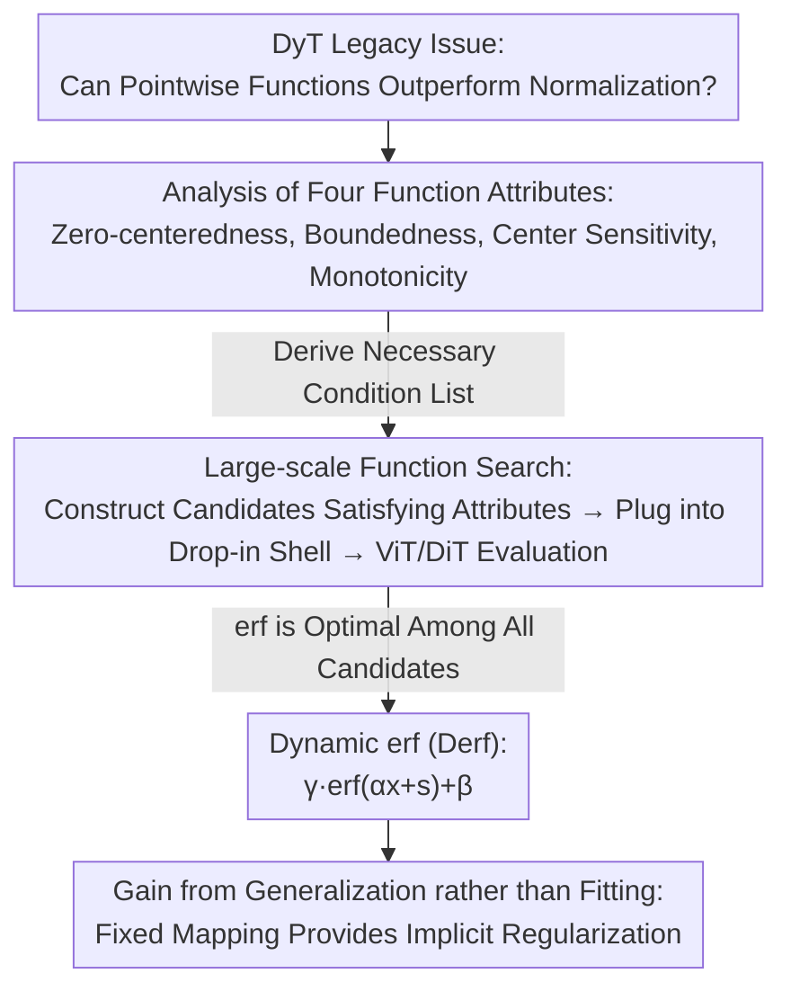

# Stronger Normalization-Free Transformers

**Conference**: CVPR 2026  
**arXiv**: [2512.10938](https://arxiv.org/abs/2512.10938)  
**Code**: Yes (Link provided in paper)  
**Area**: Computational Biology
**Keywords**: Normalization-Free Transformer, Pointwise Function, Derf, Normalization Layer Replacement, Generalization

## TL;DR
Through a systematic analysis of four critical attributes (zero-centeredness, boundedness, center sensitivity, and monotonicity) required for pointwise functions to replace normalization layers, an exhaustive search identifies $\text{Derf}(x) = \text{erf}(\alpha x + s)$ as the optimal replacement. It consistently outperforms LayerNorm and DyT across multiple domains, including visual recognition, image generation, speech representation, and DNA sequence modeling, with performance gains primarily stemming from enhanced generalization rather than fitting capacity.

## Background & Motivation

1. **Background**: Normalization layers (BatchNorm, LayerNorm, RMSNorm) are core components of modern deep networks, stabilizing training and accelerating convergence by regulating intermediate activation distributions. Recently, Dynamic Tanh (DyT) proved that a pointwise function $\tanh(\alpha x)$ can serve as a drop-in replacement for normalization layers with comparable performance.

2. **Limitations of Prior Work**:
    - Normalization layers depend on activation statistics (mean, variance), introducing extra memory access and synchronization overheads.
    - Certain normalizations are sensitive to batch size, leading to unstable training under small batch settings.
    - While DyT successfully matched normalization layer performance, it failed to exceed it—it is widely accepted that "normalization-free $\approx$ with-normalization," but no one has yet proven "normalization-free $>$ with-normalization."

3. **Key Challenge**: DyT established the foundation for pointwise functions as normalization replacements, but what other functions in the design space might be better? Which functional attributes are critical? Can a pointwise function be found that outperforms normalization layers?

4. **Goal**
    - Systematically understand which attributes of pointwise functions affect training dynamics and final performance.
    - Search for the optimal design within a set of candidate functions.
    - Demonstrate that pointwise functions can not only replace normalization layers but also surpass them.

5. **Key Insight**: Start from the intrinsic attributes of functions (zero-centeredness, boundedness, center sensitivity, and monotonicity), isolate the impact of each attribute through controlled experiments, and use these principles to guide the function search.

6. **Core Idea**: An S-shaped pointwise function $\text{erf}(\alpha x + s)$ satisfying the four key attributes can not only replace normalization layers but also consistently outperform them through superior generalization capabilities.

## Method

### Overall Architecture
This paper addresses a question left by DyT: if the pointwise function $\tanh(\alpha x)$ can replace normalization layers, are there better functions in the design space, and which mathematical attributes are decisive? The work follows a "understand then search" approach—first identifying critical attributes of pointwise functions through controlled experiments, then performing a large-scale search among candidates satisfying these attributes, finally arriving at a specific solution termed Derf. All pointwise functions are unified into a drop-in form $y = \gamma \cdot f(\alpha x + s) + \beta$: removing dependencies on activation statistics (mean, variance) and retaining only two learnable scalars $\alpha$ and $s$ alongside affine parameters $\gamma$ and $\beta$, directly replacing pre-attention, pre-FFN, and the final normalization layer.

### Key Designs

**1. Analysis of Four Function Attributes: Defining requirements for normalization replacement**

While DyT chose $\tanh$ intuitively, the necessity of its specific shape remained unclear. This paper uses controlled experiments on ViT-Base to decompose the candidate function's shape into four attributes. **Zero-centeredness** requires outputs to be balanced around zero: introducing horizontal/vertical offsets $\lambda \ge 2$ causes training collapse. **Boundedness** relates to optimization stability: adding clipping to unbounded functions (e.g., arcsinh) consistently improves performance, while introducing linear terms into bounded functions degrades it. The logquad$(x)$ is identified as the fastest-growing function that still allows convergence. **Center sensitivity** implies responses near the origin must not be flat: larger flat regions (larger $\lambda$) result in worse performance, causing collapse at $\lambda \ge 3$ because most activations concentrate near zero. **Monotonicity** preserves the relative order of activations: monotonic functions train normally, whereas non-monotonic functions (hump-shaped or oscillating) suffer significant performance drops.

**2. Large-scale Function Search: Replacing intuition with systematic screening**

Many S-shaped functions appear similar but differ significantly in empirical performance. Starting from common scalar functions and CDFs (polynomial, rational, exponential, logarithmic, trigonometric, etc.), this paper constructs candidates satisfying the four attributes via transformations (translation, scaling, mirroring, rotation, clipping). These are evaluated using $y = \gamma \cdot f(\alpha x + s) + \beta$ in ViT-Base (Top-1 Acc), DiT-B/4, and DiT-L/4 (FID). Results show $\text{erf}(x)$ is optimal across all candidates: ViT-B reaches 82.8% (vs. 82.3% for LayerNorm), and DiT-L/4 FID drops to 43.94 (vs. 45.91 for LayerNorm).

**3. Dynamic erf (Derf): The optimal function**

The search winner, $\text{erf}(x)$, naturally satisfies all four attributes—zero-centered, bounded in $[-1, 1]$, maximally sensitive at the origin, and strictly monotonically increasing. It is formulated as:

$$\text{Derf}(x) = \gamma \cdot \text{erf}(\alpha x + s) + \beta, \qquad \text{erf}(x) = \frac{2}{\sqrt{\pi}} \int_0^x e^{-t^2}\, dt$$

where $\alpha$ is initialized to 0.5, $s$ to 0, $\gamma$ to 1, and $\beta$ to 0. Notably, $s$ is a scalar rather than a per-channel vector, as experiments showed no additional gain from vectorization. Compared to the exponential saturation of $\tanh$, $\text{erf}$ (as a Gaussian CDF) has a smoother transition near the origin, likely benefiting gradient propagation.

**4. Gains from Generalization rather than Fitting: Explaining Derf's superiority**

Counter-intuitively, evaluating training loss on trained models shows a stable ranking across models and scales: Norm $<$ Derf $<$ DyT. This indicates that Derf actually has weaker fitting capacity than normalization layers but achieves better test performance. This is attributed to implicit regularization: normalization layers utilize activation statistics for adaptation, which provides high expressivity but increases overfitting risks; pointwise functions are fixed mappings with only two learnable scalar parameters ($\alpha, s$), deliberately constraining adaptation and thereby limiting overfitting in favor of stronger generalization.

## Key Experimental Results

### Main Results

| Model/Task | LayerNorm | DyT | Derf | Gain |
|-----------|-----------|-----|------|-----|
| ViT-B (ImageNet Acc↑) | 82.3% | 82.5% | **82.8%** | +0.5% |
| ViT-L (ImageNet Acc↑) | 83.1% | 83.6% | **83.8%** | +0.7% |
| DiT-B/4 (FID↓) | 64.93 | 63.94 | **63.23** | -1.70 |
| DiT-L/4 (FID↓) | 45.91 | 45.66 | **43.94** | -1.97 |
| DiT-XL/2 (FID↓) | 19.94 | 20.83 | **18.92** | -1.02 |
| wav2vec 2.0 Base (Loss↓) | 1.95 | 1.95 | **1.93** | -0.02 |
| wav2vec 2.0 Large (Loss↓) | 1.92 | 1.91 | **1.90** | -0.02 |
| HyenaDNA (Acc↑) | 85.2% | 85.2% | **85.7%** | +0.5% |
| Caduceus (Acc↑) | 86.9% | 86.9% | **87.3%** | +0.4% |
| GPT-2 (Loss↓) | 2.94 | 2.97 | **2.94** | 0.00 |

### Ablation Study - Function Search Results

| Function | ViT-B Acc↑ | DiT-L/4 FID↓ |
|------|-----------|-------------|
| erf(x) **[Derf]** | **82.8%** | **43.94** |
| tanh(x) [DyT] | 82.6% | 45.48 |
| satursin(x) | 82.6% | 44.83 |
| arctan(x) | 82.4% | 46.62 |
| isru(x) | 82.3% | 45.93 |
| linearclip(x) | 82.3% | 45.49 |
| LayerNorm | 82.3% | 45.91 |

### Ablation Study - Effect of Learnable Shift s

| Function | Without s | With s | Notes |
|------|-----|-----|------|
| erf(x) | 82.6% | 82.8% | s contributes +0.2% |
| tanh(x) | 82.5% | 82.6% | s contributes +0.1% |
| isru(x) | 82.2% | 82.3% | s contributes +0.1% |

### Key Findings
- **Derf consistently outperforms LayerNorm and DyT across domains**: Best performance achieved in ViT, DiT, wav2vec, and DNA models; GPT-2 performance matches LN (while beating DyT).
- **erf exceeds tanh beyond the effect of shift s**: erf without $s$ (82.6%) still outperforms tanh with $s$ (82.6%), with more pronounced gaps in DiT (63.39 vs 63.94).
- **Gains derive from generalization, not fitting**: Derf's higher training loss paired with superior test performance indicates that the simplicity of pointwise functions acts as an implicit regularizer.
- **Boundedness and center sensitivity are the most critical attributes**: Violating boundedness can cause training collapse, while violating center sensitivity leads to catastrophic performance drops.

## Highlights & Insights
- **Leap from "Replaceable" to "Superior"**: While DyT proved pointwise functions $\approx$ normalization layers, Derf proves pointwise functions $>$ normalization layers, marking a significant step in normalization-free Transformer research and suggesting normalization may not be the optimal activation regulator.
- **Reusable design principles**: The four-attribute analysis provides a clear necessary-condition checklist for designing future pointwise alternatives.
- **Implicit regularization insight**: The causal chain of "fixed mapping (independent of statistics) $\rightarrow$ constrained adaptation $\rightarrow$ reduced overfitting $\rightarrow$ better generalization" explains why "weaker fitting = better performance," aligning with classical regularization concepts like dropout.

## Limitations & Future Work
- Superiority of Derf in large-scale LLMs (e.g., GPT-3 scale) remains to be verified, as it only matched LN on GPT-2.
- Experiments focused on training from scratch; migration strategies for pretrained models (fine-tuning vs. retraining) were not discussed.
- Function search relied on manual candidate construction; automated discovery via NAS or meta-learning could be explored.
- Numerical stability of Derf in mixed-precision training (FP16/BF16) requires further investigation.
- The engineering incentive for switching remains a consideration given the modest absolute gains (e.g., +0.5% on ViT-B).

## Related Work & Insights
- **vs. DyT (Dynamic Tanh)**: Derf outperforms DyT across tasks due to the mathematical properties of the Gaussian CDF in erf(x) being better suited for activation regulation than tanh's exponential saturation.
- **vs. LayerNorm**: Derf achieves better generalization despite weaker fitting, suggesting statistic-based adaptation in normalization layers may lead to slight overfitting.
- **vs. RMSNorm**: Derf's +0.4% gain over Caduceus (which uses RMSNorm) indicates that its advantages are not limited to replacing LN.

## Rating
- Novelty: ⭐⭐⭐⭐ Systematic four-attribute analysis with well-supported erf selection.
- Experimental Thoroughness: ⭐⭐⭐⭐⭐ Extensive validation across vision, speech, DNA, and language domains.
- Writing Quality: ⭐⭐⭐⭐⭐ Clear logical flow from attribute analysis to final solution.
- Value: ⭐⭐⭐⭐ Proof of pointwise superiority is a significant signal; Derf is a practical drop-in replacement.

<!-- RELATED:START -->

## Related Papers

- [\[ICML 2025\] Supercharging Graph Transformers with Advective Diffusion](../../ICML2025/computational_biology/supercharging_graph_transformers_with_advective_diffusion.md)
- [\[NeurIPS 2025\] Generalizable Insights for Graph Transformers in Theory and Practice](../../NeurIPS2025/computational_biology/generalizable_insights_for_graph_transformers_in_theory_and_practice.md)
- [\[ICLR 2026\] Contact-Guided 3D Genome Structure Generation of E. coli via Diffusion Transformers](../../ICLR2026/computational_biology/contact-guided_3d_genome_structure_generation_of_e_coli_via_diffusion_transforme.md)
- [\[ICLR 2026\] ConfHit: Conformal Generative Design with Oracle Free Guarantees](../../ICLR2026/computational_biology/confhit_conformal_generative_design_with_oracle_free_guarantees.md)
- [\[ICML 2026\] CARD: Coarse-to-fine Autoregressive Modeling with Radix-based Decomposition for Transferable Free Energy Estimation](../../ICML2026/computational_biology/card_coarse-to-fine_autoregressive_modeling_with_radix-based_decomposition_for_t.md)

<!-- RELATED:END -->
