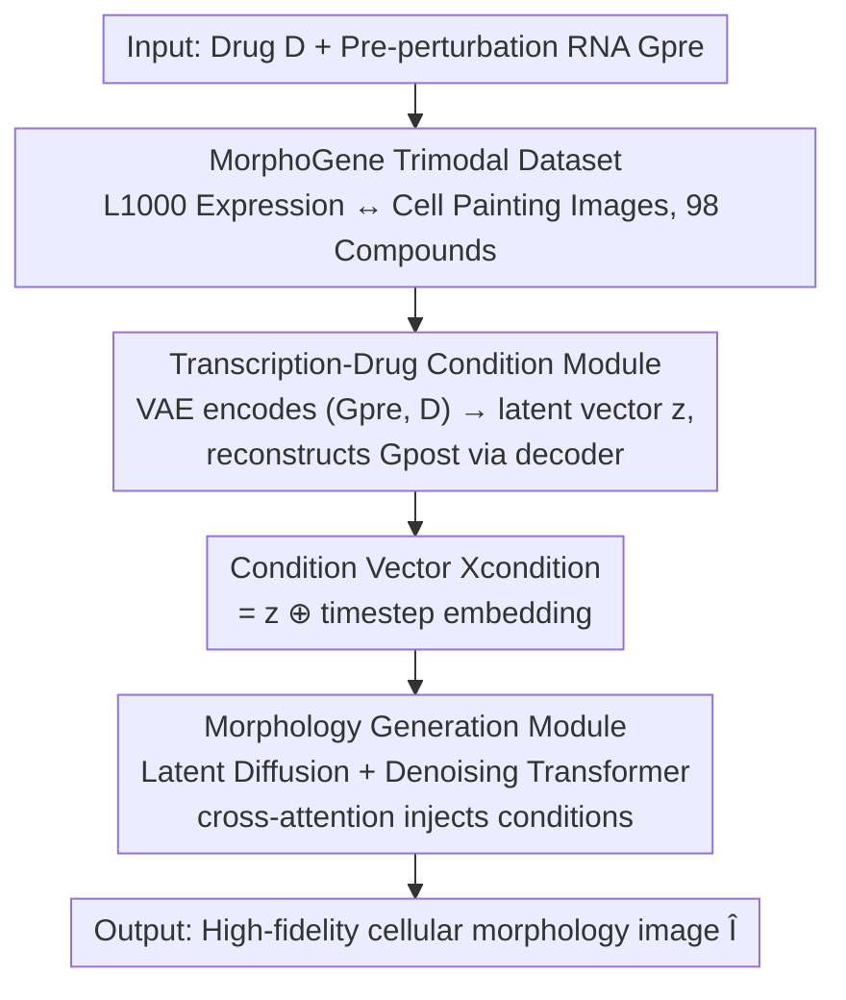

# TRIDENT: A Trimodal Cascade Generative Framework for Drug and RNA-Conditioned Cellular Morphology Synthesis

**Conference**: CVPR 2026  
**Paper**: [CVF Open Access](https://openaccess.thecvf.com/content/CVPR2026/html/Peng_TRIDENT_A_Trimodal_Cascade_Generative_Framework_for_Drug_and_RNA-Conditioned_CVPR_2026_paper.html)  
**Code**: None  
**Area**: Computational Biology / Diffusion Models  
**Keywords**: AI Virtual Cell, Cellular Morphology Synthesis, Latent Diffusion, Transcriptome-Phenotype Mapping, Conditional Generation

## TL;DR
TRIDENT proposes a cascade framework of "VAE encoding (drug + pre-perturbed RNA) $\rightarrow$ latent condition $z$ $\rightarrow$ Diffusion Transformer cellular morphology generation," explicitly modeling the causal chain of "RNA $\rightarrow$ morphology" for the first time. On the custom MorphoGene trimodal dataset, it reduces FID by 5–7 times compared to the SOTA, and generalizes to unseen compounds.

## Background & Motivation
**Background**: Building AI Virtual Cells (AIVC) requires characterizing the complete causal trace: "perturbation (drug/gene) $\rightarrow$ transcriptional response (RNA) $\rightarrow$ phenotypic change (cellular morphology)." Two high-throughput technologies, L1000 transcriptional profiling and Cell Painting morphological imaging, have led to various predictive models for "perturbation $\rightarrow$ RNA" and "perturbation $\rightarrow$ morphology" respectively. Diffusion models and VAEs have also shown potential in biological image synthesis and RNA reconstruction.

**Limitations of Prior Work**: Existing methods almost exclusively model **direct associations**—either Perturbation $\rightarrow$ RNA (such as GEARS, chemCPA, STATE, scGen) or Perturbation $\rightarrow$ Morphology (such as MorphDiff, MorphoDiff, IMPA, Mol2Image). They **bypass the intermediate molecular states** and treat "how transcriptional changes orchestrate morphological alterations" as a black box, completely **ignoring the key causal chain of RNA $\rightarrow$ Morphology**.

**Key Challenge**: The true biological mechanism of a cell is that "molecular events (RNA) mechanistically drive phenotypic outcomes (morphology)." Mapping perturbations directly to morphology is equivalent to skipping the intermediate causal variables that drive the phenotype. Without this link, models are neither interpretable nor capable of simulating virtual cells as an integrated system driven by molecular events.

**Goal**: To learn the conditional probability $p(I \mid G_{pre}, D)$—synthesizing high-fidelity cellular morphology images $I$ given a drug perturbation $D$ and pre-perturbation gene expression $G_{pre}$, while explicitly guiding the generation process through the "predicted post-perturbation transcriptome."

**Key Insight**: Instead of forcing the perturbation to jump directly to morphology, it is better to compress (drug + pre-perturbed RNA) into a **latent vector $z$ that predicts the post-perturbation transcriptome $G_{post}$**, and then use $z$ as a condition to guide image diffusion. In this way, $z$ naturally carries molecular-level causal information, forcing the image generation to align with the "correct transcriptional program."

**Core Idea**: Using a VAE to encode "(drug + RNA)" into a condition $z$ capable of reconstructing the post-perturbed transcriptome, and subsequently using $z$ to condition a latent diffusion Transformer to synthesize morphology—explicitly incorporating the neglected mapping of "transcriptome $\rightarrow$ phenotype" into the generative pipeline.

## Method

### Overall Architecture
TRIDENT is a **two-stage cascade** generative framework. The first stage is the **Transcription-Drug Condition Module**: a VAE encodes the pre-perturbation gene expression $G_{pre}$ and drug molecular representation $D$ (such as SMILES) into a latent conditional vector $z$, and uses $z$ to **reconstruct the post-perturbation gene expression** $G_{post}$, thereby forcing $z$ to encode real molecular causal information. The second stage is the **Morphology Generation Module**: running latent diffusion within a latent space compressed by a pre-trained image VAE, where the denoising Transformer repeatedly injects the conditional vector $X_{condition}$ (formed by adding $z$ to the timestep embedding) via **cross-attention** to progressively reconstruct the noise into a latent representation of cellular morphology, which is then restored to a 512×512 RGB image by an image decoder. The entire pipeline is trained end-to-end, taking (drug $D$, pre-perturbation RNA $G_{pre}$) as input and outputting a cellular morphology image after drug treatment.

### Key Designs

**1. MorphoGene Trimodal Paired Dataset: Creating a trainable correspondence for "RNA $\rightarrow$ Morphology"**

To explicitly learn "transcriptome $\rightarrow$ phenotype", the prerequisite is to have paired data that links RNA and morphology, whereas previously these two data streams were split. The authors use 98 small molecule drugs as a "bridge" to align Cell Painting morphology images from BBBC021 (MCF7 breast cancer cell line) with L1000 transcriptional profiles. On the morphology side, the DAPI (blue), tubulin (green), and actin (red) channels are merged into RGB and cropped to 512×512. On the transcription side, all L1000 profiles corresponding to each compound are **averaged into a representative vector**. Each compound's images are augmented to 1,000, yielding 98 × 1,000 = 98,000 trimodal samples (drug $D$, image $I$, pre/post-perturbation expression $G_{pre}, G_{post}$). To evaluate generalization, the authors split the 98 compounds into two groups: **44 compounds** present in both databases are split 8:2 into training + in-distribution (ID) test sets; **the remaining 54 compounds** are completely held out for out-of-distribution (OOD) testing to specifically assess extrapolation to unseen compounds. This dataset itself is one of the core contributions of the paper—without it, the supervised signal for RNA $\rightarrow$ morphology would be absent.

**2. Transcription-Drug Condition Module: Forcing latent vector $z$ to carry molecular causal information by predicting $G_{post}$**

If the drug and RNA are merely concatenated as conditions, there is no guarantee that this condition truly encodes "what molecular changes will be caused by the perturbation." This module is designed as a VAE: RNA and drug are first projected into embeddings $X_{rna}=E_{rna}(G_{pre})$ and $X_{drug}=E_{drug}(D)$ by their respective encoders, then concatenated and fed into the perturbation encoder $E_{perturb}$ to parameterize the posterior Gaussian $q_\phi(z \mid G_{pre}, D)$:

$$[\mu_z, \log \sigma_z^2] = E_{perturb}([X_{rna}, X_{drug}])$$

Then, the reparameterization trick is used to sample $z = \mu_z + \sigma_z \odot \epsilon_z$. The key lies in the **regularization constraint**: the decoder $D_{perturb}$ is required to predict the **post-perturbation** gene expression $G_{post}$ (also modeled as Gaussian) from $z$. The entire module is trained using ELBO:

$$L_{VAE} = \mathbb{E}_{q_\phi(z|G_{pre},D)}[-\log p_\psi(G_{post}|z)] + D_{KL}(q_\phi(z|G_{pre},D)\,\|\,p(z))$$

where the prior is $p(z)=\mathcal{N}(0,I)$. This "reconstruct $G_{post}$" objective is the soul of the design: it forces $z$ to become a **compact representation capable of predicting the post-perturbed molecular state**, squeezing the causal chain of initial state, perturbation, and molecular outcome into a single vector. In experiments, the Pearson correlation between the predicted and ground-truth transcriptome reached 0.957, proving that this constraint indeed enables $z$ to learn biologically correct transcriptional programs, rather than just an auxiliary encoding of the image.

**3. Morphology Generation Module: Repeatedly "injecting" molecular conditions into diffusion denoising via cross-attention**

With the causality-rich $z$ obtained, it must guide high-resolution image synthesis. The authors perform latent diffusion (LDM) within the latent space compressed by a pre-trained image VAE: the forward process progressively adds noise to the initial image latent code $X^0_{image}$ according to a variance schedule $\{\beta_t\}$, which can be sampled in closed form as $X^t_{image} = \sqrt{\bar\alpha_t}X^0_{image} + \sqrt{1-\bar\alpha_t}\,\epsilon$; the denoising Transformer $f_\theta$ learns to predict the added noise $\epsilon$. Condition injection is the core mechanism here—the condition vector $X_{condition}$ is obtained by **element-wise addition** of $z$ and the timestep embedding $X_{time}$, and then the denoising Transformer's **N stacked blocks feed it in at every layer using cross-attention**: the image representation provides the query $Q$, while $X_{condition}$ provides the key $K$ and value $V$. This design of "repeatedly applying cross-attention throughout the entire depth of the network" is critical to forcing the model to learn the complex association between "RNA-drug conditions $\leftrightarrow$ morphological features"—the condition is not just injected once at the input, but realigned at every layer. The training objective is simulated as a simplified L2 loss:

$$L_{LDM} = \mathbb{E}_{t,X^0_{image},\epsilon,z}\big[\|\epsilon - f_\theta(\hat{X}^t_{image}, X_{condition})\|^2\big]$$

### Loss & Training
The two modules are jointly optimized end-to-end to minimize the sum $L_{TRIDENT} = L_{VAE} + L_{LDM}$. This training simultaneously ensures that $z$ can predict the molecular outcome $G_{post}$ and is effective in guiding image synthesis. During inference, starting from the prior $\hat{X}^T_{image} \sim \mathcal{N}(0,I)$, $z$ is first calculated by the condition module, and then denoised iteratively for $t=T,\dots,1$:

$$\hat{X}^{t-1}_{image} = \frac{1}{\sqrt{\alpha_t}}\Big(\hat{X}^t_{image} - \frac{\beta_t}{\sqrt{1-\bar\alpha_t}}f_\theta(\hat{X}^t_{image}, X_{condition})\Big) + \sigma_t \epsilon'$$

Finally, the image decoder $D_{image}$ restores it to a morphological image. All models are trained for 10,000 steps on MorphoGene.

## Key Experimental Results

### Main Results
Evaluation metrics are FID, KID, and IS (for this task, **the lower, the better**—a lower IS indicates that the model stably generates a specific restricted phenotype for a given condition, rather than diverging into an overly broad morphological distribution). MorphoDiff and a fine-tuned unconditional Stable Diffusion are compared.

| Test Set | Metric | TRIDENT | MorphoDiff | Stable Diffusion |
|--------|------|---------|------------|------------------|
| ID | FID↓ | **49.770** | 250.290 | 354.576 |
| ID | KID↓ | **0.013** | 0.248 | 0.378 |
| ID | IS↓ | **2.240** | 2.614 | 2.792 |
| OOD | FID↓ | **126.150** | 387.135 | 393.129 |
| OOD | KID↓ | **0.222** | 0.436 | 0.543 |
| OOD | IS↓ | **2.523** | 2.747 | 2.932 |

On ID, the FID compared to the baseline improved by 5–7 times (49.8 vs 250 / 355), and on OOD, it remained more than 3 times better than SOTA for unseen compounds (126 vs 387 / 393). Qualitatively, TRIDENT replicates drug-specific phenotypes (e.g., the low cell density of cytochalasin b), whereas both baselines collapse to a generic high-density monolayer, indicating that they fail to learn conditional guidance.

### Ablation Study

| Configuration | ID FID↓ | ID KID↓ | OOD FID↓ | OOD KID↓ | Description |
|------|---------|---------|----------|----------|------|
| TRIDENT (Full) | **49.770** | **0.013** | **126.150** | **0.222** | Full Model |
| w/o RNA | 115.770 | 0.132 | 194.239 | 0.293 | RNA condition removed, drug only |

Removing the RNA condition causes the ID FID to spike from 49.8 to 115.8 (KID 0.013 $\rightarrow$ 0.132) and the OOD FID to rise from 126 to 194, proving that **RNA as an intermediate molecular state is indispensable for high-fidelity synthesis**, verifying the core hypothesis.

### Key Findings
- **RNA condition is the lifeblood of performance**: Ablation shows that removing RNA more than doubles ID FID and increases KID by about 10 times, making it the largest contributor of all designs and directly establishing the value of the "RNA $\rightarrow$ morphology" chain.
- **True biology is learned, not pixel fitting**: The predicted transcriptome has a Pearson correlation of 0.957 with the ground truth; functional enrichment analysis of docetaxel perfectly matches its known MOA (mitotic inhibition, pro-apoptotic)—downregulated genes are enriched in "cell growth regulation/DNA replication," and upregulated genes are enriched in "apoptotic signaling pathway," with the generated images indeed showing sparse cell populations (increased cell death).
- **Cross-modal consistency is verifiable**: After passing generated images through ViT embedding + LDA projection, they form clearly separable clusters by MOA (e.g., filamentous morphology of staurosporine vs. rounded, shrunken, and sparse phenotype of emetine); UMAP shows generated and real images are highly intertwined, co-occupying the same manifold; interpretable metrics from CellProfiler such as AreaOccupied also align with ground truth distributions.

## Highlights & Insights
- **"Predicting intermediate causal variables with conditions" is a transferable paradigm**: Instead of mapping perturbations directly to endpoints, forcing the conditional vector $z$ to reconstruct the intermediate molecular state $G_{post}$ embeds causal information into the condition. Any cross-modal generation of the form "A $\rightarrow$ C where the true mechanism is A $\rightarrow$ B $\rightarrow$ C" can borrow this concept—making the latent condition carry an auxiliary task of predicting B.
- **The dataset itself is a contribution**: MorphoGene aligns separated transcriptome and morphological imaging databases using "compounds" as a bridge, and carefully holds out 54 OOD compounds, serving as a scarce paired resource for this line of "virtual cell" research.
- **Layer-by-layer cross-attention forces conditional alignment**: Injecting the condition and applying cross-attention at every layer of the denoising Transformer, rather than once at the input, is the watershed between the baseline "collapsing into a generic morphology" and TRIDENT "capturing drug-specific phenotypes."
- **Solid biological interpretability validation**: Using transcription correlation, functional enrichment, ViT/LDA/UMAP, and CellProfiler from multiple perspectives to prove biological correctness of the generated results, rather than just having a nice FID.

## Limitations & Future Work
- **Limited data scale and single cell line**: It only covers 98 compounds and a single MCF7 cell line. The OOD FID (126) is still significantly higher than the ID FID (50), limiting extrapolation to compounds with entirely new mechanisms.
- **RNA averaged into a single representative vector**: For each compound, all L1000 profiles are averaged into one vector, which erases dosage/temporal dynamics/single-cell heterogeneity, and restricts the characterization of fine-grained dose-response or cellular subpopulations.
- **Only 2D morphology and fixed channel synthesis**: Multichannel fluorescence is directly synthesized into RGB and cropped to 512×512, without modeling 3D structures or single-channel biological meanings. With diffusion trained for 10,000 steps, inference iteration costs remain high.
- **Future directions**: Incorporating single-cell resolution RNA, multi-cell line joint training, dosage/time as additional conditions, and replacing the "predict $G_{post}$" component with a stronger transcriptome foundation model encoder could further improve OOD generalization.

## Related Work & Insights
- **vs MorphoDiff / MorphoDiff / IMPA / Mol2Image (Perturbation $\rightarrow$ Morphology)**: These models map perturbations directly to morphology, bypassing intermediate molecular states and treating RNA $\rightarrow$ morphology as a black box. TRIDENT explicitly inserts a "conditional VAE that predicts $G_{post}$" to complete the causal chain, reducing FID by 5–7 times.
- **vs GEARS / chemCPA / STATE / scGen (Perturbation $\rightarrow$ RNA)**: These models only learn molecular-level changes and stop at the transcriptome, without connecting to phenotypes. TRIDENT reuses the capability of "predicting transcriptional responses" but treats it as the conditional hub for image generation rather than the endpoint.
- **vs Unconditional Stable Diffusion (Fine-tuned)**: Lacking molecular conditional guidance, it can only generate generic high-density monolayers and fails to replicate drug-specific phenotypes, highlighting that "correct condition + layer-by-layer injection" is more critical than a "stronger generative backbone."

## Rating
- Novelty: ⭐⭐⭐⭐⭐ The first cascade generative framework to explicitly model the complete "perturbation $\rightarrow$ RNA $\rightarrow$ morphology" tri-modal causal chain; the problem definition itself is a contribution.
- Experimental Thoroughness: ⭐⭐⭐⭐ Main results + ablation + transcriptional correlation + functional enrichment + ViT/UMAP/CellProfiler multi-dimensional validations are solid, but limited to a single cell line and a small scale of 98 compounds.
- Writing Quality: ⭐⭐⭐⭐ Equations and diagrams are clear, and the causal motivation is explained thoroughly; some implementation details (encoder architecture, hyperparameters) rely on supplementary materials.
- Value: ⭐⭐⭐⭐⭐ Provides an in silico tool and paired dataset for AI virtual cells; the cross-modal causal modeling approach offers general inspiration.

<!-- RELATED:START -->

## Related Papers

- [\[ICML 2025\] Geometric Generative Modeling with Noise-Conditioned Graph Networks](../../ICML2025/computational_biology/geometric_generative_modeling_with_noise-conditioned_graph_networks.md)
- [\[ICLR 2026\] NC-Bench and NCfold: A Benchmark and Closed-Loop Framework for RNA Non-Canonical Base-Pair Prediction](../../ICLR2026/computational_biology/nc-bench_and_ncfold_a_benchmark_and_closed-loop_framework_for_rna_non-canonical_.md)
- [\[CVPR 2026\] Bulk RNA-seq Guided Multi-modal Detection of Anomalous Regions in Human Cancer via Spatial Transcriptomics](bulk_rna-seq_guided_multi-modal_detection_of_anomalous_regions_in_human_cancer_v.md)
- [\[ICML 2026\] From Feasible to Practical: Pareto-Optimal Synthesis Planning](../../ICML2026/computational_biology/from_feasible_to_practical_pareto-optimal_synthesis_planning.md)
- [\[ICLR 2026\] TRIBE: Trimodal Brain Encoder for Whole-Brain fMRI Response Prediction](../../ICLR2026/computational_biology/tribe_trimodal_brain_encoder_for_whole-brain_fmri_response_prediction.md)

<!-- RELATED:END -->
