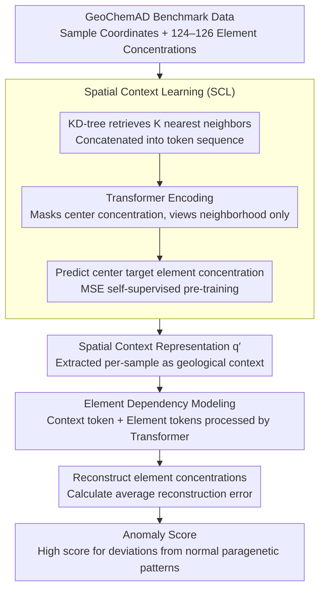

# GeoChemAD: Benchmarking Unsupervised Geochemical Anomaly Detection for Mineral Exploration

**Conference**: CVPR 2026  
**arXiv**: [2603.13068](https://arxiv.org/abs/2603.13068)  
**Code**: [https://github.com/yihaoding/geochemad](https://github.com/yihaoding/geochemad)  
**Area**: Scientific Computing  
**Keywords**: Geochemical Anomaly Detection, Unsupervised Learning, Transformer, Benchmark Dataset, Mineral Exploration  

## TL;DR

This paper proposes the GeoChemAD open-source benchmark dataset and the GeoChemFormer framework. It achieves unsupervised geochemical anomaly detection through spatial context learning and element dependency modeling, reaching an average AUC of 0.7712 across eight subsets.

## Background & Motivation

Geochemical Anomaly Detection (GAD) is vital in mineral exploration for identifying mineralized zones where element concentrations deviate from regional baselines. Surface geochemical distributions result from primary mineralization and secondary dispersion (weathering, erosion), reflecting multi-stage, multi-source processes characterized by high spatial discontinuity, uncertainty, and randomness. Existing research faces three key challenges:

**Data Irreproducibility**: Most studies use private datasets (primarily from the China Geological Survey), precluding fair comparisons and replication. Critical metadata is often omitted.

**Single Scenarios**: Studies typically focus on a single region, a single sampling source (e.g., sediment), and a single target element (e.g., Gold). Generalization across spatial scales, sampling densities, and element types remains unknown.

**Disconnect Between Anomalies and Targets**: Anomalies detected by unsupervised methods may be irrelevant to actual mineralization or the target elements—a core pain point in exploration.

Traditional statistical methods (PCA, Factor Analysis) struggle with complex non-linear patterns. Deep learning methods like AE/VAE model compositional relationships but ignore spatial dependencies. CNNs are limited by fixed receptive fields, and Graph models suffer from limited depth and representation capability. The application of Transformers in GAD is in its infancy, lacking systematic research on self-supervised pre-training.

## Method

### Overall Architecture

The paper develops both a benchmark and a methodology. The GeoChemAD benchmark standardizes GAD by providing the first multi-scenario open-source dataset. The GeoChemFormer framework decouples "spatial" and "compositional" modeling into two stages: Spatial Context Learning (SCL) to learn geological spatial representations from neighborhood samples, and Element Dependency Modeling to use reconstruction error as the anomaly score. This ensures the model captures spatial discontinuities while correlating with target mineralization elements.

### Key Designs

**1. GeoChemAD Benchmark: Standardizing GAD evaluation for reproducibility**

The field has long been hindered by non-public data and single scenarios. GeoChemAD utilizes public data from the Geological Survey of Western Australia (GSWA) Accelerated Geosciences Program. It includes 8 subsets covering 3 sampling sources (2 sediment, 3 rock chip, 3 soil) and 4 target elements (Au, Cu, W, Ni), with spatial scales ranging from $6 \text{ km}^2$ to $8500 \text{ km}^2$. Each subset provides CSV files for geochemical samples (metadata, coordinates, 124–126 element concentrations) and known mineralization sites. Outliers (e.g., -9999, -0.5) are preserved for integrity, using the GDA2020 coordinate system. This is the first standardized, multi-scenario open-source GAD benchmark.

**2. Spatial Context Learning (SCL): Learning spatial regularities by "predicting the center from the neighborhood"**

Surface geochemistry is highly spatially discontinuous. Directly modeling locations risk memorizing noise rather than learning geological structures. SCL uses a KD-tree to retrieve $K$ nearest neighbors for a query position $p_i$, forming a token sequence $\mathcal{S} = [\mathbf{e}, \mathbf{q}_i, \mathbf{t}_1, \ldots, \mathbf{t}_K]$, where $\mathbf{e}$ is the target element token, $\mathbf{q}_i$ is the query position encoding, and $\mathbf{t}_j = [\Delta x_j, \Delta y_j, \mathbf{f}_j]$ contains relative spatial offsets and concentration vectors. After Transformer encoding, the spatial context representation $\mathbf{q}_i'$ is obtained. The training goal is to predict the target element concentration at the query point: $$\mathcal{L}_{\text{sc}} = \frac{1}{N}\sum_{i=1}^{N}(\hat{y}_i - y_i)^2$$ The model is forced to learn how the surrounding context determines the center, similar to masked prediction paradigms.

**3. Element Dependency Modeling: Identifying deviations in element paragenesis**

Mineralization manifests as anomalous co-occurrence of multiple elements. The second stage uses the spatial representation from SCL as a geological context token, concatenated with element tokens, and processed by a Transformer to learn inter-element dependencies. The anomaly score $s_i$ is the average reconstruction error: $$s_i = \frac{1}{C}\sum_{c=1}^{C}(x_{i,c} - \hat{x}_{i,c})^2$$ Samples deviating from normal paragenetic patterns result in high reconstruction errors, isolating anomalies related to mineralization.

### Loss & Training

A two-stage training strategy is adopted: Stage 1 pre-trains SCL using MSE loss (20–60 epochs); Stage 2 performs anomaly detection via reconstruction error. Evaluation uses AUC (averaged over 20 random samplings of background samples). Preprocessing includes CLR/ILR transforms for compositional data, PCA/Causal Discovery/LLM-assisted feature selection, and IDW/Kriging for spatial interpolation.

## Key Experimental Results

### Main Results

| Dataset | GeoChemFormer (Ours) | Vanilla Transformer | AE | VAE-GAN | Best Baseline |
| :--- | :--- | :--- | :--- | :--- | :--- |
| sed1 | **0.7228** | 0.7111 | 0.5851 | 0.6843 | T1: 0.7111 |
| rock1 | **0.7844** | 0.7031 | 0.5516 | 0.6953 | T1: 0.7031 |
| soil1 | **0.8704** | 0.7242 | 0.5934 | 0.7124 | T1: 0.7242 |
| soil3 | **0.8334** | 0.6101 | 0.5544 | 0.6160 | VAE-CG: 0.6509 |
| **Average** | **0.7712** | 0.7147 | 0.7046 | 0.7279 | VAE-G: 0.7279 |

### Ablation Study

| Configuration | Key Metrics | Description |
| :--- | :--- | :--- |
| SCL Pre-training (20 epochs) | rock2 AUC=0.919 | Fast convergence on small datasets |
| SCL Pre-training (40 epochs) | sed1 AUC=0.743 | Sediment data requires more training |
| $K=16$ (Neighborhood size) | soil2 optimal | Soil samples suit compact neighborhoods |
| $K=256$ (Neighborhood size) | sed1 optimal=0.720 | Sediment requires larger spatial context |
| ILR Transform | Avg 0.6788 | Best preprocessing for Transformer models |
| LLM Feature Selection | Avg 0.7412 | Automated selection outperforms manual selection |

### Key Findings

- GeoChemFormer achieves the best performance in 5 out of 8 subsets with the lowest variance (0.0039), demonstrating high stability.
- Spatial context learning is critical for performance, particularly on sediment and soil datasets.
- Data preprocessing strategies (feature selection, transformations) significantly impact model performance.

## Highlights & Insights

- **Fills Domain Gaps**: Provides the first public, multi-region, multi-element, multi-source GAD benchmark.
- **Target-element Awareness**: The target-element token links anomaly detection to specific mineralization targets.
- The two-stage design effectively decouples spatial context and element dependency with an intuitive pre-training strategy.

## Limitations & Future Work

- Data is sourced from a **single geographic region** (Western Australia); generalization to other environments (e.g., tropical weathering, glacial landforms) is unverified.
- The number of positive samples (mineralization sites) is limited (7–32), which may result in statistical instability for AUC calculations.
- The **temporal dimension** is not considered (e.g., seasonal sampling variations or dynamic erosion impacts).
- Deep generative models (AE) still outperform GeoChemFormer on specific subsets (e.g., rock2 AUC 0.9185 vs Ours 0.8050), indicating Transformers may not be optimal for small-sample/high-contrast scenarios.
- Scalability to very large datasets ($>10^5$ samples) due to KD-tree dependencies is not discussed.
- Guidance for automatically selecting optimal feature selection strategies (PCA vs. LLM) is lacking.

## Related Work & Insights

- **vs. Traditional Statistical Methods (Z-score, Mahalanobis)**: Traditional methods show average AUC 0.50–0.53, failing to capture complex non-linear patterns.
- **vs. AE/VAE Series**: AE performs excellently on certain subsets but shows high variance (0.0220). GeoChemFormer provides more stable across-scenario performance.
- **vs. VAE-GAN**: VAE-GAN is the most stable non-Transformer method (AUC 0.7279), but GeoChemFormer exceeds it by 0.0433.
- **vs. Prior GAD Deep Learning Studies**: Previous works use private data and single-region evaluations. GeoChemAD enables fair standardized comparisons.
- **Insights**: The SCL strategy of "predicting the center from the neighborhood" mirrors the masked prediction paradigm and can be transferred to other geospatial anomaly tasks. The concept of "related-to-what" anomaly detection is highly valuable across domains.

## Rating

- Novelty: ⭐⭐⭐
- Experimental Thoroughness: ⭐⭐⭐⭐⭐
- Writing Quality: ⭐⭐⭐⭐
- Value: ⭐⭐⭐⭐

<!-- RELATED:START -->

## Related Papers

- [\[CVPR 2026\] MeteorPred: A Meteorological Multimodal Large Model and Dataset for Severe Weather Event Prediction](meteorpred_a_meteorological_multimodal_large_model_and_dataset_for_severe_weathe.md)
- [\[CVPR 2026\] SIGMA: A Physics-Based Benchmark for Gas Chimney Understanding in Seismic Images](sigma_a_physics-based_benchmark_for_gas_chimney_understanding_in_seismic_images.md)
- [\[ICML 2026\] (Sparse) Attention to the Details: Preserving Spectral Fidelity in ML-based Weather Forecasting Models](../../ICML2026/earth_science/sparse_attention_to_the_details_preserving_spectral_fidelity_in_ml-based_weather.md)
- [\[AAAI 2026\] MdaIF: Robust One-Stop Multi-Degradation-Aware Image Fusion with Language-Driven Semantics](../../AAAI2026/earth_science/mdaif_robust_one-stop_multi-degradation-aware_image_fusion_with_language-driven_.md)
- [\[AAAI 2026\] RENEW: Risk- and Energy-Aware Navigation in Dynamic Waterways](../../AAAI2026/earth_science/renew_risk-_and_energy-aware_navigation_in_dynamic_waterways.md)

<!-- RELATED:END -->
