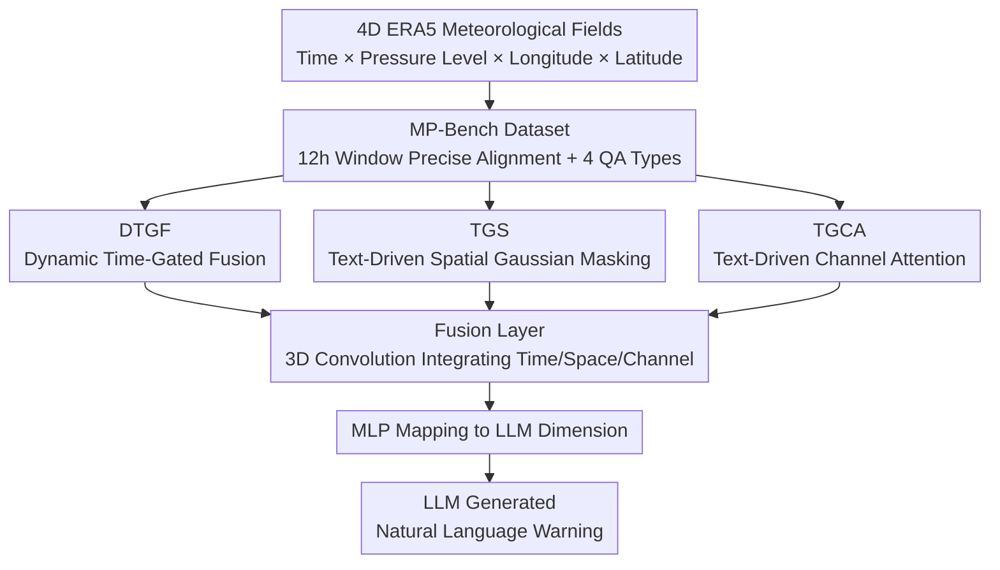

# MeteorPred: A Meteorological Multimodal Large Model and Dataset for Severe Weather Event Prediction

**Conference**: CVPR 2026  
**Paper**: [CVF Open Access](https://openaccess.thecvf.com/content/CVPR2026/html/Tang_MeteorPred_A_Meteorological_Multimodal_Large_Model_and_Dataset_for_Severe_CVPR_2026_paper.html)  
**Code**: https://github.com/tsluvjk/MeteorPred  
**Area**: Multimodal VLM / Meteorological Remote Sensing  
**Keywords**: Severe weather warning, Multimodal large model, 4D meteorological data, Plug-and-play fusion module, Text-driven attention  

## TL;DR
This paper constructs the first large-scale multimodal dataset for severe weather warning, MP-Bench (420,000 pairs of ERA5 meteorological fields and warning texts), and proposes a Multimodal Large Model (MMLM) capable of directly processing 4D meteorological tensors. Through three plug-and-play fusion modules acting on time, space, and vertical pressure levels, high-dimensional meteorological data is aligned with LLMs to generate natural language warnings.

## Background & Motivation
**Background**: Current warnings for severe weather (heavy rain, heavy snow, hail, gales, cold waves, heatwaves, frost, etc.) still rely heavily on manual labor. Numerical Weather Prediction (NWP) and AI meteorological models first provide grid forecasts, which are then synthesized, drafted, and reviewed by forecasters before public release. The academic community is exploring end-to-end "AI weather station" systems to directly convert the latest NWP outputs into publishable warning conclusions.

**Limitations of Prior Work**: The authors identify three bottlenecks. First, existing severe weather datasets are small, cover single event types, and have narrow geographical/temporal coverage, making it difficult to train models with generalization capabilities. Second, the alignment between high-dimensional meteorological data and text warnings is insufficient; many works compress meteorological fields into daily averages, severely diluting temporal resolution and failing to capture short-term drastic changes. Third, there are no off-the-shelf MLLMs capable of directly processing raw meteorological data—common practice involves manually selecting a few pressure levels and flattening or projecting 4D grid points into RGB images for visual encoders, an oversimplification that loses vertical structure, temporal dynamics, and physical relationships between variables.

**Key Challenge**: Meteorological data is essentially a 4D tensor (Time $\times$ Pressure Level $\times$ Longitude $\times$ Latitude), whereas the input interfaces of standard MLLMs are designed for 2D images/videos. There is a fundamental conflict between forcing 4D data into 2D formats and "preserving complete spatio-temporal physical dependencies."

**Goal**: The objective is decomposed into two sub-problems: (1) Constructing a large-scale dataset with precise temporal alignment and comprehensive category coverage; (2) Designing a model that can natively process 4D meteorological inputs and dynamically focus on key spatio-temporal channels based on textual queries.

**Key Insight**: Instead of "compressing data to fit the encoder," the authors add three lightweight fusion modules to the LLM to manage time, space, and vertical pressure levels, allowing the model to perform adaptive feature selection across all three dimensions.

**Core Idea**: Using three plug-and-play "text/time-driven" gating modules, the raw 4D meteorological tensors are adaptively fused into a unified representation before being fed into the LLM, thereby bypassing the information loss caused by "2D image compression."

## Method

### Overall Architecture
The MMLM input consists of national multivariable ERA5 meteorological fields (temperature, humidity, precipitation, wind speed, pressure, each with 37 pressure levels, totaling 185 channels) for the 12 hours following the warning issuance time $t$. The output is the natural language severe weather warning text. The raw 4D tensors are fed in parallel into three plug-and-play modules: DTGF (Temporal Gating), TGS (Text-Driven Spatial Gaussian Masking), and TGCA (Text-Driven Channel Attention). The outputs of these three paths are concatenated and entered into a learnable fusion layer (3D convolution to adaptively integrate temporal/spatial/channel features), then mapped via an MLP to the LLM's input dimension, where the LLM finally generates warning sentences. These three modules specifically address the aforementioned bottlenecks: diluted temporal resolution $\rightarrow$ DTGF captures key time windows; inaccurate spatial positioning $\rightarrow$ TGS focuses based on textual coordinates; vertical channel redundancy $\rightarrow$ TGCA filters channels according to text.

### Key Designs

**1. MP-Bench: Precise Alignment of Meteorological Fields and Warning Texts with 12-Hour Windows**

To address the limitations of small datasets and the loss of temporal resolution from daily averaging, the authors constructed 421,363 data pairs based on China Meteorological Administration (CMA) warning records from 2023–2024 across 2,412 stations, paired with ERA5 reanalysis fields ($0.25^\circ$ resolution, 37 pressure levels). The dataset covers seven types of severe weather: heavy rain, heavy snow, gales, cold waves, heatwaves, frost, and hail. The key alignment strategy uses the warning issuance time $t$ as the reference point to extract the complete meteorological field for the $[t, t+11]$ hour interval **without temporal averaging**. This ensures precise alignment on the time axis—a major distinction from datasets like CLLMate (daily average) or WeatherQA (1h) (see Table 1, MP-Bench is the only one with 420k+ texts, seven disaster types, and 12h@1h interval alignment). During cleaning, warnings of the same type and station issued within 2 hours were merged by highest level, and 49,660 "normal weather" negative samples were sampled uniformly by region and season to mitigate class imbalance. Four QA types were designed: Multiple Choice (MC, seven classes A–G + Normal H, sub-classified by Blue/Red levels), True/False (T/F), Regional Severe Weather (RSW), and National Severe Weather (NSW, requiring structured output in `[Place][Weather Type][Level]` format).

**2. DTGF: Capturing Key Evolutionary Windows via Adjacent Time Differencing Gating**

Drastic changes in severe weather often concentrate within specific hours (e.g., the first three hours after a Red Heavy Rain warning are most critical). Treating all moments equally can drown out the signal. DTGF (Dynamic Time-Gated Fusion) first calculates the $L2$ difference between adjacent hourly data in the channel dimension: $\Delta x_t = \lVert x_t - x_{t-1} \rVert_2$ ($t=2,\dots,T$, with zero-padding for the first frame). This difference is mapped via an MLP+Sigmoid to a gating weight $g_t = \mathrm{Sigmoid}(\mathrm{MLP}(\Delta x_t)) \in [0,1]$. Finally, temporal tokens are weighted as $\tilde{x}_t = g_t \cdot x_t$. Larger differences indicate more drastic changes in the meteorological field, leading to higher gating weights and allowing the model to focus on mutation windows. Visualizations show that for Red Heavy Rain warnings, the module indeed assigns higher weights to the first three hours post-issuance, consistent with physical evolution.

**3. TGS: Mapping Place Names to Spatial Gaussian Masks for Guided Focus**

Warning texts usually name specific geographic locations, but models lack innate knowledge of where to look in the meteorological field. TGS (Text-Driven Gaussian Spatial Masking) extracts geographic coordinates $(\phi_i, \lambda_i)$ from text events, maps them to grid indices $(h_i, w_i)$ using nearest-neighbor matching, and generates 2D Gaussian weights $G_i(h,w) = \exp\!\big(-\frac{(h-h_i)^2+(w-w_i)^2}{2\sigma^2}\big)$ around each point. The Gaussian contributions from $N$ coordinates are summed into a total mask $M(h,w) = \sum_{i=1}^{N} G_i(h,w)$, which weights spatial features for every channel and time step. $\sigma$ controls the Gaussian width (focus range). This "pulls" the model toward the specified geographic regions.

**4. TGCA: Filtering Redundant Pressure Level Channels via Text-Channel Similarity**

Five meteorological factors across 37 levels stack into 185 input channels, containing significant redundancy. TGCA (Text-Driven Channel Attention) allows the text to determine channel importance. Text embedding $y$ is projected to the channel dimension $P = \mathrm{Linear}(y)$, and a channel descriptor $V = \mathrm{Mean}(X)$ is obtained via spatio-temporal averaging of the ERA5 tensor. Text-channel attention is calculated as $\mathrm{Softmax}(VP^\top)$, which is then applied through a sigmoid gate to the original features: $Y = X \cdot \mathrm{Sigmoid}\big(\mathrm{Softmax}(VP^\top)\,P\big)$. This acts as a text-conditional channel feature selector, dynamically emphasizing relevant pressure levels.

### Loss & Training
Four open-source backbones (Qwen2.5-VL-7B-Instruct, LLaVA-NeXT-Video-7B, Video-LLaVA-7B, InternVL3-8B) were fine-tuned using LoRA on all linear layers. DTGF, TGCA, and the fusion layer were set as learnable components. Training used a learning rate of $5\times10^{-5}$, batch size 2, gradient accumulation 8, bf16 precision, and 8×A800 (40GB). 2023 data served as the training set and 2024 as the test set.

## Key Experimental Results

### Main Results
Baseline refers to open-source models fine-tuned with 3-layer pressure data; MMLM refers to fine-tuning with all 185 channels + three plug-and-play modules. The first four metrics are 0–100; NSW Score is 0–5 (GPT-4o used as LLM-as-a-judge following expert rubrics).

| Model Config | MC-main Acc↑ | MC-main F1↑ | T/F Acc↑ | RSW Acc↑ | NSW Score↑ |
|----------|------|------|------|------|------|
| GPT-4o (Closed-source Zero-shot) | 11.92 | 2.92 | 0.19 | 14.03 | 0.1 |
| Qwen2.5-VL Baseline (3 channels) | 56.26 | 26.88 | 68.33 | 61.82 | 1.7 |
| Qwen2.5-VL **MMLM** (185 channels + 3 modules) | **72.37** | **50.88** | **87.13** | **71.23** | **2.1** |

Closed-source GPT-4o shows almost no ability to understand raw meteorological data (T/F only 0.19%, far below random guess). Using Qwen2.5-VL with MMLM improvements, MC-main accuracy increases by 16+ points over its baseline, and Macro-F1 nearly doubles. The MMLM versions of all four backbones consistently outperform their respective baselines across all tasks. ⚠️ The absolute score for NSW remains low (max 2.1/5), indicating that national-level structured warning generation is still a challenging open task.

### Ablation Study
Ablation of the three modules on 5,000 samples (based on Qwen2.5-VL). ✓ indicates the module is enabled.

| DTGF | TGS | TGCA | MC-main Acc↑ | T/F Acc↑ | RSW Acc↑ | NSW Score↑ |
|------|-----|------|------|------|------|------|
| ✗ | ✗ | ✗ | 42.73 | 58.47 | 41.25 | 1.1 |
| ✓ | ✗ | ✗ | 53.28 | 57.23 | 47.30 | 1.2 |
| ✗ | ✗ | ✓ | 50.91 | 60.35 | 50.29 | 1.4 |
| ✓ | ✓ | ✗ | 53.81 | 56.63 | 54.02 | 1.4 |
| ✓ | ✓ | ✓ | **58.27** | **79.21** | **58.63** | **1.7** |

### Key Findings
- Each module provides gains individually: DTGF primarily boosts MC (temporal features aid type/level identification), TGCA benefits T/F and RSW (channel filtering improves discrimination), and TGS shows moderate gains alone but significantly improves MC-main and RSW when paired with DTGF, showing spatio-temporal complementarity.
- Synergistic effects are significant; when all modules are active, T/F jumps from ~57–60% to 79.21%, suggesting the combination is more effective than simple superposition.
- Baselines (3 channels) show qualitative improvements over closed-source models (T/F from 0.19% to 69%+), but Macro-F1 remains low—class imbalance combined with events like hail needing high-res input makes 3-channel data insufficient, justifying adaptive high-dimensional fusion.

## Highlights & Insights
- **Inverted Logic: Do not compress data to fit the model; add modules so the model can ingest raw 4D data**. The three modules correspond to temporal, spatial, and vertical dimensions. They are clear in structure and plug-and-play, adaptable to any video MLLM backbone—this design of "splitting modules by physical dimensions" is easily transferable to other spatio-temporal scientific data (oceanography, air quality, remote sensing time-series).
- **Clever Text-Driven Focus**: TGS turns text place names into Gaussian masks and TGCA uses text-channel similarity to select pressure levels. This allows natural language queries to directly modulate attention on high-dimensional physical tensors rather than relying on blind learning.
- **The 12h@1h Alignment Strategy** (no temporal averaging) is a critical data-level contribution, determining the ability to capture short-term drastic evolution.

## Limitations & Future Work
- NSW (National Structured Warning generation) absolute scores are very low (max 2.1/5), leaving significant room for improvement.
- Evaluation relies on GPT-4o as LLM-as-a-judge; consistency and discernment of professional meteorological phrasing are questionable ⚠️.
- Data is sourced only from China (CMA + ERA5 China region); cross-regional generalization was verified only on a NOAA Storm Events subset.
- While gates/attention are lightweight, the model's performance on truly rare extreme events (small sample classes) may still suffer from class imbalance, as reflected in the relatively low Macro-F1.

## Related Work & Insights
- **vs. Grid Foundation Models (e.g., NWP/AI Weather Forecasts)**: These models predict spatial distributions of variables but lack high-level semantic representation for discrete disaster phenomena; Ours uses LLMs to translate weather fields into warnings, adding the semantic layer.
- **vs. LLM+RAG Methods**: Those works compress high-dimensional weather into daily averages and extract structured semantics, ignoring physical laws of meteorological evolution and risking hallucinations; MMLM retains 12h@1h resolution with DTGF to capture time windows.
- **vs. Existing MLLM Disaster Prediction (CLLMate / WeatherQA)**: These models encode weather data as 3-channel RGB images, selecting few pressure levels and averaging time; Ours natively processes 185-channel 4D tensors with superior scale and category coverage.

## Rating
- Novelty: ⭐⭐⭐⭐ First MLLM to natively ingest 4D meteorological tensors + first 420k-pair seven-category dataset.
- Experimental Thoroughness: ⭐⭐⭐⭐ Comparison across four backbones + full ablation + cross-region validation.
- Writing Quality: ⭐⭐⭐⭐ Clear mapping between bottlenecks and modules; effective formulas and visualizations.
- Value: ⭐⭐⭐⭐ Dataset and plug-and-play modules have high reusable value for the AI weather community.

<!-- RELATED:START -->

## Related Papers

- [\[NeurIPS 2025\] Power Ensemble Aggregation for Improved Extreme Event AI Prediction](../../NeurIPS2025/earth_science/power_ensemble_aggregation_for_improved_extreme_event_ai_prediction.md)
- [\[ICML 2026\] (Sparse) Attention to the Details: Preserving Spectral Fidelity in ML-based Weather Forecasting Models](../../ICML2026/earth_science/sparse_attention_to_the_details_preserving_spectral_fidelity_in_ml-based_weather.md)
- [\[NeurIPS 2025\] Reasoning With a Star: A Heliophysics Dataset and Benchmark for Agentic Scientific Reasoning](../../NeurIPS2025/earth_science/reasoning_with_a_star_a_heliophysics_dataset_and_benchmark_for_agentic_scientifi.md)
- [\[CVPR 2026\] GeoChemAD: Benchmarking Unsupervised Geochemical Anomaly Detection for Mineral Exploration](geochemad_benchmarking_unsupervised_geochemical_anomaly_detection_for_mineral_ex.md)
- [\[CVPR 2026\] SIGMA: A Physics-Based Benchmark for Gas Chimney Understanding in Seismic Images](sigma_a_physics-based_benchmark_for_gas_chimney_understanding_in_seismic_images.md)

<!-- RELATED:END -->
