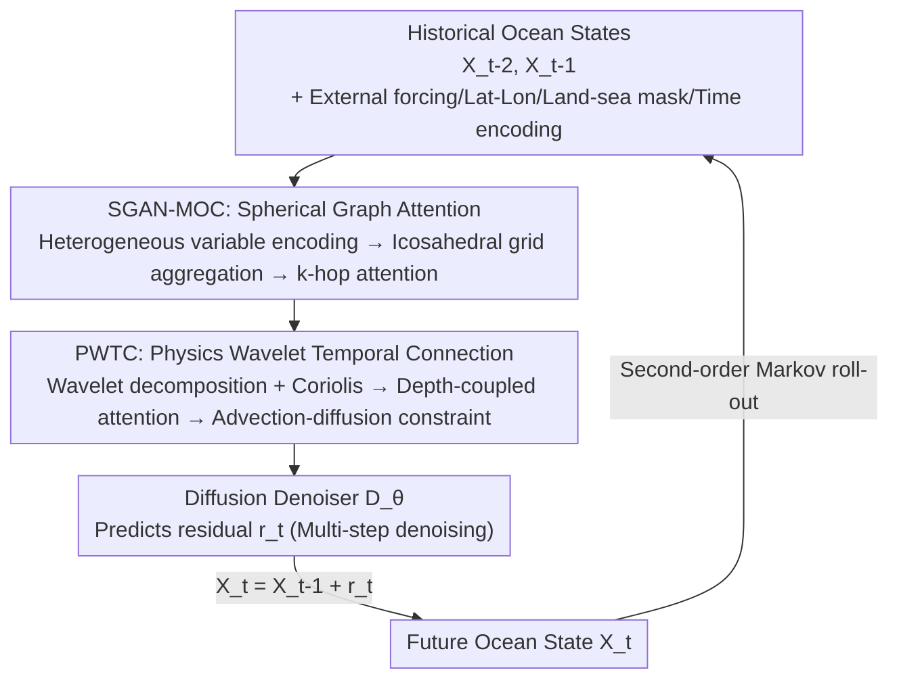

# PhyOceanCast: Global Ocean Forecasting with Physics-Informed Diffusion

**Conference**: CVPR 2026  
**Paper**: [CVF Open Access](https://openaccess.thecvf.com/content/CVPR2026/html/Li_PhyOceanCast_Global_Ocean_Forecasting_with_Physics-Informed_Diffusion_CVPR_2026_paper.html)  
**Code**: None  
**Area**: Earth Science / Spatiotemporal Forecasting / Diffusion Models  
**Keywords**: Global Ocean Forecasting, Physics-Constrained Diffusion, Spherical Graph Attention, Wavelet Temporal Decomposition, Advection-Diffusion

## TL;DR
PhyOceanCast models global ocean forecasting as a **residual diffusion** problem. It utilizes a Spherical Graph Attention Network (SGAN-MOC) to address "high-latitude projection distortion + variable coupling" and a Physics-informed Wavelet Temporal Connection module (PWTC) to handle "multi-scale dynamics + conservation constraints". The framework predicts 145 ocean variables across 36 depth layers simultaneously, reducing the 30-day forecast RMSE by approximately 13.7% compared to the strongest baseline.

## Background & Motivation
**Background**: Traditional Global Ocean Forecasting Systems (GOFS) offer high accuracy but are computationally expensive and do not fully exploit the rapidly growing volume of historical observations. Deep learning has driven significant progress in weather and ocean forecasting—GraphCast is thousands of times faster than numerical methods, and WenHai achieves eddy-resolving ocean forecasting. However, most of these models are **deterministic**; given finite initial grids, they output a single future state and fail to represent the inherently chaotic and irreducible uncertainty of the ocean.

**Limitations of Prior Work**: The authors point out three systematic flaws of current spatiotemporal forecasting methods when applied to oceans. First, treating temperature, salinity, and flow velocity as **independent variables** violates the equation of state that couples them, breaking the physical consistency of cross-depth coupled processes such as density-driven circulation and thermohaline processes. Second, ignoring **spherical geometry**: the equirectangular projection causes up to a 5-fold area distortion near the poles, and planar convolutions cannot handle longitudinal wrap-around (the International Date Line). Third, **single-scale temporal modeling** cannot support the cross-scale dynamics of the ocean—internal waves are short-term oscillations, mesoscale eddies persist for months, and thermohaline circulation spans centuries. A single scale either smooths out high-frequency signals or fails to transfer information across scales, resulting in violations of conservation laws.

**Key Challenge**: Existing works can only address these issues in isolation. GraphCast's icosahedral grid handles spherical topology, but its **isotropic** processing obscures the scale separation and stratification of horizontal and vertical motions. Pangu-Weather incorporates multivariate logic but lacks an explicit coupling mechanism oriented toward ocean constraints. Diffusion models provide probabilistic forecasts but fail to enforce physical consistency. No framework exists that simultaneously achieves "anisotropic spherical geometry + cross-depth variable coupling + multi-scale temporal evolution + conservation laws."

**Goal / Key Insight**: The authors bet on the path of **probabilistic (diffusion) forecasting**. Because the ocean is a chaotic system, deterministic models starting from finite initial values inevitably lose natural complexity. In contrast, the stochastic generation of diffusion is naturally suited for ensemble forecasting and uncertainty quantification. Building on this, domain physics (equation-of-state coupling, spherical topology, the advection-diffusion equation, Coriolis force) is explicitly integrated into the network architecture and loss functions, rather than treated as soft regularization.

**Core Idea**: Unifying global ocean probabilistic forecasting with a **physics-constrained residual diffusion model**—SGAN-MOC is responsible for "coupling multivariate data on the sphere," PWTC is responsible for "disassembling and reconstructively preserving multi-scale dynamics over time," and diffusion denoising iteratively generates physically plausible ensemble forecasts.

## Method

### Overall Architecture
Instead of directly predicting the absolute ocean state of the next step, PhyOceanCast predicts the **residual of adjacent steps** $r_t = X_t - X_{t-1}$ and writes the conditional distribution as $p(X_t \mid X_{t-1}, X_{t-2})$ under a second-order Markov assumption. During training, noise is added to the target residual $\tilde{r}_t = r_t + \sigma\epsilon$, and a denoiser $D_\theta$ is trained to reconstruct the clean residual. During inference, multi-step denoising is performed starting from pure noise to generate the residuals, followed by a roll-out step $X_t = X_{t-1} + r_t$. Each input state $X_{t-i} \in \mathbb{R}^{V\times H\times W}$ ($V=145$ variables) is accompanied by external forcing $\mathcal{F}$, latitude/longitude, a land-sea mask, and $\tau_{t-i}$ encoding the temporal position within the year.

The denoiser contains two concatenated, complementary modules: **SGAN-MOC** first performs cross-variable spatial coupling on the sphere (preserving topology and correcting distortion), and **PWTC** then models temporal evolution via multi-scale decomposition, depth coupling, and advection-diffusion constraints. The outputs of both modules jointly condition the diffusion denoiser to output the residual estimation for the current denoising step.

### Key Designs

**1. Residual Diffusion Forecasting Framework: Replacing Deterministic Regression with Probabilistic Generation**

To address the fundamental paint point that deterministic models cannot capture ocean chaos from finite initial values, PhyOceanCast reformulates forecasting as residual denoising. Predicting the residual $r_t$ (rather than the absolute state) allows the network to focus on learning "how the state changes," while the second-order Markov condition (using $X_{t-1}, X_{t-2}$) captures temporal inertia. The training objective is a weighted denoising score matching loss:

$$\mathcal{L} = \mathbb{E}_{\sigma,\epsilon}\Big[\lambda(\sigma)\sum_{v\in V}\sum_{i\in G} w_{v,d(v)}\cdot a_i \cdot \|D_\theta(\tilde{r}_t; X_{t-2}, X_{t-1}, \mathcal{F}, \tau_{t-2}, \tau_{t-1}, \sigma) - r_t\|^2\Big]$$

The three weights here act as vehicles to embed physics into the loss: $w_{v,d(v)}$ is a **depth-dependent weight** assigned to variable $v$ at depth $d(v)$ based on oceanographic principles (rebalancing weak signals at depth), $a_i$ is an **area weight** correcting grid distortion by latitude (preventing high-latitude grid points with smaller areas from being underestimated), and $\lambda(\sigma)$ is a noise-level-dependent loss weight. During inference, running denoising multiple times yields an ensemble of forecasts (10 members are used in the paper), naturally quantifying forecast uncertainty—something deterministic baselines (Video Swin, 3D-Geoformer) cannot achieve.

**2. SGAN-MOC: Coupling Multivariate Variables on the Sphere to Eliminate High-Latitude Distortion**

Addressing the two pain points of "treating variables as independent" and "polar distortion in planar projections," SGAN-MOC consists of three steps. First, **heterogeneous variable encoding** assigns an independent encoder to each ocean variable, $\hbar_\theta^{(v,i)} = \mathcal{E}_v(X_{t-i}^{(v)})$, extracting multi-scale features from mesoscale eddies to basin scales using cascaded convolutions with expanding receptive fields. This is then overlaid with sinusoidal geographical position encodings: $F_v = \hbar_\theta^{(v,1)} + \hbar_\theta^{(v,2)} + \alpha\cdot(\text{PE}_\text{geo}^\text{lat}\oplus\text{PE}_\text{geo}^\text{lon})$, allowing the model to retain distinct physical features of each variable while incorporating latitude-dependent spatial contexts (such as the Coriolis effect and meridional heat transport, both of which vary strongly with latitude).

**Adaptive spherical aggregation** is inspired by GraphCast, recursively subdividing a regular icosahedron to obtain an **icosahedral grid** that approximates the sphere and avoids planar projection distortion. The subdivision formula projects the midpoint of each edge back to the unit sphere: $\mathcal{M}^{(l+1)} = \{v' \mid v' = \text{proj}_{\mathbb{S}^2}(\tfrac{v_i+v_j}{2})\}\cup\mathcal{M}^{(l)}$. Bidirectional connections between the regular grid and the mesh nodes are established based on geodesic distance $d_{geo}(\mathbf{p}_g, \mathbf{m}_i) < r$. Adaptive weights $\hat{w}_{gm}$ derived from geodesic distances are then used to aggregate the grid features onto the mesh nodes: $\mathbf{H}_m = \frac{\sum_g \hat{w}_{gm} F_v^{(g)}}{\sum_g \hat{w}_{gm}}$. Features on the spherical domain undergo **k-hop constrained graph attention** to model variable interactions and are then mapped back to the regular grid using equal-area barycentric interpolation. This retains compatibility with regular grids and observational data while achieving uniform processing across latitudes, resolving the longitude wrap-around issue that planar convolutions cannot handle.

**3. PWTC: Multi-scale Decomposition + Depth Coupling + Advection-Diffusion Conservation Constraints**

To resolve the limitation of single-scale temporal modeling and the lack of conservation constraints, PWTC chains three sub-mechanisms. **Multi-scale wavelet decomposition** first performs frequency-domain spectral analysis to isolate periodic signals: $\hat{\mathcal{S}}(\omega_h,\omega_w) = \iint X_t(h,w)e^{-2\pi i(\omega_h h+\omega_w w)}\,dh\,dw$. A 3D discrete wavelet transform (using a Daubechies-4 basis) is applied to the inverse transformed signals to separate approximation coefficients $\mathbf{A}_L$ and horizontal/vertical/diagonal detail coefficients across scales, passing each scale through a dedicated network $\mathcal{G}_j$ to learn scale-specific dynamics. The **Coriolis force** $f(\phi)=2\Omega\sin(\phi)$ ($\Omega=7.2921\times10^{-5}$ rad/s) is also explicitly injected here, acting only on the flow velocity components via $\mathbf{H}_\text{coriolis} = \mathbf{H}_j + \beta\cdot f(\phi)\odot\mathbf{M}_\text{velocity}$.

**Depth-coupled attention** models the vertical structure across 36 depth layers. First, a Conv1D along the depth dimension is used to mix adjacent layers: $\mathbf{M}_d = \text{Conv1D}_\text{depth}(X_t^{(v,d)})$. A learnable embedding is then assigned to each layer: $\mathbf{E}_d = \mathbf{e}_d + \text{PE}_\text{depth}(d)$ (where $\text{PE}_\text{depth}$ encodes variability exponentially decaying with depth). Multi-head attention is performed across layers, $\mathbf{A}_{ij} = \text{softmax}(\frac{(\mathbf{M}_i+\mathbf{E}_i)(\mathbf{M}_j+\mathbf{E}_j)^T}{\sqrt_d{k}})$, and aggregated as $\mathbf{H}_\text{depth} = \mathbf{M} + \gamma\sum_j \mathbf{A}_{ij}\mathbf{M}_j$ to capture non-local vertical interactions such as convective plumes and internal wave vertical propagation.

Finally, the **advection-diffusion constrained temporal evolution** embeds physics conservation laws directly into the temporal module. The wavelet and depth features are added element-wise: $\mathbf{H}_\text{combined} = \mathbf{H}_\text{coriolis} + \mathbf{H}_\text{depth}$. This combined representation is passed through a ConvGRU stack with temporal position encodings. Following the advection-diffusion equation, $\frac{\partial\Phi}{\partial t} = \underbrace{-\mathbf{u}\cdot\nabla\Phi}_\text{advection} + \underbrace{\kappa\nabla^2\Phi}_\text{diffusion} + \underbrace{S}_\text{source/sink}$, the three terms (advection, diffusion, and source/sink) are implemented as **learnable convolutional operators**, adaptively weighted to suit different ocean regions. This yields physically plausible features $F_\text{phys}$, which are fused across scales using a pyramid structure. This step is key to PhyOceanCast maintaining low errors over a 30-day long-term horizon—whereas the pure diffusion baseline (DiffCast) lacks physical guidance and its RMSE explodes by day 30.

### Loss & Training
The training objective is the weighted denoising score matching loss presented in Equation (1). The dataset is the GLORYS12V1 reanalysis product, downsampled from its native 1/12° resolution to 1°. It focuses on 5 key variables (zos at the surface, plus thetao/so/uo/vo resolved across 36 depth layers from the surface to 1062m). The model is trained on 1993–2018 data, validated on 2019, and tested on 2020. Running on 6 NVIDIA H800 GPUs with a total batch size of 6, training lasts for 1K epochs. The AdamW optimizer is used (initial learning rate of 1e-3, weight decay of 1e-2, with warmup and square root decay), dropout is set to 0.13, and EMA is applied during inference. Training the global model takes a total of 700–1500 GPU hours.

## Key Experimental Results

### Main Results
The model is compared against 11 spatiotemporal forecasting and weather forecasting baselines on GLORYS12V1 across 4 lead times (3/7/15/30 days) on 5 metrics (RMSE↓ / MAE↓ / ACClat↑ / Pearson↑ / SSIM↑). The table below lists the RMSE results for both 3-day and 30-day leads (PhyOceanCast uses 10 ensemble members; parentheses indicate relative performance gains reported in the paper):

| Method | Source | 3-day RMSE↓ | 30-day RMSE↓ |
|------|------|-----------|------------|
| ConvLSTM | NeurIPS'15 | 0.6940 | 1.3443 |
| SimVP | CVPR'22 | 0.5503 | 1.2787 |
| Video Swin Transformer | CVPR'22 | 0.5358 | 1.2632 |
| 3D-Geoformer | Sci. Adv.'23 | 0.5433 | 1.3228 |
| GraphCast | Science'23 | 0.6003 | 1.7577 |
| DiffCast (10 members) | CVPR'25 | 0.7325 | 4.8514 |
| **PhyOceanCast (Ours, 10 members)** | CVPR'26 | **0.4558** | **1.1109 (+13.70%)** |

Key Observations: (1) PhyOceanCast outperforms all baselines across all lead times and metrics; its 30-day RMSE of 1.1109 makes it the only method in the table that does not suffer from error explosion over long horizons. (2) The pure diffusion model DiffCast exhibits an RMSE of 4.8514 at 30 days, confirming that "diffusion without physical guidance goes out of control" and highlighting the necessity of PWTC's physical constraints. (3) Among deterministic baselines, Video Swin Transformer scores the second-best, yet the deterministic paradigm cannot model stochastic oceanic processes from finite initial states, and planar convolutions struggle with the discontinuity at the International Date Line.

### Ablation Study
The ablation study is conducted on a 7-day lead time (results are presented in Fig. 4b of the paper using an RMSE-SSIM scatter plot; the table below presents qualitative conclusions):

| Configuration | Conclusion |
|------|------|
| Full Model (10 members) | Best RMSE/SSIM |
| Full Model (3 members) | Reduced ensemble members lead to worse uncertainty quantification and lower metrics |
| w/o PWTC (3 members) | Removing the physics wavelet temporal module degrades long-term physical consistency |
| w/o SGAN-MOC (3 members) | Removing spherical graph attention loses cross-variable coupling, causing a notable drop in metrics |
| w/o SGAN-MOC & PWTC (3 members) | Removing both core modules leads to the most severe degradation |

### Key Findings
- **Both modules are indispensable**: SGAN-MOC models the relationships between heterogeneous variables, while PWTC improves physical consistency across continuous time via physical constraints and scale decomposition. Removing either degrades performance, and removing both results in the worst results.
- **Ensemble size effectively quantifies uncertainty**: 10 members > 3 members; a larger ensemble better represents the stochastic nature of the ocean.
- **Depth coupling learns real physics**: The chord diagram of depth-coupled attention weights reveals intense cross-layer interactions between the thermocline and adjacent layers, matching vertical mixing and stratification dynamics.
- **Strong preservation of long-term forecast skill**: In the Brazil–Malvinas Confluence (one of the most dynamically complex regions where warm and cold currents collide), the spatial correlation coefficient for the 20-day forecast remains > 0.6 by day 18, and the zos forecast error amplitude is < 0.2 m.

## Highlights & Insights
- **Applying the "Diffusion Paradigm" to the right problem**: The ocean is chaotic with irreducible uncertainty; deterministic regressions starting from finite initial states naturally underfit natural complexity. Utilizing residual diffusion with ensemble members turns "probabilistic forecasting" into a first-principle choice, rather than an afterthought using dropout for variance estimation. This paradigm can be transferred to any highly stochastic spatiotemporal prediction task (such as precipitation or typhoon tracks).
- **Physics as hard structures instead of soft regularization**: Equation-of-state coupling is integrated into SGAN-MOC's cross-variable attention, spherical topology is embedded into the icosahedral grid, the Coriolis force and advection-diffusion equations are baked into the learnable operators of PWTC, and latitude area/depth weights are incorporated into the loss function. Every piece of physics maps to a specific network component or weight. This "physics-architecture alignment" is highly inspiring.
- **The counterexample of DiffCast is compelling**: Under the same diffusion backbone, DiffCast (without physical guidance) sees its 30-day RMSE blow up to 4.85, whereas PhyOceanCast keeps it at 1.11. This directly demonstrates that the integration of diffusion and physical constraints yields coupled gains, rather than isolated improvements.
- **Spherical + Anisotropy**: Most spherical approaches assume isotropy. This paper emphasizes the ocean's inherent anisotropy (horizontal vs. vertical scale separation, baroclinic instability, vertical mixing) and uses k-hop constrained attention alongside depth-coupled attention to handle horizontal and vertical coupling separately.

## Limitations & Future Work
- **Land mask fragments training samples**: The authors acknowledge that land introduces spatial discontinuities in ocean states, reducing the effective number of training samples; future plans include accelerating training and extracting higher-quality features from the data.
- **Downsampled resolution**: Re-sampling from the native 1/12° to 1° sacrifices the ability to resolve mesoscale eddies and nearshore details, which stands in tension with the core demand of "eddy-resolving" ocean forecasting.
- **Evaluation on a single test year**: Training on 1993–2018 and evaluating solely on 2020 leaves generalization across different years, extreme event years, and climatological drift insufficiently examined.
- **Ablation lacks numerical tables**: The ablation of core modules is only shown in a scatter plot without numerical tables, making it hard to precisely quantify the marginal contribution of each module.
- **High computational cost**: Requiring 700–1500 GPU hours on 6 H800 GPUs leaves a gap before it can serve as a lightweight replacement for GOFS. Multi-step diffusion denoising with 10 ensemble members also increases inference overhead.

## Related Work & Insights
- **vs GraphCast**: Both use an icosahedral grid to handle spherical topology, but GraphCast's isotropic approach cannot model horizontal/vertical scale separation and stratification. PhyOceanCast adds anisotropic cross-variable and cross-depth coupling on top of the spherical grid, and operates under a probabilistic diffusion framework instead of deterministic regression.
- **vs DiffCast**: Both use diffusion as a backbone, but DiffCast lacks physical guidance and its 30-day error spirals out of control. PhyOceanCast maintains long-term robustness by explicitly injecting the equation of state, spherical geometry, and the advection-diffusion equation via SGAN-MOC and PWTC.
- **vs Video Swin Transformer / 3D-Geoformer**: These deterministic Transformers achieve the second-best performance but cannot model ocean stochasticity from finite initial values, and their planar convolutions fail to handle longitudinal wrap-around. This paper's probabilistic paradigm and spherical grid directly resolve these issues.
- **vs WenHai**: WenHai employs bulk formulas and tendency prediction parts to handle coupling, but lacks explicit cross-variable attention to model density-driven currents and thermohaline processes. PhyOceanCast uses k-hop attention to explicitly build cross-variable and cross-depth coupling.
- **vs PhyDNet (PDE-constrained RNN)**: Both incorporate physical constraints into temporal models, but PhyDNet embeds PDE constraints into the RNN hidden states. PhyOceanCast implements the three terms of the advection-diffusion equation as learnable and adaptively-weighted convolutional operators, which is more specific to ocean conservation laws.

## Rating
- **Novelty**: ⭐⭐⭐⭐⭐ Systematically coupling residual diffusion, spherical graph attention, and physics wavelet temporal modules, mapping every physical constraint to a specific network structure, constitutes a paradigm-level effort in ocean forecasting.
- **Experimental Thoroughness**: ⭐⭐⭐⭐ Solid evaluation against 11 baselines across 4 lead times, 5 metrics, and case studies, but slightly docked due to scatter-only ablations, single-year testing, and the lack of numerical ablation tables.
- **Writing Quality**: ⭐⭐⭐⭐ Clear motivation addressing three main pain points and distinct module mappings; however, equations (OCR) and ablation tables appear somewhat less polished.
- **Value**: ⭐⭐⭐⭐⭐ Global ocean forecasting holds clear application value (climate monitoring, maritime safety, disaster warnings). The philosophy of physics-architecture alignment provides highly valuable methodological insights for AI in Earth Science.

<!-- RELATED:START -->

## Related Papers

- [\[ICLR 2026\] TianQuan-S2S: Constructing Subseasonal-to-Seasonal Global Weather Forecasting Models by Incorporating Climatology](../../ICLR2026/earth_science/tianquan-s2s_a_subseasonal-to-seasonal_global_weather_model_via_incorporate_clim.md)
- [\[CVPR 2026\] SIGMA: A Physics-Based Benchmark for Gas Chimney Understanding in Seismic Images](sigma_a_physics-based_benchmark_for_gas_chimney_understanding_in_seismic_images.md)
- [\[ICML 2026\] Scaling Laws of Global Weather Models](../../ICML2026/earth_science/scaling_laws_of_global_weather_models.md)
- [\[ICLR 2026\] GeoFAR: Geography-Informed Frequency-Aware Super-Resolution for Climate Data](../../ICLR2026/earth_science/geofar_geography-informed_frequency-aware_super-resolution_for_climate_data.md)
- [\[ICML 2026\] (Sparse) Attention to the Details: Preserving Spectral Fidelity in ML-based Weather Forecasting Models](../../ICML2026/earth_science/sparse_attention_to_the_details_preserving_spectral_fidelity_in_ml-based_weather.md)

<!-- RELATED:END -->
