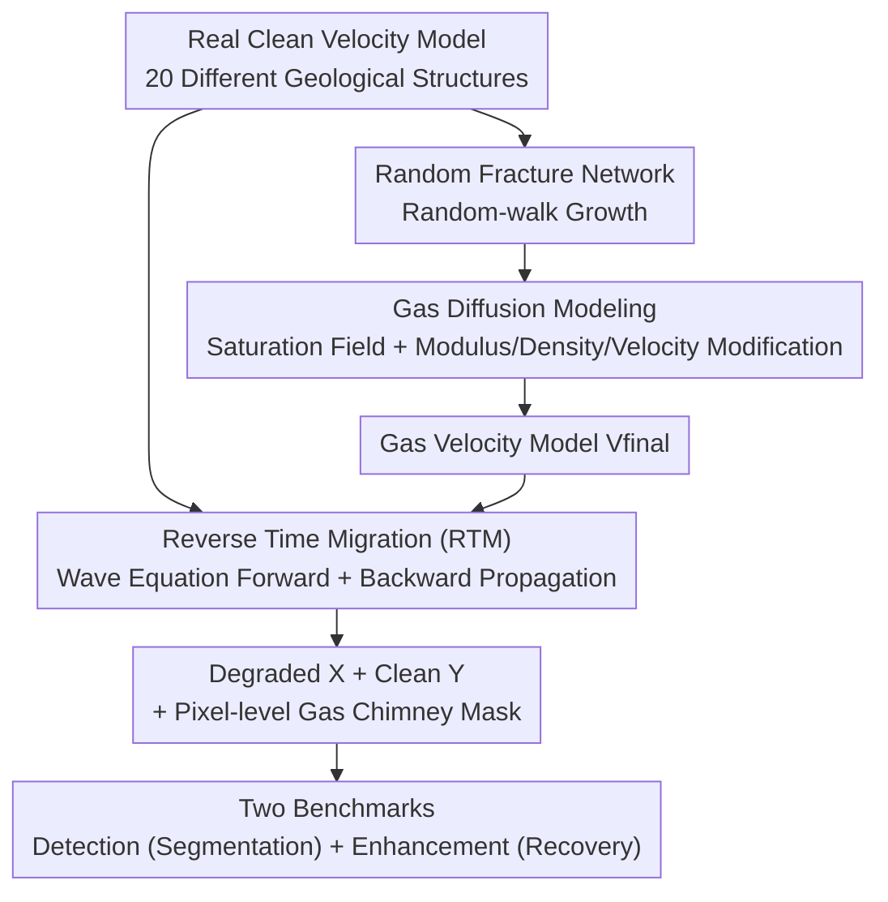

# SIGMA: A Physics-Based Benchmark for Gas Chimney Understanding in Seismic Images

**Conference**: CVPR 2026  
**Paper**: [CVF Open Access](https://openaccess.thecvf.com/content/CVPR2026/html/Truong_SIGMA_A_Physics-Based_Benchmark_for_Gas_Chimney_Understanding_in_Seismic_CVPR_2026_paper.html)  
**Code**: https://airvlab.github.io/sigma  
**Area**: Earth Science / Image Restoration  
**Keywords**: Seismic Image Understanding, Gas Chimney Detection, Physics-based Synthetic Dataset, Reverse Time Migration, Image Enhancement

## TL;DR
This work proposes SIGMA, the first physics-based synthetic seismic image dataset with ground truth labels. By combining wave equation forward modeling and Reverse Time Migration (RTM), velocity models containing gas chimneys are converted into seismic images. The dataset provides pixel-level gas chimney masks (for detection) and paired "degraded-clean" images (for enhancement). Benchmarking multiple baselines reveals that existing methods collectively struggle on this data.

## Background & Motivation
**Background**: Seismic imaging reconstructs underground structures by exciting controllable acoustic waves at the surface and recording reflections. The velocity model (describing seismic wave propagation speed at each point) is key to converting seismic data into interpretable images, usually estimated via Full Waveform Inversion (FWI). Gas chimneys are vertical anomaly zones formed by upward fluid (gas) migration, appearing as chaotic areas with vertical disruption, low amplitude, and low coherence in seismic images. They are critical indicators for assessing reservoir potential, seal integrity, drilling risks, and carbon sequestration leakage pathways.

**Limitations of Prior Work**: Accurately imaging gas chimneys is extremely difficult—their seismic signals are weak, spatially incoherent, and further destroyed by intense attenuation and scattering. Traditional physical methods (e.g., Q-compensated migration) can partially recover attenuation zones but involve expensive wave equation computations, require precise parameter tuning, and generalize poorly across different survey areas. More critically, real data lacks ground truth (GT) for gas chimneys, as no public records verified by actual drilling exist, and manual annotation is subjective and tedious. Deep learning methods are efficient but lack labeled training data.

**Key Challenge**: Deep learning requires a large number of paired "degraded-clean" images and pixel-level annotations with GT, whereas real seismic data **cannot obtain** such GT (verification requires expensive drilling). This creates an irreconcilable data gap.

**Goal**: Create a physically plausible, reproducible synthetic dataset with complete GT to support two tasks: (i) gas chimney detection (pixel-level segmentation); (ii) seismic image enhancement/recovery in gas chimney regions.

**Key Insight**: Instead of the dead-end path of "labeling real data," the authors use physical forward modeling to synthesize data. Since both clean and gas-containing velocity models are controlled, the "clean image," "degraded image," and "gas chimney mask" are all naturally known.

**Core Idea**: Establish the entire physical modeling chain: "gas diffusion $\rightarrow$ changing rock modulus/density/velocity $\rightarrow$ RTM imaging" to generate large-scale paired seismic data for gas chimneys with GT.

## Method

### Overall Architecture
The core of SIGMA is a physical synthesis pipeline: starting from real clean velocity models, random fracture networks are generated to simulate gas diffusion and obtain gas saturation fields. Rock bulk modulus and density are modified accordingly to calculate gas-containing velocity models. Wave equation forward modeling and Reverse Time Migration (RTM) are used to image the "background velocity model" and "gas velocity model" into a "clean seismic image $Y$" and a "degraded seismic image $X$," respectively. Each sample outputs the original velocity model, gas velocity model, gas saturation map, degraded image, and clean image. Pixel-level masks and pairs are automatically aligned without manual labeling.

### Key Designs

**1. Physics-driven Gas Chimney Synthesis: From Random Fractures to Saturation Velocity Fields**

To create physically plausible gas chimney images, the key is modeling how gas changes rock physical properties. The authors seed random starting points on clean velocity models and grow fractures using a random-walk process (constrained by max length and vertical angle range) to obtain a fracture indicator function $s(x)$. Gas diffuses from fractures into surrounding rocks; the gas volume fraction $S(x,t)$ at position $x$ and time $t$ is given by the diffusion integral $S(x,t) = \int dx'\, s(x')\,\frac{H_0}{8\pi D R}\big(1-\mathrm{erf}(\frac{R}{4Dt})\big)$, where $R$ is the distance to the fracture, $H_0$ is the gas injection rate, $D$ is the diffusion coefficient, and $\mathrm{erf}$ is the error function. Gas modifies the effective bulk modulus $\frac{1}{K(x,t)} = \frac{1-S(x,t)}{K_s} + \frac{S(x,t)}{K_g}$ and density $\rho(x,t) = (1-S)\rho_s + S\rho_g$, leading to the gas-saturated P-wave velocity $V_p(x,t) = \sqrt{\frac{K + \frac{4}{3}G}{\rho}}$. The final model is $V_{final} = V_p * V_{background}$.

**2. Wave Equation Forward Modeling + RTM: Converting Velocity to Seismic Images**

Velocity models must be "imaged" into seismic sections. The authors use the scalar wave equation $\frac{1}{V^2(x)}\frac{\partial^2 p}{\partial \tau^2} - \nabla^2 p = s(x,\tau)$ for forward propagation. Imaging uses RTM: under the Born approximation, the squared slowness is $m(x) = m_0(x) + \delta m(x)$. The scattered wavefield $\delta p$ is solved, and the receiver field $p_r$ is solved by back-propagating recorded traces. The reflectivity image $I(x)$ is formed using the zero-lag cross-correlation condition $I(x) = \int_0^T p_s(x,\tau)\,p_r(x,\tau)\,d\tau$. The Deepwave framework is used to image both models, yielding clean images $Y$ and degraded images $X$.

**3. Dual Ground Truth Pairs + Pixel-level Masks: Alignment without Annotation**

Synthesis allows for automatic labeling. Since both imaging branches share the same geometry and acquisition configuration, each sample $S = \{X, Y, V_{background}, V_{final}, V_p\}$ naturally provides three types of GT: paired $X$ and $Y$ (enhancement), and pixel-level masks defined by gas saturation (detection). The dataset includes 20 real velocity models with varying geological structures, generating 400 pairs of $512\times512$ seismic images. Each sample takes 30–45 minutes of simulation on an RTX 8000, highlighting the high computational cost.

### Loss & Training
The authors unified the training protocol for benchmarks: detection tasks use Dice loss + Adam (cosine annealing), while enhancement tasks use WGAN-GP for GANs and MSE noise reconstruction loss for Diffusion models. Data is split such that the test set (100 pairs) and training set (300 pairs) originate from non-overlapping velocity models.

## Key Experimental Results

### Dataset Realism Validation
A perceptual user study was conducted with 80 AI researchers and geologists. Each participant judged 10 unlabelled images (5 real, 5 synthetic).

| Evaluation Item | Result | Note |
|:---|:---|:---|
| Synthetic images judged "Real" | 82% | 400 total synthetic responses |
| 95% Wilson Confidence Interval | [0.78, 0.86] | Error margin approx. ±4.0% |
| Reason for 18% "Not Real" | Outlier samples | Mostly due to texture blurring/collapse in failed samples |

### Main Results: Benchmark for Two Tasks
**Gas Chimney Detection** (Pixel-level segmentation, higher IoU/Dice is better):

| Model | Year | IoU↑ | Dice↑ |
|:---|:---|:---|:---|
| FaultSeg | 2019 | 0.76 | 0.86 |
| DualUnet | 2023 | **0.84** | **0.91** |
| FaultFormer | 2025 | 0.80 | 0.87 |
| FaultViT | 2025 | 0.75 | 0.86 |

**Gas Chimney Enhancement** (Image restoration, higher SSIM/PSNR/Corr/SNR is better):

| Model | Year | SSIM↑ | PSNR↑ | Corr↑ | SNR↑ |
|:---|:---|:---|:---|:---|:---|
| ConditionGAN | 2022 | 0.52 | **20.02** | **0.81** | 3.33 |
| SeisDDPM | 2023 | 0.41 | 16.14 | 0.61 | 0.68 |
| SeisGAN | 2023 | 0.30 | 15.66 | 0.46 | 2.08 |
| SeisResoDiff | 2024 | 0.30 | 16.05 | 0.70 | 0.59 |
| SIST | 2024 | **0.65** | 19.00 | 0.77 | **3.51** |

### Key Findings
- While detection methods show high IoU/Dice (DualUnet reaching 0.84), authors emphasize that chimneys have irregular shapes and low contrast, and accuracy is not yet practical.
- Enhancement results are very close across methods and generally low (max SSIM 0.65). Qualitative results show all methods struggle to reconstruct seismic features inside and below gas chimneys—precisely the information required for geological interpretation.
- Enhancement of gas chimneys remains an unsolved open challenge.

## Highlights & Insights
- **Converting "Obtaining GT" into "Known GT" via Physics**: By controlling both clean/gas models, paired images and masks are automatically available, bypassing the labeling bottleneck in seismic data.
- **Complete Physical Chain**: Modeling from random-walk fractures to RTM imaging is supported by physical equations rather than simple noise, verified by the 82% realism score.
- **Honest Challenge**: The benchmark reveals the limitations of current methods rather than just achieving high scores, providing more value to the community.

## Limitations & Future Work
- **Domain Gap**: Labels are from simulations; baselines still generalize poorly to real data.
- **High Computational Cost**: Each sample takes 30–45 minutes to simulate, limiting the dataset size (400 pairs) for large-scale pre-training.
- **Modeling Simplifications**: Uses isotropic diffusion and multiplicative synthesis, which might differ from complex underground anisotropic media.

## Related Work & Insights
- **vs. Traditional Physics Baselines**: Traditional Q-compensation is expensive and lacks GT verification. SIGMA provides the foundation for data-driven evaluation.
- **vs. Existing Synthetic Datasets**: SIGMA is the first to provide paired clean images, degraded images, and pixel-level masks simultaneously.
- **vs. Mixed Physics+ML Detection**: Unlike two-stage methods requiring manual attribute engineering, SIGMA enables end-to-end segmentation and restoration.

## Rating
- Novelty: ⭐⭐⭐⭐ First physics-based synthetic gas chimney dataset with GT.
- Experimental Thoroughness: ⭐⭐⭐⭐ Benchmarked 9 baselines + 80-person user study.
- Writing Quality: ⭐⭐⭐⭐ Clear chain from physical modeling to imaging equations.
- Value: ⭐⭐⭐⭐ Fills the gap of missing GT in seismic understanding and highlights an open challenge.

<!-- RELATED:START -->

## Related Papers

- [\[CVPR 2026\] PhyOceanCast: Global Ocean Forecasting with Physics-Informed Diffusion](phyoceancast_global_ocean_forecasting_with_physics-informed_diffusion.md)
- [\[ICLR 2026\] The Seismic Wavefield Common Task Framework](../../ICLR2026/earth_science/the_seismic_wavefield_common_task_framework.md)
- [\[NeurIPS 2025\] Reasoning With a Star: A Heliophysics Dataset and Benchmark for Agentic Scientific Reasoning](../../NeurIPS2025/earth_science/reasoning_with_a_star_a_heliophysics_dataset_and_benchmark_for_agentic_scientifi.md)
- [\[ICML 2026\] Scaling Laws of Global Weather Models](../../ICML2026/earth_science/scaling_laws_of_global_weather_models.md)
- [\[ICLR 2026\] TianQuan-S2S: Constructing Subseasonal-to-Seasonal Global Weather Forecasting Models by Incorporating Climatology](../../ICLR2026/earth_science/tianquan-s2s_a_subseasonal-to-seasonal_global_weather_model_via_incorporate_clim.md)

<!-- RELATED:END -->
