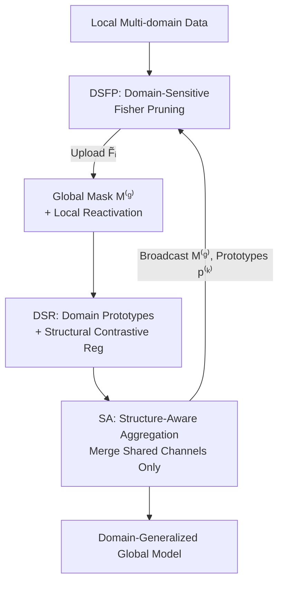

# Domain Sensitive Federated Learning with Fisher-Informed Pruning

**Conference**: CVPR 2026  
**Paper**: [CVF Open Access](https://openaccess.thecvf.com/content/CVPR2026/html/Lin_Domain_Sensitive_Federated_Learning_with_Fisher_Informed_Pruning_CVPR_2026_paper.html)  
**Code**: None  
**Area**: Federated Learning / Model Pruning / Optimization  
**Keywords**: Federated Learning, Domain Shift, Fisher Information Pruning, Personalized Sparse Models, Structural Contrastive Regularization  

## TL;DR
FEDFIP estimates channel importance using domain-specific Fisher information to assemble a globally shared pruning mask on the server, while clients "reactivate" a small number of locally critical channels. Combined with domain-prototype structural contrastive regularization and a "shared-channel-only" aggregation strategy, it significantly compresses models while achieving higher accuracy and stability than mainstream FL baselines in multi-domain federated scenarios.

## Background & Motivation
**Background**: Federated Learning (FL) enables multiple clients to collaboratively train a shared model without exchanging raw data. FedAvg is the most classic paradigm, where parameters are weighted and averaged on the server after multiple local updates. To reduce communication and computation overhead, pruning has been widely introduced, allowing clients to train and upload only a compact sub-network.

**Limitations of Prior Work**: In real-world scenarios, a client often holds data from **multiple distribution domains** (intra-client domain skew), whereas most FL methods assume each client has only a single domain. Domain shift brings two specific problems: first, gradient directions from different domains conflict, causing heterogeneous updates to cancel each other out or be dominated by a single domain, which slows convergence and harms stability. Second, the global model is forced to accommodate incompatible feature distributions, making it difficult to learn domain-invariant representations, eventually leading to overfitting on dominant domains and marginalizing weak domains.

**Key Challenge**: The authors distill these contradictions into two challenges. **Challenge I (Structural Misalignment under Domain-Heterogeneous Pruning)**: Different domains induce distinct channel importance; a one-size-fits-all unified mask discards channels critical to certain local domains. Furthermore, a single sparse structure cannot satisfy the divergent needs where "some domains require wider/deeper paths while others favor compact specialized routes," undermining aggregation consistency. **Challenge II (Structural Ambiguity and Cross-Domain Semantic Entanglement)**: Even if locally important channels are preserved, structurally similar channels may be reused to encode semantically different domains, causing the shared sparse backbone to mix mutually exclusive semantics and weakening domain discriminability. Traditional personalization or aggregation operates at the client granularity, ignoring finer domain-level differences.

**Core Idea**: Instead of pursuing a global sparse structure that is "good for all domains," pruning should be **domain-sensitive**. Fisher information is used to measure channel importance at the domain level. A global shared mask ensures structural alignment and compression, while clients reactivate a few private channels based on local Fisher information for personalization. Domain prototypes and structural contrastive regularization are employed to separate different domains in the structural space, and only shared sub-structures are aggregated to maintain global consistency.

## Method

### Overall Architecture
FEDFIP addresses the problem of "compressing models while balancing global alignment and local personalization in multi-domain federated settings." The input is each client's local multi-domain dataset $D_i=\bigcup_{k=1}^{K_i} D_i^{(k)}$, and the output is a domain-generalized global sparse model plus personalized sparse sub-networks for each client. The pipeline consists of three core modules during each communication round:

- **DSFP (Domain-Sensitive Fisher Pruning)**: Clients estimate channel Fisher importance per domain $\rightarrow$ Server aggregates these into global importance and applies a threshold to obtain a global mask $M^{(g)}$ $\rightarrow$ Clients reactivate a few channels that were globally pruned but remain locally important.
- **DSR (Domain-Sensitive Regularization)**: The server constructs domain prototypes $p^{(k)}$ from structural vectors uploaded by clients (via EMA smoothing) and broadcasts them; clients use structural contrastive loss to pull their local domain structures closer to their respective prototypes while pushing others away.
- **SA (Structure-Aware Aggregation)**: Clients upload only the parameters of the globally shared channels $C_{\text{shared}}$. The server performs weighted averaging only on these aligned channels; reactivated private channels participate only in local forward/backward passes and are excluded from aggregation.

### Key Designs

**1. DSFP: Decoupling "Global Alignment" and "Local Personalization" into Two-Layer Masks using Per-Domain Fisher Information**

To address Challenge I, DSFP splits channel selection into "globally shared" and "locally reactivated" steps. First, for the $k$-th domain of client $i$, channel $j$ importance is estimated using the square of the task loss gradient (diagonal approximation of the Fisher Information Matrix):

$$F_{i,j}^{(k)} = \mathbb{E}_{x\sim D_i^{(k)}}\Big[\big(\tfrac{\partial L_{\text{task}}(x;w)}{\partial w_j}\big)^2\Big]$$

This requires only one additional backward pass without second-order operations. To save communication, local domain weights $\alpha_i^{(k)}=|D_i^{(k)}|/|D_i|$ are used to compress this into a weighted average vector $\tilde F_{i,j}=\sum_k \alpha_i^{(k)}F_{i,j}^{(k)}$ for upload (fine-grained $F_{i,j}^{(k)}$ stays local). The server aggregates these into global importance $F_j^{(g)}$ and keeps the top-$\rho C$ channels based on the target sparsity $\rho$ to obtain the global mask $M_j^{(g)}$.

The second step is **conservative local reactivation**: Clients receive $M^{(g)}$ and select channels from the pruned set ($M_j^{(g)}=0$) whose local importance exceeds a threshold $\phi$. The reactivation indicator is $R_{i,j}=\mathbb{1}(\tilde F_{i,j}>\phi)(1-M_j^{(g)})$, leading to the final mask $M_{i,j}^{\text{final}}=M_j^{(g)}\vee R_{i,j}$. This ensures all clients align on shared channels for effective aggregation while providing local expressivity; private channels contribute to training but are **neither uploaded nor aggregated**.

**2. DSR: Treating "Channel Importance Distribution" as Structural Signatures for Cross-Domain Contrast**

To address Challenge II, DSR recognizes that **"which channels are important in the shared sub-network" is a structural fingerprint of a domain**. Clients calculate normalized importance vectors on the globally preserved channels:

$$V_{i,j}^{(k)} = \frac{F_{i,j}^{(k)}\cdot M_j^{(g)}}{\sum_{j'} F_{i,j'}^{(k)}\cdot M_{j'}^{(g)}}$$

The server aggregates these into domain prototypes $\tilde p^{(k)}$ and smoothes them via EMA $p^{(k)}\leftarrow\mu\, p^{(k)}+(1-\mu)\tilde p^{(k)}$ before broadcasting. Clients treat $V_i^{(k)}$ as the anchor, the corresponding $p^{(k)}$ as the positive sample, and other domain prototypes as negative samples in a softmax contrastive loss:

$$L_{\text{con}} = -\sum_{k=1}^{K_i}\log\frac{\exp(\text{sim}(V_i^{(k)},p^{(k)}))}{\sum_{k'=1}^{K}\exp(\text{sim}(V_i^{(k)},p^{(k')}))}$$

The total loss is $L_i^{\text{total}}=L_i(w)+\lambda\,L_{\text{con}}$. This regularization occurs **only on Fisher structural vectors**, avoiding raw inputs or feature embeddings, thereby enhancing domain-specific structural signatures while maintaining privacy.

**3. SA: Aggregating Only "Structurally Aligned" Shared Channels**

Because DSFP allows each client to have a distinct personalized sparse structure, standard "homogeneous average" aggregation no longer applies. SA merges only the parameters of the shared channel set $C_{\text{shared}}$:

$$w_j^{t+1}=\sum_{i=1}^{N}\frac{|D_i|}{\sum_m|D_m|}\cdot w_{i,j}^{t},\quad \forall j\in C_{\text{shared}}$$

Reactivated channels outside $M^{(g)}$ remain strictly local. However, since local training occurs on the **complete personalized model**, these private channels indirectly influence the optimization of shared channels through backpropagation.

## Key Experimental Results

### Main Results
Evaluated on three multi-domain image classification benchmarks (Digits / Office-Caltech / PACS; 4 domains, ResNet-18 backbone, 20 clients, 100 rounds). Metrics include mean Top-1 accuracy (AVG) and standard deviation (STD) across domains.

| Method | Digits AVG | Office-Caltech AVG | PACS AVG |
|--------|------------|--------------------|----------|
| FEDAVG | 74.35 | 55.39 | 77.89 |
| MOON | 74.11 | 54.91 | 78.76 |
| DAPPERFL (Pruning) | 75.87 | 60.53 | 80.58 |
| FEDHEAL | 76.22 | 63.12 | 80.65 |
| FDSE (Runner-up) | 76.19 | 63.28 | 81.37 |
| **FEDFIP (Ours)** | **76.48** | **64.44** | **82.02** |

FEDFIP achieved the highest AVG across all three benchmarks and maintained the lowest STD on Office-Caltech and PACS, indicating superior robustness against cross-domain variance.

### Ablation Study
Incremental addition of modules (Office-Caltech results):

| Configuration | AVG | STD | Description |
|---------------|-----|-----|-------------|
| Baseline (FEDAVG) | 55.39 | 11.46 | No modules |
| DSFP + SA | 58.78 | 8.92 | Domain-sensitive pruning provides original gain |
| DSFP + DSR | 61.93 | 7.11 | Contrastive regularization improves performance |
| Full (DSFP+DSR+SA) | **64.44** | **5.99** | Maximum accuracy and stability |

### Key Findings
- **DSFP is the primary driver**: Adding DSFP alone provides the largest jump over the baseline, validating that domain-level pruning is the core source of performance gain.
- **Compression vs. Accuracy**: On Digits, increasing sparsity $\rho$ from 0.2 to 0.8 saw AVG rise from 57.58% to 74.44%, while significantly reducing parameters and FLOPs compared to FDSE and DAPPERFL.
- **Hyperparameter Sensitivity**: Performance increases monotonically with $\rho$; local threshold $\phi$ must be tuned carefully (too high causes drops), and $\mu, \lambda$ have optimal ranges ($\mu \in \{0.4, 0.5\}, \lambda \in \{0.005, 0.01\}$).

## Highlights & Insights
- **Decoupling masks into "Global Shared + Local Reactivated"** resolves the conflict between structural alignment and local expressivity in federated pruning.
- **Fisher vectors as structural signatures** for contrastive learning is a clever design that performs domain alignment in the structural space rather than the feature space, reducing privacy risks and communication costs.
- **Computational Efficiency**: The same Fisher information $F_{i,j}^{(k)}$ is reused for pruning, reactivation, and regularization, amortizing the overhead of an extra backward pass across the entire pipeline.

## Limitations & Future Work
- Experimental verification is limited to ResNet-18 and small-scale image benchmarks; scalability to large models or NLP tasks is unexplored.
- The method introduces four hyperparameters ($\rho, \phi, \mu, \lambda$) which require tuning; adaptive parameter setting in real-world FL remains a challenge.
- Reactivated channels increase local model size; while communication is saved, local computation might not decrease as much as the global sparsity suggests.

## Related Work & Insights
- **vs. FedAvg / FedProx / MOON**: These address general data heterogeneity through proximal terms or feature contrast but do not explicitly model structural domain shift.
- **vs. FDSE / DAPPERFL**: While these handle inter-client shift, they often fail when a single client contains multiple domains (intra-client skew). FEDFIP's per-domain Fisher modeling provides a finer-grained solution.
- **vs. Prototype FL**: Traditional methods use class-level prototypes in feature space; FEDFIP moves prototypes to the "Fisher structure level," offering a more efficient alignment mechanism.

## Rating
- Novelty: ⭐⭐⭐⭐ 
- Experimental Thoroughness: ⭐⭐⭐ 
- Writing Quality: ⭐⭐⭐⭐ 
- Value: ⭐⭐⭐⭐ 

<!-- RELATED:START -->

## Related Papers

- [\[CVPR 2026\] Single-Round Scalable Analytic Federated Learning](single-round_scalable_analytic_federated_learning.md)
- [\[CVPR 2026\] HiLoRA: Hierarchical Low-Rank Adaptation for Personalized Federated Learning](hilora_hierarchical_low-rank_adaptation_for_personalized_federated_learning.md)
- [\[CVPR 2026\] FedRG: Unleashing the Representation Geometry for Federated Learning with Noisy Clients](fedrg_unleashing_the_representation_geometry_for_federated_learning_with_noisy_c.md)
- [\[CVPR 2026\] FedRAC: Rolling Submodel Allocation for Collaborative Fairness in Federated Learning](fedrac_rolling_submodel_allocation_for_collaborative_fairness_in_federated_learn.md)
- [\[CVPR 2026\] FedAlign: Differentially Private Distribution Alignment for Non-IID Federated Learning](fedalign_differentially_private_distribution_alignment_for_non-iid_federated_lea.md)

<!-- RELATED:END -->
