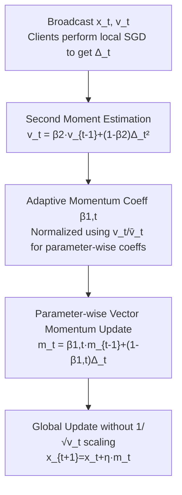

# FedAdamom: Adaptive Momentum for Improved Generalization in Federated Optimization

**Conference**: CVPR 2026  
**Paper**: [CVF Open Access](https://openaccess.thecvf.com/content/CVPR2026/html/Hou_FedAdamom_Adaptive_Momentum_for_Improved_Generalization_in_Federated_Optimization_CVPR_2026_paper.html)  
**Code**: https://github.com/Tenshawn/FedAdamom  
**Area**: Federated Learning / Optimization  
**Keywords**: Federated Learning, Adaptive Optimization, Adaptive Momentum, Flat Minima, Diffusion Theory  

## TL;DR
This paper uses diffusion theory to explain the root cause of why "FedAdam converges fast but generalizes poorly"—the adaptive learning rate weakens the preference for flat minima. Based on this, FedAdamom is proposed: shifting the adaptive mechanism from the learning rate to the **momentum coefficient**. This preserves the ability to quickly escape saddle points while restoring the selection of flat minima, simultaneously achieving faster convergence and higher accuracy on CIFAR-10/100, Tiny-ImageNet, and LEAF.

## Background & Motivation

**Background**: In Federated Learning (FL), the server broadcasts the global model to several clients, each performs SGD on local data, and transmits updates back to the server for aggregation. FedAvg is the baseline, essentially equivalent to performing a single SGD step on the "pseudo-gradient" $\Delta_t$ at the server side. To accelerate training, **adaptive federated optimizers** like FedAdam adopt Adam to the server side using second moments for adaptive learning rates, achieving significantly faster convergence and becoming a standard acceleration scheme.

**Limitations of Prior Work**: Although FedAdam converges rapidly, its **generalization often shows no significant improvement or even degrades** under highly heterogeneous (non-i.i.d.) data. Similar observations exist in centralized training: Adam tends to converge to sharper minima, which usually correspond to poorer generalization. FedAdam inherits this issue in FL, and there has been a lack of theoretical explanation for its optimization/generalization mechanism.

**Key Challenge**: The authors decompose the problem into two tasks using diffusion theory—**escaping saddle points** (affecting convergence speed) and **escaping sharp minima to select flat minima** (affecting generalization). Theoretical analysis reveals that escape times for FedAvg/FedAvgM satisfy $\log(\tau)=O(H_{ae}^{-1})$, whereas FedAdam satisfies $\log(\tau)=O(H_{ae}^{-1/2})$. This implies that FedAdam's global updates have a **weaker dependence on the Hessian (sharpness of the minima)**, making it insufficiently "picky" when escaping sharp minima. Its speed in escaping saddle points comes from making momentum drift and diffusion approximately isotropic and independent of the Hessian, but this same property weakens its preference for flat minima. Furthermore, local and global loss landscapes are inconsistent under heterogeneous data; local flat minima do not guarantee global flatness.

**Goal**: To design a global optimizer that escapes saddle points as quickly as adaptive methods while selecting flat minima like FedAvg, without increasing communication or computational overhead.

**Core Idea**: The culprit is the $1/\sqrt{v_t}$ scaling in the "adaptive learning rate," which destroys sensitivity to the Hessian. The solution is to **move the adaptation from the learning rate to the momentum parameter**—retaining the second-moment information advantage for saddle point escape while removing the harm to flat minima selection.

## Method

### Overall Architecture
FedAdamom is a **server-side global optimizer**. The skeleton of each communication round is identical to FedAvg/FedAdam (broadcast → local client SGD → upload updates → server aggregation). The only modification occurs in how the server updates the global model using the aggregated pseudo-gradient.

Specifically, at round $t$: the server selects a batch of clients $S_t$, broadcasts global parameters $x_t$ (and second moments $v_t$); each client performs $K$ local SGD steps to obtain displacement $\Delta x_t^i = x_{t,K}^i - x_{t,0}^i$ and sends it back; the server aggregates these into a pseudo-gradient $\Delta_t = \frac{1}{s}\sum_{i\in S_t}\Delta x_t^i$. Critically, while FedAdam uses an update like $x_{t+1}=x_t+\eta\,m_t/(\sqrt{v_t}+\epsilon)$ with **$1/\sqrt{v_t}$ scaling**, FedAdamom uses $v_t$ to **generate a parameter-wise momentum coefficient** $\beta_{1,t}$, then performs a standard momentum update $x_{t+1}=x_t+\eta\,m_t$—**without** dividing by $\sqrt{v_t}$ in the update formula.

### Key Designs

**1. Diffusion Theory Diagnosis: Locating the root cause of "trading generalization for speed"**

This is the theoretical foundation. The authors model the process of SGD escaping critical points as a diffusion process driven by the Langevin equation $dx=-\nabla f(x)dt+[\eta C(x)]^{1/2}dW_t$. The probability density follows the Fokker–Planck equation, allowing the analytical calculation of the **mean escape time** $\tau$ from a sharp minimum $a$ through a saddle point $b$ to a flat minimum $d$. Derivations for the three optimizers are:

$$\log(\tau_{\text{FedAvg}})=O\!\Big(\tfrac{2B\Delta f}{\eta\eta_l H_{ae}}\Big),\quad \log(\tau_{\text{FedAvgM}})=O\!\Big(\tfrac{2(1-\beta)B\Delta f}{\eta\eta_l H_{ae}}\Big),\quad \log(\tau_{\text{FedAdam}})=O\!\Big(\tfrac{2\sqrt{B}\Delta f}{\eta\eta_l\sqrt{H_{ae}}}\Big)$$

Two conclusions are key: first, FedAvg and FedAvgM are both $O(H_{ae}^{-1})$, indicating **momentum itself does not affect escape from minima** (it only affects saddle point escape/speed); second, FedAdam is $O(H_{ae}^{-1/2})$, where the dependence on the Hessian eigenvalue $H_{ae}$ in the escape direction is reduced by half a power. When $H_{ae}$ is large (sharper minima), the escape time for FedAvg decreases more drastically than for FedAdam—meaning FedAvg is more "willing" to escape sharp minima and eventually stay at flatter ones. This explains why FedAdam converges fast but generalizes poorly: **the adaptive learning rate makes global updates approximately isotropic and decoupled from the Hessian**, accelerating saddle point escape but sacrificing flat minima selection.

**2. Adaptive Momentum Parameter $\beta_{1,t}$: Shifting "adaptation" from learning rate to momentum**

Since the root cause is $1/\sqrt{v_t}$ scaling, FedAdamom **stops using the second moment to scale the step size**. Instead, it constructs an adaptive momentum coefficient. Specifically, the server maintains the second moment $v_t=\beta_2 v_{t-1}+(1-\beta_2)\Delta_t^2$, calculates the mean of all elements $\bar v_t=\frac{1}{d}\sum_i v_{t,i}$, and sets:

$$\beta_{1,t}=\Big(1-\frac{v_t}{\bar v_t}\Big)\cdot\mathrm{Clip}(0,\,1-\epsilon)$$

The intuition: when the second moment $v_{t,i}$ of a specific coordinate is large relative to the global mean (high gradient variance, high noise), $1-v_{t,i}/\bar v_t$ decreases, leading to a lower momentum coefficient $\beta_{1,t}$ and shorter momentum memory for that coordinate. Conversely, directions with small variance have more persistent momentum. Clipping to $[0,1-\epsilon]$ ensures valid momentum coefficients. Then, a standard momentum update is performed: $m_t=\beta_{1,t}m_{t-1}+(1-\beta_{1,t})\Delta_t$, followed by $x_{t+1}=x_t+\eta m_t$. Thus, adaptivity is retained in "momentum memory length," while **the global step size is no longer anisotropically stretched by $1/\sqrt{v_t}$**.

**3. Parameter-wise Vectorized Momentum + Removing $1/\sqrt{v}$ Scaling: Preserving both saddle point escape and flat minima selection**

$\beta_{1,t}$ is a **vector with the same dimension as the parameters**, providing parameter-wise adaptivity. The authors re-derived the mean square displacement of FedAdamom near saddle points and found its momentum drift term $\frac{\sum_i|H_i|\eta^2\eta_l^2}{nB}+\frac{|H_i|\eta^2\eta_l^2 T}{B}$ remains approximately isotropic and independent of the Hessian—**preserving saddle point escape efficiency** (the source of FedAdam's speed). Simultaneously, because the $1/\sqrt{v_t}$ scaling is removed, the behavior of escaping minima is re-linked to the Hessian:

$$\log(\tau_{\text{FedAdamom}})=O\!\Big(\tfrac{2B\Delta f}{\eta\eta_l H_{ae}}\Big)=O(H_{ae}^{-1})$$

This is the same order as FedAvg, **restoring the preference for flat minima** and ensuring consistency between global and local updates in "escaping sharp minima." In short: FedAdamom acts like FedAdam for "saddle point escape" and like FedAvg for "flat minima selection," combining the advantages of both without adding communication or client-side computation overhead.

### Loss & Training
There are no additional loss terms; the objective remains the standard FL global empirical risk $\min_x \frac{1}{n}\sum_i F_i(x)$. The authors provide a convergence upper bound under general non-convex, partial participation settings: when $\eta_l=O(1/(LK\sqrt T))$ and $\eta=O(\sqrt{sK})$,

$$\frac{1}{T}\sum_{t=0}^{T-1}\mathbb{E}\|\nabla f(x_t)\|^2\le O\!\Big(\tfrac{L\Theta_0}{\sqrt{sKT}}+\tfrac{\beta_{1,\max}}{1-\beta_{1,\max}}\big(\tfrac{\sigma_l^2}{KT}+\tfrac{\sigma_g^2}{T}+\Psi\big)\Big)$$

This rate is comparable to the optimal convergence rates of existing FL methods (FedAdam, etc.), and the proof **does not rely** on the bounded global/local gradient assumptions required by FedAdam.

## Key Experimental Results

### Main Results
Settings: 100 clients, 5% participation per round (medium scale), ResNet-18, Dirichlet partition for heterogeneous data. Reported metrics are communication rounds to reach target accuracy (lower is better) and accuracy at fixed rounds (higher is better).

| Dataset | Metric | FedAdamom | Best Baseline | Gain |
|--------|------|-----------|----------|------|
| CIFAR-10 | Acc@1000R | **88.93** | FADAS 88.14 | +0.79 |
| CIFAR-10 | Rounds to 81% | **307** | FedCAda 325 | −18 rounds |
| CIFAR-100 | Acc@1000R | **57.58** | FADAS 54.67 | +2.91 |
| CIFAR-100 | Rounds to 50% | **392** | FedAvgM 435 | −43 rounds |
| Tiny-ImageNet | Acc@1000R | **47.38** | FADAS 43.83 | +3.55 |
| Tiny-ImageNet | Rounds to 40% | **353** | FADAS 517 | −164 rounds |

Comparison with FedAdam: CIFAR-100 1000R increased from 53.67% → 57.58% (+3.9), Tiny-ImageNet from 41.75% → 47.38% (+5.6). The generalization advantage of FedAdamom over FedAdam grows as heterogeneity and task difficulty increase.

Results on LEAF real-world heterogeneous datasets (2000 clients, 5 sampled per round, featuring feature shift and data imbalance):

| Dataset | Metric | FedAdamom | Best Baseline |
|--------|------|-----------|----------|
| FEMNIST | Acc@500R | **82.85** | FedAvgM 82.32 |
| CelebA | Acc@500R | **89.95** | FedAvgM 89.41 |
| Shakespeare | Acc@1000R | **48.02** | FedYogi 47.10 |

### Ablation Study
CIFAR-10, 1000 rounds, 100 clients, 5% participation, scanning second-moment decay $\beta_2$:

| $\beta_2$ | 0.01 | 0.05 | 0.1 | 0.2 | 0.3 |
|------|------|------|------|------|------|
| Dir(0.3) Acc | 88.75 | **88.93** | 88.73 | 88.42 | 88.13 |
| i.i.d. Acc | 91.73 | **91.83** | 91.47 | 91.41 | 91.32 |

Accuracy remains stable and high within the range of 0.01–0.3 for $\beta_2$, peaking at 0.05, indicating low sensitivity to this hyperparameter.

### Key Findings
- **Generalization gain stems from "relocated adaptivity"**: Moving adaptation from the learning rate to momentum yields the largest gains on difficult tasks like CIFAR-100/Tiny-ImageNet (+3.9 / +5.6), confirming the theoretical judgment that $1/\sqrt v$ scaling hurts flat minima selection.
- **Loss landscape visualization**: The global minimum reached by FedAdamom is significantly flatter with lower loss than FedAdam/FedAvgM, directly corresponding to better generalization.
- **Escape rate experiments verify theory**: On the Styblinski-Tang test function, FedAdamom and FedAvgM satisfy $-\log(\Gamma)=O(k^{-1})$ (Pearson 0.998), while FedAdam only satisfies $O(k^{-1/2})$, quantitatively confirming that FedAdam's escape from sharp minima has a weaker dependence on the Hessian.
- **Overhead comparison**: FedCAda requires 3× communication per round (transmitting both model and gradient information); FAFED is designed for full participation and its performance drops sharply with partial participation. FedAdamom only transmits model parameters without extra overhead yet outperforms overall.

## Highlights & Insights
- **Clean "diagnosis-to-cure" paradigm**: Using diffusion theory to decouple speed and generalization into saddle point escape vs flat minima selection mechanisms, identifying $1/\sqrt v$ scaling as the culprit, and precisely modifying only that part. The causal chain between theory and algorithm is very clear.
- **"Adaptivity in momentum rather than step size" is a transferable insight**: Adaptive optimizers by default use the second moment for step size scaling; this paper shows that using it to adjust momentum memory length is an alternative route. This perspective could be transferred back to centralized Adam-like optimizers to alleviate their sharp minima issues.
- **Zero additional overhead**: Unlike many FL improvements that add communication or client computation, FedAdamom only changes a single line of server-side update logic, making it highly practical for deployment.
- **Theoretical consistency**: The escape time powers ($O(H_{ae}^{-1})$ vs $O(H_{ae}^{-1/2})$) provide an explanation and are quantitatively verified by synthetic function experiments.

## Limitations & Future Work
- Theoretical analysis relies on three assumptions (Assumption 1–3: quadratic approximation, quasi-equilibrium, low temperature). Whether these hold on the complex landscapes of real deep networks is not fully discussed.
- Experiments are concentrated on image classification (ResNet-18/LeNet-style CNNs) and LEAF; gains of adaptive momentum on larger models or NLP/detection tasks remain to be verified.
- The use of global mean $\bar v_t$ for normalization in $\beta_{1,t}=(1-v_t/\bar v_t)\cdot\mathrm{Clip}$ might not be robust for heavy-tailed second-moment distributions.
- Potential improvements: turning "adaptive learning rate + adaptive momentum" into a tunable hybrid, or making the construction of $\beta_{1,t}$ adaptive to data heterogeneity $\alpha$.

## Related Work & Insights
- **vs FedAdam / FedYogi / FedAdagrad**: These put adaptation on the **learning rate** ($1/\sqrt{v_t}$ scaling), converging fast but weakening flat minima selection and hurting generalization; FedAdamom puts adaptation on the **momentum coefficient**, preserving saddle point escape while restoring flat minima preference.
- **vs FedAvgM**: Both satisfy $O(H_{ae}^{-1})$ for minima escape and can select flat minima, but FedAvgM uses fixed scalar momentum, making its saddle point escape inferior to adaptive methods; FedAdamom uses parameter-wise adaptive momentum driven by the second moment for faster saddle point escape.
- **vs FedCAda / FAFED / FADAS**: These adaptive FL methods either require extra communication (FedCAda 3×), are designed for full participation (FAFED), or introduce asynchronous mechanisms; FedAdamom adds no overhead and outperforms in most settings.

## Rating
- Novelty: ⭐⭐⭐⭐⭐ Shifting adaptation from learning rate to momentum combined with diffusion theory diagnosis is a novel and theoretically supported angle.
- Experimental Thoroughness: ⭐⭐⭐⭐ Covers CIFAR/Tiny-ImageNet/LEAF and multiple baselines, including landscape and escape rate verification, though task domains are image-heavy.
- Writing Quality: ⭐⭐⭐⭐ Clear causal chain from theory to algorithm, though core derivations are mostly in the appendix.
- Value: ⭐⭐⭐⭐⭐ Stabilizing generalization gains by changing one line of logic with zero overhead is highly friendly for FL practitioners.

## Related Papers

- [\[NeurIPS 2025\] Efficient Adaptive Federated Optimization](../../NeurIPS2025/optimization/efficient_adaptive_federated_optimization.md)
- [\[CVPR 2026\] HFedATM: Hierarchical Federated Domain Generalization via Optimal Transport and Regularized Mean Aggregation](hfedatm_hierarchical_federated_domain_generalization_via_optimal_transport_and_r.md)
- [\[ICML 2025\] FedSWA: Improving Generalization in Federated Learning with Highly Heterogeneous Data via Momentum-Based Stochastic Controlled Weight Averaging](../../ICML2025/optimization/fedswa_improving_generalization_in_federated_learning_with_highly_heterogeneous_.md)
- [\[CVPR 2026\] Fed-ADE: Adaptive Learning Rate for Federated Post-adaptation under Distribution Shift](fed-ade_adaptive_learning_rate_for_federated_post-adaptation_under_distribution_.md)
- [\[CVPR 2026\] Dynamic Momentum Recalibration in Online Gradient Learning](dynamic_momentum_recalibration_in_online_gradient_learning.md)

<!-- RELATED:END -->

<!-- RELATED:START -->

## Related Papers

- [\[CVPR 2026\] FedARA: Resource-adaptive Low-rank Personalized Federated Learning via Anchor-driven Representation Alignment on Heterogeneous Edge Devices](fedara_resource-adaptive_low-rank_personalized_federated_learning_via_anchor-dri.md)
- [\[CVPR 2026\] GDFA: Geometry-Driven Federated Unlearning with Directional Task Vector Alignment](gdfa_geometry-driven_federated_unlearning_with_directional_task_vector_alignment.md)
- [\[CVPR 2026\] Personalized Federated Training of Diffusion Models with Privacy Guarantees](personalized_federated_training_of_diffusion_models_with_privacy_guarantees.md)
- [\[CVPR 2026\] Domain Sensitive Federated Learning with Fisher-Informed Pruning](domain_sensitive_federated_learning_with_fisher-informed_pruning.md)
- [\[CVPR 2026\] HiLoRA: Hierarchical Low-Rank Adaptation for Personalized Federated Learning](hilora_hierarchical_low-rank_adaptation_for_personalized_federated_learning.md)

<!-- RELATED:END -->
