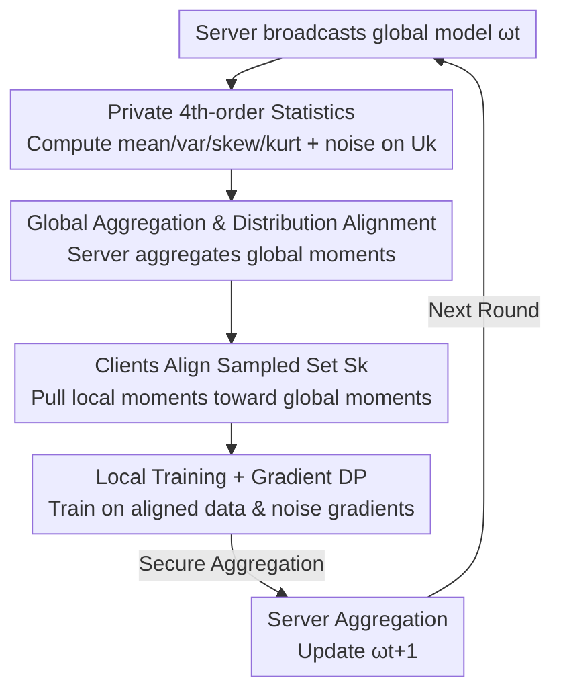

# FedAlign: Differentially Private Distribution Alignment for Non-IID Federated Learning

**Conference**: CVPR 2026  
**Paper**: [CVF Open Access](https://openaccess.thecvf.com/content/CVPR2026/html/Wu_FedAlign_Differentially_Private_Distribution_Alignment_for_Non-IID_Federated_Learning_CVPR_2026_paper.html)  
**Code**: Not available  
**Area**: Federated Learning / Optimization  
**Keywords**: Federated Learning, Non-IID, Differential Privacy, Distribution Alignment, Statistical Moments  

## TL;DR
FedAlign requires each client to upload noisy versions of the first four statistical moments (mean, variance, skewness, kurtosis) of their local data. The server aggregates these into a global reference distribution and broadcasts it back. Clients then align the distribution of their locally sampled data accordingly—mitigating both Non-IID heterogeneity and privacy leakage under differential privacy constraints, achieving a ~4% accuracy gain over strong baselines on CIFAR-10.

## Background & Motivation
**Background**: Federated Learning (FL) allows multiple clients to collaboratively train a global model without sharing raw data. The standard approach, FedAvg, aggregates local updates weighted by sample size.

**Limitations of Prior Work**: In reality, client data is usually Non-IID, which the paper categorizes into three types: label skew, quantity skew, and feature skew. These skews cause local models to drift away from the global optimum, resulting in slow convergence, high optimization variance, and low final accuracy. More subtly, heterogeneity **amplifies privacy risks**: the more distinct the distribution, the more "unique" the client's gradient becomes, making it easier for attacks like model inversion, membership inference, or gradient leakage to recover information.

**Key Challenge**: Heterogeneity degrades convergence, while Non-IID data exacerbates privacy leakage; these two issues are coupled. Existing Differentially Private FL (DP-FL) methods inject noise into gradients to prevent leakage but fall into a trilemma trade-off between privacy, utility, and convergence speed. Most current heterogeneity optimization methods (FedProx, SCAFFOLD, FedNova, FedRDN, etc.) **lack theoretical characterization** regarding how distribution differences specifically impact global convergence.

**Goal**: Under client-level differential privacy constraints, simultaneously (1) mitigate the harm of Non-IID on convergence and (2) provide a quantitative theory for "distribution difference ↔ convergence".

**Key Insight**: The authors attribute data heterogeneity to **differences in statistical moments**. Since Non-IID is essentially inconsistency in client distributions, they directly "pull" local distributions toward a global reference distribution at the statistical moment level. This alignment process only exchanges noisy statistics and never touches raw data.

**Core Idea**: Use "Noisy Statistical Moment Alignment" instead of "Shared Data/Representations" to smooth out client distribution differences. Clients upload perturbed mean/variance/skewness/kurtosis, the server aggregates them into global moments, and clients align local data accordingly to accelerate convergence while preserving privacy.

## Method

### Overall Architecture
FedAlign runs a pipeline in each communication round: "Broadcast Model → Private Statistics → Aggregate Alignment → Train & Upload". A key design choice is splitting local data into two parts: the **unsampled set $U_k$**, used exclusively to estimate local statistical moments (uploaded after adding noise), and the **sampled set $S_k$**, which is used for the actual training in the current round but aligned with global moments first. This ensures alignment follows a "global perspective" and keeps privacy noise confined to statistics and gradients without polluting the training data itself. The framework consists of four modules: server broadcasts global model → clients compute and noise four-order moments on $U_k$ → server aggregates global moments and broadcasts them → clients align $S_k$, train locally, and return noisy gradients.

### Key Designs

**1. Fourth-order Moment Private Statistics: Estimating with "Unsampled" and Training with "Sampled"**

To align distributions, one must know what each client's distribution looks like, but direct exchange of data/representations leaks privacy. FedAlign has each client $k$ split data into a sampled set $S_k$ (for training) and an unsampled set $U_k$ (for stats estimation). On $U_k$, they compute the first four moments: mean $\mu_k$, variance $\sigma_k^2$, skewness $s_k$, and kurtosis $\kappa_k$:

$$\mu_k = \frac{1}{|U_k|}\sum_{x_i\in U_k} x_i,\qquad \sigma_k^2 = \frac{1}{|U_k|}\sum_{x_i\in U_k}(x_i-\mu_k)^2$$

$$s_k = \frac{1}{|U_k|}\sum_{x_i\in U_k}\frac{(x_i-\mu_k)^3}{\sigma_k^3},\qquad \kappa_k = \frac{1}{|U_k|}\sum_{x_i\in U_k}\frac{(x_i-\mu_k)^4}{\sigma_k^4}$$

The moments reflect different properties: mean (central bias like brightness), variance (dispersion), skewness (asymmetry), and kurtosis (tailedness). Using a disjoint subset ($U_k$) avoids the coupled privacy sensitivity that comes from using the same set for both training and statistical reporting.

**2. Global Aggregation & Distribution Alignment: Pulling Local Data to "Ideal Global Distribution"**

To ensure all clients converge in the same direction, the server computes global moments by weighting received noisy statistics by sample size $n_k/N$:

$$\bar\mu = \sum_{k=1}^{K}\frac{n_k}{N}\tilde\mu_k,\quad \bar\sigma^2 = \sum_{k=1}^{K}\frac{n_k}{N}\tilde\sigma_k^2,\quad \bar s = \sum_{k=1}^{K}\frac{n_k}{N}\tilde s_k,\quad \bar\kappa = \sum_{k=1}^{K}\frac{n_k}{N}\tilde\kappa_k$$

These are viewed as the "ideal optimal distribution" for the current Non-IID scenario. The server broadcasts $\{\bar\mu,\bar\sigma^2,\bar s,\bar\kappa\}$, and each client **aligns** $S_k$ to these: $S_k' = \text{Align}(S_k;\ \mu_g,\sigma_g^2,\gamma_g,\kappa_g)$. The aligned data is then used for training. ⚠️ The paper notes "alignment by adjusting mean and variance" in experiments but lacks an explicit formula for $\text{Align}(\cdot)$; it implies linear rescaling (standardization followed by global re-scaling/shifting).

**3. Dual-layer Differential Privacy: Noise for Statistics and Gradients**

FedAlign applies DP in two places. Statistical moments are clipped ($S_{stat}$) and added with Gaussian noise to satisfy $(\varepsilon,\delta)$-DP:

$$\tilde\mu_k = \mu_k + \mathcal{N}(0,\sigma_{dp}^2),\quad \tilde\sigma_k^2 = \sigma_k^2 + \mathcal{N}(0,\sigma_{dp}^2)$$

After local training, gradients are also clipped and noised: $\tilde g_k^t = g_k^t + \mathcal{N}(0,\sigma^2 I)$, then sent back via secure aggregation. The server only sees noisy stats and noisy gradients.

**4. Theorem: The Bridge between Statistical Difference and Convergence Bound**

Theorem 1 decomposes the expected square distance between client gradients and global DP gradients into five terms: gradient bias, local variance, cross-client covariance, global covariance structure, and DP noise. Four Propositions quantify the impact of the four moments: mean difference $\Delta_{\mu,k}$ bounds the gradient bias; variance affects gradient variance; skewness satisfies $\|g_k^{DP}-g^{DP}\|^2\propto|\gamma_k-\bar\gamma|^2$; kurtosis modulates the variance by a factor of $\big(1+\frac{\kappa_k-3}{4}\big)$. Theorem 2 provides the convergence bound under non-convex $L$-smooth conditions:

$$\frac{1}{T}\sum_{t=0}^{T-1}\mathbb{E}\big[\|\nabla F(w_t)\|^2\big] \le \frac{2\Delta F}{\eta T} + \eta L\big(\sigma_{\min}^2 + \Gamma_{stat} + \sigma_{DP}^2\big)$$

Decreasing $\Gamma_{stat}$ (the moment difference) directly lowers the convergence bound.

### Loss & Training
Standard SGD is used locally: $w_{k,e+1}^t = w_{k,e}^t - \eta_l\nabla f_k(w_{k,e}^t; S_k')$ for $\tau$ epochs. The global update is $w_{t+1} = w_t - \eta\sum_{k\in W_t}\frac{n_k}{N}\tilde\Delta_k^t$. Key hyperparameters include noise scales $\sigma_{stat}$ and $\sigma_{grad}$, clipping thresholds, and the unsampled data ratio $\rho$.

## Key Experimental Results

### Main Results
Tested on CIFAR-10 / MNIST with CNN and ResNet50. Non-IID is simulated using Dirichlet $\alpha=0.5$ for label skew and Gaussian noise $\mathcal{N}(0,\beta)$ for feature skew.

| Non-IID Setting | Method | CIFAR-10 (%) | MNIST (%) |
|--------------|------|------|------|
| $\alpha=0.5,\ \beta=0.05$ | FedAvg | 49.1 | 99.13 |
| | FedProx | 51.1 | 99.08 |
| | FedNova | 52.4 | 99.04 |
| | FedRDN | 52.8 | 98.92 |
| | **FedAlign** | **54.9** | **99.26** |
| $\alpha=0.5,\ \beta=0.1$ | FedAvg | 50.7 | 99.02 |
| | FedProx | 50.5 | 99.05 |
| | FedRDN | 49.8 | 98.94 |
| | **FedAlign** | **54.3** | **99.12** |

At $\beta=0.05$, FedAlign improves CIFAR-10 accuracy by 11.9% / 7.5% / 4.8% relative to FedAvg / FedProx / FedNova. When noise increases to $\beta=0.1$, baselines drop while FedAlign remains stable at 54.3%.

### Ablation Study

| Configuration | Observation | Explanation |
|------|------|------|
| Unsampled Ratio $\rho$ | Higher $\rho$ yields better accuracy | Full $U_k$ is ~16% better than 40% at 100 rounds |
| Mean Only | Effective but insufficient | Dominates gradient bias |
| Variance Only | Effective but insufficient | Affects gradient variance |
| Mean + Variance | Significant gain | The primary drivers of drift |
| All Four Moments | Optimal | Higher moments correct tails and asymmetry |

### Key Findings
- **Mean and Variance are the primary drivers**: Ablations show 1st and 2nd order moments determine gradient bias and client drift; higher moments provide secondary corrections.
- **Accurate Global Statistics are Vital**: A larger $\rho$ allows the aggregated global moments to closer approximate the true distribution, enhancing alignment guidance.
- **Superior Robustness**: While most baselines drop as $\beta$ (feature skew) increases, FedAlign remains stable, indicating moment alignment is more robust than merely correcting updates.

## Highlights & Insights
- **Clever Split of Data**: Using a disjoint "unsampled set" to report statistics decouples statistical reporting from training data, reducing the entanglement of privacy sensitivities.
- **Moment-based Quantization of Heterogeneity**: Instead of treating Non-IID as a black box, the authors quantify it with four moments and prove that aligning moments directly equivalent to tightening the convergence bound.
- **DP for the New Channel**: FedAlign recognizes that any information leaving the client is a leakage risk. By noising both statistics and gradients, it ensures the alignment channel remains differentially private.

## Limitations & Future Work
- **Missing Align Formula**: ⚠️ The paper does not provide an explicit formula for the $\text{Align}(\cdot)$ transformation, particularly for skewness and kurtosis.
- **Restricted Data Scale**: Experiments are limited to CIFAR-10 and MNIST; performance on CIFAR-100 or Tiny-ImageNet is not reported.
- **Privacy-Utility Curves**: There is a lack of a systematic scan of accuracy degradation across different $\varepsilon$ values to judge the benefits under strict privacy budgets.
- **Simulated Feature Skew**: Simulating feature skew solely with Gaussian noise $\mathcal{N}(0,\beta)$ might be too idealized compared to real-world cross-device domain shifts.

## Related Work & Insights
- **vs FedProx / SCAFFOLD**: These correct drift at the **update/gradient** level. FedAlign aligns **data distributions** before training begins and provides a statistical moment-based convergence analysis.
- **vs FedRDN / FedMix**: These use data augmentation or shared representations that often lack DP for the statistics channel. FedAlign is more theoretically rigorous and privacy-aware.
- **vs Standard DP-FL**: Most DP-FL methods only noise gradients and suffer significant utility loss under Non-IID. FedAlign fills the gap by addressing heterogeneity through a separate, private alignment channel.

## Rating
- Novelty: ⭐⭐⭐⭐ Quantifying Non-IID with four moments and aligning them under DP is a clear, fresh perspective.
- Experimental Thoroughness: ⭐⭐⭐ limited to small datasets and lacks detailed privacy-budget scanning.
- Writing Quality: ⭐⭐⭐⭐ Theoretical derivations are logical, though key implementation details of the alignment function are missing.
- Value: ⭐⭐⭐⭐ A solid framework that makes "Alignment = Convergence Tightening" a provable proposition.

<!-- RELATED:START -->

## Related Papers

- [\[CVPR 2026\] DP-FedAdamW: An Efficient Optimizer for Differentially Private Federated Large Models](dp-fedadamw_an_efficient_optimizer_for_differentially_private_federated_large_mo.md)
- [\[CVPR 2026\] Fed-ADE: Adaptive Learning Rate for Federated Post-adaptation under Distribution Shift](fed-ade_adaptive_learning_rate_for_federated_post-adaptation_under_distribution_.md)
- [\[CVPR 2026\] Domain Sensitive Federated Learning with Fisher-Informed Pruning](domain_sensitive_federated_learning_with_fisher-informed_pruning.md)
- [\[CVPR 2026\] FedRG: Unleashing the Representation Geometry for Federated Learning with Noisy Clients](fedrg_unleashing_the_representation_geometry_for_federated_learning_with_noisy_c.md)
- [\[CVPR 2026\] FedRAC: Rolling Submodel Allocation for Collaborative Fairness in Federated Learning](fedrac_rolling_submodel_allocation_for_collaborative_fairness_in_federated_learn.md)

<!-- RELATED:END -->
