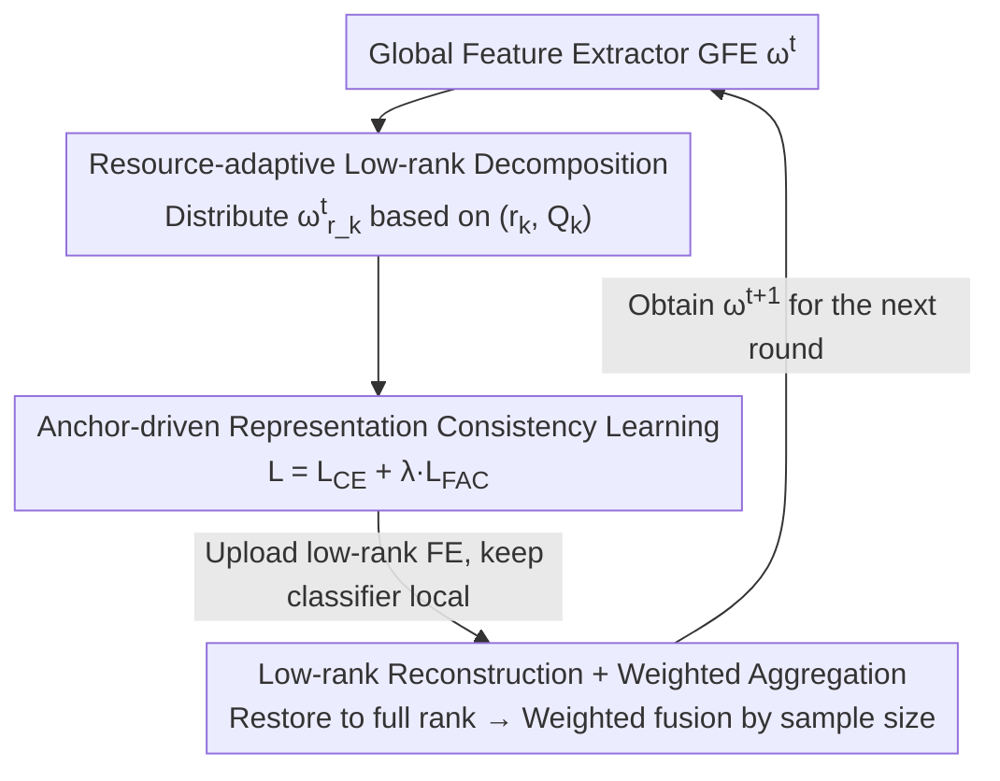

# FedARA: Resource-adaptive Low-rank Personalized Federated Learning via Anchor-driven Representation Alignment on Heterogeneous Edge Devices

**Conference**: CVPR 2026  
**Paper**: [CVF Open Access](https://openaccess.thecvf.com/content/CVPR2026/html/Zhao_FedARA_Resource-adaptive_Low-rank_Personalized_Federated_Learning_via_Anchor-driven_Representation_Alignment_CVPR_2026_paper.html)  
**Code**: None  
**Area**: Federated Learning  
**Keywords**: Personalized Federated Learning, Low-Rank Decomposition, Model Heterogeneity, Representation Alignment, Edge Devices

## TL;DR
FedARA designs the shared feature extractor into a low-rank structure that can be adaptively decomposed and reconstructed by the server based on client-specific resources, allowing heterogeneous edge devices to utilize their desired ranks. Concurrently, it computes "consistency anchors" using the aggregated global features from the server to regularize local representations, mitigating feature drift and global knowledge forgetting under non-IID settings. It outperforms 17 SOTA baselines on three datasets with lower communication and computation overhead.

## Background & Motivation

**Background**: Federated Learning (FL) allows edge devices to collaboratively train models without exchange of raw data. However, in real-world IoT scenarios, data are non-IID and device capacity (computation/memory/bandwidth) is highly heterogeneous. Standard approaches like FedAvg, which require all clients to run the same homogeneous model, heavily bottleneck training speed by the slowest device while wasting resources of capable ones. Personalized Federated Learning (PFL) has emerged to resolve this by decoupling model parameters into a **personalized part** (retained locally, usually the classifier) and a **shared part** (uploaded for aggregation, usually the feature extractor), balancing global generalization and local personalization.

**Limitations of Prior Work**: Current PFL approaches suffer from two major limitations. First, **only the personalized part can be heterogeneous, while the shared part must remain homogeneous**—since cross-client aggregation is required, the layout of the shared feature extractors must be aligned. Methods like pFedAFM and pFedES attempt to bypass this by introducing an extra small, homogeneous feature extractor on each client for interaction. However, this forces resource-constrained devices to **train two models serially**, significantly increasing the computational burden, and the knowledge transfer capacity of the small extractor is limited. Second, **the shared feature extractor drifts under non-IID settings**: different clients learn inconsistent semantic representation spaces, biasing decision boundaries for personalized classifiers. This skewed aggregation on the server further harms global generalization, leading to a vicious cycle. Worse, the knowledge of the global feature extractor is only injected once during initialization, which quickly degrades after a few local training batches, resulting in the **catastrophic forgetting of global knowledge**.

**Key Challenge**: Cross-client knowledge fusion requires a homogeneous shared part, which precludes model-level heterogeneity. Conversely, allowing the shared extractor to be truly heterogeneous violates the structural consistency needed for aggregation. Furthermore, local customization and global generalization inherently conflict, as deeper personalization accelerates the loss of global generalization knowledge.

**Goal**: To simultaneously address (1) the homogeneity constraint of the shared part and (2) the representation space inconsistency and global knowledge forgetting caused by non-IID data, without imposing additional computational burdens on the clients.

**Key Insight**: The authors observe that although low-rank decomposition has mostly been used as a "compression tool" to save FL resources, its decomposition and reconstruction process possesses an overlooked property—**low-rank matrices of different ranks can all be reconstructed back to full-rank parameters of the same dimension**. If both decomposition and reconstruction are offloaded to the server, clients only need to train low-rank versions matching their resources. The server can then reconstruct different low-rank versions back to full-rank parameters for aggregation, naturally breaking the constraint that "the shared part must be homogeneous."

**Core Idea**: Utilize "server-side low-rank decomposition/reconstruction" to allow the shared extractor to be heterogeneous on the client side while being uniformly aggregated on the server side; further, use "consistency anchors calculated from global features" to align the representation spaces of various clients during local training.

## Method

### Overall Architecture
FedARA is a decoupled PFL system: each client $k$ holds private data $D_k$ and a local model $\mathcal{F}(W_k)=\mathcal{F}(\omega_k)\circ\mathcal{H}(\theta_k)$, where $\mathcal{F}(\omega_k)$ is the feature extractor (FE) for cross-client interaction, and $\mathcal{H}(\theta_k)$ is the personalized classifier kept locally. Before training, each client **independently selects a rank ratio $r_k$ and a subset of layers to be decomposed $Q_k$** based on its own resources, constructing low-rank heterogeneous models of varying complexities.

Subsequent communication rounds ($t>1$) consist of three phases scheduled by the server: **Stage 1: Parameter Decomposition**—the server decomposes the current global feature extractor (GFE) $\omega^t$ into the corresponding low-rank form $\omega^t_{r_k}$ based on the client structural parameters $(r_k,Q_k)$ and distributes it; **Stage 2: Local Training**—clients train with consistency anchor constraints, uploading only the updated low-rank FE $\tilde\omega^t_{r_k}$ while keeping the classifier $\tilde\theta^t_k$ local; **Stage 3: Parameter Reconstruction and Aggregation**—the server uses a reconstruction operator $\mathcal{R}(\cdot)$ to restore the low-rank parameters of each client to full-rank $\tilde\omega^t_k$, and then performs weighted aggregation based on sample sizes to form the next GFE. The key ingenuity is that the computational overhead for decomposition and reconstruction is shifted to the server, relieving clients of extra burdens.

### Key Designs

**1. Resource-Adaptive Low-Rank Decomposition and Reconstruction Fusion: Enabling Heterogeneous Shared Extractors on Clients and Uniform Aggregation on the Server**

This breaks the "homogeneous shared part" constraint. For a fully connected layer $z'=\sigma(Wz)$, the weight $W\in\mathbb{R}^{m\times n}$ is decomposed into $UV^T$ ($U\in\mathbb{R}^{m\times r}$, $V\in\mathbb{R}^{n\times r}$, rank $r\ll\min\{m,n\}$), reducing multiplication and storage complexity from $O(mn)$ to $O(mr+nr)$. For a convolutional layer, the weight is reshaped into a matrix $W'=UV^T$ and then folded back to a 4D kernel, reducing storage from $O(\xi^2 c_{in}c_{out})$ to $O(\xi r(c_{in}+c_{out}))$. Each client autonomously sets its rank ratio $r_k$ and selects a layer subset $Q_k$ with larger parameters (higher redundancy) to decompose based on local resources. Smaller ranks lead to lighter models, saving communication and computation.

The highlight is that **both decomposition and reconstruction are executed on the server**: the server decomposes the GFE into $\omega^t_{r_k}$ based on $(r_k, Q_k)$ and distributes it, and clients only train and upload $\tilde\omega^t_{r_k}$ in their own low-rank spaces. Upon receiving them, the server uses a reconstruction operator to restore them to full-rank $\tilde\omega^t_k=\mathcal{R}(\tilde\omega^t_{r_k})$ (i.e., calculating $U_qV_q^T$ and reshaping). The low-rank versions from different clients are thus aligned to the **same dimension**, enabling direct weight aggregation based on sample sizes:

$$\omega^{t+1}=\sum_{k\in S_t}\frac{n_k}{n}\,\tilde\omega^t_k.$$

Consequently, the shared extractors can be heterogeneous models with different ranks on the client side while seamlessly fusing knowledge on the server side—whereas prior works either treated low-rank strictly as compression or forced clients to train an additional homogeneous small model. To guarantee the training quality of low-rank models, an extra Frobenius decay regularization term $\|U_qV_q^T\|_F^2$ is added to the decomposition layers.

**2. Anchor-Driven Representation Consistency Learning: Aligning Client Representations and Preventing Forgetting with Anchors Computed from Global Features**

This is designed to alleviate feature space drift and global knowledge forgetting under non-IID conditions. The core observation is that the aggregated GFE parameter $\omega$ contains richer generalization knowledge and provides more accurate cross-category representations. Therefore, clients should use it as a "yardstick" to align local representations. Specifically, client $k$ uses the **frozen** low-rank GFE parameter $\omega^t_{r_k}$ to compute a consistency anchor for each local category $c$ (the average feature of samples of that class):

$$P^c_k=\frac{1}{|D^c_k|}\sum_{x^c_{k,i}\in D^c_k}\mathcal{F}(\omega^t_{r_k},x^c_{k,i}).$$

Since anchors for the same category across different clients originate from the same $\omega^t$ (or its low-rank approximation), they are naturally aligned and provide a unified, stable reference in the feature space for that category. During local training, a **feature alignment consistency loss** is introduced to penalize the deviation between the sample representation $R_i=\mathcal{F}(\omega^t_{r_k},x_{k,i})$ and its true category anchor:

$$\mathcal{L}_{FAC}=\|R_i-P^{y_{k,i}}_k\|_2^2,$$

The total loss is $\mathcal{L}_k=\mathcal{L}_{CE}+\lambda\cdot\mathcal{L}_{FAC}$. This $\mathcal{L}_{FAC}$ kills two birds with one stone: it pulls the feature spaces of different clients toward the same reference to mitigate drift, and because the anchor itself embeds the generalization knowledge of the GFE, it continuously "injects" global knowledge back into the local model throughout local training, preventing catastrophic forgetting—something prior approaches that "only inject global knowledge once during initialization" fail to achieve. Note that at $t=1$, as a well-aggregated GFE is not yet available, local training does not include the anchor constraint.

### Loss & Training
The local objective is $\mathcal{L}_k=\mathcal{L}_{CE}+\lambda\cdot\mathcal{L}_{FAC}$, where the classifier and the low-rank FE are updated jointly via gradient descent $\tilde W^t_k\leftarrow W^t_k-\eta\nabla\mathcal{L}_k$. Under heterogeneous models, the constraint intensity $\lambda$ is set to 2/5/20 for CIFAR10/100/Tiny-ImageNet, respectively, and 10 under homogeneous settings. To prevent under-training of GFE in early rounds, $\lambda$ is linearly warmed up from 0 to the target value in the first 10 rounds. The Frobenius decay on the decomposed layers is fixed at $1\times10^{-3}$.

## Key Experimental Results

Settings: Client count $K=20$, local epochs 5, batch size 16, learning rate $5\times10^{-3}$, 100 communication rounds. Non-IID partitions include Dirichlet (Practical, smaller $\alpha$ indicates higher heterogeneity) and Pathological (each client only sees a few classes). Homogeneous settings use a unified 4-layer CNN (FedARA* is its low-rank variant with $r_k=0.5$). Heterogeneous settings use five models with decreasing complexity (CNN1–CNN5); FedARA applies different rank ratios to CNN1 to derive five levels. Compared against 17 SOTAs.

### Main Results

| Setting | Dataset | Metric | FedARA | Best Baseline | Gain |
|------|--------|------|--------|----------|------|
| Homogeneous Model | CIFAR10 | Average Accuracy | 88.21 | FedAS 86.77 | +1.44 |
| Homogeneous Model | CIFAR100 | Average Accuracy | 60.49 | FedAS 55.36 | +5.13 |
| Heterogeneous Model (Practical) | CIFAR10 | Accuracy | 90.84 | FedTGP 89.39 | +1.45 |
| Heterogeneous Model (Practical) | CIFAR100 | Accuracy | 54.54 | FedKD 48.75 | +5.79 |
| Heterogeneous Model (Practical) | Tiny-ImageNet | Accuracy | 38.70 | FedTGP 29.19 | +9.51 |
| Heterogeneous Model (Pathological) | CIFAR10/100/TiIM | Accuracy | 91.23 / 70.25 / 41.14 | — | +2.06 / +5.68 / +5.65 |

FedARA exhibits a more pronounced advantage in harder scenarios (more classes, higher heterogeneity), achieving a 9.51% lead under the heterogeneous Tiny-ImageNet setting. In terms of efficiency: in homogeneous scenarios, FedARA substantially lowers computational and communication costs compared to the best baseline FedAS (anchor alignment accelerates convergence), with FedARA* achieving further compression by transmitting only the low-rank FE. In heterogeneous scenarios, although the communication overhead is slightly higher than methods that only transmit class mean representations/approximate gradients (e.g., FedTGP, FedKD), the accuracy is significantly superior, and it remains more efficient than FedALA, which transmits full models.

### Ablation Study

Constraint intensity $\lambda\in\{0,0.1,0.5,1,2,5,10,20\}$ (under heterogeneous models):

| Configuration | Phenomenon | Description |
|------|------|------|
| $\lambda=0$ (Without anchor constraint) | Significant drop in accuracy | Local models are heavily affected by non-IID data, leading to large deviations in the representation space |
| Moderate increase in $\lambda$ | Faster convergence, higher final accuracy | Stronger constraints promote cross-client feature alignment |
| $\lambda=20$ (Excessive) | Slower convergence, over-regularization | Suppresses personalized knowledge extraction |

### Key Findings
- **Anchor consistency constraint is the primary source of improvement**: The performance collapses significantly when $\lambda=0$, proving that non-IID drift is severe and anchor constraints are indispensable.
- **There is a sweet spot for $\lambda$**: Too small fails to constrain the drift, while too large stifles personalization. It needs tuning based on the degree of dataset heterogeneity (up to 20 for heterogeneous Tiny-ImageNet).
- **Greater gains in more challenging scenarios**: The improvement on datasets with more classes and higher heterogeneity (CIFAR100, Tiny-ImageNet) is much larger than on CIFAR10, indicating that the method is particularly effective in difficult settings.

## Highlights & Insights
- **Elevating Low-Rank "Decomposition + Reconstruction" from a Compression Tool to a Bridge for Heterogeneous Aggregation**: Previously, low-rank structure was only used for resource saving. FedARA exploits the property that "different ranks can all reconstruct back to the same dimension" to enable shared extractors to be heterogeneous on clients while being homogeneously aggregated on the server—an elegant and novel application of an established technique.
- **Offloading Computational Burden to the Server**: Both decomposition and reconstruction are shifted to the server, and clients only train their own low-rank versions. This avoids the extra burden of "serially training two models on each device" as seen in pFedAFM, making it exceptionally friendly to resource-constrained edge devices.
- **Anchor Consistency Catching Two Birds with One Stone**: Using the class-wise means of frozen global features as anchors not only aligns representations across clients but also continuously feeds global knowledge back to prevent forgetting. This paradigm of "constraining local models using a stable reference computed on-the-fly from aggregated parameters" can be migrated to other collaborative learning tasks suffering from client drift.

## Limitations & Future Work
- Anchors are class-wise means calculated based on ground-truth category labels, implying reliance on labeled local samples of each class. Anchor quality may degrade under extreme label scarcity or heavy label noise, which is not thoroughly discussed in the paper.
- The client's rank $r_k$ and layers to be decomposed $Q_k$ must be pre-selected. The paper does not provide a systematic solution for optimal rank allocation based on device resources or whether they can be adaptively adjusted during training.
- Under heterogeneous settings, the communication cost is still higher than methods that only transmit class representations or approximate gradients (e.g., FedTGP, FedKD). This represents a trade-off of "slightly higher communication for significantly improved accuracy," which may not be optimal for extremely bandwidth-limited scenarios.
- The validation is restricted to image classification (CIFAR10/100, Tiny-ImageNet) and CNNs. Whether it can generalize to Transformers or more complex tasks like detection/segmentation remains to be verified.

## Related Work & Insights
- **vs pFedAFM / pFedES (Mutual Learning)**: These methods introduce an extra small, homogeneous feature extractor on each client for cross-client interaction, requiring serial training of two models ("small shared model + personalized model"). This causes heavy computational overhead and limited knowledge transfer from the small model. FedARA directly makes the shared extractor itself heterogeneous (low-rank), eliminating the need for an extra model and shifting the computational load to the server.
- **vs FedAS / FedRep / FedBABU (Model Decoupling)**: These approaches split the model into a shared feature extractor and a personalized classifier, but the **shared part must remain homogeneous**, and global knowledge is only injected once during initialization, which is easily forgotten during local training. FedARA breaks the homogeneity constraint via low-rank reconstruction and continuously feeds back global knowledge throughout the training via consistency anchors.
- **vs FedProto / FedTGP (Prototype/Logits)**: These methods upload local class prototypes or logits to the server for aggregation and use them to guide training, which poses privacy risks from exposing sensitive signals. FedARA transmits only the low-rank feature extractor parameters, while anchors are computed on-the-fly locally and never transmitted.

## Rating
- Novelty: ⭐⭐⭐⭐ Utilizing the "dimension reconstruction" property of low-rank decomposition/reconstruction as a bridge for heterogeneous aggregation offers a fresh perspective, though the underlying components (low-rank, prototype alignment) are recombinations of established techniques.
- Experimental Thoroughness: ⭐⭐⭐⭐ Solid validation across three datasets under both homogeneous and heterogeneous settings, covering two non-IID partitions, comparing against 17 baselines, along with training efficiency and $\lambda$ ablation studies.
- Writing Quality: ⭐⭐⭐⭐ The motivation is progressively structured, the three-phase framework is clear, and the mathematical formulations and algorithms are comprehensive.
- Value: ⭐⭐⭐⭐ Balancing both accuracy and overhead under dual heterogeneity (data and model) holds practical significance for real-world edge IoT deployments.

<!-- RELATED:START -->

## Related Papers

- [\[CVPR 2026\] HiLoRA: Hierarchical Low-Rank Adaptation for Personalized Federated Learning](hilora_hierarchical_low-rank_adaptation_for_personalized_federated_learning.md)
- [\[CVPR 2026\] GDFA: Geometry-Driven Federated Unlearning with Directional Task Vector Alignment](gdfa_geometry-driven_federated_unlearning_with_directional_task_vector_alignment.md)
- [\[CVPR 2026\] FedRG: Unleashing the Representation Geometry for Federated Learning with Noisy Clients](fedrg_unleashing_the_representation_geometry_for_federated_learning_with_noisy_c.md)
- [\[CVPR 2026\] SubFLOT: Efficient Personalized Federated Learning via Optimal Transport-based Submodel Extraction](submodel_extraction_for_efficient_and_personalized_federated_learning_via_optima.md)
- [\[CVPR 2026\] FedHarmony: Harmonizing Heterogeneous Label Correlations in Federated Multi-Label Learning](fedharmony_harmonizing_heterogeneous_label_correlations_in_federated_multi-label.md)

<!-- RELATED:END -->
