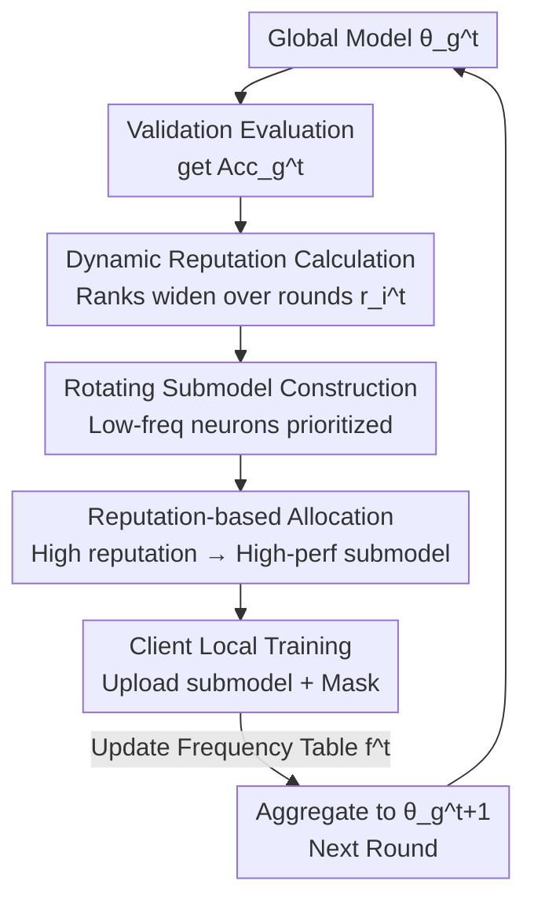

# FedRAC: Rolling Submodel Allocation for Collaborative Fairness in Federated Learning

**Conference**: CVPR 2026  
**Paper**: [CVF Open Access](https://openaccess.thecvf.com/content/CVPR2026/html/Wang_FedRAC_Rolling_Submodel_Allocation_for_Collaborative_Fairness_in_Federated_Learning_CVPR_2026_paper.html)  
**Code**: https://github.com/ZiHuiWangpcl1/FedRAC  
**Area**: Federated Learning / Collaborative Fairness  
**Keywords**: Federated Learning, Collaborative Fairness, Submodel Allocation, Dynamic Reputation, Balanced Neuron Training

## TL;DR
FedRAC introduces a "dynamic reputation calculation that evolves with training" alongside "submodel construction via historical frequency rotation followed by reputation-based allocation." This dual-module approach ensures high-contribution clients receive superior submodels (fairness) while maintaining uniform training for every neuron in the global model (accuracy). It outperforms existing collaborative fairness methods in both fairness and accuracy.

## Background & Motivation

**Background**: Federated Learning (FL) enables multiple clients to collaboratively train a global model without sharing raw data. However, client contributions are often unequal due to variations in data scale and quality. To incentivize long-term participation from high-contribution clients, "Collaborative Fairness" (CF) has become a key requirement in FL: rewards (model quality) received by a client should be proportional to their contribution. Existing CF methods are categorized into gradient-based (allocating aggregated gradients by reputation ratio) and submodel-based (allocating submodels containing "important neurons" by reputation).

**Limitations of Prior Work**: The authors identify three root causes for the accuracy degradation in existing CF methods. First, **fixed-ratio reputation calculation**: existing methods use static reputation ratios throughout training, ignoring the gradual improvement of the global model. Enforcing fixed ratios early on, when the model is naturally poor, leads to insufficient rewards and training for low-contribution clients, eventually dragging down the aggregated model. Second, **inter-model inconsistency**: gradient-based methods exchange gradients that may not match local needs, causing significant divergence between local models $\theta_1^t, \theta_2^t, \theta_3^t$, leading to a mismatch between expected and actual rewards. Third, **intra-model inconsistency**: submodel-based methods that allocate by neuron importance lead to severely uneven training frequencies across different neurons.

**Key Challenge**: There is a tension between fairness (awarding better models to high-contributors, which necessitates some clients training only partial parameters) and accuracy (requiring every neuron in the global model to be fully trained). Existing methods sacrifice either early-stage low-contributors or training consistency, trading accuracy for fairness.

**Goal & Key Insight**: The objective is to achieve CF without sacrificing global model accuracy. The approach builds on two observations: (1) Reputation should not be static but should **evolve dynamically with training**—the gap between clients should be small early on (to allow weak clients to be trained) and gradually widen later. (2) Submodel allocation should not solely depend on neuron importance but should **rotate based on the historical allocation frequency of neurons** to ensure all neurons are trained uniformly.

**Core Idea**: Replace "fixed ratios + importance-based allocation" with "dynamic reputation + frequency-rotating submodel allocation." This ensures uniform training of every global neuron while distributing high-performance submodels to high-reputation clients.

## Method

### Overall Architecture

FedRAC is a server-client FL framework that performs two tasks each round: the server calculates a **dynamic reputation** $r_i^t$ for each client, then allocates a set of "rotating submodels constructed by neuron frequency" for local training, followed by aggregation. The process consists of two phases:

- **Phase 1: Dynamic Reputation Calculation**: The server evaluates the current global model performance $\mathrm{Acc}_g^t$ on a validation set. A dynamic reputation function combines client contribution $c_i$ to calculate $r_i^t$. Crucially, this reputation evolves—gaps are small initially and widen over iterations.
- **Phase 2: Rotating Submodel Allocation**: This involves **submodel construction**, where the server maintains a neuron frequency table $f^t$ and prioritizes neurons with the lowest allocation counts to ensure uniform training. This is followed by **submodel allocation**, where submodel performance is evaluated on the validation set, and high-performance submodels are matched to high-reputation clients. After local training, clients upload submodels and masks for aggregation and frequency table updates.

### Key Designs

**1. Dynamic Reputation Calculation: Sufficient training for low-contributors in early stages**

To address the issue of fixed ratios penalizing low-contributors early on, FedRAC allows reputation to evolve. Contributions $c_i$ are first amplified using exponential normalization:

$$c_i^n = \frac{e^{\beta \cdot c_i}}{\max(e^{\beta \cdot c_i})} \times 100$$

Reputation is then dynamically calculated based on contribution and global performance $\mathrm{Acc}_g^t$:

$$r_i^t = c_i + (\mathrm{Acc}_g^t - \mathrm{tmp}_i^t)\cdot c_i^n / 100$$

$$\mathrm{tmp}_i^t = \lambda \cdot \mathrm{Acc}_g^t \cdot \Big(1 - \frac{1}{\log(\zeta \cdot t + \kappa)}\Big)$$

The term $\mathrm{tmp}_i^t$ increases with round $t$ and performance $\mathrm{Acc}_g^t$. Initially, when $t$ and $\mathrm{Acc}_g^t$ are small, $(\mathrm{Acc}_g^t-\mathrm{tmp}_i^t)$ is small, narrowing the reputation gap. This ensures low-contributors receive rewards similar to high-contributors for sufficient initial training. As rounds progress, the gap widens until it converges. Theorem 1 provides a theoretical guarantee: high-reputation clients receive submodels $\theta_i^t$ closer to the global model $\theta_g^t$ ($\delta_i^t \le \delta_j^t$), ensuring fairness.

**2. Rotating Submodel Construction: Ensuring uniform training via frequency tables**

To solve the uneven training frequency of neurons, FedRAC uses a sliding selection approach. The server maintains a frequency table $f^t \in \mathbb{N}^K$ recording cumulative allocations for each of the $K$ neurons:

$$f^0 = [0,0,\dots,0], \qquad \pi^t = \mathrm{argsort}(f^{t-1})$$

$\pi^t$ sorts neurons from least to most allocated. Binary masks $m_i^t[j]\in\{0,1\}^K$ for client $i$ are constructed by prioritizing these low-frequency neurons. This rotation ensures every neuron is eventually prioritized, maintaining architectural consistency and accuracy. Theorem 2 provides convergence guarantees based on this uniform training frequency.

**3. Reputation-based Allocation and Aggregation: Matching performance to reputation**

After constructing submodels, FedRAC evaluates their performance $\sum_{i\in S}A_{K_i}^t$ on a validation set. A nesting constraint is used where larger masks strictly encompass smaller ones. Allocation is then performed:

$$\theta_i^t = \mathrm{quantity}\big(r_i, \textstyle\sum_{i\in S} A_{K_i}^t\big)$$

High reputation matches higher performance. After $E$ local steps, submodels and masks are aggregated:

$$\theta_g^{t+1} = \frac{\sum_{i\in S}\theta_i^t}{\sum_{i\in S} m_i^t(\theta_i^t,\theta_g^{t-1})}$$

The denominator normalizes by masks to ensure correct aggregation weights for each neuron.

### Loss & Training

The objective is $\min_\theta F(\theta) := \sum_{i=1}^N p_i F_i(\theta)$. Local training uses SGD: $\theta_{i,j+1}\leftarrow \theta_{i,j} - \eta_t \nabla F_i(\theta_{i,j})$. Fairness is achieved via the allocation mechanism rather than extra regularization terms.

## Key Experimental Results

Experiments were conducted on CIFAR-10, SVHN, EMNIST, and Tiny-ImageNet with 10 clients across four heterogeneous scenarios: POW, CLA, DIR(3.0), and DIR(7.0). Fairness is measured by $\gamma = 100\times\rho(c,\theta^*)$ (Pearson correlation).

### Main Results

Fairness Comparison (SVHN, $\rho \in [-100, 100]$, higher is better):

| Method | SVHN-POW | SVHN-CLA | SVHN-DIR(3.0) | SVHN-DIR(7.0) |
|------|---------|---------|--------------|--------------|
| FedAvg | -22.21 | 87.60 | 36.03 | 39.87 |
| CFFL | 93.14 | 97.46 | 44.84 | 85.54 |
| IAFL | 98.90 | 99.55 | 97.16 | 85.28 |
| FedSAC | 97.18 | 97.21 | 95.75 | 96.47 |
| **Ours (FedRAC)** | **99.85** | **99.89** | **98.00** | **98.99** |

Accuracy Comparison (Max Test Accuracy %):

| Method | CIFAR10-POW | CIFAR10-CLA | SVHN-DIR(7.0) | EMNIST-DIR(7.0) |
|------|------------|------------|--------------|----------------|
| FedAvg | 49.10 | 42.66 | 81.77 | 83.01 |
| IAFL | 47.65 | 43.07 | 82.15 | 82.39 |
| FedSAC | 48.63 | 43.07 | 80.39 | 81.37 |
| **Ours (FedRAC)** | **49.37** | **44.28** | **82.43** | **84.00** |

### Ablation Study

Impact of modules on SVHN (w/o reputation = static reputation; w/o allocation = random submodel construction):

| Configuration | Fairness (DIR7.0) | Acc (POW) | Acc (DIR7.0) | rate (POW) |
|------|--------------|------------|---------------|-----------|
| w/o reputation | 97.01 | 73.42 | 70.56 | 1.00 |
| w/o allocation | 91.58 | 70.81 | 76.62 | 0.20 |
| **FedRAC (Full)** | **98.99** | **79.18** | **82.43** | **1.00** |

### Key Findings

- **Dynamic reputation is vital for accuracy**: Removing it drops SVHN-DIR(7.0) accuracy by 11.87%, proving that initial support for low-contributors is crucial for global model quality.
- **Rotating allocation ensures stability**: Removing it causes the **rate** metric (clients meeting fairness bounds) to plummet from 1.00 to 0.20.
- **Superiority in DIR scenarios**: FedRAC shows the largest fairness gains in highly non-IID Dirichlet distributions.

## Highlights & Insights

- **Temporal Reputation Design**: The core insight that "rewarding the weak early on does not harm final fairness" is clever. By using a logarithmic growth term in $\mathrm{tmp}_i^t$, the system bridges the gap during early training to ensure global convergence without breaking final reward rankings.
- **Decoupling Fairness and Accuracy**: The frequency table handles uniform training (accuracy), while reputation handles the matching (fairness). This prevents the two goals from competing.
- **Theoretical Rigor**: The inclusion of $\alpha$-BCF definitions and convergence proofs (Theorem 2) provides a solid foundation for empirical observations.

## Limitations & Future Work

- **Scalability**: Tested mainly on small models (ResNet18). Construction and frequency table overhead for large-scale models needs investigation.
- **Client Size**: Experiments focused on 10 clients; performance in large-scale or asynchronous FL with stragglers/dropouts is unverified.
- **Validation Data**: Assumes the server holds a representative 10% validation set, which may not always be feasible.

## Related Work & Insights

- **vs. FedSAC**: FedSAC also uses submodel rewards but suffers from static reputation and intra-model inconsistency. FedRAC resolves these by introducing dynamic evolution and frequency rotation.
- **vs. Gradient-based Methods (CFFL/IAFL)**: These suffer from inter-model inconsistency. FedRAC's submodel approach bypasses the issues of conflicting gradient updates.
- **vs. Heterogeneous FL (FedRolex)**: While FedRolex uses rolling submodels for hardware constraints, FedRAC repurposes the idea for collaborative fairness, linking it to reputation-driven rewards.

## Rating
- Novelty: ⭐⭐⭐⭐ Targetedly addresses early-stage penalization and training imbalance.
- Experimental Thoroughness: ⭐⭐⭐⭐ Strong multi-dataset validation, though client scale is limited.
- Writing Quality: ⭐⭐⭐⭐ Clear problem diagrams and modular logic.
- Value: ⭐⭐⭐⭐ High practical value for incentivizing participation in real-world FL systems.

<!-- RELATED:START -->

## Related Papers

- [\[ICLR 2026\] Personalized Collaborative Learning with Affinity-Based Variance Reduction](../../ICLR2026/optimization/personalized_collaborative_learning_with_affinity-based_variance_reduction.md)
- [\[CVPR 2026\] Domain Sensitive Federated Learning with Fisher-Informed Pruning](domain_sensitive_federated_learning_with_fisher-informed_pruning.md)
- [\[CVPR 2026\] FedRG: Unleashing the Representation Geometry for Federated Learning with Noisy Clients](fedrg_unleashing_the_representation_geometry_for_federated_learning_with_noisy_c.md)
- [\[CVPR 2026\] FedAlign: Differentially Private Distribution Alignment for Non-IID Federated Learning](fedalign_differentially_private_distribution_alignment_for_non-iid_federated_lea.md)
- [\[CVPR 2026\] Generalized and Personalized Federated Learning with Black-Box Foundation Models via Orthogonal Transformations](generalized_and_personalized_federated_learning_with_black-box_foundation_models.md)

<!-- RELATED:END -->
