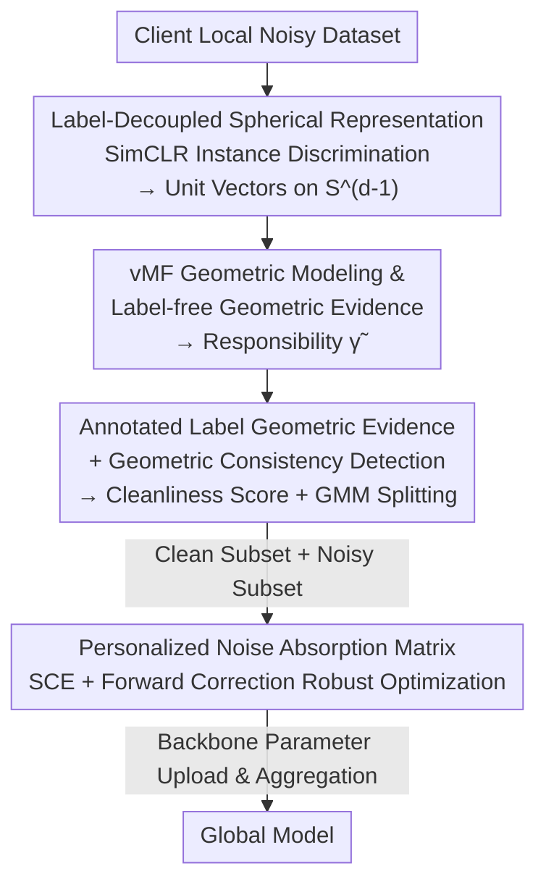

# FedRG: Unleashing the Representation Geometry for Federated Learning with Noisy Clients

**Conference**: CVPR 2026  
**Paper**: [CVF Open Access](https://openaccess.thecvf.com/content/CVPR2026/html/Wen_FedRG_Unleashing_the_Representation_Geometry_for_Federated_Learning_with_Noisy_CVPR_2026_paper.html)  
**Code**: https://github.com/Tianjoker/FedRG  
**Area**: Federated Learning / Noisy Label Learning  
**Keywords**: Federated Learning, Noisy Labels, Representation Geometry, vMF Mixture Model, Data Heterogeneity  

## TL;DR
To address the dual challenges of "noisy client annotations + Non-IID data" in Federated Learning, FedRG abandons the unreliable small-loss heuristic. Instead, it identifies clean/noisy samples based on **representation geometry**. Specifically, it first learns label-agnostic representations on a hypersphere through self-supervision, then uses a vMF mixture model to compare "geometric evidence" with "annotated label evidence" in a shared space for noise detection. Finally, it employs a personalized noise absorption matrix for robust optimization, achieving SOTA across multiple datasets and four noise scenarios.

## Background & Motivation
**Background**: Federated Learning (FL) enables multiple clients to train models collaboratively without sharing raw data. However, in real-world deployments, annotations are often imperfect due to crowdsourcing or weak supervision, introducing noisy labels into local client data. Existing "robust FL" methods (e.g., FedCorr, FedNoRo, FedClean) mostly follow the classical intuition of centralized noisy learning: distinguish clean/noisy samples based on **loss values** (small-loss heuristic), treating high-loss samples as noise.

**Limitations of Prior Work**: The authors pose Question 1—Is the small-loss heuristic still reliable in heterogeneous (Non-IID) FL scenarios? The answer is no. A primary heterogeneity in FL is label skew, where local data follows a long-tail distribution. Models tend to favor majority classes, causing **correct samples from tail classes to naturally exhibit high loss**, leading to misclassification as noise (high False Negatives). Meanwhile, deep models eventually memorize mislabeled samples, lowering their loss and causing them to be wrongly retained as clean samples. Scalar loss conflates "mislabeling," "rare-but-correct samples," and "domain shift," completely failing in heterogeneous settings.

**Key Challenge**: Noise identification requires a signal that is **neither contaminated by labels nor biased by class imbalance**. However, loss is a product of the prediction space built upon (potentially noisy) labels and biased classifiers.

**Goal**: (1) Identify a more robust criterion for "sample cleanliness" than loss; (2) Utilize the supervision signal from detected noisy samples rather than simply discarding them.

**Key Insight**: The authors shift focus from the prediction space to the **representation space**, proposing the principle of "representation geometry priority." The **intrinsic representation clustering (label-independent)** of a clean sample should align with the clustering pattern implied by its **annotated label**. Mislabeled samples, conversely, exhibit geometric inconsistency. This signal does not inherently depend on labels, thus bypassing the pitfalls of loss.

**Core Idea**: Utilize self-supervision on a hypersphere to learn label-free representations, then use a vMF mixture model to project both "geometric evidence" and "annotated label evidence" into the same semantic cluster space. **Identify noise through distribution consistency (rather than loss)**.

## Method

### Overall Architecture
FedRG is a two-stage (Stage I / Stage II) federated training framework. Each client locally performs "representation learning → noise identification → robust optimization." Only the backbone parameters are uploaded to the server for aggregation, while the vMF states and class-geometry mapping matrix $\mathbf{B}$ remain local to preserve personalized noise characteristics.

- **Stage I (Label-Decoupled Spherical Representation)**: Performs federated pre-training via SimCLR instance discrimination to encode each sample as a unit vector on the hypersphere $\mathbb{S}^{d-1}$, yielding a **label-agnostic** geometric foundation.
- **Stage II (Representation Geometry Priority Noise Identification + Robust Optimization)**: Fits a vMF mixture model on the hypersphere to extract semantic clusters → computes the "label-free geometric evidence" $\tilde{\gamma}$ for each sample → estimates "class-geometry evidence" $\mathbf{B}$ using (noisy) labels → calculates geometric cleanliness scores via inner products → partitions local samples into clean subset $D_k^c$ and noisy subset $D_k^n$ using GMM → applies SCE loss for clean samples and a personalized noise absorption matrix with forward correction for noisy samples to jointly optimize the backbone.

### Key Designs

**1. Label-Decoupled Spherical Representation: Building a label-untainted geometric base**

For noise identification to be reliable, the criterion itself must not be built upon (potentially noisy) labels. In Stage I, the authors use SimCLR instance discrimination for federated pre-training. Each sample undergoes two random augmentations, is encoded, and normalized into a unit vector $z=\frac{f_\theta(x)}{\|f_\theta(x)\|}\in\mathbb{S}^{d-1}$ on the hypersphere, optimized using the symmetric NT-Xent (InfoNCE) objective:

$$\mathcal{L}_{\text{SimCLR}}=\frac{1}{2b}\sum_{i=1}^{2b}-\log\frac{\exp(z_i^\top z_{i^+}/\tau)}{\sum_{a\neq i}\exp(z_i^\top z_a/\tau)}$$

This objective only requires "two views of the same sample to be positive pairs," **completely avoiding annotated labels**. Consequently, the resulting geometric structure is not biased by noisy labels. It promotes "alignment + uniformity" on the sphere: semantically similar samples form clusters with concentrated directions, while samples with weak structural information receive more dispersed geometric evidence. This provides a natural foundation for subsequent vMF modeling to determine cleanliness based on "whether a sample falls into a semantic cluster."

**2. vMF Mixture Geometric Modeling & Label-free Geometric Evidence: Quantifying semantic cluster assignment as soft evidence**

With spherical representations, a probabilistic model respecting directional geometry is needed. The authors choose the von Mises–Fisher (vMF) distribution, defined on a unit hypersphere, which smoothly transitions from "sharply concentrated around a mean direction" to a "directional preference-free uniform distribution." Normalized representations are modeled as a vMF mixture with a uniform background component:

$$p(z)=\pi_0\,U(z)+\sum_{g=1}^{G}\pi_g\,\mathrm{vMF}(z\mid\mu_g,\kappa_g)$$

Each vMF component $g$ corresponds to a **label-independent semantic cluster** (which may split a class into sub-patterns or capture cross-class textures). The uniform component $U(z)$ absorbs geometric outliers that do not align with any semantic pattern. The posterior responsibility $\gamma_{i,g}=\frac{\pi_g p_g(z_i)}{\sum_h \pi_h p_h(z_i)}$ represents a sample's assignment to cluster $g$. This is refined using multi-view consistency: $z_{i,1},z_{i,2}$ from two augmentations are mapped to a precision-like tempering factor $r_i$, which **flattens responsibilities** for inconsistent samples and **maintains sharp assignments** for well-aligned ones, yielding refined responsibilities $\tilde{\gamma}_{i,g}$. The set $\tilde{\Gamma}_i=\{\tilde{\gamma}_{i,1},\dots,\tilde{\gamma}_{i,G}\}$ constitutes the label-free geometric evidence—asking "which semantic clusters does this sample resemble geometrically" without ever looking at labels.

**3. Annotated Label Geometric Evidence + Geometric Consistency Detection: Comparing two types of evidence in a shared space**

Geometric evidence alone is insufficient; (noisy) annotated labels must be brought into the **same semantic cluster space** for comparison. Treating label-free semantic clusters as stable references, the authors compute the distribution of annotated samples for each class $c$ across clusters, using Dirichlet smoothing (constant $\eta>0$) to obtain the class-geometry distribution:

$$\beta_{c,g}=\frac{\sum_{i:\tilde{y}_i=c}\tilde{\gamma}_{i,g}+\eta}{\sum_{g'=1}^{G}\big(\sum_{i:\tilde{y}_i=c}\tilde{\gamma}_{i,g'}+\eta\big)}$$

Note that the summation **explicitly excludes the uniform background component $g=0$** to avoid contamination by geometric outliers. The vector $\mathbf{B}_c=\{\beta_{c,1},\dots,\beta_{c,G}\}$ describes "what class $c$ looks like in semantic geometry." Noise detection then becomes a simple inner product—the geometric cleanliness score of sample $i$ is the consistency between its geometric responsibility and its annotated class template:

$$P_i^{\text{clean}}=\langle\bar{\Gamma}_i,\mathbf{B}_{\tilde{y}_i}\rangle=\sum_{g=1}^{G}\beta_{\tilde{y}_i,g}\,\tilde{\gamma}_{i,g}$$

A high score indicates that the "cluster explaining the sample geometrically" matches the "cluster where the annotated class usually falls," signifying a clean sample. A low score implies a contradiction between geometry and label, suggesting mislabeling (high background responsibility also implicitly lowers the score). A two-component GMM is then fitted to $1-P_i^{\text{clean}}$ to split local samples into clean subset $D_k^c$ and noisy subset $D_k^n$. This detection is performed **locally** in Stage II of each communication round, with vMF states and $\mathbf{B}$ not uploaded to the server, supporting personalized noise identification in heterogeneous FL.

**4. Personalized Noise Absorption Matrix + Robust Optimization: "Correcting and Utilizing" detected noise**

Instead of discarding noisy samples, the authors introduce a **personalized noise absorption matrix** $\mathbf{T}\in\mathbb{R}^{C\times C}$ for each client, where $T_{c,c'}\approx P(\tilde{y}=c'\mid y^\star=c)$ estimates local noise transition probabilities. $\mathbf{T}$ is implemented as a linear layer following the classification head. The classifier outputs a clean label distribution $p_i$, which the absorption layer maps to the observed noisy label space via forward correction $p_i\mathbf{T}$, avoiding the need for the model to predict unknown true labels directly. The total loss combines Symmetric Cross Entropy for clean samples and forward correction loss for noisy samples:

$$\mathcal{L}=\lambda_s\mathcal{L}_{\text{SCE}}+\lambda_n\mathcal{L}_n,\qquad \mathcal{L}_n=-\frac{1}{\sum_i m_i^{\text{noisy}}+\epsilon}\sum_{i=1}^{B}m_i^{\text{noisy}}\log[(p_i\mathbf{T})_{\tilde{y}_i}+\epsilon]$$

Here $\mathcal{L}_{\text{SCE}}$ applies to all local samples (intrinsically robust), while $\mathcal{L}_n$ acts only on samples identified as noise ($m_i^{\text{noisy}}=1$) by the GMM. Crucially, $\mathbf{T}$ **remains personalized to the client and is not aggregated**, as ablation shows that aggregating it into a global matrix degrades performance because noise patterns (especially localized noise) differ across clients.

### Loss & Training
In Stage II, the vMF model is updated using the soft responsibilities of **all local samples** to capture evolving feature geometry, while the class-geometry matrix $\mathbf{B}$ is updated using **only samples identified as clean**. Both are preserved on-device across rounds. The global optimization objective is $\mathcal{L}=\lambda_s\mathcal{L}_{\text{SCE}}+\lambda_n\mathcal{L}_n$, with backbone parameters aggregated via FedAvg. ⚠️ Specific formulas for the tempering factor $r_i$ and the update details for vMF parameters $(\mu_g,\kappa_g,\pi_g)$ are provided in the appendix; refer to the original paper for full derivations.

## Key Experimental Results

### Main Results
Evaluated on CIFAR-10 / SVHN / CIFAR-100 datasets using ResNet-18 / ResNet-34 backbones. Settings: Strong Non-IID (Dirichlet $\alpha=0.1$, $K=10$ clients), noise rate $\epsilon=0.4$. Four noise scenarios = {symmetric, pairflip} × {localized, globalized}. Comparisons include 8 representative FL methods and 6 robust methods.

CIFAR-10 Main Results (Accuracy / Precision / F-score, partial):

| Configuration (CIFAR-10) | Metric | FedRG | Next Best | Notes |
|------|------|------|----------|------|
| Symmetric-localized | Acc / Prec / F | **59.99 / 70.32 / 55.31** | SymmetricCE 55.01 / FedProx 62.70 / SymmetricCE 49.78 | Leads across three metrics |
| Symmetric-globalized | Acc / Prec / F | **63.29 / 72.94 / 59.14** | SymmetricCE 59.23 / 64.55 / 54.38 | Significant lead in Accuracy |
| Pairflip-localized | Acc / Prec / F | **61.52 / 73.01 / 57.09** | MOON 51.68 / FedELC ~ / MOON 48.80 | Clear advantage |
| Pairflip-globalized | Acc / Prec / F | **64.88 / 64.88 / 60.98** | FedSAM 59.03 / 64.00 / 54.80 | Overall best |

SVHN / CIFAR-100 (Globalized setting, Accuracy partial):

| Dataset | Noise | FedRG Acc | Next Best Acc | Remarks |
|--------|------|-----------|----------|------|
| SVHN | Symmetric | **62.70** | SymmetricCE 57.82 | F-score 58.83 also best |
| SVHN | Pairflip | **80.62** | FedSAM 75.25 | Highest Acc 80.62 / F 68.83 |
| CIFAR-100 | Symmetric | 51.95 | SymmetricCE 56.36 | ⚠️ Lower than SymmetricCE (authors cite instability cross-scenarios) |
| CIFAR-100 | Pairflip | **60.80** | FedELC 41.89 | Significant lead |

### Ablation Study
Ablations presented via radar charts (Fig. 3, CIFAR-10 four noise scenarios) show performance drops when removing any component:

| Change | Impact | Conclusion |
|------|------|-----------|
| Full (FedRG) | Baseline | Best across all scenarios |
| w/o Noise Absorption Matrix | Loss of correction | Noisy samples cannot be utilized; Acc/F drop |
| w/o Label Decoupled Spherical Rep. | Remove Stage I SimCLR | Loss of label-free geometric base; identification quality drops |
| Replace SCE with CE | Use standard CE | Reduced robustness |
| w/o Localized Noise Absorption Matrix | Aggregate $\mathbf{T}$ globally | Personalized noise features blurred; performance drops |

> ⚠️ Qualitative trends derived from Fig. 3 as specific numeric values were not tabulated in the radar chart section.

### Key Findings
- **Geometric evidence is more reliable than loss**: Fig. 1 shows loss-based methods yield high FN and low TP under severe heterogeneity (misidentifying clean tail-class samples as noise). FedRG’s geometric filtering is more stable, explaining its lead in tail-class and pairflip scenarios.
- **Personalization > Aggregation**: Keeping the noise absorption matrix local (not aggregated) is critical, aligning with the "localized noise" setting where patterns vary per client.
- **Sensitivity to Client Sampling Rate**: Increasing the sampling ratio from 0.4 to 1.0 improves Accuracy from 55.29 to ~63, suggesting more participating clients benefit geometric modeling, though it saturates after 0.8.

## Highlights & Insights
- **Clean Paradigm Shift**: Shifting noise identification from prediction space (loss) to representation space (geometric consistency) addresses why the small-loss heuristic fails under Non-IID and long-tail distributions.
- **Dual Evidence Inner Product**: Projecting label-free responsibilities $\tilde{\gamma}$ and class-geometry templates $\mathbf{B}$ into the same vMF semantic cluster space reduces noise detection to an interpretable inner product $\langle\bar{\Gamma},\mathbf{B}\rangle$.
- **Transferable Tricks**: The use of a uniform background component to absorb geometric outliers and multi-view consistency to temper responsibilities is valuable for tasks like open-set recognition or OOD detection.
- **Utilization over Discarding**: The noise absorption matrix enables the model to utilize detected noisy samples via forward correction rather than discarding them, which is particularly beneficial for data-scarce clients.

## Limitations & Future Work
- **Dependency on Stage I Self-Supervision Quality**: Since detection relies on SimCLR spherical representations, extremely limited local data or poor augmentations can compromise the geometric base. Ablation confirms removing Stage I results in a significant performance hit.
- **Inconsistent Performance on CIFAR-100**: FedRG did not lead in globalized symmetric noise for CIFAR-100. This suggests that for high class counts and globalized noise, the number of geometric clusters $G$ and fine-grained class separability may become bottlenecks.
- **Hyperparameters and Overhead**: Requires tuning $G$, $\lambda_s/\lambda_n$, and $\tau$. Additional vMF modeling and local GMM fitting introduce computational overhead (cost analysis is relegated to the appendix).
- **Future Directions**: Potential explorations include adaptive estimation of $G$, creating a closed-loop by feeding geometric evidence back to Stage I representation learning, or extending the principle to more extreme scenarios where noisy labels and class imbalance coexist.

## Related Work & Insights
- **vs FedNoRo / FedCorr / FedClean (Small-loss family)**: These methods identify noise based on loss values (GMM/consistency). This paper argues this signal is unreliable under Non-IID/Long-tail settings and proposes label-decoupled geometric evidence instead.
- **vs MOON (Contrastive Alignment)**: MOON also uses contrastive learning but focuses on aligning representations to mitigate Non-IID effects. FedRG uses contrastive representations as a base for noise identification.
- **vs SymmetricCE (Robust Losses)**: These methods modify local objectives without explicit noise identification. FedRG adopts SCE as a component but adds geometric identification and a personalized absorption matrix for a more systematic solution.

## Rating
- Novelty: ⭐⭐⭐⭐⭐ Shifting noise detection from loss to representation geometry, combined with vMF dual-evidence consistency, is a genuine paradigm shift.
- Experimental Thoroughness: ⭐⭐⭐⭐ Covers 3 datasets, 4 noise scenarios, and 14 baselines with complete ablations; however, ablation results lack exact numeric tables, and results were mixed on CIFAR-100.
- Writing Quality: ⭐⭐⭐⭐ Motivations are well-structured via two key questions; however, essential details on the tempering factor and vMF updates are relegated to the appendix.
- Value: ⭐⭐⭐⭐ Provides a loss-independent criterion for federated noise robustness, with insights applicable to OOD and open-set scenarios.

<!-- RELATED:START -->

## Related Papers

- [\[CVPR 2026\] FedARA: Resource-adaptive Low-rank Personalized Federated Learning via Anchor-driven Representation Alignment on Heterogeneous Edge Devices](fedara_resource-adaptive_low-rank_personalized_federated_learning_via_anchor-dri.md)
- [\[CVPR 2026\] GDFA: Geometry-Driven Federated Unlearning with Directional Task Vector Alignment](gdfa_geometry-driven_federated_unlearning_with_directional_task_vector_alignment.md)
- [\[CVPR 2026\] From Selection to Scheduling: Federated Geometry-Aware Correction Makes Exemplar Replay Work Better under Continual Dynamic Heterogeneity](from_selection_to_scheduling_federated_geometry-aware_correction_makes_exemplar_.md)
- [\[CVPR 2026\] Domain Sensitive Federated Learning with Fisher-Informed Pruning](domain_sensitive_federated_learning_with_fisher-informed_pruning.md)
- [\[CVPR 2026\] Single-Round Scalable Analytic Federated Learning](single-round_scalable_analytic_federated_learning.md)

<!-- RELATED:END -->
