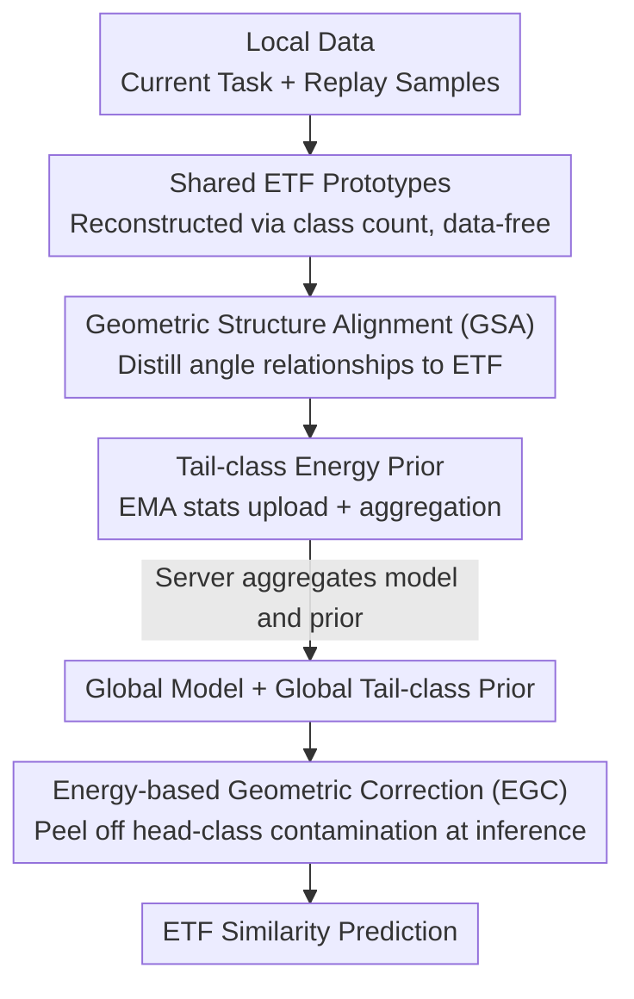

# From Selection to Scheduling: Federated Geometry-Aware Correction Makes Exemplar Replay Work Better under Continual Dynamic Heterogeneity

**Conference**: CVPR 2026  
**Paper**: [CVF Open Access](https://openaccess.thecvf.com/content/CVPR2026/html/Qi_From_Selection_to_Scheduling_Federated_Geometry-Aware_Correction_Makes_Exemplar_Replay_CVPR_2026_paper.html)  
**Code**: None  
**Area**: Federated Learning / Continual Learning  
**Keywords**: Federated Continual Learning, Exemplar Replay, Equiangular Tight Frame, Geometric Alignment, Class Imbalance Debiasing  

## TL;DR
Addressing the pain point in Federated Continual Learning (FCL) where "selecting samples is easy, but utilizing them is difficult," FEAT does not modify the replay strategy itself. Instead, it employs a set of fixed ETF prototypes shared across all clients. It uses geometric structure distillation during training to align feature angles across clients and applies energy-based geometric correction during inference to "pull back" tail-class features from head-class subspaces. As a plug-and-play module layered on Re-Fed+ or FedCBDR, it yields stable performance gains.

## Background & Motivation

**Background**: In Federated Continual Learning (FCL), the dominant approach to mitigating catastrophic forgetting is **exemplar replay**—each client stores a small batch of representative samples from past tasks in local memory and mixes them into training when learning a new task. Compared to generative replay (training GAN/VAEs for synthetic data), exemplar replay using real samples is computationally cheaper and offers higher fidelity, making it more suitable for edge devices.

**Limitations of Prior Work**: Almost all existing works focus on "**how to select samples**"—designing various sample-importance scores (e.g., Re-Fed trains personalized importance models, FedCBDR reconstructs global features for class-aware sampling). However, they assume that "once samples are selected correctly, everything is solved," while **almost no one considers how those selected samples are actually utilized**. Under "continual dynamic heterogeneity," where client distributions drift and new classes arrive continuously, good samples alone are insufficient.

**Key Challenge**: Replay is a double-edged sword. On one hand, it injects a small number of samples from past tasks into current training; **current task classes (head classes) have many samples, while past task classes (tail classes) have few**, creating severe class imbalance. On the other hand, the class distribution observed by each client varies over time, and replay further amplifies **inter-client heterogeneity**. The combination leads to "imbalanced-induced representation collapse": tail-class features are frequently "dragged" toward head classes, tilting decision boundaries toward head classes and making predictions insensitive to tail classes. Even when using fixed ETF classifiers based on Neural Collapse theory (where class directions are naturally equiangular and symmetric), tail-class alignment across clients remains significantly weaker than that of head classes under such dynamic heterogeneity.

**Goal**: Without changing sample selection criteria or memory allocation, resolve two issues: (1) pulling drifted feature geometries back to consistency across clients; (2) correcting the prediction bias where tail classes are contaminated by head classes during inference.

**Key Insight**: Shift the research focus **from "selection" to "scheduling" (sample utilization)**. Use a set of fixed ETF prototypes, shared by all clients and reconstructable without data, as a "geometric ruler." During training, distill the angular relationships between features to align with the ruler; during inference, use energy levels to strip away head-class components that have contaminated tail-class features. The entire method is orthogonal to replay strategies and is plug-and-play.

## Method

### Overall Architecture
The output of FEAT (Federated gEometry-Aware correcTion) is a global classification model that is robust under both heterogeneity and long-tail distributions. It does not replace any replay strategy but instead attaches two modules to the standard FedAvg "local training → aggregation" loop: **Geometric Structure Alignment (GSA)** during local training distills feature angles toward shared ETF prototypes and uploads EMA-aggregated tail-class statistical energy; **Energy-based Geometric Correction (EGC)** performs decontamination for each test feature during inference, followed by prediction using ETF similarity.

The key prerequisite is the set of **ETF prototypes**: For a set of observed classes $\mathcal{C}_t$ in incremental task $t$, a simplex ETF matrix is constructed as $W_t = \sqrt{\frac{C_t}{C_t-1}}\, U_t (I_{C_t} - \frac{1}{C_t}\mathbf{1}\mathbf{1}^\top)$, ensuring all prototypes have equal norms and equal pairwise angles (inner product is 1 for the same class and $-\frac{1}{C_t-1}$ for different classes). When a new task arrives, it **can be reconstructed using only the updated class count without any data**—this is precisely why it serves as a "cross-client shared ruler" in federated and continual scenarios.

### Key Designs

**1. Shared Fixed ETF Prototypes: A "Data-Free Geometric Ruler" for FCL**

The pain point is the lack of a stable reference system under heterogeneity and continuous tasks—each client's feature space drifts independently, making alignment impossible. FEAT replaces learnable classifiers with fixed simplex ETF classifiers $W_t=[w_c]_{c\in\mathcal{C}_t}$ (Eq. 1), which inherently satisfy equiangularity: $w_i^\top w_j = 1$ (if $i=j$) or $-\frac{1}{C_t-1}$ (if $i\ne j$), ensuring symmetric directions and consistent margins across classes. Its beauty lies in the ability to be **re-initialized whenever the class count changes without depending on any samples**, making it naturally suitable for incremental settings and as a unified prior for all clients. The classification loss is defined as: $z_i=\langle f, w_i\rangle$, representing the similarity between features and prototypes, with $L_{CLS}=-\sum_i y_i \log \frac{e^{z_i}}{\sum_j e^{z_j}}$ (Eq. 6). This ruler is the foundation for the subsequent two modules.

**2. Geometric Structure Alignment (GSA): Distilling "Angular Relationship Matrices" with Class Balancing**

Using ETF alone is insufficient—empirical results (Fig. 3) show that cross-client alignment for tail classes (past tasks) is significantly weaker than for head classes. GSA aligns the "pairwise angular structure between features" with the "pairwise angular structure between ETF prototypes," performing **relationship-level (pairwise) distillation** rather than approximating single prototypes. For a batch, the feature cosine similarity matrix $M_F^{a,b}=\frac{\langle f_a,f_b\rangle}{\|f_a\|\|f_b\|}$ and the prototype cosine similarity matrix $M_P^{a,b}=\frac{\langle w_{y_a},w_{y_b}\rangle}{\|w_{y_a}\|\|w_{y_b}\|}$ are calculated (Eq. 3). Both are $B\times B$ matrices with consistent row/column order, allowing for sample-wise angle alignment. Distributions $P_F, P_P$ (Eq. 4) are obtained via softmax with temperature $\tau$ and distilled using KL divergence.

The key debiasing insight is in the **aggregation method**: Since head classes have far more rows in a batch than tail classes, direct averaging would be dominated by head classes. GSA modifies this to **average within classes first, then across classes**:

$$L_{GSA}=\frac{1}{|C_B|}\sum_{c\in C_B}\frac{1}{n_c}\sum_{a:y_a=c}\mathrm{KL}\!\left(P_F^{a,:}\,\|\,P_P^{a,:}\right)$$

where $C_B$ denotes classes in the current batch and $n_c$ is the number of samples for class $c$. This ensures equal geometric supervision weight for each class, **guaranteeing sufficient alignment signals for tail classes** and alleviating their drift toward head classes.

**3. Energy-based Geometric Correction (EGC): Subtracting and Compensating Head-Class Contamination during Inference**

While GSA alleviates drift, it does not cure it—measurements (Fig. 4) show many tail-class samples still exhibit higher energy in head-class subspaces than in tail-class subspaces ($e_H>e_T$). EGC is a **lightweight, inference-only correction with zero training cost**. ETF prototypes are split into head/tail sets $W_H, W_T$, and two orthogonal projection operators $P_H=W_H(W_H^\top W_H)^\dagger W_H^\top$ and $P_T$ are constructed using the Moore–Penrose pseudoinverse (Eq. 8).

During training, the "typical energy" of tail classes is tracked: for replayed tail-class normalized features, an EMA of rank-normalized energy in both subspaces $\bar e_H^{(T)}, \bar e_T^{(T)}$ (Eq. 9) is maintained. Clients **upload only these two scalars**, which the server aggregates via sample-weighted averaging into global priors $\bar e_H^{(G)}, \bar e_T^{(G)}$ (Eq. 10)—communication overhead is negligible. During inference, for any normalized feature $\tilde x$, the energy in head/tail subspaces is calculated as $e_H(\tilde x)=\frac{\|P_H\tilde x\|^2}{|C_H|-1}$ and $e_T(\tilde x)$ (Eq. 11). A confidence gate is calculated based on the "extent of exceeding the global tail prior":

$$g(\tilde x)=\max\!\left(\frac{e_H(\tilde x)-\bar e_H^{(G)}}{e_H(\tilde x)+e_T(\tilde x)+\varepsilon},\,0\right)$$

A larger gate value indicates higher contamination by head classes. The correction **weakens the head-class component and strengthens the tail-class component** based on the gate, followed by $\ell_2$ normalization: $\tilde x'=\tilde x - g(\tilde x)P_H\tilde x + g(\tilde x)P_T\tilde x$ (Eq. 13). Predictions are finally made via $z_c=(\tilde x')^\top w_c$. This reduces overconfidence in head classes and increases sensitivity to tail classes.

### Loss & Training
Optimization is split into stages (Eq. 15): For the first task $t=1$, only the classification loss $L=L_{CLS}$ is used. For subsequent tasks $t>1$, GSA distillation is added: $L=L_{CLS}+\lambda L_{GSA}$, where $\lambda$ is a balancing coefficient. Replay is handled by Re-Fed+ or FedCBDR, while EGC is triggered only at inference. The number of training rounds and aggregation protocols remain identical to baselines, with only two additional scalars uploaded.

## Key Experimental Results

### Main Results
Evaluation on three datasets (CIFAR10/100, TinyImageNet-Subset) using Dirichlet partitions to simulate non-IID conditions across 7 SOTA methods. FEAT is layered on Re-Fed+ / FedCBDR to create FEAT$_R$ / FEAT$_F$. Top-1 Accuracy (5 clients, selected):

| Dataset/Setting | FedCBDR | LANDER | Re-Fed+ | FEAT$_R$ | FEAT$_F$ |
|------|------|------|------|------|------|
| CIFAR10 3-Task β=1.0 | 65.88 | 59.88 | 61.64 | 70.28 | **74.21** |
| CIFAR10 5-Task β=0.5 | 61.77 | 39.63 | 54.15 | 60.38 | **70.19** |
| CIFAR100 5-Task β=0.1 | 45.84 | 43.59 | 31.92 | 37.14 | **50.14** |
| CIFAR100 10-Task β=0.5 | 45.96 | 32.64 | 38.62 | 43.34 | **49.18** |
| TinyImageNet 5-Task β=0.5| 26.38 | 24.77 | 26.07 | 27.36 | **29.31** |

FEAT$_F$ achieves the **highest accuracy in all settings**. Both FEAT$_R$ and FEAT$_F$ consistently outperform their respective baselines, verifying plug-and-play efficacy. Notably, in more difficult scenarios (high heterogeneity, 10 clients), FEAT's lead **does not diminish**, indicating its effectiveness is not limited to simple cases.

### Ablation Study
On CIFAR10 (3-task) / CIFAR100 (5-task) with 5 clients, incrementally adding modules to FedCBDR:

| Configuration | CIFAR10 β=0.5 | CIFAR10 β=1.0 | CIFAR100 β=0.1 | CIFAR100 β=0.5 |
|------|------|------|------|------|
| FedCBDR | 63.32 | 65.88 | 45.84 | 50.33 |
| +ETF | 62.17 | 63.66 | 44.58 | 48.69 |
| +ETF+GSA | 68.54 | 70.42 | 47.77 | 52.23 |
| +ETF+EGC | 69.12 | 70.83 | 47.16 | 51.72 |
| +ETF+GSA+EGC (Full) | **72.67** | **74.21** | **50.14** | **53.31** |

### Key Findings
- **Using ETF alone leads to performance drops** (62.17 vs. 63.32): Severe class imbalance undermines cross-source representation alignment; a fixed classifier alone cannot solve this without GSA/EGC.
- **GSA and EGC are individually effective and complementary**: Adding GSA or EGC alone to FedCBDR yields a 5-7 point gain; combining them yields the best results. GSA handles cross-client geometric consistency during training, while EGC handles task-level debiasing during inference.
- **Minimal Communication Increase**: Only two scalars ($\bar e_H, \bar e_T$) are added per client per round. GSA is purely local and EGC is purely during inference.
- **Robustness to Hyper-parameters**: Accuracy fluctuates only slightly within $\lambda\in\{0.05,0.1,0.5\}$, $\rho\in\{0.5,0.7,0.9\}$, and $\tau\in\{0.07,0.5\}$. Smaller $\lambda$ better utilizes geometric structure, while larger $\rho$ provides stabler debiasing.
- **Stronger Anti-forgetting**: FEAT$_F$ shows the highest initial accuracy and the slowest, most stable decline in the forgetting curve.

> ⚠️ Section 5.7 describes the range for $\lambda$ as $\{1, 5, 10\}$, but Figure 7 and implementation details specify $\{0.05, 0.1, 0.5\}$. The former is likely a typo; $\{0.05, 0.1, 0.5\}$ should be considered accurate.

## Highlights & Insights
- **Valuable shift from "selection" to "scheduling"**: The FCL community has long focused on sample selection. This paper points out that "how to use them" is the real neglected factor and proves that an orthogonal module can provide stable improvements.
- **Distilling relationship matrices instead of single points**: GSA aligns the $B\times B$ angular relationship structure, preserving inter-class geometry better than approximating single prototypes, and naturally pairs with the "known angles" of ETF.
- **Splitting debiasing into training and inference stages**: Aligning geometry during training (GSA) and subtracting contamination during inference (EGC) using energy gates to quantify bias provides a transferable strategy for other long-tail scenarios.
- **Highly Federated-Friendly**: ETF is reconstructable without data, and the module only uploads two scalars, introducing almost no additional communication or privacy risks.

## Limitations & Future Work
- The method is validated only on ResNet-18 with CIFAR/TinyImageNet scales; **no results for large models or large-scale datasets** are provided. Absolute accuracy on TinyImageNet remains low (under 30% for β=0.1), suggesting difficult scenarios are far from solved.
- EGC's geometric correction relies heavily on the premise that "head/tail subspaces can be cleanly separated by ETF orthogonal projections." Whether this holds when class counts are extreme, ETF dimensions are limited ($d < C_t$), or boundaries are blurred remains unverified. ⚠️ The paper does not discuss degradation when $d < C_t$.
- The global tail prior is a single scalar aggregated via EMA, assuming similar energy distributions across clients. This prior may be inaccurate if a client has extremely few tail-class samples.
- EGC is an inference-time correction; while the **deployment latency** is small, it is non-zero, and the maintenance cost of the global prior during cross-task prototype expansion is not discussed in detail.

## Related Work & Insights
- **vs. Re-Fed+ / FedCBDR (Selection-based)**: These focus on "which samples to replay." FEAT does not touch selection criteria but optimizes "how to use them," allowing for orthogonal stacking.
- **vs. Standard ETF-in-FL**: Existing works use fixed simplex-ETF classifiers to reduce bias and align non-IID representations. This paper notes that under "continual dynamic heterogeneity + long-tail," tail classes still drift and are contaminated by head classes, necessitating GSA and EGC.
- **vs. Generative Replay (LANDER/GenFCIL)**: Generative approaches save memory but incur high training costs for generators and suffer from unstable sample quality. FEAT follows the exemplar replay path for high fidelity and outperforms LANDER by focusing on utilizing real samples effectively.

## Rating
- Novelty: ⭐⭐⭐⭐ The reframe from "selection" to "scheduling" is insightful. The GSA relationship distillation + EGC energy projection combo is novel, though the individual components have established roots.
- Experimental Thoroughness: ⭐⭐⭐⭐ Tested on three datasets with various heterogeneity levels, 7 baselines, and thorough ablation/sensitivity/communication/budget analysis. However, scale is small, missing large models and real-world federated scenarios.
- Writing Quality: ⭐⭐⭐⭐ Clear motivation, complete formulas, and good visualizations; minor inconsistency in hyper-parameter range descriptions.
- Value: ⭐⭐⭐⭐ Plug-and-play with negligible communication overhead and orthogonality to current replay strategies makes it highly practical for long-tail debiasing in FCL.

<!-- RELATED:START -->

## Related Papers

- [\[CVPR 2026\] FedRG: Unleashing the Representation Geometry for Federated Learning with Noisy Clients](fedrg_unleashing_the_representation_geometry_for_federated_learning_with_noisy_c.md)
- [\[CVPR 2026\] BD-Merging: Bias-Aware Dynamic Model Merging with Evidence-Guided Contrastive Learning](bd-merging_bias-aware_dynamic_model_merging_with_evidence-guided_contrastive_lea.md)
- [\[ICCV 2025\] Federated Continual Instruction Tuning](../../ICCV2025/optimization/federated_continual_instruction_tuning.md)
- [\[CVPR 2026\] FedSST: Rethinking Fair Federated Graph Learning under Structural Shift](fedsst_rethinking_fair_federated_graph_learning_under_structural_shift.md)
- [\[CVPR 2026\] Dynamic Momentum Recalibration in Online Gradient Learning](dynamic_momentum_recalibration_in_online_gradient_learning.md)

<!-- RELATED:END -->
