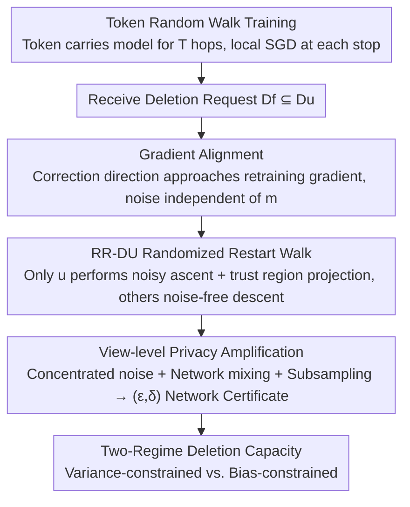

# Fully Decentralized Certified Unlearning

**Conference**: CVPR 2026  
**Paper**: [CVF Open Access](https://openaccess.thecvf.com/content/CVPR2026/html/Lamri_Fully_Decentralized_Certified_Unlearning_CVPR_2026_paper.html)  
**Code**: To be confirmed (Paper claims open source)  
**Area**: Federated Learning  
**Keywords**: Machine Unlearning, Certified Unlearning, Decentralized, Differential Privacy, Deletion Capacity

## TL;DR
Addressing the neglected scenario of "decentralized networks without a central coordinator," this paper proposes RR-DU—a random-walk-based certified unlearning algorithm. It performs noisy projected gradient ascent on the forgetting set only at the client initiating the deletion, while other clients continue with noise-free descent. By incorporating sub-sampled Gaussian noise and trust region projections, the authors prove $(\varepsilon,\delta)$ network unlearning certificates, convergence, and deletion capacity bounds. Notably, the noise does not scale with the size of the forgetting set $m$, successfully reducing backdoor attack success rates to random-guess levels while maintaining clean accuracy on image classification tasks.

## Background & Motivation
**Background**: Machine Unlearning (MU) aims to eliminate the influence of specific data from a trained model without retraining (responding to privacy requests or removing data poisoning). When extended to federated learning, it becomes Federated Unlearning (FU). **Certified unlearning** (providing provable guarantees similar to differential privacy) has previously been analyzed primarily in centralized or "server-orchestrated" federated settings.

**Limitations of Prior Work**: **The decentralized scenario—where clients have no coordinator and communicate peer-to-peer along network edges—is largely unexplored**. Most existing decentralized FU works are heuristic and lack theoretical guarantees; the few that provide guarantees only hold under (strong) convexity assumptions. Zhang et al. provide DP unlearning guarantees for server-orchestrated FL, requiring coordination from all clients and the server, which is computationally expensive. Qiao et al. (PDUDT) proposed the first decentralized certified unlearning under dynamic topologies, but it **involves all clients or neighbors and requires storing historical gradients**, leading to high storage/computational overhead and temporary drops in test accuracy during the unlearning phase.

**Key Challenge**: ① In decentralized settings with a fixed topology where each client has only a "local view" of the network, the definition of certified unlearning itself has not been clarified (how to define a certificate when the transcript seen by each client differs?). ② The impact of decentralized factors (routing, mixing, trust regions) on the "utility-privacy trade-off" and "deletion capacity" remains unquantified. ③ While Decentralized Differential Privacy (DDP) could theoretically imply unlearning certificates, it relies on **group privacy, causing noise to grow linearly with the number of deletions $m$**, making its effectiveness as a practical unlearning certifier questionable.

**Goal**: To enable unlearning to proceed **autonomously without involving all clients** on a fixed topology; to quantify the impact of decentralized factors on trade-offs and deletion capacity; and to clarify whether DDP is suitable as an unlearning certifier.

**Key Insight**: The authors leverage a critical observation—in a random walk, the forgetting set $D_f\subseteq D_u$ **only affects the computation when the walker is located at the client $u$ that initiated the deletion**. Updates from other clients are independent of $D_f$ and thus constitute "post-processing" with respect to $D_f$. By utilizing the decentralized privacy amplification and subsampling amplification, noise can be concentrated at $u$ while others remain noise-free, relying on network mixing to ensure any observer sees only a small fraction of sensitive events.

**Core Idea**: Concentrate noise **only at the deleting client** and use **gradient alignment** to make the correction direction approach the retraining direction. This ensures that the required noise **does not depend on the forgetting set size $m$**, thereby achieving stronger guarantees with significantly less noise than DDP, which adds noise across the entire network.

## Method

### Overall Architecture
Consider a fixed undirected graph $G=(V,E)$ where $N$ clients each hold private data $D_u$. The training algorithm $\mathcal{A}$ uses a **token** carrying the current model $\theta$ to perform a random walk of $T$ hops on the graph. When a client receives the token, it performs several local SGD steps using its data and forwards the updated token to a uniformly random neighbor. Upon receiving a deletion request for $D_f\subseteq D_u$ in a certain round, the RR-DU (randomized-restart decentralized unlearning) algorithm is initiated: the token restarts at the deleting client $u$ with probability $p$, or otherwise follows the graph's transition matrix $P$. **Only $u$ performs a noisy correction ascent step (projected gradient ascent on the forgetting set + Gaussian noise + trust region projection), while other clients continue with noise-free projected descent**. This mechanism provides three types of guarantees: convergence in convex cases / stationarity in non-convex cases; an $(\varepsilon,\delta)$ network unlearning certificate (view-level) based on sub-sampled Gaussian Rényi-DP; and a deletion capacity bound that scales with the "forgetting set-to-local data ratio."

### Key Designs

**1. Formalizing View-based Decentralized Certified Unlearning: Building "Deletion Certificates" on Local Views**

The pain point is that centralized definitions of certified unlearning cannot be directly applied—in decentralization, no one sees the full transcript. Client $u$ only observes a message view related to itself: $O_u(\mathcal{A}(D))=\{(v,m,v')\in\mathcal{A}(D): v=u \text{ or } v'=u\}$. Borrowing from network differential privacy (network-DP) by Cyffers-Bellet, the authors redefine certified unlearning as **view-based**: an algorithm pair $(\mathcal{A},\mathcal{U})$ achieves $(\varepsilon,\delta)$ decentralized certified unlearning if there exists a certifier $\mathcal{C}$ such that for any non-deleting client $v\neq u$ and any $\theta\subseteq\Theta_v$, $P(O_v(\mathcal{U}(D_f,\mathcal{A}(D)))\in\theta)\le e^\varepsilon P(O_v(\mathcal{C}(D\setminus D_f))\in\theta)+\delta$ and vice versa. This definition is appropriate because "removal completeness" only makes sense relative to an **observer's view**; furthermore, this guarantee is **post-deletion**—it certifies the distribution of the observer's view after the deletion request but cannot retrospectively erase information already leaked in the pre-deletion training transcript. The authors also adapt the deletion capacity (the maximum $m$ removable under a tolerance $L(U)-L^\star\le\gamma$) from Sekhari et al. to the decentralized setting, explicitly characterizing the roles of routing probability, network mixing, and trust region projection.

**2. Gradient Alignment: Making the Correction Direction Match the Retraining Direction to Decouple Noise from $m$**

This is the mathematical core of the paper. After deleting $D_f$, the gradient of the retraining objective $L_{\setminus f}$ can be decomposed as $\nabla L_{\setminus f}(\theta,V)=\nabla L(\theta,V)-\tfrac1N[\nabla\ell_u(\theta)-\nabla\ell_{u\setminus f}(\theta)]+\Delta_{\text{norm}}(\theta)$, where $\|\Delta_{\text{norm}}\|_2=O(Lm/n_u)$. This indicates that "moving toward the retraining optimum" can be achieved via **standard descent by other clients plus a correction step at $u$ that relies only on local information**. When the walk is at $u$, it uses either exact alignment $-\nabla\ell_{u\setminus f}(\theta)$ or lightweight alignment $\tfrac{m}{n_u}\nabla\ell_f(\theta)$. By setting the restart probability $p=1/N$, the conditional expectation of the update exactly recovers the retraining direction $\mathbb{E}[\Delta\theta_t|\theta_t]/\eta_t=-\nabla L_{\setminus f}(\theta_t,V)$ (for exact alignment), while lightweight alignment has a controlled bias $O(Lm/n_u)$. Why it works: DDP relies on group privacy to certify $m$ deletions, forcing the calibration noise to grow linearly with $m$. RR-DU completely removes the dependency of $m$ from the noise scale, leaving it only in a **controllable alignment bias term**—this is why it can use much smaller noise to achieve stronger guarantees within the same $(\varepsilon,\delta)$ view budget.

**3. RR-DU Randomized Restart Walk + Concentrated Noise + Trust Region Projection: Minimizing Privacy Costs**

Algorithmically (Algorithm 1): Each hop returns to $u$ with probability $p$, otherwise follows $P$. At $u$, it samples $Z_t\sim\mathcal{N}(0,\sigma^2 I_d)$ and performs $\theta\leftarrow\Pi_{B(\theta_{\text{ref}},\varrho)}(\theta+\eta_t(g_u+Z_t))$ (noisy ascent + trust region projection); at other nodes, it averages $s\ge1$ mini-batches and performs noise-free $\Pi_\Theta(\theta-\eta_t g_v)$. **Only a $p$ fraction of hops add noise**, so the second moment per hop $G^2\le L^2+\tfrac{p}{s}d\sigma^2$, whereas all hops in DDP add $d\sigma^2$. View-level amplification comes from: for any observer $v\neq u$, the first-observation delay of a sensitive update follows $\text{Geom}(q)$ with $q=\tfrac{1-p}{N-1}$ (the token must leave $u$ and land on $v$), and this geometric mixing provides a $\sqrt{\ln N/N}$ amplification. The trust region projection $\Pi_{B(\theta_{\text{ref}},\varrho)}$ limits noisy steps to the vicinity of the original model, stabilizing the noisy ascent. Why it works: The combination of concentrated noise, local averaging, and network mixing ensures that the "effective variance under the same privacy budget" is much smaller than network-wide noise, translating directly into higher clean accuracy.

**4. Two-regime Deletion Capacity: Clarifying When RR-DU Truely Outperforms DDP**

By solving the inequality "non-bias term $A$ (optimization + privacy, independent of $m$) + alignment bias $CLm/n_u \le \gamma$," the deletion capacity is found to follow a **two-regime** structure: $m^\star=\Omega((\gamma-A)n_u/L)$ when $\gamma>A$, and $0$ otherwise. Intuitively: when $A$ is reduced below $\gamma$ by increasing $T_u$, increasing local averaging $s$, choosing a moderate $p$, and benefiting from the $\sqrt{\ln N/N}$ network amplification, the capacity becomes $\Theta(\gamma n_u/L)$—**linear with respect to local data $n_u$ and no longer improving with $N$** (the $N$ gain in earlier formulas appears when the variance-limited regime $A$ dominates). In contrast, DDP's capacity is fundamentally limited by group privacy (noise grows with $m$, even high mixing cannot fully utilize large $n_u$). Practical rule: Use lightweight alignment when $m/n_u$ is small, and switch to exact alignment for large $m/n_u$ or strong data non-i.i.d.

### Loss & Training
Training uses a single-token random walk + local SGD. Unlearning uses RR-DU (Algorithm 1). Key hyperparameters include the restart probability $p\approx1/N$, trust region radius $\varrho$, noise scale $\sigma$, local averaging $s$, and unlearning hop count $T_u$. Noise calibration (Cor. 5.2) gives $\sigma=\Theta\big(\tfrac{L}{\varepsilon}\sqrt{\tfrac{pT_u\ln(1/\delta)\ln N}{N}}\big)$ for view-level $(\varepsilon,\delta)$. Last-iterate / stationarity guarantees are provided for convex, strongly convex, and smooth non-convex objectives.

## Key Experimental Results

### Main Results
Unlearning was evaluated on two image classification benchmarks under a BadNets backdoor setting: CIFAR-10 + ResNet-18, and MNIST + FLNet. $m=1000$ poisoned samples were injected into a single target client. Forgetting was performed for $T_u=100$ hops after $T=100$ training hops. Complete graph $N=10$, i.i.d. uniform partition, $\varepsilon=1, \delta=10^{-5}$, Adam $\eta=0.005$, $s=4$. The ideal trade-off is reducing Attack Success Rate (ASR) to ≈10% (random guess) while maintaining clean accuracy. Comparisons were made against DDP, DP-SGD, and Finetuning.

| Dataset | Method | Backdoor ASR ↓ (Target ≈10%) | Clean Accuracy ↑ |
|--------|------|------|------|
| MNIST | Retraining Baseline | ≈10% | ≈99.5% |
| MNIST | **RR-DU (Ours)** | **≈10%** | **≈99.1–99.2%** |
| MNIST | Finetuning | ≈18% | ≈99% |
| MNIST | DDP | ≈35% | ≈96.7% |
| MNIST | DP-SGD | ≈60% | — |
| CIFAR-10 | Retraining Baseline | ≈10% | ≈88–89% |
| CIFAR-10 | **RR-DU (Ours)** | **≈10%** | **≈88–89%** |
| CIFAR-10 | Finetuning | ≈25–30% | Good but < RR-DU |
| CIFAR-10 | DDP / DP-SGD | More backdoor residue | ≈50–55% (Saturated) |

ASR (Attack Success Rate) refers to the proportion of samples with triggers classified into the attacker's target class; values closer to the 10% random guess indicate the backdoor has been successfully erased.

### Theoretical Comparison (DDP vs RR-DU, Convex Case)

| Method | Noise Scale | Deletion Capacity (Scaling) |
|------|---------|------|
| DDP (group privacy) | $\Theta\big(\tfrac{mL}{\varepsilon}\sqrt{\tfrac{T\ln(1/\delta)\ln N}{N}}\big)$, **Scales linearly with $m$** | Fundamentally limited by group privacy |
| **RR-DU (Ours)** | $\Theta\big(\tfrac{L}{\varepsilon}\sqrt{\tfrac{pT_u\ln(1/\delta)\ln N}{N}}\big)$, **Independent of $m$** | $\gamma>A:\ \Omega\big(\tfrac{(\gamma-A)n_u}{L}\big)$; else $0$ |

### Key Findings
- **RR-DU achieved the best trade-off across both datasets**: Backdoors were eliminated almost as effectively as retraining, while clean accuracy remained close to the retraining baseline; DP-based certifiers (DP-SGD, DDP) left significant backdoor signals and often sacrificed clean utility.
- **DDP fails to eliminate backdoors**: On MNIST, DDP's ASR remained at ≈35% and DP-SGD at ≈60%. On CIFAR-10, clean accuracy for both saturated at 50–55%, failing to reach the baseline—confirming that "noise scaling with $m$" significantly hampers DDP in practice.
- **Two-regime deletion capacity**: Capacity only becomes linear with local data $n_u$ after the non-bias term $A$ is reduced below the tolerance $\gamma$. Beyond this point, increasing $N$ yields no additional capacity gain.
- **Practical switching between Lightweight and Exact alignment**: Lightweight is used for small $m/n_u$ (saving computation/storage), while Exact is used for large $m/n_u$ or high heterogeneity to prevent bias dominance. Increasing $s$ reduces variance without affecting privacy.

## Highlights & Insights
- **The "Post-processing" observation is elegant**: Realizing that the forgetting set only participates in computation when the walker is at $u$ allows concentrating noise at a single node while keeping the rest of the network noise-free. This provides the physical intuition for why noise does not need to scale with $m$, making it far more efficient than uniform network-wide noise.
- **Moving the dependency of $m$ from noise scale to a controllable bias** is the fundamental advantage of RR-DU over DDP. Group privacy inevitably forces DDP's noise to grow with the number of deletions, which RR-DU bypasses through gradient alignment, yielding much higher utility for the same privacy budget.
- **Observer-view certification** is more aligned with the actual threat models in decentralized systems than "node-by-node" certification. It also explicitly clarifies that these are post-deletion guarantees and does not exaggerate the ability to retrospectively erase historical leaks.
- **Two-regime deletion capacity** provides clear engineering guidance: it identifies when to adjust $T_u/s/p$ and when increasing $N$ becomes futile, a framework that could be transferred to the capacity analysis of other decentralized privacy mechanisms.

## Limitations & Future Work
- **The Theory and Main experiments focus on complete graphs**: Routing uses uniform transition and a small scale ($N=10$). Performance under non-fully connected or dynamic topologies is only briefly addressed in the appendix, and robustness on large-scale sparse topologies remains to be verified.
- **Inherent limitations of post-deletion guarantees**: Information already leaked in the pre-deletion training transcripts cannot be erased—if an attacker has already recorded historical messages, this method cannot mitigate that.
- **Lightweight alignment introduces approximation bias**, which grows with the deletion ratio $m/n_u$, smoothness, and heterogeneity. In strongly non-i.i.d. scenarios, it may fail due to bias dominance, requiring more costly exact alignment.
- **Hyperparameter dependency on grid search**: The trust region radius $\varrho$ and effective gradient bound $L$ are selected via grid search for each dataset-model pair. Automated or adaptive selection is a target for improvement.
- **Incomplete comparison with PDUDT**: Their protocols are fundamentally different (PDUDT relies on dynamic topologies and gossip, while RR-DU uses random walks on fixed graphs), so head-to-head comparisons are only provided for restricted matching settings.

## Related Work & Insights
- **vs Qiao et al. PDUDT (First decentralized certified unlearning)**: PDUDT uses Gaussian mechanisms but **involves all users/neighbors and requires historical gradients**, resulting in high overhead and temporary utility drops. It also only provides node-level certificates. RR-DU concentrates noise at the deleting client, utilizes random next-hop selection and local steps as post-processing amplification, ensures noise is independent of $m$, and requires no historical gradient storage.
- **vs Decentralized Differential Privacy DDP (Cyffers-Bellet)**: While DDP can theoretically imply unlearning, the authors demonstrate it is **not an ideal unlearning certifier** due to group privacy making noise scale with $m$. This work cleanly separates DDP from Decentralized Certified Unlearning (DCU).
- **vs Centralized Certified Unlearning (Sekhari / Guo / Ginart et al.)**: In those works, the key driver for deletion capacity is the total dataset size $n$. In the decentralized adaptation here, the drivers become the number of nodes $N$ (variance-limited regime) or local data size $n_u$ (bias-limited regime), explicitly incorporating routing, mixing, and trust regions.
- **vs Server-orchestrated FL DP Unlearning (Zhang et al.)**: Those methods require full participation and server coordination, which is computationally expensive. RR-DU is fully decentralized, lacks a coordinator, and has low communication and storage overhead.

## Rating
- Novelty: ⭐⭐⭐⭐⭐ First formalization of view-based decentralized certified unlearning on fixed topologies. The "concentrated noise + gradient alignment" to decouple noise from $m$ is a highly original contribution.
- Experimental Thoroughness: ⭐⭐⭐ Main experiments are limited to small benchmarks (MNIST/CIFAR-10) and complete graphs ($N=10$). Large-scale, sparse/dynamic topologies, and comparisons with PDUDT are relegated to the appendix or restricted settings, making the primary evidence somewhat thin.
- Writing Quality: ⭐⭐⭐⭐ Theoretical derivations (gradient alignment, view amplification, two-regime capacity) are logically structured, though the notation is dense and definitions are numerous, posing a high barrier for non-privacy experts.
- Value: ⭐⭐⭐⭐ This completes the map for certified unlearning in the blank space of decentralization. The clear separation of this framework from DDP is instructive for future work, though practical adoption is constrained by small-scale experiments and hyperparameter sensitivity.

<!-- RELATED:START -->

## Related Papers

- [\[CVPR 2026\] GDFA: Geometry-Driven Federated Unlearning with Directional Task Vector Alignment](gdfa_geometry-driven_federated_unlearning_with_directional_task_vector_alignment.md)
- [\[CVPR 2026\] Personalized Federated Training of Diffusion Models with Privacy Guarantees](personalized_federated_training_of_diffusion_models_with_privacy_guarantees.md)
- [\[CVPR 2026\] FedAlign: Differentially Private Distribution Alignment for Non-IID Federated Learning](fedalign_differentially_private_distribution_alignment_for_non-iid_federated_lea.md)
- [\[CVPR 2026\] FedAdamom: Adaptive Momentum for Improved Generalization in Federated Optimization](fedadamom_adaptive_momentum_for_improved_generalization_in_federated_optimizatio.md)
- [\[CVPR 2026\] FedRAC: Rolling Submodel Allocation for Collaborative Fairness in Federated Learning](fedrac_rolling_submodel_allocation_for_collaborative_fairness_in_federated_learn.md)

<!-- RELATED:END -->
