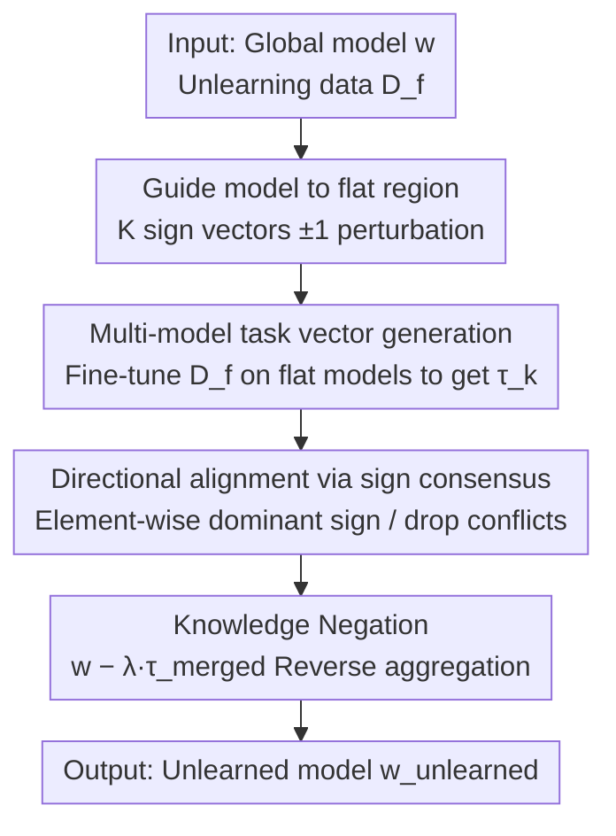

# GDFA: Geometry-Driven Federated Unlearning with Directional Task Vector Alignment

**Conference**: CVPR 2026  
**Paper**: [CVF Open Access](https://openaccess.thecvf.com/content/CVPR2026/html/Weng_GDFA_Geometry-Driven_Federated_Unlearning_with_Directional_Task_Vector_Alignment_CVPR_2026_paper.html)  
**Code**: Not disclosed  
**Area**: Federated Learning / Machine Unlearning / Privacy Protection  
**Keywords**: Federated Unlearning, Flat Minima, Task Vector, Directional Alignment, Non-IID

## TL;DR
GDFA reinterprets "Federated Unlearning" as a **loss surface geometry** problem: it first migrates the global model to a flat minima region via perturbations, then has relevant clients generate task vectors on unlearning data, retaining only components with **directional consensus (sign consensus)** for reverse aggregation. This achieves precise erasure of target client knowledge in Non-IID scenarios with almost no loss in retention task accuracy.

## Background & Motivation

**Background**: Federated Learning (FL) enables collaborative training without sharing raw data. However, to satisfy the "right to be forgotten," it is necessary to erase the contribution of a target client to the global model without accessing local data. Existing federated unlearning methods generally fall into two categories: retraining (from scratch, extremely costly and impractical) and parameter manipulation (task vector subtraction / historical update replay / gradient correction), with the latter being more efficient but prone to significant accuracy loss.

**Limitations of Prior Work**: Under Non-IID (heterogeneous data distributions across clients) settings, optimization directions of clients naturally conflict, causing gradients to interfere with each other. The authors observe a critical phenomenon: **conflicting updates produce misaligned task vectors**, which fails to cleanly "isolate" the specific knowledge to be deleted. Worse, data inaccessibility combined with Non-IID pushes the optimized parameters into **sharp loss basins**. In such high-curvature regions, models are extremely sensitive to parameter perturbations—modifying parameters during unlearning causes "catastrophic forgetting" of retained knowledge.

**Key Challenge**: Unlearning requires "modifying parameters to delete knowledge," but under sharp minima, "modifying parameters" $\approx$ "destroying retained knowledge." This trade-off between unlearning effectiveness and retention stability is rooted in the **poor geometry of the loss surface** and the **directional inconsistency of task vectors** caused by Non-IID data.

**Goal**: (1) Make unlearning operations robust to parameter perturbations without affecting retained knowledge; (2) Accurately isolate and delete target knowledge under conditions of no raw data access and client directional conflicts.

**Key Insight**: The authors' core observation is that **models located in flat regions generalize more stably and have higher tolerance for parameter modifications**. If the global model is first migrated to a flat basin before unlearning, perturbations are "trapped" within the basin and do not cause performance collapse; furthermore, training within the same flat region significantly enhances the sign consistency of task vectors. Theoretically, a PAC-Bayes style bound is provided to link loss surface flatness with the performance gap under data heterogeneity.

**Core Idea**: Use "geometric migration to flat minima + reverse aggregation of directionally aligned task vectors" instead of "direct task vector subtraction in sharp regions" to address the stability and accuracy issues of Non-IID federated unlearning.

## Method

### Overall Architecture
GDFA is a three-stage serial federated unlearning framework: the input is a pre-trained global model $w$ and an unlearning dataset $D_f$ from a specific client, and the output is the unlearned model $w_{unlearned}$ with target knowledge erased and remaining knowledge preserved. The process is: **Migrate global model to flat region** $\rightarrow$ **Relevant clients fine-tune on unlearning data in the flat region to generate multiple task vectors** $\rightarrow$ **Perform sign consensus merging per parameter element, keeping only directionally consistent components** $\rightarrow$ **Apply reverse (negative) aggregation of the merged task vector to achieve "knowledge negation."**

### Key Designs

**1. Guiding migration to flat regions: Pushing the global model out of sharp basins using symmetric random perturbations**

To address the pain point that "Non-IID pushes models into sharp basins, causing unlearning to collapse," GDFA performs geometric migration before unlearning. For a global model $w$ with $L$ layers, $K$ "flattened models" are generated, each associated with a sign vector $Z^{(k)}=[z_1^{(k)},\dots,z_L^{(k)}]$, where $z_i^{(k)}\in\{-1,1\}$ is randomly sampled. The $k$-th flattened model is perturbed layer-wise using gradient information: $w_{flat}^{(k)}=\big(\text{layer}_i+\rho\cdot g_{l_i}\cdot z_i^{(k)}\big)_{i=1}^{L}$, where $\rho$ controls the perturbation radius. A key constraint is $\sum_{k=1}^{K} z_i^{(k)}=0$, ensuring $\frac{1}{K}\sum_k w_{flat}^{(k)}=w$—this guarantees that the $K$ perturbed models are **uniformly distributed in the $\rho$-neighborhood** of $w$ and return to the center upon aggregation. This mirrors Sharpness-Aware Minimization (SAM): when $w$ is already in a flat region, perturbations are contained within the basin; when in a sharp region, perturbations help explore nearby flat minima. If $\rho$ is too small, it fails to escape sharp basins; if too large, it exits the beneficial flat region. Authors found $\rho=0.5$ to be optimal.

**2. Multi-model task vector generation: Fine-tuning in the same flat region to enhance directional consistency**

Traditional task vectors compute parameter differences from a single fine-tuned model, which is sensitive to hyperparameters and yields volatile unlearning results. GDFA instead fine-tunes the $K$ flattened models on the unlearning data $D_f$ to obtain $\{w_{ft}^{(k)}\}$, then calculates individual task vectors $\tau_k=w_{ft}^{(k)}-w_{flat}^{(k)}$. Because these models reside in the **same flat region with a smoother parameter space**, the generated task vectors naturally exhibit higher sign consistency. Task vectors follow the Task Arithmetic approach—"adding vectors = learning knowledge, subtracting vectors = unlearning knowledge"—requiring no raw data access and relying solely on weight manipulation, which aligns with FL privacy principles.

**3. Directional alignment via sign consensus: Merging only consistent components and discarding conflicting parameters**

This is the core of isolating target knowledge. For each parameter index $j$, the **dominant sign** $s_j^*$ is identified across all $\tau_k$. A subset of indices $S_j=\{k:\text{sign}(\tau_{k,j})=s_j^*\}$ with consistent signs is used for merging: $\tau_{merged,j}=\frac{1}{|S_j|}\sum_{k\in S_j}\tau_{k,j}$ (if $S_j$ is empty, it is set to 0). The authors argue that **discarding parameters with conflicting directions does not harm unlearning effectiveness but improves directional consistency**, as these conflicting components are empirically redundant or harmful. By filtering and merging sign-consistent components, the "common features of the knowledge to be forgotten" can be accurately captured, avoiding the entanglement of irrelevant knowledge caused by misaligned vectors in Non-IID settings.

**4. Knowledge negation: Precise erasure via reverse scaled aggregation**

The final step performs "knowledge negation": $w_{unlearned}=w-\lambda\tau_{merged}$, where $\lambda$ is a scaling coefficient (typically $\lambda=1$). Since the model is already in a flat region, perturbations do not trigger collapse, allowing this reverse subtraction to delete target knowledge while maximizing the retention of other knowledge. The entire workflow follows Algorithm 1 (Migrate to flat $\rightarrow$ Generate task vectors $\rightarrow$ Merging via sign consensus $\rightarrow$ Reverse aggregation).

### Loss & Training
GDFA does not introduce additional trainable losses; it relies on geometric migration and task vector algebra. Theoretical support is provided by a performance gap bound under data heterogeneity (Theorem 1): when the model is at a flat minimum with small first-order sharpness $R_\rho^{(1)}(\theta)$, the performance difference $|L(\theta^*)-L(\theta_{flat})|$ between the optimal and flat model is bounded by a term involving a **concentration coefficient** $C=\max_i \frac{P_i}{P}$ (measuring maximum distribution mismatch). Better flatness leads to a tighter bound and more robust unlearning. Experimental setup: 100 clients, 0.1 sampling rate, SGD (lr=0.1, momentum=0.9, 0.99 decay), local training $E=5$, unlearning limit 100 rounds, total communication limit 200 rounds.

## Key Experimental Results

### Main Results
Evaluated on MNIST/FMNIST/CIFAR10/CIFAR100 using 4-layer CNN / LeNet / ResNet-18 / ResNet-34 against ten baselines: Retrain (Gold Standard), FedAvg, Eraser, Recovery, MoDe, SGA, PGD, OSD, Editor, and SIFU. Metrics include: RA $\uparrow$ (Retention Accuracy), FA $\downarrow$ (Forgetting Accuracy, lower is cleaner), JSD $\downarrow$ (Jensen-Shannon Divergence from the retrained model), and MIA (Membership Inference Attack accuracy, closer to 50% is safer).

Representative results under Non-IID (Dir(0.5)):

| Dataset-Model | Metric | FedAvg | Retrain | SIFU | Editor | Ours (GDFA) |
|------|------|------|------|------|------|------|
| MNIST-CNN | RA ↑ | 94.60 | 94.15 | 94.22 | 94.48 | **95.89** |
| MNIST-CNN | FA ↓ | 96.92 | 0.11 | 3.92 | 2.95 | 1.53 |
| MNIST-CNN | JSD ↓ | 0.0089 | - | 0.0035 | 0.0028 | **0.0012** |
| MNIST-CNN | MIA | 92.52 | 50.28 | 55.90 | 55.12 | **50.00** |
| CIFAR10-ResNet18 | RA ↑ | 68.32 | 68.88 | 55.17 | 65.18 | **69.33** |
| CIFAR10-ResNet18 | FA ↓ | 97.58 | 0.51 | 1.06 | 2.54 | 1.57 |
| CIFAR100-ResNet34 | RA ↑ | 42.53 | 47.82 | 39.61 | 38.42 | 46.08 |
| CIFAR100-ResNet34 | FA ↓ | 98.77 | 0.34 | 1.80 | 3.00 | **1.05** |

GDFA often **outperforms Retrain** in retention accuracy (RA) while suppressing FA to near-random levels, achieving the lowest JSD and MIA near 50%, indicating thorough and private unlearning.

Efficiency comparison (Server computation time in seconds, Dir(0.5)):

| Dataset | FedAvg | Retrain | Eraser | Editor | Ours |
|------|------|------|------|------|------|
| MNIST | 647.92 | 223.96 | 188.90 | 14.39 | **11.28** |
| FMNIST | 1085.43 | 542.72 | 443.09 | 25.54 | **17.41** |
| CIFAR10 | 2322.76 | 1161.33 | 884.55 | 52.21 | **31.92** |
| CIFAR100 | 3246.27 | 1623.14 | 949.26 | 74.63 | **67.88** |

GDFA is two orders of magnitude faster than retraining and superior to all lightweight approximate baselines by avoiding retraining and Hessian calculations, relying solely on controlled geometric migration.

### Ablation Study

| Component | Observation / Conclusion | Description |
|------|---------|------|
| Perturbation radius $\rho$ (Fig 5a) | $\rho=0.5$ is optimal | Too small fails to escape sharp basins; too large exits flat regions and degrades generalization. |
| Number of models $K$ (Fig 5b) | Moderate is best | $K$ represents a trade-off between task vector quality and computational overhead. |
| Scaling $\lambda$ (Table 4, FMNIST-IID) | More negative $\lambda$ lower FA | At $\lambda=0, FA=98.21$; at $\lambda=-1, FA=1.45$. Forgetting increases monotonically with negative scaling. |

### Key Findings
- **Flatness is the root cause of stable unlearning**: Loss landscape visualization (Fig 3) shows GDFA converges to significantly flatter basins, explaining why unlearning doesn't destroy retained knowledge.
- **Sign consensus discards conflicts without accuracy loss**: Parameters with inconsistent directions are proven redundant/harmful; discarding them improves unlearning efficacy.
- **Attention shift in class-level unlearning**: Grad-CAM (Fig 4) shows attention for the unlearned class shifts from "critical prediction regions" to the background, weakening class discriminative power while keeping retention tasks intact.
- **$\lambda$ controls unlearning intensity**: FA drops monotonically from 98.21% to 1.45% as $\lambda$ moves from 0 to -1, making the degree of forgetting adjustable.

## Highlights & Insights
- **Geometrizing the Unlearning Problem**: Using a "migrate-then-erase" strategy resolves the contradiction of "modifying parameters destroys retained knowledge" at its root—flatness naturally provides a fault-tolerant space for parameter perturbations.
- **Sign Consensus as a Reusable Trick**: Merging vectors by dominant signs and discarding conflicts is conceptually similar to TIES-merging sign election and can be transferred to any multi-client/multi-task model merging scenario.
- **Privacy Friendly**: The method manipulates weights without accessing raw data, pushing MIA accuracy back to 50%, which is ideal for FL privacy compliance.
- **Alignment between Theory and Phenomenon**: The PAC-Bayes bound + loss landscape visualization + Grad-CAM together form a cohesive and well-supported argument chain.

## Limitations & Future Work
- **Small Datasets and models**: Evaluated primarily on MNIST/FMNST/CIFAR with CNN/ResNet; effectiveness on LLMs or complex tasks (Detection/Segmentation, Transformers) remains to be verified.
- **FA is not always the lowest**: Under specific settings like MNIST-CNN, GDFA's FA (1.53) is not the absolute lowest among baselines (SGA 1.70, Retrain 0.11), as it seeks a balance between RA/FA and privacy.
- **Hyperparameter Sensitivity**: $\rho$ and $K$ require tuning; suboptimal values significantly impact performance, and a self-adaptive selection mechanism is missing.
- **Randomized Sign Vectors**: $z_i^{(k)}$ is sampled randomly; exploring structured perturbation directions (rather than purely random) might yield further improvements.

## Related Work & Insights
- **vs Task Arithmetic**: While TA uses parameter differences from single models, GDFA generates multiple vectors within flat regions and aligns them via sign consensus, explicitly solving the vector misalignment issue in Non-IID settings.
- **vs FedEraser / FUKD (History Storage)**: These rely on storing historical updates or distillation, posing privacy risks and storage pressure; GDFA requires no history, relying solely on geometric migration.
- **vs PGD / Gradient Correction**: Gradient correction often requires target client participation and high computation; GDFA bypasses iterative calibration by leveraging the reduced sensitivity of flat regions.
- **vs SAM**: Unlike SAM which uses flatness for generalization in standard training, this work is the first to introduce "flat minima" as a geometric property to **Federated Unlearning**, cross-pollinating sharpness-aware optimization with unlearning.

## Rating
- Novelty: ⭐⭐⭐⭐⭐ High. Introducing loss surface geometry and sign consensus to federated unlearning is a fresh perspective with theoretical backing.
- Experimental Thoroughness: ⭐⭐⭐⭐ Good. Covers four datasets, ten baselines, multiple metrics, and visualizations, though model scales remain small.
- Writing Quality: ⭐⭐⭐⭐ Clear motivation-theory-method-experiment chain with complete algorithms.
- Value: ⭐⭐⭐⭐ Practical for privacy-compliant scenarios; sign consensus merging is transferable to other merging tasks.

<!-- RELATED:START -->

## Related Papers

- [\[CVPR 2026\] FedARA: Resource-adaptive Low-rank Personalized Federated Learning via Anchor-driven Representation Alignment on Heterogeneous Edge Devices](fedara_resource-adaptive_low-rank_personalized_federated_learning_via_anchor-dri.md)
- [\[CVPR 2026\] Fully Decentralized Certified Unlearning](fully_decentralized_certified_unlearning.md)
- [\[CVPR 2026\] FedAlign: Differentially Private Distribution Alignment for Non-IID Federated Learning](fedalign_differentially_private_distribution_alignment_for_non-iid_federated_lea.md)
- [\[CVPR 2026\] FedRG: Unleashing the Representation Geometry for Federated Learning with Noisy Clients](fedrg_unleashing_the_representation_geometry_for_federated_learning_with_noisy_c.md)
- [\[CVPR 2026\] From Selection to Scheduling: Federated Geometry-Aware Correction Makes Exemplar Replay Work Better under Continual Dynamic Heterogeneity](from_selection_to_scheduling_federated_geometry-aware_correction_makes_exemplar_.md)

<!-- RELATED:END -->
