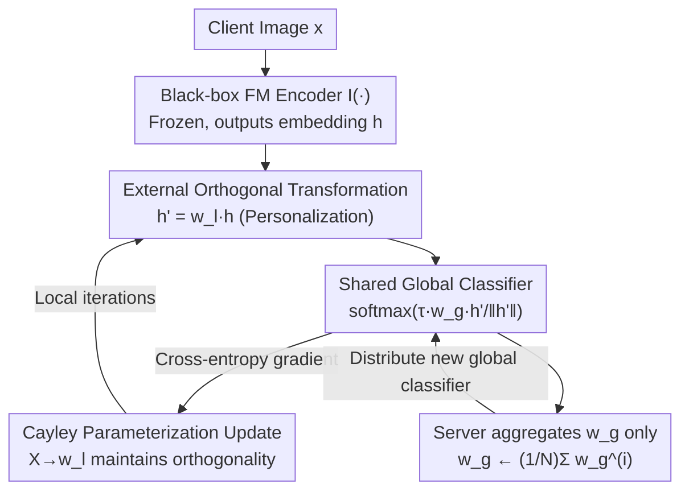

# Generalized and Personalized Federated Learning with Black-Box Foundation Models via Orthogonal Transformations

**Conference**: CVPR 2026  
**Paper**: [CVF Open Access](https://openaccess.thecvf.com/content/CVPR2026/html/Kong_Generalized_and_Personalized_Federated_Learning_with_Black-Box_Foundation_Models_via_CVPR_2026_paper.html)  
**Code**: Not disclosed  
**Area**: Federated Learning / Optimization  
**Keywords**: Federated Learning, Black-Box Foundation Models, Orthogonal Transformations, Generalization and Personalization, Dual Privacy  

## TL;DR
FEDOT treats frozen black-box foundation models (FM) as pure feature extractors. Each client stacks a **local orthogonal transformation** on the output embeddings for personalization, while all clients share and aggregate a **global classifier** for generalization. The authors prove that the orthogonal constraint (condition number $\kappa=1$) minimizes the upper bound of cross-client gradient conflicts, achieving SOTA generalization and personalization under severe non-IID conditions without accessing FM internal parameters.

## Background & Motivation
**Background**: Federated Learning (FL) allows multiple clients to collaborate without uploading raw data. Integrating foundation models (FM) like CLIP, which possess strong generalization capabilities, into FL is a natural requirement to leverage FM representation power while protecting data privacy.

**Limitations of Prior Work**: In reality, most FMs are proprietary assets of vendors, provided only via APIs or compiled binaries. Clients **cannot access weights, architectures, or gradients**, allowing only black-box calls. This invalidates numerous methods: PEFT approaches like LoRA and Adapter require inserting modules into the network; OFT (Orthogonal Fine-Tuning) requires re-parameterizing existing weight matrices; and most Personalized Federated Learning (PFL) methods require access to internal gradients. All of these assume white-box access and fail under black-box constraints.

**Key Challenge**: There are two layers of tension. The first is a classic FL issue—under non-IID conditions, it is difficult to simultaneously obtain a global model that generalizes to unseen clients and a personalized model adapted to local distributions. The second is the **dual privacy** introduced by FMs: the need to protect both client data (the duty of FL) and the FM intellectual property (IP) held by the server, which mandates strict black-box access. Existing black-box FL methods like ZooPFL rely on zeroth-order optimization to estimate gradients, which suffers from high query complexity and slow computation.

**Goal**: To achieve high-quality generalization and personalization simultaneously using a lightweight, gradient-based approach under strict black-box constraints where only FM output embeddings are accessible.

**Key Insight**: Since the internal FM cannot be modified, operations should be restricted to the **output feature vectors**. The authors key observation is that if the transformation stacked outside the embeddings is **orthogonal**, it serves as a personalized adaptation while acting as an isometric transformation (preserving length and angles), thus not destroying the geometric structure of the FM representation space. More importantly, the condition number of an orthogonal matrix is always 1, which happens to minimize the theoretical upper bound of cross-client gradient conflicts.

**Core Idea**: Use a "**global shared classifier + local private orthogonal transformation**" external dual-parameter structure to replace any internal fine-tuning requiring white-box access, solving generalization, personalization, and dual privacy under black-box constraints.

## Method

### Overall Architecture
FEDOT splits each client's model into two parts: the **global parameters**—a task classifier $w_g \in \mathbb{R}^{K\times d}$ ($K$ classes, $d$-dimensional features) shared by all clients and aggregated at the server; and the **local parameters**—an orthogonal transformation $w_l^{(i)}\in\mathbb{R}^{d\times d}$ private to each client $i$ and never uploaded. The black-box FM encoder $I(\cdot)$ remains completely frozen, responsible only for mapping image $x$ to feature $h=I(x)$.

During the forward pass, the local orthogonal transformation first linearly transforms the feature to $h'=w_l^{(i)}h$, which is then fed into the global classifier to compute classification probabilities:

$$P\big(y\mid x; w_g, w_l^{(i)}\big)=\mathrm{softmax}\Big(\tau\, w_g\, \tfrac{h'}{\|h'\|}\Big),$$

where $\tau$ is a temperature hyperparameter. During local training, clients minimize the standard cross-entropy $\ell^{(i)}=\mathbb{E}_{(x,y)\sim D^{(i)}}[-\log P(y\mid x; w_g^{(i)}, w_l^{(i)})]$, updating both $w_g^{(i)}$ and the orthogonal transformation. After a round, the **server only aggregates the global classifier** $w_g\leftarrow\frac{1}{N}\sum_{i=1}^N w_g^{(i)}$, while the local orthogonal transformations stay on the devices. Thus, personalization is achieved through individual $w_l^{(i)}$, generalization through the aggregated $w_g$, and dual privacy is guaranteed by the architecture—internal FM is never accessed, and local transformations are never transmitted.

### Key Designs

**1. External Orthogonal Transformation: Personalization at the black-box side without touching the FM**

**Design Motivation**: The difficulty of personalization lies in the black-box constraint—traditional PFL either inserts modules into the encoder or fine-tunes the feature extractor, neither of which is possible under black-box status. FEDOT moves personalization entirely **outside** the FM: each client learns a $d\times d$ orthogonal matrix $w_l^{(i)}$ to transform FM features via $h'=w_l^{(i)}h$. The insistence on **orthogonality** rather than arbitrary linear transformations is because orthogonal transformations are isometric—they preserve vector lengths and angles. Consequently, the semantic integrity and manifold structure of the original FM representation space remain valid after transformation, merely being "rotated/reflected" to orientations better fitting the local distribution. Orthogonal matrices are also naturally invertible, ensuring that distinct features in the original space remain distinguishable after transformation, avoiding information collapse. Furthermore, a $d\times d$ orthogonal matrix has only $\frac{d(d-1)}{2}$ degrees of freedom (roughly half that of a general $d^2$ linear transformation), providing a constrained capacity that suppresses overfitting to local data.

**2. Shared Global Classifier: Generalization through aggregation**

**Mechanism**: Local transformations alone can only manage local performance without generalizing to unseen clients. FEDOT has all clients share a task-related classifier $w_g\in\mathbb{R}^{K\times d}$. It can be initialized randomly or, when using a VLM, by encoding class prompts $\{T(p_c)\}_{c=1}^K$ into class vectors (using the text encoder $T$ only once at initialization). During training, each client updates its local $w_g^{(i)}$, and **the server only performs average aggregation on this single classifier** $w_g\leftarrow\frac1N\sum_i w_g^{(i)}$. This step is the source of generalization—it merges task knowledge learned by various clients into a shared classification head, which can then be directly applied to unseen domains. Additionally, experiments show it conversely enhances personalization (knowledge transfer from aggregation improves local performance). The communication cost is extremely low: only the $K\times d$ classifier is exchanged (approx. 5K parameters on FEMNIST), while local $d\times d$ transformations never leave the device.

**3. Cayley Parameterization + Gradient Conflict Bound: Why orthogonality is the optimal solution**

**Mechanism**: Maintaining strict orthogonality for $w_l^{(i)}$ during SGD is non-trivial. FEDOT utilizes the differentiable **Cayley transform**: it optimizes an unconstrained matrix $X^{(i)}$, constructs a skew-symmetric matrix $R^{(i)}=\frac12\big(X^{(i)}-(X^{(i)})^\top\big)$, and then sets $w_l^{(i)}=(I+R^{(i)})(I-R^{(i)})^{-1}$. This is a smooth parameterization on the Stiefel manifold, ensuring $w_l^{(i)}$ remains strictly orthogonal after every update. The real explanation for "why orthogonality is necessary" is provided by Theorem 1: the difference between global parameter gradients of two clients $i,j$ satisfies:

$$\Big\|\nabla_{w_g^{(i)}}\ell^{(i)}-\nabla_{w_g^{(j)}}\ell^{(j)}\Big\|\le 2\tau\big[\kappa(w_l^{(i)})+\kappa(w_l^{(j)})\big],$$

where $\kappa(\cdot)$ is the condition number of the transformation. When both local transformations are orthogonal, $\kappa=1$, and the upper bound tightens to the constant $4\tau$—the **minimum** upper bound achievable under this linear transformation framework. Intuitively, the upper bound of gradient conflict is proportional to the condition number; the orthogonal constraint fixes the condition number at 1, allowing global parameter aggregation to remain stable even under severe non-IID conditions where client gradient directions would otherwise diverge. Thus, orthogonality is not just "helpful" but **optimal** within this framework.

**4. Block-Diagonal Orthogonal Transformation: Tuning degrees of freedom via task complexity (FEDOT(+B))**

**Mechanism**: While orthogonal constraints are beneficial, $\frac{d(d-1)}{2}$ degrees of freedom might still be excessive for simple tasks. FEDOT(+B) partitions the dimension $d$ into $r$ blocks, with each block $Q_k$ being independently orthogonal, resulting in a block-diagonal matrix $B=\mathrm{diag}(Q_1,\dots,Q_r)$. Since each block is orthogonal, the overall condition number remains $\kappa(B)=1$, and the minimum upper bound of Theorem 1 still holds. However, the total degrees of freedom are reduced to $\frac{d(d/r-1)}{2}$. This provides a "knob" to adjust between "local adaptation capability" and "global semantic structure preservation": simple tasks (like FEMNIST) benefit most from fewer degrees of freedom to prevent overfitting, while complex tasks (like Office-Home) require higher degrees of freedom to capture domain-specific patterns. Experimentally, FEDOT(+B) is the best-performing variant overall.

### Loss & Training
The local objective is standard cross-entropy $\ell^{(i)}$. Local updates are applied to $w_g^{(i)}$ and the unconstrained matrix $X^{(i)}$, with $w_l^{(i)}$ recalculated via Cayley transform at each step to maintain orthogonality. On the server side, only FedAvg-style averaging is performed on $w_g$; local orthogonal transformations do not participate in aggregation. The backbone used is CLIP ViT-B/32, which remains completely frozen with no gradients backpropagated into the encoder.

## Key Experimental Results

### Main Results
Five datasets with significant domain shifts (FEMNIST / PACS / Office-Home / VLCS / TerraIncognita) were evaluated using a leave-one-out cross-domain protocol, constructing an $N\times N$ accuracy matrix: the diagonal (Generalization G) represents the accuracy of the global model on the held-out domain, off-diagonal entries (Personalization P) represent personalized accuracy on seen domains, and C is the overall average. Results are averaged over 3 random seeds (50/77/98). The table below shows the average across five datasets (%):

| Method | G(%) | P(%) | C(%) | Description |
|------|------|------|------|------|
| CLIP (ZS) | 67.31 | – | – | Zero-shot baseline |
| FedCLIP | 71.76 | 77.16 | 75.81 | Adapter, purely global |
| PromptFL | 78.01 | 84.97 | 83.23 | Prompt tuning via CoOp |
| VPT | 71.25 | 83.36 | 80.18 | Visual Prompt Tuning |
| FedLT | 74.77 | 88.43 | 84.24 | Unconstrained general linear transform |
| FedAdapter | 77.99 | 86.93 | 84.57 | Non-linear MLP adapter |
| FedOT(All Global) | 76.59 | 84.09 | 82.22 | Global parameters only |
| FedOT(All Local) | – | 84.54 | – | Local only, no aggregation |
| **FEDOT (Ours)** | 76.04 | 86.21 | 83.65 | Full orthogonal transformation |
| **FEDOT(+B) (Ours)** | **78.67** | **88.58** | **86.10** | Block-diagonal variant, optimal |

FEDOT(+B) achieved the highest overall average accuracy of 86.10% with a very small standard deviation across seeds. Comparisons are telling: the purely global FedOT(All Global) achieved only 84.09% personalization, while the purely local FedOT(All Local) reached 84.54%. In contrast, FEDOT(+B) maximized both G and P—aggregating global parameters not only provides generalization but also enhances personalization. Notably, traditional PFL methods (FedGH(C), FedAKT(C)) adapted to the CLIP backbone performed poorly (average C only 34.85% / 53.88%), indicating that PFL designed for lightweight models can destroy the inherently strong representations of FMs when applied to FM-FL.

### Ablation Study

**Gradient Conflict and Condition Number (Validating Theorem 1)**: Conflict was measured using the average pseudo-gradient cosine similarity across rounds (higher is better).

| Dataset | FEDOT ($\kappa=1$) | FedLT (Gen. Linear, $\kappa\ge1$) | FedAdapter (Non-linear) |
|--------|------|------|------|
| FEMNIST | **0.401** | 0.309 | 0.258 |
| VLCS | **0.002** | -0.084 | -0.307 |
| TerraIncognita | **0.029** | -0.045 | -0.235 |
| PACS | **0.036** | 0.002 | -0.117 |
| OfficeHome | **0.052** | 0.000 | -0.150 |

FEDOT with orthogonal constraints consistently maintained the highest and near-zero or positive similarity (minimum conflict). Once constraints were relaxed, FedLT's similarity frequently dropped into negative values, with the non-linear FedAdapter being the worst. The impact of the condition number on accuracy was direct: on FEMNIST, FedLT's average $\kappa$ spiked to 32.26, and generalization accuracy dropped from FEDOT's 94.93% to 88.74%, strongly supporting the claim: "Relaxing $\kappa$ → loosening the gradient bound → damaging generalization."

**Classifier Initialization** (Tab. 4): Comparing CLIP text encoder initialization vs. random initialization, random initialization actually performed better on FEMNIST (C 96.51% vs 95.84%) and Office-Home across five datasets. This suggest that the effectiveness of FEDOT stems primarily from the orthogonal adaptation + robust aggregation optimization method rather than a reliance on CLIP's multi-modal alignment—meaning it is also applicable to vision-only FMs.

### Key Findings
- **Orthogonality is Optimal, Not Optional**: Removing orthogonal constraints significantly increased gradient conflict and caused drops in generalization, matching the $4\tau$ minimum upper bound in Theorem 1—a rare "theoretical prediction—experimental validation" closed loop.
- **Block-Diagonal Degrees of Freedom Should Be Tuned per Task**: Simple tasks benefit most from low degrees of freedom to prevent overfitting, while complex tasks require more. Thus, FEDOT(+B) generally outperforms the full orthogonal version.
- **Scalability**: On FEMNIST, increasing the number of participating clients from 1 to 75 saw FEDOT's generalization accuracy rise monotonically to 71.18% (CLIP zero-shot is only 44.00%), remaining more stable than the strongest baseline PromptFL (which plunged from 73.54% at 40 clients to 65.30% at 75 clients).
- **Efficiency**: Since gradients are not backpropagated into the encoder, computational overhead is independent of backbone scale. Communication is minimal, involving only the $K\times d$ classifier (approx. 5K parameters for FEMNIST).

## Highlights & Insights
- **Moving "Personalization" Outside the Model**: By not touching the FM and merely stacking an orthogonal rotation on the output embeddings, the method achieves personalization, black-box constraints, and FM IP protection—an "external adaptation" approach transferable to any proprietary large model providing only embedding interfaces.
- **Explicit Quantization of Gradient Conflict via Condition Number**: Theorem 1 translates the abstract "client heterogeneity leading to training instability" into "gradient difference upper bound $\propto$ condition number," and then uses orthogonal matrices with $\kappa=1$ to drive it to the infimum. The theoretical and engineering motivations are highly unified.
- **Block-Diagonal as a Clean Capacity "Knob"**: It allows for monotonically decreasing degrees of freedom while maintaining $\kappa=1$, providing a design interface to tune adaptation capability by task difficulty without breaking the optimal bound.

## Limitations & Future Work
- **Linearity of Personalized Transformations**: Representation capability is limited to rotation/reflection, which may be insufficient for tasks requiring highly non-linear local adaptation; the authors also noted that degrees of freedom ($r$ blocks) require manual tuning.
- ⚠️ **Generalization is Not Always Ranked First**: While FEDOT(+B) achieved the highest average G (78.67%), on PACS, the purely global FedOT(All Global) generalization (94.55%) slightly outperformed FEDOT (94.53%), indicating trade-offs still exist between generalization and personalization in specific domains.
- **Dependence on FM Representation Quality**: The method preserves rather than reshapes the geometry of FM representations. If a black-box FM performs poorly in a domain (e.g., TerraIncognita, G only 20-30%), orthogonal transformations cannot recover it.
- **Theoretical Bounds Limited to Linear Frameworks**: The $4\tau$ minimum bound is optimal *within* the premise of linear local transformations; whether it remains optimal outside the linear framework is an open question.

## Related Work & Insights
- **vs OFT / Orthogonal Fine-Tuning**: OFT also uses orthogonal matrices but re-parameterizes internal FM weights, requiring white-box access. FEDOT places transformations outside the embeddings, specifically designed for black-box scenarios.
- **vs ZooPFL (Black-box FL)**: ZooPFL also addresses black-box FMs but relies on zeroth-order optimization to estimate gradients, resulting in high query complexity. FEDOT allows efficient gradient-based learning because it transforms external features, decoupling it entirely from the FM.
- **vs FedCLIP / PromptFL and other PEFT-FL**: These are either purely global (FedCLIP) lacking personalization, or require full backpropagation through the encoder (PromptFL/VPT/CoCoOp), with costs scaling with the backbone. FEDOT uses a global classifier + local orthogonal transformation dual-parameter structure to balance generalization and personalization with costs independent of backbone scale.

## Rating
- Novelty: ⭐⭐⭐⭐⭐ The first framework to introduce orthogonal transformations to black-box FM-FL and provide an optimal bound for gradient conflict. Both the problem setting and the solution are novel.
- Experimental Thoroughness: ⭐⭐⭐⭐ Extensive evaluation across five datasets, multiple seeds, and up to 75 clients with theoretical validation, though verification on larger-scale or stronger FM backbones is missing.
- Writing Quality: ⭐⭐⭐⭐⭐ Clear closed loop from motivation through method and theory to experiments. Theorem 1 corresponds directly with ablation studies, offering high readability.
- Value: ⭐⭐⭐⭐⭐ Given the trend of proprietary large models offering only APIs, "external black-box personalization" has significant real-world utility.

<!-- RELATED:START -->

## Related Papers

- [\[CVPR 2026\] Few-for-Many Personalized Federated Learning](few-for-many_personalized_federated_learning.md)
- [\[CVPR 2026\] SCOPE: Semantic Coreset with Orthogonal Projection Embeddings for Federated learning](scope_semantic_coreset_with_orthogonal_projection_embeddings_for_federated_learn.md)
- [\[AAAI 2026\] Instance Generation for Meta-Black-Box Optimization through Latent Space Reverse Engineering](../../AAAI2026/optimization/instance_generation_for_meta-black-box_optimization_through_latent_space_reverse.md)
- [\[AAAI 2026\] Personalized Federated Learning with Bidirectional Communication Compression via One-Bit Random Sketching](../../AAAI2026/optimization/personalized_federated_learning_with_bidirectional_communication_compression_via.md)
- [\[NeurIPS 2025\] Personalized Subgraph Federated Learning with Differentiable Auxiliary Projections](../../NeurIPS2025/optimization/personalized_subgraph_federated_learning_with_differentiable_auxiliary_projectio.md)

<!-- RELATED:END -->
