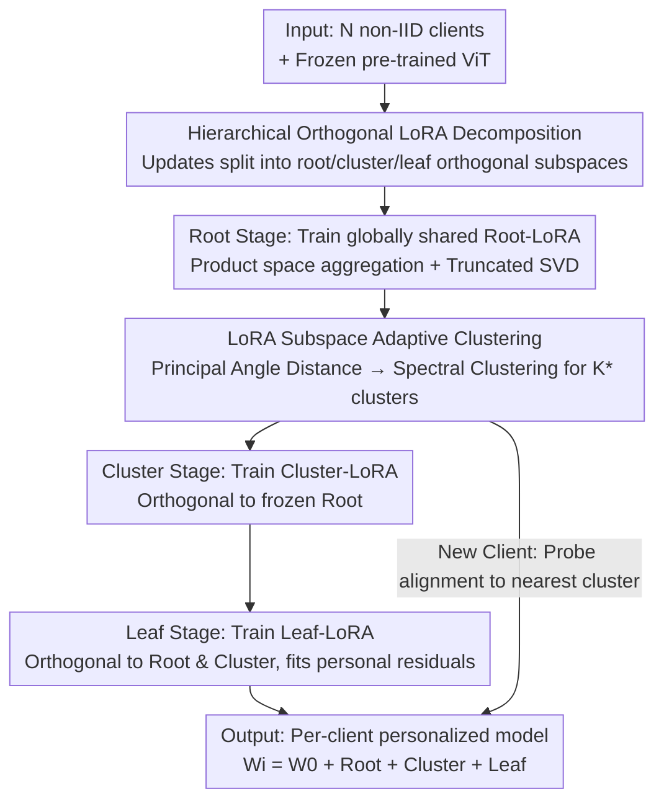

# HiLoRA: Hierarchical Low-Rank Adaptation for Personalized Federated Learning

**Conference**: CVPR 2026  
**Paper**: [CVF Open Access](https://openaccess.thecvf.com/content/CVPR2026/html/Peng_HiLoRA_Hierarchical_Low-Rank_Adaptation_for_Personalized_Federated_Learning_CVPR_2026_paper.html)  
**Code**: Not disclosed  
**Area**: Federated Learning / Parameter-Efficient Fine-Tuning  
**Keywords**: Federated Learning, LoRA, Personalization, Hierarchical Adaptation, Subspace Clustering

## TL;DR
HiLoRA decomposes the LoRA update of each client into a three-layer orthogonal subspace structure consisting of "root-cluster-leaf," which respectively capture global consensus, subgroup commonalities, and client personalization. Combined with an adaptive clustering mechanism based on LoRA subspace similarity, it achieves SOTA performance in both personalization and generalization to new clients on CIFAR-100 and DomainNet.

## Background & Motivation

**Background**: Federated Learning (FL) enables distributed clients to collaborate on training without sharing raw data. When backbones are replaced by foundation models like ViT, the communication overhead of full fine-tuning becomes prohibitive. Consequently, LoRA has become a mainstream Parameter-Efficient Fine-Tuning (PEFT) solution, transmitting only two low-rank factors $B\in\mathbb{R}^{p\times r}$ and $A\in\mathbb{R}^{r\times q}$ to represent the update $\Delta W=BA$.

**Limitations of Prior Work**: Recent works split "personalization" and "generalization" into dual-adapters (dual-LoRA): one for global aggregation and one for local privacy. However, this paper identifies three critical flaws: ① Under severe non-IID conditions, clients converge toward different local optima, causing local gradients to pull against each other and **dragging the aggregated global adapter away from the optimal solution (gradient drift)**; ② Leaf-level local adapters are trained on small, skewed datasets, making them **prone to overfitting** and resulting in fragile decision boundaries; ③ The dual-design completely ignores the **latent subgroup structures** naturally formed by clients in real-world deployments, causing subgroup-level knowledge to be either diluted into the global adapter or trapped locally, failing to transfer between related clients.

**Key Challenge**: The tension between global utility and local personalization is coarse-grained—offering only "global" or "local" levels while missing the intermediate "subgroup" granularity, leading to the long-term inefficient utilization of subgroup-level information.

**Goal**: While maintaining PEFT communication efficiency, use a unified low-rank representation to **simultaneously** address the three granularities of global consensus, cluster-level commonality, and client personalization, while allowing new clients to quickly align with the appropriate subgroup.

**Key Insight**: The authors observe that the additive form of LoRA $W=W_0+\sum_h \Delta W_h$ naturally supports **stacking** multiple LoRA modules. By ensuring that updates at different levels fall into **mutually orthogonal subspaces**, each layer can be responsible for its own residual level without interference.

**Core Idea**: Replace dual-adapters with a "root-cluster-leaf" three-layer orthogonal LoRA and use LoRA subspace similarity to automatically discover client clusters, followed by cascaded layer-wise training.

## Method

### Overall Architecture
The input to HiLoRA consists of $N$ clients with non-IID private data and a frozen pre-trained ViT. The output is a personalized model for each client $i$ assembled along its "root→cluster→leaf" path: $W_i = W_0 + B_rA_r + B_{c,j(i)}A_{c,j(i)} + B_{\ell,i}A_{\ell,i}$. The essence of the process is "hierarchical knowledge separation followed by cascaded training and layer-wise freezing": first train the root adapter shared by all, then use root update subspace similarity to group clients into clusters and train cluster adapters (constrained to be orthogonal to the frozen root), and finally train leaf adapters private to each client (constrained to be orthogonal to both root and cluster).

### Key Designs

**1. Hierarchical Orthogonal LoRA Decomposition: Decoupling Three Granularities via Orthogonal Subspaces**

Addressing the issue where dual-adapters lack a place for subgroup knowledge, HiLoRA decomposes the weight update of client $i$ into three **orthogonally constrained** low-rank components $\Delta W_i = B_rA_r + B_{c,j(i)}A_{c,j(i)} + B_{\ell,i}A_{\ell,i}$. From a decoupling perspective: the basis matrix $B$ determines "in which direction to adapt" (adaptation direction), and the paired coefficient matrix $A$ determines "how much to adapt along these directions" (magnitude). To prevent layers from overlapping, the authors enforce pairwise orthogonality of the column spaces along each path $r\!\to\!j(i)\!\to\!i$: $\forall\,U\neq V\in\{\mathcal{R}(B_r),\mathcal{R}(B_{c,j(i)}),\mathcal{R}(B_{\ell,i})\}: U\perp V$. After orthogonalization, the root handles trends shared by all, the cluster handles subgroup commonalities, and the leaf focuses on client residuals that cannot be explained by higher levels.

**2. LoRA Subspace Adaptive Clustering: Discovering Client Subgroups from Adaptation Directions**

To address the neglected latent subgroup structure without exposing raw data, HiLoRA clusters based on the similarity of client LoRA subspaces. In each round $t$, the basis $B_i^{(t)}$ is extracted and normalized to a unit Frobenius norm, then stabilized across rounds using an EMA with decay $\lambda$: $\bar{B}_i^{(t)}=\lambda\bar{B}_i^{(t-1)}+(1-\lambda)\hat{B}_i^{(t)}$. An SVD is performed on $\bar{B}_i^{(t)}$ to take the top $r$ left singular vectors $U_i^{(t)}$ to span the "adaptation direction subspace," achieving reparameterization invariance and noise robustness. The distance between two clients is defined by **principal angles**: $d_{ij}=1-\frac{1}{r}\sum_{s=1}^{r}\cos^2\theta_s = 1-\frac{1}{r}\lVert U_i^{(t)\top}U_j^{(t)}\rVert_F^2$, where $\cos\theta_s$ are the singular values of $U_i^{(t)\top}U_j^{(t)}$. This distance matrix is converted to an affinity matrix via a Gaussian kernel $S_{ij}=\exp(-d_{ij}^2/2\sigma^2)$ before running spectral clustering. The number of clusters $K$ is automatically determined by scanning $[K_{\min},K_{\max}]$ and maximizing the eigengap of the normalized Laplacian spectrum.

**3. Cascaded Layer-wise Optimization + Inter-layer Orthogonal Regularization**

HiLoRA does not optimize the three layers simultaneously; instead, it uses a **root→cluster→leaf cascade**. Each layer is frozen after training, forcing subsequent layers to operate only in directions complementary to the frozen ones. In the root stage, a weighted loss is minimized across all clients, and the server aggregates updates in the **product space** $\Delta W_r^{(t+1)}=\sum_i \pi_i^{\text{root}}B_{r,i}^{(t)}A_{r,i}^{(t)}$ (avoiding cross-terms from averaging $B$ and $A$ separately), followed by a rank-$r$ truncated SVD to reset $B_r,A_r$. Training stops when the relative step size $\rho_t=\lVert\Delta W_r^{(t+1)}-\Delta W_r^{(t)}\rVert_F/(\lVert\Delta W_r^{(t)}\rVert_F+\varepsilon)\le\tau_{\text{rel}}$ is reached. The cluster stage adds an orthogonal regularization $\gamma_c\lVert B_r^{\star\top}B_{c,j}\rVert_F^2$ over the frozen root, and the leaf stage adds both $\gamma_c\lVert B_r^{\star\top}B_{\ell,i}\rVert_F^2+\gamma_\ell\lVert B_{c,j}^{\star\top}B_{\ell,i}\rVert_F^2$.

**4. Subspace Routing for Fast Generalization to New Clients**

For generalization to unseen clients, HiLoRA reuses the subspace metrics. For a new client $u$, a few local gradient steps produce a lightweight probe basis $B_u$. Its top $r$ left singular vectors $U_u$ are used to assign it to the most similar cluster via $j^\star(u)=\arg\max_j \text{mean}(\cos^2\Theta(U_u,U_{c,j}))$. This allows the new client to **immediately** perform inference using the root + cluster layers. Theoretically, the authors provide a layer-wise generalization bound (Theorem 1), proving that clustering brings $D_i$ closer to the cluster distribution $C_{j(i)}$ to reduce distribution shift, while orthogonality narrows the hypothesis class and reduces Rademacher complexity.

## Key Experimental Results

### Main Results
The backbone is an ImageNet-21K pre-trained ViT-Base with LoRA inserted into query/value projections. CIFAR-100 uses 100 clients with three non-IID partitions (GL–Dir(0.3), SC–Dir(3), Patho(10)). DomainNet uses 90 clients across 6 domains. 9 LoRA federated baselines (Local-LoRA, FedIT, FlexLoRA, FedSA-LoRA, FDLoRA, FedDPA-F/T, PF²LoRA, FedALT) are compared.

| Dataset / Setting | Metric | HiLoRA (Ours) | Sub-optimal Baseline | Gain |
|--------|------|------|----------|------|
| CIFAR-100 SC–Dir(3) | Mean Acc | **0.934** | 0.912 (FedALT) | +2.2pt |
| CIFAR-100 SC–Dir(3) | Tail (10%) Acc | **0.791** | 0.763 (FedALT) | +2.8pt |
| CIFAR-100 GL–Dir(0.3) | Mean Acc | **0.846** | 0.818 (FlexLoRA) | +2.8pt |
| CIFAR-100 Patho(10) | Mean Acc | **0.941** | 0.929 (FedALT) | +1.2pt |
| DomainNet | Client Mean Acc | **0.877** | 0.860 (FedDPA-F) | +1.7pt |
| DomainNet | Tail (10%) Acc | **0.589** | 0.583 (FedDPA-F) | +0.6pt |
| CIFAR-100 Patho(10) | Unseen Client Acc | **0.940** | 0.879 (FedDPA-T) | +6.1pt |

The improvement in unseen client generalization is particularly significant: HiLoRA reaches 0.940 on Patho(10), far exceeding the 0.879 of the runner-up. Furthermore, loading only the root + cluster adapters (zero-leaf fine-tuning) achieves 0.811 on CIFAR-100 and 0.849 on DomainNet, already surpassing sub-optimal baselines requiring 5 epochs of fine-tuning (0.788 / 0.840).

### Ablation Study

Layer-wise gains (Table 3) show the contribution of the three-layer structure:

| Stage | CIFAR-100 Mean±std | Relative Gain (Root/Cluster) | DomainNet Mean±std |
|------|------|---------|------|
| Root | 0.663 ± 0.18 | — | 0.815 ± 0.15 |
| + Cluster | 0.889 ± 0.10 | +22.6% / — | 0.864 ± 0.13 |
| + Leaf | 0.934 ± 0.06 | +27.1% / +4.5% | 0.877 ± 0.11 |

Component ablation (Table 4):

| Configuration | CIFAR-100 Per. / Gen. | DomainNet Per. / Gen. |
|------|---------|---------|
| Hierarchical LoRA only | 89.7 / 87.5 | 85.4 / 84.2 |
| + LoRA Subspace Clustering | 92.8 / 92.2 | 86.0 / 85.1 |
| + Orthogonal Loss (Full) | 94.1 / 94.0 | 0.877 / 0.861 |

### Key Findings
- **Cluster layer provides the largest contribution**: Adding the cluster layer on CIFAR-100 boosts accuracy from 0.663 to 0.889 (+22.6pt), which is the largest jump among the three layers, confirming that "subgroup granularity" is critical information missing in dual-LoRA.
- **Standard deviation decreases with levels**: On CIFAR-100, std drops from 0.18 → 0.10 → 0.06, indicating that the three-layer structure not only raises the mean but also makes performance more uniform across clients.
- **Subspace clustering > Parameter space clustering**: Replacing "k-means on full parameter updates" with LoRA subspace principal angle clustering improves both personalization and generalization (+3.1 / +4.7pt on CIFAR-100).
- **Orthogonal constraints are effective**: Adding orthogonal loss further improves results by 1–2pt; principal angle distributions show significantly small $\cos^2\theta$ for root–leaf and cluster–leaf subspaces, verifying reduced inter-layer overlap.

## Highlights & Insights
- **"Direction vs Magnitude" Decoupling**: Separating $B$ (where to adapt) and $A$ (how much to adapt) and applying orthogonal constraints to the column space of $B$ is a clean geometric intuition. It ensures that "hierarchical" means more than just stacking; it truly partitions the update space.
- **Privacy-friendly Clustering via LoRA Subspace**: Discovering client subgroups through principal angles of adaptation directions without touching raw data, while using EMA + SVD for stability, is a clever way to integrate structural discovery into the LoRA pipeline.
- **Training as Routing**: The subspace metric used for clustering is reused during testing for cluster routing, achieving strong generalization for "root+cluster" without additional mechanisms.

## Limitations & Future Work
- **Uniform Rank for All Layers**: The authors acknowledge that future work should explore assigning different ranks to different levels; intuitively, the root might need a higher rank for global consensus, while leaves could use lower ranks.
- **Budget Splitting in Cascaded Training**: The split $T_{\text{root}}+T_{\text{cluster}}+T_{\text{leaf}}=50$ is manual. The paper lacks a systematic sensitivity analysis on how many rounds each stage needs or how to set $\tau_{\text{rel}}$.
- **Clustering Overhead and K Scanning**: Performing SVD, constructing distance matrices, and scanning $K$ for each round introduces server-side overhead, raising concerns about scalability for thousands of clients.
- **Visual Classification Tasks Only**: Experiments are limited to image classification. Extension to detection, segmentation, or LoRA-MoE architectures remains to be validated.

## Related Work & Insights
- **vs Dual-adapters (FedDPA-F/T, PF²LoRA, FedALT)**: These only have global and local levels. HiLoRA adds the "cluster" level and decouples the three layers via orthogonal constraints, where the cluster layer yields the most gain (+22.6pt).
- **vs FlexLoRA**: Both aggregate in the product space $BA$ to avoid cross-terms. HiLoRA adopts this aggregation but adds the hierarchical structure and orthogonal regularization on top.
- **vs Parameter Space Clustering**: HiLoRA’s use of LoRA subspace principal angles provides reparameterization invariance and noise robustness, outperforming k-means on full updates.

## Rating
- Novelty: ⭐⭐⭐⭐ The combination of three-layer orthogonal LoRA and subspace clustering is a clear new structure in federated PEFT.
- Experimental Thoroughness: ⭐⭐⭐⭐ Comprehensive tests across datasets, baselines, and non-IID settings; however, lacks large-scale client analysis.
- Writing Quality: ⭐⭐⭐⭐ Logical structure with clear links between challenges and design solutions.
- Value: ⭐⭐⭐⭐ The "subgroup granularity + training-as-routing" approach is practical and transferable for personalized FL with foundation models.

<!-- RELATED:START -->

## Related Papers

- [\[CVPR 2026\] Personalized Federated Training of Diffusion Models with Privacy Guarantees](personalized_federated_training_of_diffusion_models_with_privacy_guarantees.md)
- [\[CVPR 2026\] GDFA: Geometry-Driven Federated Unlearning with Directional Task Vector Alignment](gdfa_geometry-driven_federated_unlearning_with_directional_task_vector_alignment.md)
- [\[CVPR 2026\] Fully Decentralized Certified Unlearning](fully_decentralized_certified_unlearning.md)

<!-- RELATED:END -->
