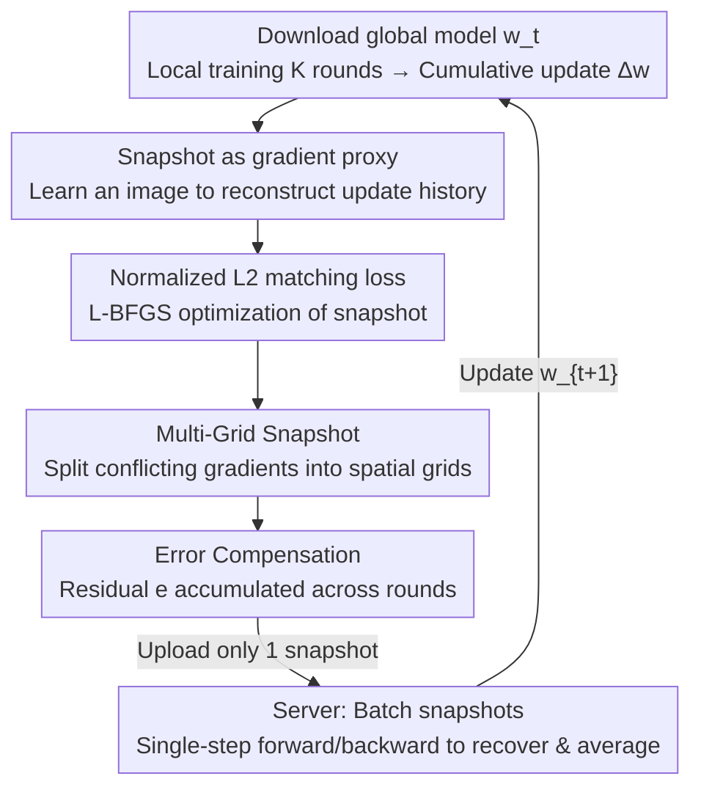

# OS-FED: One Snapshot Is All You Need

**Conference**: CVPR 2026  
**Paper**: [CVF Open Access](https://openaccess.thecvf.com/content/CVPR2026/html/Qian_OS-Fed_One_Snapshot_Is_All_You_Need_CVPR_2026_paper.html)  
**Code**: None  
**Area**: Federated Learning / Communication-Efficient Optimization  
**Keywords**: Federated Learning, Communication Efficiency, Gradient Compression, Data Distillation, One-Shot

## TL;DR
OS-FED encodes the cumulative gradients of a client's entire local training period into a "synthetic snapshot"—comprising one 224×224 synthetic image and a set of learnable labels. In each round, only this snapshot is transmitted. The server recovers and aggregates global updates through a single feedforward and backpropagation step, reducing communication overhead by 1.5–16× and accelerating convergence by 18–45% compared to SOTA methods.

## Background & Motivation

**Background**: Federated Learning (FL) enables multiple clients to collaboratively train a global model without uploading raw data. FedAvg serves as the de facto standard—clients download the global model, train locally for several epochs, and transmit the model update $\Delta w$ back to the server for averaging.

**Limitations of Prior Work**: Since $\Delta w$ consists of millions of parameters, communication overhead explodes as model size increases. For instance, training a medium-sized RegNetX on ImageNet-10 generates 8040 MB of traffic in just 10 rounds. This bottleneck is exacerbated in the LLM era.

**Key Challenge**: Existing optimization strategies face significant hurdles. "Increasing local computation to reduce communication rounds" leads to client drift or divergence on non-IID data. "Direct gradient compression" (sparsity/quantization) suffers from severe information loss, and since FL clients are stateless, it is difficult for the server to reconstruct complex gradient structures. Another route, "distilling local data into small synthetic sets for upload," concentrates data proxies on the server for retraining, which violates the decentralized principle of FL, poses privacy risks, requires expensive bilevel optimization, and necessitates access to real labels.

**Core Idea**: Following the adage "a picture is worth a thousand words," instead of compressing high-dimensional gradients directly, one can learn a **compact proxy** for reconstruction. The authors observe that model gradients can be effectively reconstructed from an ordinary image and its corresponding labels. Consequently, they propose OS-FED: in each round, each client transmits only **one synthetic snapshot** (image + learnable labels). The server utilizes this snapshot to recover the gradient in a single step and performs aggregation. A 32-bit 224×224×3 image consumes only 0.57 MB, representing a 140× reduction compared to the 80.4 MB required for a RegNetX update.

## Method

### Overall Architecture

The core of OS-FED is compressing the "entire local training history of a client" into an **information-dense synthetic snapshot** $S$. The server performs a single-step aggregation on snapshots from all clients to update the global model. The workflow for a single round is as follows: Client $i$ downloads the global model $w_t$, performs $K$ local training epochs on private data, and obtains the cumulative update $\Delta w_{t,i} = \eta_{local}\sum_{k=1}^{K} g_{t,i}^{(k)}$. Subsequently, this "gradient trajectory" (superimposed with historical residuals) is treated as the compression target to optimize a multi-grid snapshot $S^*_{t,i}$. The compression residual is stored in an error vector for the next round, and only $S^*_{t,i}$ is uploaded. On the server side, snapshots from various clients are assembled into a batch to generate synthetic gradients and averaged (gradient recovery), which is used to update the global model.

The pivotal shift is that while traditional compression performs lossy operations in the **gradient space**, OS-FED optimizes the snapshot in an independent **compact parameter space** and generates gradients via a differentiable function. This decoupling of compression and gradient space avoids information loss and transforms server recovery into an O(1) pass rather than a retraining process.

### Key Designs

**1. Snapshot as Gradient Proxy: Compressing local updates into a gradient-generating image**

To address the high cost of transmitting high-dimensional gradients and the information loss of direct compression, OS-FED transmits a compact snapshot $S_i$ (synthetic image + learnable labels). It ensures that the "synthetic gradient generated by this snapshot" approximates the cumulative local update. This is formulated as an optimization problem with a budget constraint:

$$S^*_{t,i} = \underset{S_i}{\arg\min}\; D(\nabla \mathcal{L}(S_i, w_t), \Delta w_{t,i}) \quad \text{s.t.}\quad \|S_i\|_0 \le B$$

Where $\nabla \mathcal{L}(S_i, w_t)$ represents the synthetic gradient obtained by a forward/backward pass of snapshot $S_i$ through model $w_t$, $D(\cdot,\cdot)$ is a gradient distance metric, and $\|S_i\|_0 \le B$ enforces the communication budget using the L0 norm. Server recovery is equally elegant: snapshots from $C$ clients are concatenated along the batch dimension, and a single backward pass yields the average synthetic gradient, approximating the ideal global update of FedAvg:

$$\frac{1}{C}\sum_{i=1}^{C}\Delta w_{t,i} \approx \nabla \mathcal{L}_{mean}([S^*_{t,i}]_{i=1}^{C}, w_t)$$

Then $w_{t+1} = w_t - \nabla \mathcal{L}_{mean}(\cdot)$. This step transforms server aggregation into an O(1) operation and is naturally compatible with existing frameworks like LoRA and quantization. The fundamental difference from data distillation is that labels are **learnable and independent of the client's real labels**, and snapshot generation is a single-level optimization rather than bilevel meta-learning.

**2. Multi-Grid Snapshot: Separating conflicting gradient directions into spatial grids**

A "monolithic" snapshot with a single image and label lacks expressivity. Cumulative updates from $K$ local epochs on non-IID data often encode rich features pointing in multiple directions. A single synthetic sample would smear these together (as shown in Figure 3 of the paper, where features of '2' and '9' alias into blurred textures), creating an expressivity bottleneck. OS-FED parameterizes the snapshot $S$ as a set of learnable tensors, including a grid feature map and $M^2$ independent label embeddings, which are "unfolded" by a deterministic, differentiable multi-grid function $\mathcal{F}(\cdot)$. $\mathcal{F}$ treats the feature map as individual patches, each bilinearly upsampled to the target input size and paired with its own label embedding to produce $M^2$ distinct synthetic samples. This allows different parts of the snapshot to specialize in different facets of the target gradient trajectory. The authors provide theoretical support (Proposition 1) showing that the multi-grid function can achieve a superior optimal value: $\min_S D(\mathcal{F}(S),\mathcal{T}) \le \min_S D(S,\mathcal{T})$.

**3. Error Compensation: Retaining residuals for the next round**

Under extremely high compression ratios, the error introduced by the compression operator in each round is non-negligible. If discarded, this error accumulates across rounds, slowing down or destroying convergence. OS-FED maintains an error accumulation vector $e$ locally at each client. The true compression target for each round is the **target gradient trajectory** that superimposes historical residuals:

$$\Delta g_{t,i} = \Delta w_{t,i} + e_{t-1,i}$$

After optimizing $S^*_{t,i}$, the current residual is updated as the difference between the target and the actual synthetic gradient:

$$e_{t,i} = \Delta g_{t,i} - \nabla \mathcal{L}(\mathcal{F}(S^*_{t,i}), w_t)$$

If $e_{t,i}=0$, compression is lossless; otherwise, the non-zero residual is carried over to the next round. This ensures that any information not captured by the snapshot has a chance to be compensated subsequently.

**4. Normalized L2 Matching Loss: Self-calibrating across-layer gradient magnitudes**

Snapshot parameters are learned by minimizing the gap between the synthetic gradient and the target trajectory $\Delta g$. OS-FED utilizes a normalized L2 distance as the matching loss:

$$\mathcal{L}_{match} = \frac{\|\nabla \mathcal{L}(\mathcal{F}(S_i), w_t) - \Delta g_{t,i}\|_2^2}{\|\Delta g_{t,i}\|_2^2 + \varepsilon}$$

A small positive value $\varepsilon$ is added to the denominator to prevent numerical instability when the norm of $\Delta g$ approaches zero. This normalization achieves two goals: it provides a strong optimization signal even when the magnitude of $\Delta g$ decreases in later training stages, and it self-calibrates magnitude differences across layers and parameters. Since $\mathcal{F}$ is fully differentiable, the loss is end-to-end differentiable from $S_i$, allowing the use of L-BFGS for optimization.

### Loss & Training
CV tasks utilize SGD (lr=0.01, cosine annealing), with 10 clients over 100 rounds and $K=5$ local epochs per round. ImageNet subsets use a 4×4 grid by default, while MNIST/FMNIST use 2×2. NLP tasks use GPT2-mini with AdamW (lr=1e-4, linear warmup+decay). Non-IID partitioning is performed via Dirichlet($\alpha$=0.5).

## Key Experimental Results

### Main Results

On CIFAR-10/100 (ResNet-18), OS-FED achieves higher accuracy while reducing communication to the 0.12 MB scale:

| Method | Message Type | CIFAR-10 Acc | CIFAR-10 Size(MB) | CIFAR-100 Acc | CIFAR-100 Size(MB) |
|------|---------|------|------|------|------|
| FedAvg | Gradient | 47.6% | 447.2 | 27.4% | 451.2 |
| FedMPQ (Quantization) | Gradient | 31.5% | 13.9 | 20.2% | 14.1 |
| FedAF (Data Distillation) | Dataset | 41.9% | 23.4 | 26.4% | 234.4 |
| LoRA-FAIR | Gradient | 41.8% | 3.58 | 26.3% | 3.61 |
| **OS-FED (4×4)** | **Snapshot** | **44.9%** | **0.12** | **30.3%** | **0.12** |

On CIFAR-100, OS-FED outperforms the strongest baseline, LoRA-FAIR, by 4.0% while using 30× less communication. To reach 65% accuracy on ImageNet-10, OS-FED requires only 80.5 MB, compared to 280 MB for LoRA-FAIR and 8100+ MB for FedAvg (a reduction of 100×+).

The performance is also validated on NLP (GPT2-mini), with significant latency advantages:

| Method | Message Type | AGNews Acc | Size(MB) | Client Compression Time | Server Decompression Time |
|------|---------|------|------|------|------|
| FedAvg | Gradient | 82.3% | 3124 | - | - |
| LoRA-FAIR | Gradient | 75.5% | 25.0 | - | - |
| FedAF+ (Data Distillation) | Dataset | 80.0% | 11.2 | 56 min | 13 min |
| **OS-FED (4×4)** | **Snapshot** | **81.6%** | **7.66** | **5.46 s** | **0.82 s** |

OS-FED outperforms LoRA-FAIR by 6.1% and FedAF+ by 1.6%. Server decompression drops from 8–13 minutes (FedAF) to sub-second levels—a 1147× reduction—because it involves a single forward/backward pass rather than retraining.

### Ablation Study

| Configuration | Key Metrics (ResNet-18 / RegNetX, ImageNet-10) | Description |
|------|------|------|
| OS-FED (End-to-end Multi-Grid) | 63.5% / 68.0% | Complete method |
| OS-FED-post (Optimize then downsample) | 48.8% / 53.1% | Non-end-to-end, significant drop |
| Oracle (No compression upper bound) | 65.6% / 69.7% | OS-FED approaches the bound |
| Single+Norm.+L2 (Proposed loss) | 63.5% / 68.0% | Full loss function |
| Single+L2 (No normalization) | 61.0% / 64.6% | 2.5% / 3.4% reduction |
| Bi (FedAF-style bilevel optimization) | 28.3% / 28.7% | Bilevel approach fails here |

Ablation on Error Compensation (EC) on ImageNet-10 with varying Multi-Grid factors $M$: EC consistently improves performance across $M$=2/4/8/16. The gain from EC becomes more pronounced as $M$ increases.

### Key Findings
- **Multi-Grid + End-to-End is the core performance driver**: Removing end-to-end training (OS-FED-post) causes accuracy to plummet from 63.5% to 48.8% on ResNet-18, highlighting the necessity of the differentiable unfolding function $\mathcal{F}$.
- **Normalization is essential**: Removing normalization leads to a 2.5–3.4% drop; self-calibrating gradient magnitudes across layers is critical for effective compression.
- **Easy-to-Hard learning dynamics**: Visualizations reveal that early snapshots focus on a few easy-to-classify categories (e.g., 2, 3, 7), spreading to harder and more ambiguous categories as training progresses.
- **Privacy**: The method fits gradient dynamics rather than raw pixels; >75% of snapshots show a cosine similarity <0.25 with original data. Adding noise $\mathcal{F}(S_i+z)$ achieves visual privacy comparable to DP-SGD with much lower overhead (+0.15 GB / +0.2 s vs. 10.3 GB / 10.1 s for DP-SGD).

## Highlights & Insights
- **Ingenious Paradigm Shift**: Reframing "high-dimensional gradient compression" as "learning a compact proxy that generates gradients" bypasses the information loss of lossy compression and the recovery challenges of stateless clients.
- **O(1) Server Recovery**: Recovery is simply a feedforward/backward pass of the snapshot batch. By avoiding the retraining required by data distillation, server decompression time is reduced from minutes to sub-seconds, which is decisive for real-world FL deployment.
- **Spatializing Gradient Conflicts via Multi-Grid**: Using $M^2$ grid cells to handle different directions, paired with $M^2$ learnable labels, is a transferable trick for enhancing expressivity in any synthetic/distillation scenario where a single sample is insufficient.
- **Effective Reuse of Error Feedback**: Porting the classic error-feedback mechanism to snapshot compression elegantly solves the cumulative drift problem at high compression ratios with a single formula $\Delta g = \Delta w + e$.

## Limitations & Future Work
- **Client-side snapshot optimization**: Each round requires L-BFGS fitting (~3.6 s for CV, ~5–6 s for NLP). While small, this represents additional compute for extremely resource-constrained edge devices.
- **Strong theoretical assumptions**: Proposition 1 relies on regularity assumptions such as "natural data falling into subspace $\mathcal{N}$." The extent to which real-world distributions satisfy these warrants further scrutiny.
- **Empirical rather than formal privacy**: The default version provides empirical evidence (cosine/SSIM similarity). Strict guarantees require noise injection, and the privacy-accuracy trade-off under systematic attacks needs further evaluation.
- **Ultra-large models and heterogeneous grids**: The paper focuses on GPT2-mini scale. Whether snapshot capacity is sufficient for massive LLMs and how to adaptively select $M$ remain open questions.

## Related Work & Insights
- **vs. Gradient Compression (e.g., RandTopk, FedMPQ, signSGD)**: These perform lossy operations in gradient space, making complex structures hard to recover. OS-FED learns a proxy in a separate compact parameter space, avoiding loss and achieving 1–2 orders of magnitude lower communication.
- **vs. LoRA-FAIR (Low-rank)**: Low-rank compression is limited by its rank and accuracy. OS-FED is orthogonal and can be stacked with LoRA to further reduce traffic.
- **vs. Data Distillation / Local Data Compression (FedAF, FedSD2C)**: These upload synthetic datasets for server retraining, which is computationally expensive, risks privacy, and requires bilevel optimization. OS-FED uses learnable labels, single-level optimization, and provides orders-of-magnitude faster compression/decompression without server retraining.

## Rating
- Novelty: ⭐⭐⭐⭐⭐ The paradigm shift to "drawing gradients as images" is highly novel in FL compression.
- Experimental Thoroughness: ⭐⭐⭐⭐⭐ Covers CV/NLP, various model sizes, ablation, privacy, and theory.
- Writing Quality: ⭐⭐⭐⭐ Clear motivation and excellent visualizations, though theoretical sections are dense.
- Value: ⭐⭐⭐⭐⭐ 1.5–16× communication reduction and sub-second recovery provide direct value for FL deployment.

<!-- RELATED:START -->

## Related Papers

- [\[CVPR 2026\] Fed-ADE: Adaptive Learning Rate for Federated Post-adaptation under Distribution Shift](fed-ade_adaptive_learning_rate_for_federated_post-adaptation_under_distribution_.md)
- [\[AAAI 2026\] Personalized Federated Learning with Bidirectional Communication Compression via One-Bit Random Sketching](../../AAAI2026/optimization/personalized_federated_learning_with_bidirectional_communication_compression_via.md)
- [\[AAAI 2026\] A Unified Convergence Analysis for Semi-Decentralized Learning: Sampled-to-Sampled vs. Sampled-to-All Communication](../../AAAI2026/optimization/a_unified_convergence_analysis_for_semi-decentralized_learni.md)
- [\[NeurIPS 2025\] Do Neural Networks Need Gradient Descent to Generalize? A Theoretical Study](../../NeurIPS2025/optimization/do_neural_networks_need_gradient_descent_to_generalize_a_theoretical_study.md)
- [\[AAAI 2026\] PEOAT: Personalization-Guided Evolutionary Question Assembly for One-Shot Adaptive Testing](../../AAAI2026/optimization/peoat_personalization-guided_evolutionary_question_assembly_for_one-shot_adaptiv.md)

<!-- RELATED:END -->
