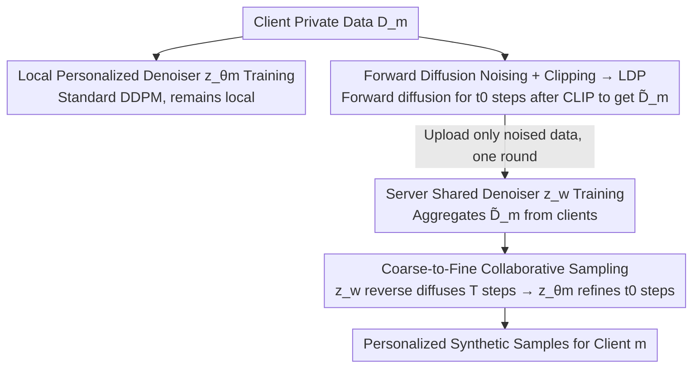

# Personalized Federated Training of Diffusion Models with Privacy Guarantees

**Conference**: CVPR 2026  
**Paper**: [CVF Open Access](https://openaccess.thecvf.com/content/CVPR2026/html/Patel_Personalized_Federated_Training_of_Diffusion_Models_with_Privacy_Guarantees_CVPR_2026_paper.html)  
**Code**: To be confirmed  
**Area**: Federated Learning / Diffusion Models / Differential Privacy  
**Keywords**: Federated Learning, Diffusion Models, Differential Privacy, Personalization, Privacy Attack Defense

## TL;DR
PFDM decomposes the reverse denoising process of diffusion models into two components: a "client-private denoiser + server-shared denoiser." Clients only upload data that has been clipped and subjected to forward noise, providing formal Local Differential Privacy (LDP) guarantees for each data point. The shared model only observes noised data and cannot reproduce any client samples in isolation, while collaboration significantly enhances generation quality for minority or underrepresented classes.

## Background & Motivation
**Background**: Institutions such as hospitals, financial firms, and research centers are often restricted by privacy regulations from centralizing data. Federated Learning (FL) allows for collaborative training without exchanging raw data. Recent work has extended FL to diffusion models (e.g., using FedAvg to train DDPM, FedDM, etc.) to develop shared generative models that increase data coverage and support various downstream tasks.

**Limitations of Prior Work**: Existing federated diffusion methods typically train a **single global diffusion model**, which faces three major issues. First, **lack of client-level control**—sharing a single generator prevents clients from generating personalized synthetic data conforming to their specific distributions. Second, **memorization risks**—diffusion models tend to memorize training samples; deploying an end-to-end global generator exposes clients to extraction and reconstruction attacks. Third, **ineffectiveness of standard DP training**—applying DP-SGD to diffusion models often leads to significant quality degradation, scales poorly to high-dimensional images, and may still allow memorization. Adapting DP-SGD from low-dimensional tabular data to high-dimensional images is non-trivial because DP noise can destabilize the denoising process.

**Key Challenge**: A single global generator creates a zero-sum game between "safety (preventing memorization/reconstruction)" and "flexibility (personalized control)"—increased sharing heightens danger, while increased DP noise destroys quality.

**Goal**: To provide each client with a personalized generative model under decentralized, formal privacy guarantees, while maintaining a shared model that is safe to exchange and cannot independently generate samples from any specific client.

**Key Insight**: The authors observe that diffusion denoising naturally possesses a "coarse-to-fine" hierarchy—fine-grained details (e.g., textures) decay faster during the forward diffusion process than macroscopic structures (e.g., background layout). Therefore, the shared model can be tasked with learning only the "coarse structures remaining after noising," leaving sensitive details to the local models.

**Core Idea**: Decompose reverse denoising into two stages: shared (standard Gaussian noise → mixture of noised client images) and client-specific (noised images → clean images). The shared model exclusively processes noised data, mitigating memorization risks while granting each client direct control over synthetic data generation.

## Method

### Overall Architecture
PFDM (Algorithm 1) is a two-stage federated framework requiring only one communication round. Each client first trains a **personalized denoiser** $z_{\theta_m}$ on local private data using standard DDPM (this never leaves the client). Clients then perform **clipping** and run $t_0$ steps of forward diffusion on their data to obtain a noised dataset $\tilde{D}_m$, and **upload only this noised data** to the server. The server aggregates all $\tilde{D}_m$ to train a **shared global denoiser** $z_w$. During sampling, the global $z_w$ performs reverse diffusion for $T$ steps to produce an intermediate sample representing common structures across clients, which is then refined by the client's $z_{\theta_m}$ for $t_0$ steps to restore client-specific details. Since the shared model only interacts with noised data, it can be shared safely and cannot reproduce any individual's samples alone.

### Key Designs

**1. Split Personalized Denoising: Shared Model Only Sees Noised Data**  
This addresses the root cause of the "safety vs. flexibility" conflict. PFDM splits the reverse denoising process: the **client denoiser** $z_{\theta_m}$ maps noised images back to clean ones (learning client-specific fine-grained details), while the **shared denoiser** $z_w$ maps standard Gaussian noise to the "mixture distribution of noised client images." Crucially, the shared model **only ever processes noised client images** and never touches clean data. This reduces the risk of memorizing sensitive samples and ensures the shared model cannot independently generate samples for a specific client without the local model. This separation allows the shared model to capture generalizable high-level features (helping alleviate data imbalance) while isolating sensitive details locally.

**2. Forward Diffusion Noise + Clipping: Leveraging Diffusion Noise for LDP Guarantees**  
Before uploading, clients perform two operations: clipping $\text{CLIP}(x,C)=x\cdot\min(1,C/\|x\|_2)$ to limit the magnitude to $C$, followed by $t_0$ steps of forward diffusion $\tilde{x}_0=\sqrt{\bar{\alpha}_{t_0}}\,\text{CLIP}(x_0,C)+\sqrt{1-\bar{\alpha}_{t_0}}\,z$. The Gaussian noise injected here is repurposed as a differential privacy mechanism. Theorem 5.1 demonstrates that the uploaded result satisfies $(\epsilon,\delta)$-**Local Differential Privacy (LDP)** per data point, where the effective noise variance is $\sigma^2=(1-\bar{\alpha}_{t_0})/\bar{\alpha}_{t_0}$, and the upper bound for $\epsilon$ is $\frac{2C^2}{\sigma^2}+C\sqrt{\frac{8\log(1/\delta)}{\sigma^2}}$. Thus, $t_0$ serves as the **privacy-utility knob**: a larger $t_0$ increases $\sigma^2$ and privacy but retains fewer details. The authors choose LDP over central DP as it requires no trusted server, and per-sample LDP is strictly stronger than equivalent sample-level central DP—making it highly practical for cross-silo scenarios. Example: With $T=1000$, a linear noise schedule, $C=10$, and $t_0=690$, PFDM yields LDP with $\epsilon=10, \delta=10^{-5}$.

**3. Coarse-to-Fine Collaborative Sampling: Why "Splitting" is Effective**  
Sampling follows a two-stage process (Algorithm 2): first, the global $z_w$ reverse-diffuses $T$ steps from standard Gaussian noise to obtain intermediate sample $\tilde{x}_0$, then the local $z_{\theta_m}$ refines it for the final $t_0$ steps. This decomposition works because of the **coarse-to-fine** nature of forward diffusion: fine-grained textures decay faster than macroscopic background layouts. Consequently, even if raw data across clients differs significantly, their noised distributions $\{q_m(x_{t_0})\}$ **converge toward similar large-scale features**. Training $z_w$ on these noised datasets allows it to learn broadly useful structural patterns without accessing sensitive information, while sensitive details are restored by each $z_{\theta_m}$.

**4. Utility Guarantees: Gains of Collaboration for Minority Classes**  
Theorem 5.2 provides a utility bound under a Gaussian Mixture Model (GMM): the expected 2-Wasserstein distance between the distribution learned by client $m$ and the true distribution is $O\!\big(\frac{2}{2+3\sigma^2}\cdot\frac{d^2}{N_k}+\frac{3\sigma^2}{2+3\sigma^2}\cdot\frac{d^2}{n_k^m}\big)$, where $n_k^m$ is the count of class-$k$ samples in client $m$ and $N_k=\sum_m n_k^m$ is the total count across all clients. This bound interpolates between two extremes: as $\sigma^2\to\infty$ (max privacy) it approaches the non-collaborative rate $O(d^2/n_k^m)$, and as $\sigma^2\to 0$ (min privacy) it approaches the centralized rate $O(d^2/N_k)$. Since $N_k$ can be much larger than $n_k^m$, collaboration offers **massive gains for minority classes**.

### Loss & Training
Both stages use the standard DDPM training objective ($\ell_2$ loss for noise prediction $\mathbb{E}\|z_t-z_\theta(x_t,t)\|_2^2$). The framework uses a linear noise schedule, $T=1000$, and a fixed privacy budget of $\epsilon=10, \delta=10^{-5}$ with one round of communication. Since the global model sees clipped images and its outputs are biased, local training involves a mix of clipped and unclipped samples and an auxiliary conditional signal to guide generation back toward unclipped images.

## Key Experimental Results

### Main Results
Evaluation using FID on CIFAR-10, Colorized MNIST, and CelebA (reported for majority/minority classes of the first client, lower is better). PFDM approaches non-private baselines and significantly outperforms non-collaborative baselines on minority classes:

| Method | CIFAR-10 (Maj/Min/Avg) | C-MNIST (Maj/Min/Avg) | CelebA (Maj/Min/Avg) |
|------|--------------------|---------------------|---------------------|
| Non-private (Centralized) | 16.27/17.62/16.95 | 1.85/1.45/1.66 | 13.72/11.70/12.71 |
| Non-private (FedDM) | 18.05/19.15/18.60 | 1.89/1.51/1.70 | 14.47/11.83/13.15 |
| Non-collaborative (Local) | 19.87/36.44/28.16 | 2.19/5.99/4.09 | 23.42/41.38/32.40 |
| **Ours (Collaborative)** | **19.85/35.78/27.82** | **1.72/4.79/3.26** | **18.11/28.09/23.10** |

Comparison with DPDM (DP-SGD for diffusion) on MNIST ($\epsilon=10$): PFDM achieves a Maj/Min FID of 5.40/8.51 (Avg 6.96), while federated DPDM reaches only 31.06/36.40 (Avg 33.73)—demonstrating that the image quality from standard DP-SGD is much worse than the proposed "split + noised upload" scheme.

### Privacy Attack Evaluation
Against Passive Inference Attacks (PIA), memorization, and reconstruction, the global model results in AUC/ASR near 50% (equivalent to random guessing):

| Metric (300 epoch Global Model) | CIFAR-10 | C-MNIST | CelebA |
|---------------------------|----------|---------|--------|
| AUC | 50.01 | 49.70 | 50.08 |
| ASR | 50.15 | 50.10 | 50.34 |
| TPR@1% FPR | 0.82 | 1.07 | 0.86 |

In contrast, a standard centralized non-private model trained for 1000 epochs shows MIA AUC values skyrocketing to 82.13% / 99.62% / 99.59% across the three datasets.

### Key Findings
- **Minority Classes are the Biggest Beneficiaries**: Theorem 5.2 predicts significant collaborative gains when $N_k \gg n_k^m$, which is validated as minority class FID drops significantly compared to the non-collaborative baseline (e.g., C-MNIST 5.99 → 4.79).
- **Collaboration Value Increases with Client Count**: On CIFAR-10, as the number of clients increases from 4 to 128 (with total data held constant), the FID gap between collaborative and non-collaborative training widens, showing that collaboration is more valuable as data becomes more fragmented.
- **Structural Privacy Protection**: The global model produces unrecognizable digital shapes (only coarse color/layout), and all three types of privacy attacks yield near-random results, proving protection results from the design itself rather than parameter tuning.

## Highlights & Insights
- **Repurposing Diffusion Noise**: The Gaussian noise in forward diffusion serves a dual purpose as both the generative mechanism and the DP mechanism. This avoids the quality degradation typical of DP-SGD.
- **Coarse-to-Fine = Privacy Boundary**: By utilizing the inherent property that details decay faster than structures, the method aligns "what can be shared" versus "what must remain private" to a single mathematical knob $t_0$.
- **Theoretical-Empirical Loop**: The combination of privacy (Theorem 5.1) and utility (Theorem 5.2) theorems with empirical validation via attacks and FID provides a rigorous defense of the "collaboration without leakage" claim.

## Limitations & Future Work
- **Cross-silo Assumption**: The method is designed for cross-silo FL (large data per client) and treats labels as public conditional variables. Its adaptability to cross-device scenarios is not fully explored.
- **Theoretical GMM Constraints**: Utility Theorem 5.2 is based on a Gaussian mixture model and piecewise linear denoising approximations; tightness for high-dimensional images is primarily empirical.
- **Distribution Shift from Clipping**: Since the global model only sees clipped data, its output is biased. Correcting this requires local mixing of unclipped samples and auxiliary signals, adding design complexity.

## Related Work & Insights
- **vs. FedDM / FedAvg-DDPM**: These train a single global model and improve communication efficiency but lack formal DP, leaving clients vulnerable to reconstruction attacks and lacking personalized control.
- **vs. DPDM (DP-SGD Diffusion)**: Injecting DP-SGD noise into high-dimensional diffusion models destroys denoising stability and quality (Federated DPDM FID 33.73 vs. Ours 6.96).
- **vs. Personalized FL (Split UNet)**: While some works split UNet into shared/local modules for personalization, they do not provide formal DP. PFDM's split is specifically designed so the shared model only sees noised data.

## Rating
- Novelty: ⭐⭐⭐⭐ Repurposing forward diffusion noise as DP + personalized denoising split is a clever perspective.
- Experimental Thoroughness: ⭐⭐⭐⭐ Comprehensive across three datasets, multiple client scales, three attack types, and DP baselines.
- Writing Quality: ⭐⭐⭐⭐ The link between theory and empirical results is clear, explaining why the split works effectively.
- Value: ⭐⭐⭐⭐ Provides a more practical route for "provable privacy + personalization" in federated diffusion than DP-SGD.

<!-- RELATED:START -->

## Related Papers

- [\[CVPR 2026\] HiLoRA: Hierarchical Low-Rank Adaptation for Personalized Federated Learning](hilora_hierarchical_low-rank_adaptation_for_personalized_federated_learning.md)
- [\[CVPR 2026\] GDFA: Geometry-Driven Federated Unlearning with Directional Task Vector Alignment](gdfa_geometry-driven_federated_unlearning_with_directional_task_vector_alignment.md)
- [\[CVPR 2026\] Fully Decentralized Certified Unlearning](fully_decentralized_certified_unlearning.md)

<!-- RELATED:END -->
