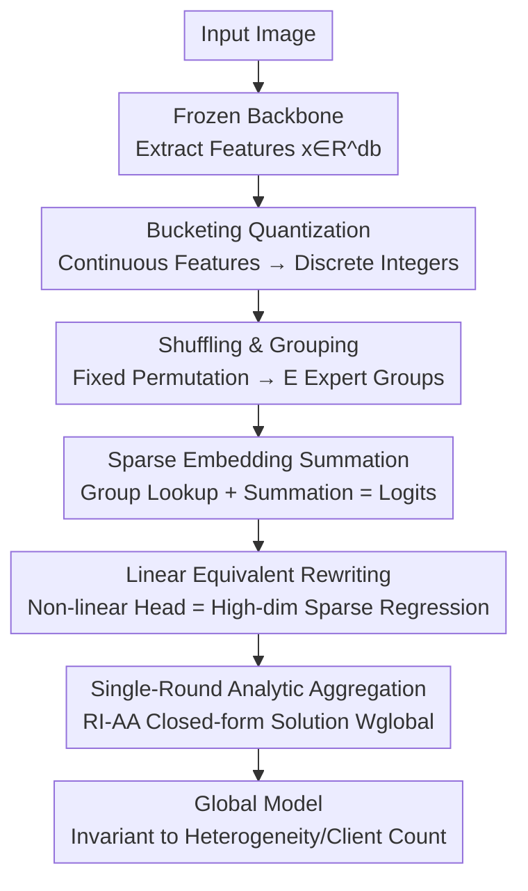

# Single-Round Scalable Analytic Federated Learning

**Conference**: CVPR 2026  
**Paper**: [CVF Open Access](https://openaccess.thecvf.com/content/CVPR2026/html/Bacellar_Single-Round_Scalable_Analytic_Federated_Learning_CVPR_2026_paper.html)  
**Code**: None  
**Area**: Federated Learning / Optimization  
**Keywords**: Analytic Federated Learning, Single-Round Communication, Non-IID Invariance, Sparse Embedding, Closed-form Solution

## TL;DR
SAFLe constructs a deterministic non-linear classification head using "feature bucketing + shuffling & grouping + sparse embedding summation" and proves its mathematical equivalence to a high-dimensional sparse linear regression. This allows the direct application of the single-round closed-form aggregation law of Analytic Federated Learning (AFL)—retaining the expressivity of non-linearity while preserving AFL's advantages of "single-round communication" and "complete invariance to data heterogeneity." It outperforms both linear AFL and multi-round DeepAFL across three visual federated benchmarks.

## Background & Motivation
**Background**: Federated Learning (FL) enables multiple clients to collaboratively train a shared model without exposing local data. The mainstream paradigm, FedAvg and its variants, relies on multi-round "local update → server aggregation" iterations, often requiring hundreds or thousands of rounds to converge.

**Limitations of Prior Work**: Iterative FL faces two major challenges. First, **communication overhead is massive**; factors like varying client speeds, disconnections, and mid-training crashes can lead to global model convergence taking days or even weeks. Second, **performance collapses under Non-IID conditions**; when local distributions vary significantly, local gradient directions deviate from the global optimum, leading to sharper performance drops as heterogeneity increases (e.g., FedAvg on CIFAR-100 drops from $56.62\%$ at $\alpha=0.1$ to $32.99\%$ at $\alpha=0.01$).

**Key Challenge**: Analytic Federated Learning (AFL) elegantly solved these points by freezing a pre-trained backbone for feature extraction and solving a least-squares closed-form solution for a linear regression head. Using the "Absolute Aggregation (AA)" law, it precisely reconstructs the global model (equivalent to centralized training) in one round, remaining **strictly invariant** to data partitioning or client count. However, AFL is limited to training a linear layer, which **caps its expressivity**. Subsequent DeepAFL introduced non-linearity via deep random projections but **sacrificed the single-round property**; every additional layer requires two extra rounds, meaning a $T=20$ layer model requires 41 communication rounds, reintroducing the multi-round burden AFL intended to eliminate. Thus, a clear trade-off exists: AFL is single-round but linear, while DeepAFL is non-linear but multi-round.

**Goal**: To break this trade-off—injecting non-linear expressivity into Analytic FL **without increasing communication rounds or breaking the closed-form solution and heterogeneity invariance**.

**Key Insight**: The authors argue that DeepAFL's "random projection for non-linearity" is inefficient, as it relies on stacking enough random matrices and activations to approximate non-linear surfaces by chance. Instead of randomness, a better approach is to **deterministically bucket the continuous feature space** into discrete "regions" and use an embedding layer to learn optimal logits for specific region combinations—this explicitly models non-linear functions.

**Core Idea**: Design the non-linear head as a deterministic pipeline of "bucketing → shuffling & grouping → sparse embedding summation" and prove this structure can be **rewritten as a high-dimensional sparse linear regression**, thereby inheriting the single-round closed-form aggregation of AFL perfectly.

## Method

### Overall Architecture
SAFLe (Sparse Analytic Federated Learning with nonlinear embeddings) addresses the challenge of making Analytic FL both non-linear and single-round. It replaces the simple linear regression head of AFL with a **deterministic non-linear transformation head** $f_{NL}(x)$.

The pipeline is as follows: images pass through a frozen pre-trained backbone to extract feature vectors $x \in \mathbb{R}^{d_b}$. The head then transforms this into class logits $\hat{y} \in \mathbb{R}^C$ in three steps: ① **Bucketing** quantizes each continuous feature into discrete integers; ② **Shuffling and Grouping** uses a fixed permutation to scramble the integer vector and split it into $E$ independent groups (each group acting as an "expert"); ③ **Sparse Embedding Summation** calculates a composite index for each group of $G$ integers (treated as base-$k$ digits) to query a group-specific embedding matrix. Finally, the outputs of all $E$ embeddings are **summed directly** to obtain the logits. Crucially, this routing is **deterministic and non-learnable**, allowing the entire non-linear head to be rewritten as a high-dimensional sparse linear regression, solvable via AFL's absolute aggregation law in one round.

### Key Designs

**1. Bucketing + Shuffling + Sparse Embedding: Constructing an Analytic Non-linear Head**

This is the source of SAFLe's expressivity. It consists of three steps:

**Step 1: Pre-Non-Linearity Bucketing**: For each dimension $x_i$ of the backbone output, $L$ different bucketing functions $B_l(\cdot)$ quantize it into one of $k$ discrete bins, resulting in an integer vector $b \in \mathbb{Z}^{d_q}$, where $d_q = d_b \times L$. This partitions the continuous space into discrete "regions," forming the basis for non-linearity.

**Step 2: Shuffling and Grouping**: A fixed deterministic permutation $P$ scrambles the integer vector into $b' = P(b)$, which is then split into $E$ groups with $G$ integers each ($E \times G = d_q$). Shuffling **breaks feature locality**, ensuring each expert perceives a diverse "sub-view" across features rather than a small adjacent segment.

**Step 3: Sparse Embedding and Summation**: Each group treats $G$ integers as digits in base-$k$ to compute a composite index:

$$idx_j = \sum_{i=1}^{G} g_{j,i} \cdot k^{i-1}$$

The maximum index value is $V = k^G$, representing the "vocabulary size" (number of rows) for each embedding matrix $W_j \in \mathbb{R}^{V \times C}$. The final logit is the **dense summation** of all $E$ embedding lookups:

$$\hat{y} = f_{NL}(x) = \sum_{j=1}^{E} W_j[idx_j, :]$$

A naive approach would use a single massive lookup table for all feature combinations, which would be intractable and prone to overfitting. SAFLe uses "many small, independent embeddings, each viewing a fixed sub-view," forcing the model to **generalize** by predicting based on diverse, local feature combinations. Ablations show that "multiple small embeddings (high $E$, small $G$, and small $V$)" are crucial for generalization.

Conceptually, this resembles Mixture-of-Experts (MoE), but with two key differences: the routing is **fixed (bucketing + shuffling)** rather than a learned gating network; and activation is **dense** (all $E$ experts activate for every input) rather than sparse top-k. This deterministic routing is exactly what allows the non-linear head to be rewritten as a linear regression.

**2. Linear Equivalence Proof: Rewriting Non-linear Lookups as High-dimensional Sparse One-hot Regression**

This is the theoretical key to making the non-linear structure "analytic." While non-linearity comes from the group index $idx_j$, an embedding lookup $W_j[idx_j,:]$ is essentially a **linear row-selection operation**. It can be written as the product of a one-hot vector $\phi_j(x) \in \{0,1\}^V$ (with a $1$ only at position $idx_j$) and $W_j$: $W_j[idx_j,:] = \phi_j(x)^T W_j$. Thus, the total output is:

$$\hat{y} = \sum_{j=1}^{E} \phi_j(x)^T W_j$$

By concatenating all $E$ one-hot vectors horizontally into a high-dimensional sparse feature $\Phi(x) = [\phi_1^T|\phi_2^T|\dots|\phi_E^T]^T \in \mathbb{R}^{D_e}$ (where $D_e = E \times V$) and stacking all embedding matrices vertically into $W_{global} \in \mathbb{R}^{D_e \times C}$, the non-linear model is **perfectly represented as a standard linear model**: $\hat{y} = \Phi(x)^T W_{global}$. The global objective then collapses into a least-squares problem: $\mathcal{L}(W_{global}) = \|Y - \Phi W_{global}\|_F^2$. This is **identical in form** to the problem AFL solves, merely replacing AFL's feature matrix $X_k$ with the high-dimensional sparse $\Phi_k$. Consequently, all "non-linearity" is absorbed into the feature construction $\Phi(\cdot)$, while weights remain linear relative to $\Phi$.

**3. Single-Round RI-AA Analytic Aggregation: Achieving Global Equivalent via Closed-form Solution**

With linear equivalence established, SAFLe inherits the "Regularized Intermediary + Absolute Aggregation (RI-AA)" of AFL. Each client $k$ computes two matrices based on local sparse features $\Phi_k$: the regularized covariance $C_k^r = \Phi_k^T \Phi_k + \gamma I \in \mathbb{R}^{D_e \times D_e}$ and the cross-correlation $M_k = \Phi_k^T Y_k \in \mathbb{R}^{D_e \times C}$, which are sent to the server. The server performs simple additive aggregation $C_{agg}^r = \sum_k C_k^r$ and $M_{agg} = \sum_k M_k$. It first solves for the regularized solution $W_{global}^r = (C_{agg}^r)^{-1} M_{agg}$, then uses the AFL recovery formula to **analytically strip the regularization term**, obtaining the precise unregularized global solution:

$$W_{global} = (C_{agg}^r - K\gamma I)^{\dagger} M_{agg}$$

Because this is an exact closed-form solution to the normal equation, the resulting global model is **mathematically invariant** to data distribution and the number of clients. Expressivity scales by increasing the number of experts $E$, and $D_e = E \times V$ remains a controllable hyperparameter **decoupled from communication rounds**, which always remains at one.

## Key Experimental Results

### Main Results
Testing across three benchmarks (CIFAR-10 / CIFAR-100 / Tiny-ImageNet) using a frozen ResNet-18 (ImageNet pre-trained). Metrics are Top-1 Accuracy (%). Table shows results for $\alpha=0.1$ (analytic methods yield identical results across all Non-IID settings):

| Dataset | FedAvg | AFL (1-round Linear) | DeepAFL (Multi-round Non-linear) | SAFLe (Ours) |
|--------|--------|---------------|---------------------|-------------|
| CIFAR-10 | 64.02 | 80.75 | 86.43 | **90.73** |
| CIFAR-100 | 56.62 | 58.56 | 66.98 | **70.61** |
| Tiny-ImageNet | 46.04 | 54.67 | 62.35 | **64.58** |

SAFLe outperforms both iterative and analytic baselines: on CIFAR-10, it is $4.3\%$ higher than DeepAFL and $\sim10\%$ higher than AFL, while maintaining single-round communication.

### Heterogeneity Invariance

| Method | CIFAR-100 @ $\alpha=0.1$ | CIFAR-100 @ $\alpha=0.01$ | Gain |
|------|-------------------|--------------------|------|
| FedAvg (Iterative) | 56.62 | 32.99 | **-23.63%** |
| AFL (Analytic) | 58.56 | 58.56 | 0 |
| DeepAFL (Analytic) | 66.98 | 66.98 | 0 |
| SAFLe (Ours) | 70.61 | 70.61 | **0** |

While iterative methods suffer significant performance drops as heterogeneity increases, all analytic methods (including SAFLe) remain **entirely unchanged**. SAFLe also remains constant as the number of clients $K$ increases from 100 to 1000.

### Ablation Study

**Communication Cost (Total transfer to reach target accuracy)**: Although SAFLe's single-round payload is larger, it is more efficient in total communication:

| Scenario | DeepAFL | SAFLe | Reduction |
|------|---------|-------|------|
| CIFAR-100 reach ~67% | 146 MB | 70 MB | >50% |
| Tiny-ImageNet reach 62.3% | 170 MB | 60 MB | ~3× |

**Bucketing Strategy** (CIFAR-100, 8 bins):

| Strategy | Accuracy | Note |
|---------|--------|------|
| Integer | 58.28 | Worst; "cliff effect" at bin boundaries hurts generalization |
| One-Hot | 61.66 | Better; but neighboring inputs still yield disjoint representations |
| Binary Overlap | **70.61** | Best; neighboring values share similar bit patterns, preserving local similarity |

### Key Findings
- **Embedding Configuration is Key**: Using more small experts (high $E$, low $V$) generalizes better but increases matrix density and communication costs. Optimal balance is found at $V \in [32, 64]$.
- **Bucketing Impact**: Integer bucketing performance drops sharply as bins increase (87% to 60% on CIFAR-10), while Binary Overlapping preserves local similarity and maintains performance.
- **Backbone Independence**: SAFLe consistently outperforms AFL across ResNet-18, VGG11, and ViT-B-16. Compared to the one-shot method TOFA (ViT-B/16 based), SAFLe is higher on CIFAR-10 (95.31% vs 93.18%).

## Highlights & Insights
- **"Hiding" Non-linearity in Feature Construction**: By using one-hot row selection to represent embedding lookups as linear operators, the non-linear head is transformed into a high-dimensional sparse linear regression. This allows it to inherit AFL's closed-form solution.
- **Deterministic Routing = Analytic MoE**: Replacing learned gating with fixed bucketing and shuffling trades adaptive expressivity for mathematical analyticity.
- **Expressivity Decoupled from Communication**: Scaling is achieved via "width" (number of experts $E$) rather than "depth," ensuring communication always requires exactly one round.
- **Binary Overlapping Bucketing**: This discrete trick ensures neighboring continuous values have similar bit patterns, avoiding the "cliff effect" of standard quantization.

## Limitations & Future Work
- **Large Single-Round Payload**: Although total communication is lower, the single-round $C_k^r$ matrix size is $O((E \times V)^2)$. High $E$ or $V$ can make the payload and server-side inversion a bottleneck.
- **Dependent on Frozen Backbone**: Like AFL, the closed-form solution requires a fixed feature extractor, meaning the backbone cannot be updated end-to-end.
- **Task Scope**: Experiments are limited to image classification; performance on more complex tasks (detection, segmentation) or scenarios with large distribution shifts between backbone and downstream data is untested.
- **Hyperparameter Sensitivity**: Parameters like bin count, $E$, and $V$ significantly impact accuracy and cost, currently requiring manual tuning.

## Related Work & Insights
- **vs. AFL**: AFL is linear, single-round, and heterogeneity-invariant. SAFLe upgrades it with non-linearity while retaining all three properties, consistently outperforming it.
- **vs. DeepAFL**: DeepAFL uses random projections for non-linearity but requires multiple rounds (T=20 requires 41 rounds). SAFLe uses experts for non-linearity and always requires one round, with higher accuracy and lower total communication.
- **vs. Iterative FL (FedAvg/FedProx, etc.)**: These require multi-round gradient iterations and suffer under Non-IID data. SAFLe uses gradient-free closed-form solutions and is invariant to heterogeneity.
- **vs. One-Shot FL (FedSD2C, TOFA, etc.)**: While these are also single-round, they often lack strict guarantees of centralized equivalence or do not match SAFLe's accuracy.

## Rating
- Novelty: ⭐⭐⭐⭐⭐ The proof that "non-linear lookups ≡ high-dimensional sparse linear regression" elegantly breaks the AFL trade-off.
- Experimental Thoroughness: ⭐⭐⭐⭐ Comprehensive across datasets and backbones, though limited to classification.
- Writing Quality: ⭐⭐⭐⭐⭐ Clearly articulated logic from motivation to proof.
- Value: ⭐⭐⭐⭐ Provides a drop-in non-linear upgrade for analytic FL, highly practical for asynchronous federated deployments.

<!-- RELATED:START -->

## Related Papers

- [\[ICLR 2026\] DeepAFL: Deep Analytic Federated Learning](../../ICLR2026/optimization/deepafl_deep_analytic_federated_learning.md)
- [\[CVPR 2025\] Model Poisoning Attacks to Federated Learning via Multi-Round Consistency](../../CVPR2025/optimization/model_poisoning_attacks_to_federated_learning_via_multi-round_consistency.md)
- [\[CVPR 2026\] Few-for-Many Personalized Federated Learning](few-for-many_personalized_federated_learning.md)
- [\[CVPR 2026\] Domain Sensitive Federated Learning with Fisher-Informed Pruning](domain_sensitive_federated_learning_with_fisher-informed_pruning.md)
- [\[CVPR 2026\] FedRG: Unleashing the Representation Geometry for Federated Learning with Noisy Clients](fedrg_unleashing_the_representation_geometry_for_federated_learning_with_noisy_c.md)

<!-- RELATED:END -->
