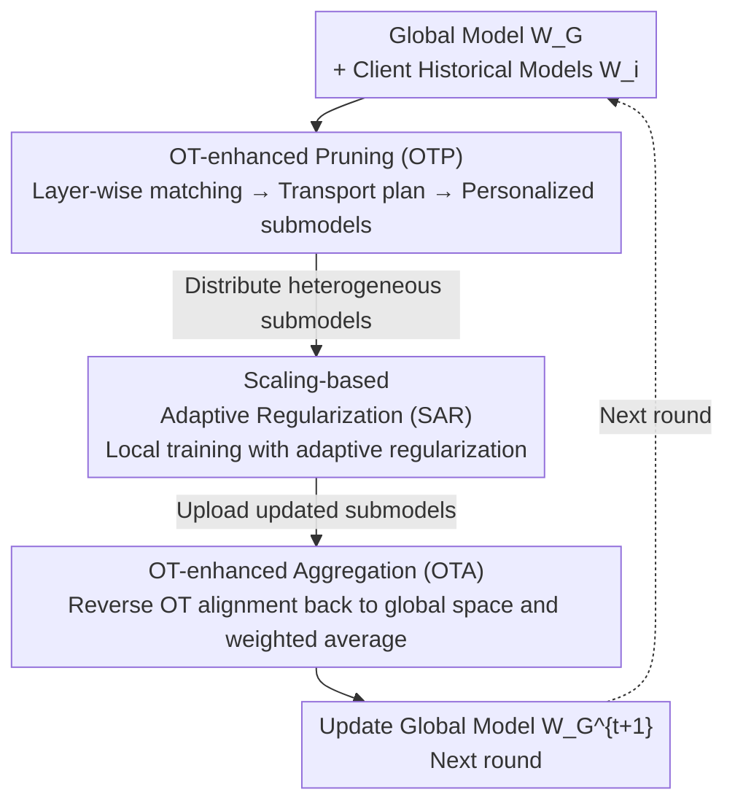

# SubFLOT: Efficient Personalized Federated Learning via Optimal Transport-based Submodel Extraction

**Conference**: CVPR 2026  
**Paper**: [CVF Open Access](https://openaccess.thecvf.com/content/CVPR2026/html/Jiang_Submodel_Extraction_for_Efficient_and_Personalized_Federated_Learning_via_Optimal_CVPR_2026_paper.html)  
**Code**: None  
**Area**: Federated Learning / Optimization  
**Keywords**: Federated Learning, Network Pruning, Optimal Transport, Personalization, Model Heterogeneity

## TL;DR
SubFLOT shifts "personalized pruning" from the client to the server: it uses the client's historical models as proxies for local data distributions and employs Optimal Transport (Wasserstein distance minimization) at the server to extract heterogeneous submodels tailored to each device's data. Combined with an adaptive regularization term that scales with the pruning rate to stabilize local training and an OT-aligned aggregation module to mitigate parametric drift, SubFLOT significantly outperforms 9 SOTA federated pruning methods across 8 datasets.

## Background & Motivation
**Background**: Federated Learning (FL) allows multiple devices to collaborate on training without sharing raw data. However, deployment is hindered by two types of heterogeneity: **system heterogeneity** (varying computational power across devices, requiring different model sizes) and **statistical heterogeneity** (non-IID local data involving feature shifts and label imbalance). Federated network pruning is a mainstream remedy, allowing each client to train a sparse submodel that fits its hardware, thereby saving computation/communication while leveraging data-dependent pruning for personalization.

**Limitations of Prior Work**: A dilemma exists regarding "where the pruning decision is made." **Server-side global pruning** saves communication but cannot achieve personalization due to privacy constraints (lack of access to local data), leading to a "one-size-fits-all" approach. **Client-side local pruning** (typically "train-prune-finetune") creates highly customized models, but the client must first process the full large model before pruning, which is an unbearable computational burden for resource-constrained edge devices.

**Key Challenge**: Server-side pruning (uniform, non-personalized) and client-side pruning (personalized, computationally explosive) are mutually exclusive. worse, pruning itself **exacerbates heterogeneity**—more aggressively pruned submodels tend to have weight magnitudes that drift significantly, deviating from the global model's parameter distribution (pruning-induced parametric drift). This both destabilizes local training and hinders global convergence during aggregation.

**Goal**: To solve two specific sub-problems: (1) How to perform personalized pruning at the server without accessing local data? (2) How to design a local objective to adaptively constrain submodel divergence and stabilize training dynamics?

**Key Insight**: The authors observe that **a client's historical model parameters serve as high-fidelity proxies for its local data distribution**, as they implicitly encode the data the client has encountered. Since data cannot be accessed, historical models can "represent" the data distribution.

**Core Idea**: Reformulate server-side personalized pruning as an **Optimal Transport (OT) problem between the global model and client historical models**. By minimizing the Wasserstein distance between their parameters, functionally equivalent neurons are aligned, yielding a transport plan that guides the pruning for that specific client. The same OT mechanism is used in reverse for heterogeneous aggregation, supplemented by a regularization term that scales with the pruning rate to stabilize training.

## Method

### Overall Architecture
SubFLOT is a **server-side personalized federated pruning** framework. Its inputs are the global model $W_G$ and historical models $W_i$ uploaded by clients, and the output is the updated global model. A communication round is divided into three stages linked by three modules: the server uses **OTP** to extract and distribute personalized heterogeneous submodels; clients perform local training under **SAR** regularization; the server then uses **OTA** (inverse reuse of OTP) to align and aggregate diverse submodels to update the global model. All three modules share a "progressive layer-wise OT alignment" geometric mechanism, differing only in alignment direction and purpose.

### Key Designs

**1. OTP: Translating historical models into personalized submodels using Optimal Transport**

This directly addresses the inability to personalize at the server without data. Instead of raw data, the server treats client $i$'s historical model $W_i$ as its data distribution proxy. "Pruning for client $i$" is reformulated as an OT problem to align functionally equivalent neurons between $W_G$ and $W_i$. Since global OT for deep networks is computationally infeasible, it is decomposed into **progressive layer-wise matching**, iteratively calculating transport plans $\{T_i^{(l)}\}_{l=1}^{L}$.

For layer $l$: the previous layer's transport plan $T_i^{(l-1)}$ is used to remap the global weights' input space to the feature space aligned with the client: $\widehat{W}_G^{(l,l-1)} = W_G^{(l,l-1)} T_i^{(l-1)}$. Then, the output neurons of the aligned global weights and the client's local weights are treated as two discrete distributions $\mu^{(l)},\nu^{(l)}$. A cost matrix $C^{(l)}$ is constructed using pairwise Euclidean distances between neurons, and the discrete OT is solved:

$$T_i^{(l)} = \arg\min_{T\in\Pi(\mu^{(l)},\nu^{(l)})}\ \langle C^{(l)}, T\rangle_F$$

where $\Pi(\mu^{(l)},\nu^{(l)})$ is the set of valid plans, and $\langle\cdot,\cdot\rangle_F$ is the Frobenius inner product. After obtaining $T_i^{(l)}$, the global layer weights are projected into the client's parameter space $W_{\text{aligned}}^{(l,l-1)} = {T_i^{(l)}}^{\top}\widehat{W}_G^{(l,l-1)}$, followed by **adaptive fusion**:

$$\widetilde{W}_i^{(l,l-1)} = \alpha\cdot W_{\text{aligned}}^{(l,l-1)} + (1-\alpha)\cdot W_i^{(l,l-1)}$$

$\alpha\in[0,1]$ balances global knowledge absorption and local specialization preservation. Submodels $\widetilde{W}_i$ extracted this way are pre-adapted to client $i$'s data characteristics before local training begins.

**2. SAR: Adaptive regularization scaling for stability**

Pruning induces parametric divergence—smaller models often undergo larger updates and drift more easily, destabilizing training. While methods like HeteroFL apply post-hoc weight corrections, SAR **actively** constrains trajectories during training. The motivation is specific: submodels with higher pruning rates are more prone to divergence, thus requiring stronger constraints.

The core of SAR is a regularization term that anchors the current model $W_i$ to the server-distributed anchor $\widetilde{W}_i$, with a penalty scaled by the pruning rate $\rho_i$:

$$L_{\text{SAR}}(W_i) = \rho_i\cdot \lVert W_i - \widetilde{W}_i\rVert_2^2$$

This provides two benefits: (1) **Adaptive Control**: The penalty is proportional to $\rho_i$, so smaller (more "dangerous") models receive stronger regularization; (2) **Divergence Suppression**: Anchoring to the server's submodel discourages large parametric shifts, keeping updates within a "collaborative" parameter region. The complete local objective is: $L_i(W_i) = L_{\text{CE}}(W_i;D_i) + \lambda\cdot L_{\text{SAR}}(W_i)$.

**3. OTA: Reverse reuse of OTP geometry for aggregation**

Standard FedAvg often fails in heterogeneous scenarios because averaging may combine parameters corresponding to different semantic features, causing destructive interference. OTA reuses the geometric insights of OTP: for each client $i$, the **same progressive layer-wise OT** is used in reverse (matching $W_i^t$ back to the previous global model $W_G^t$) to find the mapping $T_i$ that pulls $W_i^t$ back to the global canonical space. Aligned models are then weighted and averaged:

$$W_G^{t+1} = \sum_{i=1}^{N} p_i\cdot T_i(W_i^t)$$

This approach yields two gains: OT alignment naturally normalizes parameter scales, **mitigating magnitude differences caused by different pruning rates**, and matches functionally similar neurons, **suppressing the negative effects of feature shift**. Ablation studies show OTA is the most critical module for performance.

### Loss & Training
The local objective is $L_i(W_i)=L_{\text{CE}}+\lambda L_{\text{SAR}}$. Default settings involve $N=20$ clients, 200 communication rounds, 5 local epochs, and SGD (lr=0.001, batch=256). Pruning rates are sampled from $\{0,1/4,1/2,3/4\}$. Fusion coefficient $\alpha=0.5$ and regularization weight $\lambda=1.0$. The authors provide a theoretical guarantee (Theorem 1) for linear convergence to a neighborhood of the global optimum, determined by gradient noise $\sigma^2$, statistical heterogeneity $G^2$, personalization bias $\delta_P^2$, and OT alignment perturbation $\delta_{OT}^2$.

## Key Experimental Results

### Main Results
SubFLOT was compared against 10 federated pruning methods across 8 datasets (CV/NLP/IoT), measuring average local model accuracy. In label shift and real-world scenarios, SubFLOT shows significant leads:

| Setting | Dataset | SubFLOT | runner-up (FlexFL) | Gain |
|------|--------|---------|--------------|------|
| Pathological Label Shift | CIFAR100 | **58.37** | 49.21 | +9.16 |
| Pathological Label Shift | TinyImageNet | **29.30** | 22.23 | +7.07 |
| Practical Label Shift (Dir) | CIFAR100 | **44.88** | 35.27 | +9.61 |
| NLP | AG News | **87.88** | 86.02 | +1.86 |
| IoT | HAR | **79.72** | 76.24 | +3.48 |

In feature shift settings (Digit5 / PACS), the gap is even larger—PACS mean 41.58 vs 20.17 for the second best (nearly double), indicating the strong combined effect of OTP personalization and OTA/SAR drift resistance.

### Ablation Study
Removing core modules on CIFAR10 ($\beta{=}0.1$) and Digit5:

| Configuration | CIFAR10 | Digit5 | Description |
|------|---------|--------|------|
| Full SubFLOT | 83.78 | 92.58 | Complete model |
| w/o OTP | 83.21 | 90.37 | Replaced with fixed-position pruning |
| w/o SAR | 82.77 | 89.73 | Removed adaptive regularization |
| w/o OTA | 81.41 | 78.74 | Replaced with position-based aggregation |

All modules are essential; **removing OTA causes the sharpest drop** (e.g., -13.84 on Digit5), confirming its necessity for aggregating highly heterogeneous submodels.

### Highlights & Insights
- **"Historical models as data proxies"** is an ingenious way to bypass privacy constraints. Since raw data is inaccessible but historical parameters are not, and parameters encode distribution info, personalization becomes a parameter-space problem.
- **Tri-purpose OT mechanism**: OTP (alignment for pruning), OTA (reverse alignment for aggregation). Using the same layer-wise OT logic in different directions makes the framework cohesive.
- **Pruning-rate-scaled regularization** is a transferable concept: any scenario with unbalanced model capacities causing unbalanced update magnitudes (e.g., heterogeneous distillation) could benefit from "stronger constraints on weaker branches."
- Shifting the computational burden from the edge to the server is highly friendly to real IoT deployments, where clients only train the already-pruned small models.

## Limitations & Future Work
- Convergence analysis relies on L-smooth and $\mu$-strongly convex assumptions, which are only approximations for deep non-convex networks (warning: strong convexity does not hold for real CNNs).
- The validity of "historical models as high-fidelity proxies" in cases of severe concept drift or cold start (no history) is not fully discussed.
- While layer-wise OT reduces complexity to $O(L\cdot M^2)$, it may still be expensive for very wide layers in large Transformers; sparse/low-rank OT approximations might be needed for scaling.
- Code is not public, and implementation details for the OT solver and layer-matching pose a barrier to reproduction.

## Related Work & Insights
- **vs. HeteroFL / FedRolex (Static Server Pruning)**: These prune fixed positions uniformly. SubFLOT uses OT to "infer data from history" for personalization.
- **vs. Client-side Pruning (train-prune-finetune)**: These are personalized but require clients to initially process the full model. SubFLOT moves this to the server, reducing client costs by over 50%.
- **vs. FedOTP / FedAli (OT in FL)**: These perform alignment in the **feature space at the client**, which has higher overhead and privacy risks. SubFLOT is the first to use OT for **federated network pruning** in the **parameter space at the server**.

## Rating
- Novelty: ⭐⭐⭐⭐⭐ 
- Experimental Thoroughness: ⭐⭐⭐⭐⭐ 
- Writing Quality: ⭐⭐⭐⭐ 
- Value: ⭐⭐⭐⭐⭐ 

<!-- RELATED:START -->

## Related Papers

- [\[CVPR 2026\] HFedATM: Hierarchical Federated Domain Generalization via Optimal Transport and Regularized Mean Aggregation](hfedatm_hierarchical_federated_domain_generalization_via_optimal_transport_and_r.md)
- [\[CVPR 2026\] Generalized and Personalized Federated Learning with Black-Box Foundation Models via Orthogonal Transformations](generalized_and_personalized_federated_learning_with_black-box_foundation_models.md)
- [\[CVPR 2026\] Domain Sensitive Federated Learning with Fisher-Informed Pruning](domain_sensitive_federated_learning_with_fisher-informed_pruning.md)
- [\[CVPR 2026\] FedRAC: Rolling Submodel Allocation for Collaborative Fairness in Federated Learning](fedrac_rolling_submodel_allocation_for_collaborative_fairness_in_federated_learn.md)
- [\[CVPR 2026\] FedAlign: Differentially Private Distribution Alignment for Non-IID Federated Learning](fedalign_differentially_private_distribution_alignment_for_non-iid_federated_lea.md)

<!-- RELATED:END -->
