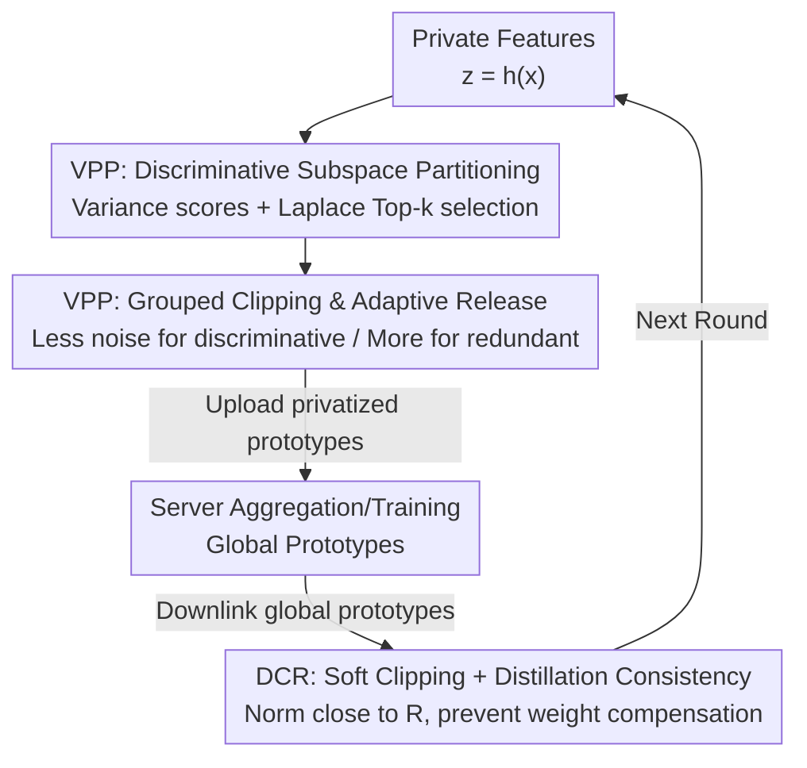

# Taming Noise-Induced Prototype Degradation for Privacy-Preserving Personalized Federated Fine-Tuning

**Conference**: CVPR2026  
**arXiv**: [2604.27833](https://arxiv.org/abs/2604.27833)  
**Code**: https://github.com/yuCoryx/ProtoPFL_VPDR  
**Area**: Federated Learning / Differential Privacy / Privacy Protection  
**Keywords**: Prototype Federated Learning, Local Differential Privacy, Anisotropic Noise, Soft Clipping, Knowledge Distillation

## TL;DR
Addressing the issue where prototype-based personalized federated learning (ProtoPFL) injects isotropic Gaussian noise to satisfy local differential privacy (LDP) when sharing class prototypes—consequently drowning out discriminative dimensions—this paper proposes a client-side plugin, VPDR. It uses variance-adaptive VPP to shift noise budget from discriminative subspaces to redundant ones, and distillation-guided DCR to actively push feature norms toward the clipping threshold, significantly improving the privacy-utility trade-off under the same LDP guarantees.

## Background & Motivation

**Background**: The scaling laws of foundation models have nearly exhausted public data; further improvements require utilizing private data from various clients. Federated Learning (FL) is a distributed fine-tuning paradigm designed for this purpose. However, under domain skew, a single global model often performs poorly or fails to converge. Personalized Federated Learning (PFL) allows each client to maintain its own components. **Prototype-based methods (ProtoPFL)** offer a lightweight route: freezing the backbone and exchanging compact per-class statistics (class means/cluster centers, i.e., "prototypes") between clients to align global and local semantics.

**Limitations of Prior Work**: Prototypes compress an entire class of features into a "domain fingerprint." With small samples, these can closely resemble individual samples, and direct uploading exposes them to Membership Inference Attacks (MIA) and reconstruction attacks. The standard defense is Local Differential Privacy (LDP) before uploading: first applying $\ell_2$ clipping to each sample feature to bound sensitivity within threshold $R$, then adding isotropic Gaussian noise to the prototype—a recipe the paper calls **IGPP (Isotropic Gaussian Prototype Perturbation)**.

**Key Challenge**: IGPP suffers from two incurable issues. First is the **noise-discriminativeness mismatch**: the contribution of different feature dimensions to classification varies greatly; some carry key discriminative information while others are redundant. Isotropic noise treats them equally, drowning out the most important discriminative directions (as shown in Figure 1, where uniform noise pushes the blue Class 1 prototype into the red Class 2 region). Second is the **$\ell_2$ clipping threshold dilemma**: a larger threshold $R$ reduces clipping distortion, but sensitivity $\Delta\propto R$ forces larger noise scales; a smaller threshold severely compresses feature norms, irreversibly erasing semantics.

**Goal + Core Idea**: Use a **client-side plugin, VPDR**, to solve both problems simultaneously while ensuring privacy strength no weaker than IGPP. VPP (Variance-adaptive Prototype Perturbation) addresses the former by shifting noise budget away from discriminative subspaces based on dimensional discriminativeness. DCR (Distillation-guided Clipping Regularization) addresses the latter by stably pushing feature norms near threshold $R$ during training, resolving the dilemma of a fixed $R$.

## Method

### Overall Architecture

VPDR does not change the communication backbone of ProtoPFL; instead, it is inserted into two stages on the client side. In one communication round: ① **Private Prototype Computation** (VPP)—the client calculates discriminative scores per dimension, privately selects the discriminative subspace, and performs grouped clipping and adaptive noise injection to obtain the privatized prototype; ② **Upload** the privatized prototype; ③ Server **generates global prototypes** (aggregation or training); ④ **Downlink** global prototypes; ⑤ **Local Personalized Fine-tuning** (DCR)—beyond the basic ProtoPFL loss, it uses a soft-clipping layer + distillation consistency to stabilize feature norms. Crucially, all privacy-consuming operations are concentrated in VPP before uploading; DCR is a purely local regularization and **consumes no privacy budget**. The overall budget is split via sequential composition into $(\epsilon,\delta)=(\epsilon_1,0)+(\epsilon_2,\delta)$, where $\epsilon_1$ is for subspace selection and $\epsilon_2$ is for prototype release.

### Key Designs

**1. Variance-adaptive Discriminative Scores and Private Subspace Partitioning: Quantifying and Privately Selecting "Worthwhile" Dimensions**

The fundamental problem with isotropic noise is the lack of knowledge regarding dimension importance. This paper directly extracts the discriminative power of each dimension from the intra-class/inter-class variation of sample embeddings. Intra-class variation $V^{\mathrm{tra}}_j=\sum_c (n_m^c-1)s_{c,j}^2$ and inter-class variation $V^{\mathrm{ter}}_j=\sum_c n_m^c(\mu_{c,j}-\mu_j)^2$ are defined, and an ANOVA normalization yields the discriminative score:

$$S_j=\frac{V^{\mathrm{ter}}_j/(C-1)}{V^{\mathrm{tra}}_j/(n_m-C)+\zeta}.$$

Normalization counteracts class imbalance and small-sample bias. The authors empirically found $S_j$ to be strongly linearly correlated with label mutual information $I(z_j;y)$ (Pearson/Spearman coefficients >0.90 on PACS), making it a lightweight yet accurate proxy. However, **this selection itself depends on data and is privacy-sensitive**. Even if the index set is not uploaded, it determines the subsequent clipping boundaries and noise covariance; the released prototype remains a function of it and must be accounted for in the privacy budget. Thus, scores are clipped to $\bar S_j=\mathrm{clip}(S_j,0,H)$ to bound $\ell_1$ sensitivity, followed by a one-time Laplace Top-$k$ mechanism ($k=d_A=\lceil\rho d\rceil$) to privately pick the discriminative subspace $\mathcal I_A$, with the remaining $d_B$ dimensions as the redundant subspace $\mathcal I_B$. Under Laplace scale $\lambda\ge 2d_A H T/\epsilon_1$, $T$ rounds of partitioning satisfy $(\epsilon_1,0)$-LDP.

**2. Grouped Clipping + Adaptive Noise Redistribution: Shifting Noise Out of the Discriminative Subspace under Equal LDP**

With the partitioning, features are split into $\mathbf z=[\mathbf z_A;\mathbf z_B]$. For a fixed global threshold $R$, grouped boundaries are assigned as $R_A=R\kappa_A,\ R_B=R\kappa_B$, where $\kappa_A=\sqrt{d_A/d},\ \kappa_B=\sqrt{d_B/d}$, ensuring $R_A^2+R_B^2=R^2$. Consequently, grouped sensitivities are $\Delta_A=\Delta\kappa_A,\ \Delta_B=\Delta\kappa_B$. Both groups undergo $\ell_2$ clipping independently, and noise is added: $\boldsymbol\xi_A\sim\mathcal N(\mathbf 0,(\sigma_A\Delta_A)^2\mathbf I)$ and $\boldsymbol\xi_B\sim\mathcal N(\mathbf 0,(\sigma_B\Delta_B)^2\mathbf I)$. Theoretically (Theorem 4.4), if grouped multipliers satisfy $1/\sigma_A^2+1/\sigma_B^2\le 1/\sigma_{\mathrm{ref}}^2$, the overall release is no weaker than $(\epsilon_2,\delta)$-LDP of the reference isotropic mechanism. The paper uses weights $w_A+w_B=1$ to set $\sigma_A=\sigma_{\mathrm{ref}}/\sqrt{w_A},\ \sigma_B=\sigma_{\mathrm{ref}}/\sqrt{w_B}$, and **without manual tuning**, sets $w_A=\kappa_B/(\kappa_A+\kappa_B)$. A key insight is the inequality: to ensure the actual perturbation of the discriminative group does not exceed the isotropic reference ($\sigma_A\Delta_A\le\sigma_{\mathrm{ref}}\Delta$), simplifying leads to $\kappa_A\le\kappa_B\Leftrightarrow 0<\rho\le 0.5$. **As long as the discriminative subspace does not exceed half of the feature dimensions, the discriminative group receives no more noise than the isotropic baseline, and the excess noise is pushed to the redundant group.** Although reserving budget for subspace selection results in $\epsilon_2<\epsilon$ (raising $\sigma_{\mathrm{ref}}$), the net utility gain from directional protection outweighs the budget splitting overhead.

**3. Distillation-guided Clipping Regularization (DCR): Stabilizing Norms Near the Threshold to Break the "Norm-Weight" Compensation Shortcut**

Hard clipping is brittle: when the norm far exceeds the threshold ($\|\mathbf z\|_2\gg R$), structural information is irreversibly lost; when it is far below ($\|\mathbf z\|_2\ll R$), clipping is ineffective, and small vectors are swallowed by noise. DCR dynamically regularizes the feature space during local training. First, a **differentiable soft-clipping layer** is attached to the encoder: $\widehat{\mathbf z}=\frac{R}{\|\mathbf z\|_2+\gamma R}\mathbf z$ ($0<\gamma\ll1$), which stretches small-norm features toward $R$ and smoothly shrinks large-norm features, avoiding hard clipping's gradient discontinuity. However, the model might "cheat" by scaling up classifier weights to offset soft clipping (Figure 4a shows pre-clipping norms rising in mid-to-late training with only soft clipping). To cut off this **norm-weight compensation shortcut**, EMA teacher-student distillation is introduced: the local head is split into a trainable student $f_m$ and a momentum teacher $f_m^t$ ($\theta_m^t=\beta\theta_m^t+(1-\beta)\theta_m$). The teacher produces soft labels $y^t$ on original features, while the student predicts $y^s$ on soft-clipped features, minimizing the temperature-scaled KL consistency:

$$\mathcal L_{\mathrm{KD}}=\mathrm{KL}\Big(\mathrm{softmax}(y^t/\tau)\,\big\|\,\mathrm{softmax}(y^s/\tau)\Big).$$

Since the teacher does not share parameter coupling with the student, the model cannot bypass clipping via weight scaling, thereby suppressing the "norm-weight tug-of-war" and keeping pre-clipping norms stably concentrated near $R$.

### Loss & Training
The total local objective is $\mathcal L=\mathcal L_{\mathrm{BASE}}+\lambda_1\mathcal L_{\mathrm{KD}}$, where $\mathcal L_{\mathrm{BASE}}$ is the original objective of the host ProtoPFL (e.g., cross-entropy or InfoNCE-style alignment) and $\lambda_1$ is the KD weight. Privacy is maintained via sequential composition: VPP subspace selection gives $(\epsilon_1,0)$-LDP, and prototype release gives $(\epsilon_2,\delta)$-LDP, totaling $(\epsilon,\delta)$-LDP for ProtoPFL+VPDR; DCR is local and budget-free. Overhead is minimal: VPP adds $\mathcal O(n_m d+d\log d)$ computation and $\mathcal O(d)$ memory per round; DCR adds one teacher forward pass. **Communication complexity remains strictly unchanged** at $\mathcal O(Cd)$ (only privatized prototypes are sent). Default hyperparameters: $H{=}0.1,\ r{=}0.1,\ \rho{=}0.2,\ \gamma{=}0.05,\ \beta{=}0.999,\ \tau{=}4,\ \lambda_1{=}0.05$.

## Key Experimental Results

The backbone is a frozen ViT-small ($d{=}512$), training only the adapter + classifier; $T{=}20$ rounds, $E{=}2$ local epochs, default $(\epsilon,\delta)=(1,10^{-5})$, with $R$ grid-searched in $\{5,10,15,20\}$. VPDR is plugged into 6 ProtoPFL frameworks (FedProto / FedPCL / FPL / FedPLVM / FedTGP / MPFT) and compared against their +IGPP versions.

### Main Results

Average accuracy (AVG, higher is better) and standard deviation (STD, lower is better) on three domain-skew benchmarks. Representative results:

| Framework | Defense | Digits AVG | Office–Caltech AVG | PACS AVG | PACS STD |
|------|------|-----------|--------------------|----------|----------|
| FedProto | +IGPP | 94.36 | 90.82 | 90.58 | 7.31 |
| FedProto | **+VPDR** | **96.05** | **93.36** | **92.71** | **6.11** |
| FedPCL | +IGPP | 93.82 | 86.79 | 79.73 | 16.08 |
| FedPCL | **+VPDR** | **95.41** | **90.19** | **86.91** | **11.84** |
| FedTGP | +IGPP | 95.10 | 92.31 | 92.95 | 5.80 |
| FedTGP | **+VPDR** | **96.29** | **95.04** | **94.79** | 5.64 |
| MPFT | +IGPP | 95.71 | 92.23 | 93.41 | 5.89 |
| MPFT | **+VPDR** | **96.56** | **94.71** | **94.91** | **5.04** |

Accuracy improved for every framework and dataset, with the most significant gains in more heterogeneous datasets like PACS and Office–Caltech (FedPCL gained +7.18 on PACS). STD generally narrowed in difficult scenarios, indicating that VPDR primarily aids where domain variance is high. Under CIFAR-10 label shift (Dirichlet $\alpha$), benefits were most pronounced in extreme cases: FPL at $\alpha{=}0.1$ rose from 28.42 to 37.18.

### Ablation Study

Based on the FedProto framework, adding modules step-by-step (AVG for Office–Caltech / PACS):

| VPP | DCR | Office–Caltech AVG | PACS AVG |
|-----|-----|--------------------|----------|
| ✗ | ✗ | 90.82 (IGPP Baseline) | 90.58 |
| ✓ | ✗ | 93.06 | 91.89 |
| ✗ | ✓ | 92.89 | 91.91 |
| ✓ | ✓ | **93.36** | **92.71** |

### Key Findings
- **VPP and DCR are complementary**: Adding either module significantly boosts performance over the IGPP baseline (with similar individual contributions); combining them achieve the best results, showing "noise shifting" and "norm stabilization" are orthogonal paths.
- **Hyperparameter Robustness**: Privacy split ratio $r$ is optimal at 0.1–0.2, discriminative subspace ratio $\rho$ is best near 0.2 (matching the $\rho\le0.5$ theory), and results are stable for $\gamma{=}0.05, \beta{=}0.999$, and $\tau \in [4, 8]$.
- **No Defense Degradation Under Attacks**: Analysis on Office–Caltech for Feature Space Hijacking (FSH) and Membership Inference (MIA) showed that +VPDR metrics (cosine similarity, Top-1 hit, ROC-AUC) are comparable to or better than +IGPP (e.g., ROC-AUC 0.4992 closer to the random 0.5), proving discriminative protection doesn't sacrifice privacy.

## Highlights & Insights
- **Quantifying and Privately Selecting Importance**: The ANOVA score $S_j$ is both strongly correlated with label mutual information and lightweight. The authors correctly identified that "selection itself leaks privacy" and used the Laplace Top-$k$ mechanism to include selection in the privacy accounting—a step often ignored in adaptive clipping works.
- **The $\rho\le0.5$ Boundary**: Converting the intuition "discriminative subspace shouldn't exceed half the dimensions" into a provable inequality $\kappa_A\le\kappa_B$ is elegant. Noise redistribution then holds naturally without weakening LDP, while weights remain parameter-free and determined solely by the dimension ratio.
- **DCR Exposes the "Norm-Weight Compensation Shortcut"**: Recognizing that soft clipping alone can be neutralized by weight scaling, the team used EMA teacher-student prediction consistency to block this shortcut—a trick transferable to other feature-norm constraint scenarios.
- **True Plugin Nature**: Communication complexity remains strictly unchanged, and computation/memory overhead is $\mathcal O(d)$, allowing seamless integration with 6 different ProtoPFL methods with high engineering friendliness.

## Limitations & Future Work
- **Reliance on Intra/Inter-class Variance**: In scenarios with very few samples per class or highly entangled features (where discriminativeness isn't well-separated), the reliability of $S_j$ and the "half-dimension" assumption may diminish.
- **Fixed Privacy Budget Split**: While $r$ and $\rho$ are robust, they are still preset; there is no theoretical guidance on how the budget should adaptively allocate according to domain heterogeneity or the number of classes.
- **Limited Evaluation Scale**: Tested on 4 clients with ViT-small for 20 rounds; scalability to mass clients, extreme non-IID, or non-classification tasks hasn't been verified. On CIFAR-10, some configurations (e.g., FedPLVM $\alpha{=}1$) showed VPDR slightly below IGPP, indicating it's not a "win-all" for every regime.
- **Protection Scope**: The threat model focuses on prototype release, leaving potential risks in adapters/classifiers shared through other channels unaddressed.

## Related Work & Insights
- **vs. IGPP (Isotropic Gaussian Prototype Perturbation)**: IGPP applies uniform noise across all coordinates and uses a single $\ell_2$ threshold, drowning discriminative dimensions and facing a threshold dilemma; VPDR improves the trade-off under **identical $(\epsilon,\delta)$-LDP**.
- **vs. Standard FL DP (DP-FedAvg, DP-FedSAM, UDP-FL, etc.)**: These methods add noise to gradients or model updates. This paper is the first to apply **LDP specifically to prototype release** with explicit per-sample clipping and complete local DP accounting—addressing a gap in existing ProtoPFL privacy schemes that often lack formal DP guarantees.
- **vs. Existing ProtoPFL (FedProto, FedPCL, FPL, FedPLVM, FedTGP, MPFT)**: Existing works focus on prototype alignment and generalization but largely ignore how noise injection damages discriminative geometry. VPDR acts as a privacy plugin, decoupling "semantic alignment" from "privacy protection."

## Rating
- Novelty: ⭐⭐⭐⭐ First mechanism for dimension-level adaptive protection in prototype release with formal LDP, accounting for "selection leakage."
- Experimental Thoroughness: ⭐⭐⭐⭐ 6 host frameworks across 3 benchmarks + CIFAR-10 label shift + 2 types of attacks; however, the client scale and task types are relatively narrow.
- Writing Quality: ⭐⭐⭐⭐ Clear motivation figures, smooth transition between theory and method; dense but readable notation.
- Value: ⭐⭐⭐⭐ Plugin-style, zero communication overhead, no privacy compromise—high practical value for deploying ProtoPFL with defense.

<!-- RELATED:START -->

## Related Papers

- [\[CVPR 2026\] Fine-Tuning Impairs the Balancedness of Foundation Models in Long-tailed Personalized Federated Learning](fine-tuning_impairs_the_balancedness_of_foundation_models_in_long-tailed_persona.md)
- [\[CVPR 2026\] Personalized Federated Training of Diffusion Models with Privacy Guarantees](personalized_federated_training_of_diffusion_models_with_privacy_guarantees.md)
- [\[CVPR 2026\] HiLoRA: Hierarchical Low-Rank Adaptation for Personalized Federated Learning](hilora_hierarchical_low-rank_adaptation_for_personalized_federated_learning.md)
- [\[CVPR 2026\] SubFLOT: Efficient Personalized Federated Learning via Optimal Transport-based Submodel Extraction](submodel_extraction_for_efficient_and_personalized_federated_learning_via_optima.md)
- [\[CVPR 2026\] Generalized and Personalized Federated Learning with Black-Box Foundation Models via Orthogonal Transformations](generalized_and_personalized_federated_learning_with_black-box_foundation_models.md)

<!-- RELATED:END -->
