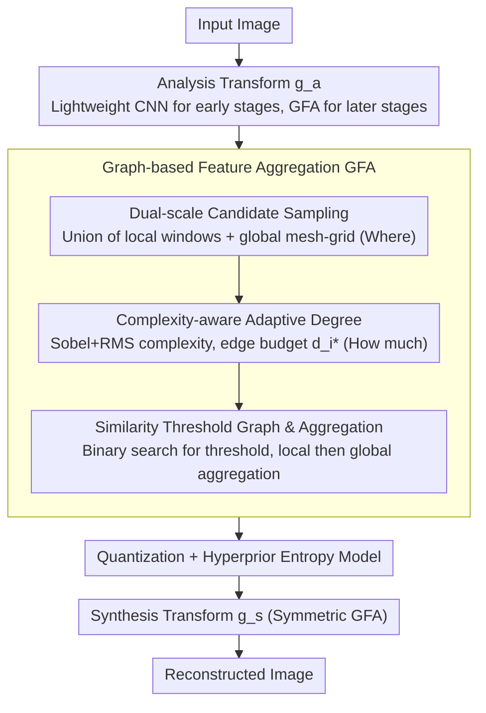

# Adaptive Learned Image Compression with Graph Neural Networks

**Conference**: CVPR 2026  
**arXiv**: [2603.25316](https://arxiv.org/abs/2603.25316)  
**Code**: [https://github.com/UnoC-727/GLIC](https://github.com/UnoC-727/GLIC)  
**Area**: Graph Learning / Learned Image Compression  
**Keywords**: Image Compression, GNN, Dual-scale Sampling, RMS Gradient, Content-adaptive Connection

## TL;DR

GLIC transforms nonlinear transformations in learned image compression (LIC) from fixed convolutions or window attention into content-adaptive connections driven by Graph Neural Networks (GNNs). It employs dual-scale graphs to determine "where to connect" and a complexity-aware mechanism to decide "how much to connect" to better model local and long-range redundancy. It significantly outperforms traditional codecs and recent LIC baselines across three standard datasets.

## Background & Motivation

Learned image compression has evolved from early convolutional autoencoders to backbones like CNN, Transformer, and Mamba, with rate-distortion performance approaching or exceeding traditional codecs. However, these methods share a deep underlying assumption: adjacency relationships are mostly pre-fixed. Convolutions bind each pixel to a fixed $k \times k$ neighborhood, and window attention restricts interactions to preset windows. Even with shifts or deformations, the "neighborhood first, weighting second" nature remains.

The issue is that image compression focuses on redundancy, which is neither uniform nor necessarily confined to local Euclidean neighborhoods. Smooth regions have high redundancy, while edges and textures have lower redundancy. Furthermore, long-range regions with structural similarities are highly valuable for reference during compression. Persistent fixed connection patterns force links between irrelevant neighbors while missing remote areas with high compression value.

The authors summarize the Key Challenge into two questions:

- **Where to connect**: Which positions should establish information interaction.
- **How much to connect**: How much connection budget should be allocated to different pixels.

CNNs and window attention are too rigid in both dimensions. Consequently, the authors turn to GNNs to leverage dynamic graph connectivity, allowing the compression model to automatically determine connection patterns based on content complexity and similarity. The Core Idea is not merely replacing convolutions with graphs, but explicitly designing candidate neighborhoods, degree allocation, and aggregation around spatial redundancy modeling.

## Method

### Overall Architecture

GLIC specifically replaces fixed-neighborhood nonlinear transformations in LIC with graph transformations that decide their own connection structures. Built on a standard VAE-style compression framework, it retains the analysis transform $g_a$, synthesis transform $g_s$, and the hyperprior entropy model. The standard blocks are replaced by the **Graph-based Feature Aggregation (GFA)** module.

The Mechanism is pragmatic in its hierarchical usage of graphs. In the early stages with high-resolution shallow features, lightweight convolutional blocks are used due to the high cost of graph construction. In later stages where resolution is reduced, traditional blocks are replaced by a serial connection of GFA-Local and GFA-Global. GFA operates in three steps: dual-scale sampling for candidate neighbors ("where"), complexity-aware budget allocation ("how much"), and similarity-threshold-based graph aggregation.

### Key Designs

**1. Dual-scale Candidate Sampling: Capturing local details and remote similarities**

Relying only on local windows misses long-range correlations, while sparse sampling across the whole image can blur textures. The authors construct a union of two candidate sets for each pixel node: a local candidate set from a fixed window (for fine textures and edges) and a global candidate set from a mesh-grid sampled with a specific stride (for low-cost long-range redundancy). This ensures both "local detail" and "global similarity" are considered in a single candidate set at a cost far lower than global all-to-all attention.

**2. Complexity-aware Adaptive Degree: Allocating budget based on content difficulty**

Image compression does not require uniform modeling capacity across all positions. Smooth regions can afford fewer connections without hurting reconstruction, whereas hard-to-compress textures require more neighbors to eliminate redundancy. The authors use Sobel operators to calculate gradients per channel, then use RMS pooling to generate a complexity score. A higher gradient indicates higher complexity and lower redundancy. The total edge budget $B = N \cdot \bar{d}$ is allocated proportional to complexity, resulting in a target degree $d_i^*$ for each node.

**3. Similarity Threshold Graph Construction and GFA Aggregation**

Once candidates are identified, final edges are selected by calculating cosine similarity between the node and its candidates. A binary search determines a threshold such that the number of neighbors approximates $d_i^*$. Only candidates with similarity above the threshold are retained. Feature aggregation is then performed on this directed graph, sequentially applying local and global aggregation. This "sample then threshold" approach is more controllable than soft attention and captures the sparse structures actually needed for compression.

### Loss & Training

The objective is standard rate-distortion optimization, minimizing the sum of the bit rate and distortion terms. Training is conducted under both PSNR and MS-SSIM settings, with comparisons made using BD-rate and BD-PSNR.

## Key Experimental Results

### Main Results

Ours is compared against VTM-9.1 and strong LIC baselines on Kodak, Tecnick, and CLIC datasets.

| Metric | Kodak | Tecnick | CLIC |
|---|---:|---:|---:|
| BD-rate (Ours vs VTM-9.1) | **-19.29%** | **-21.69%** | **-18.71%** |
| BD-PSNR Gain (vs FTIC) | +0.26 dB | +0.38 dB | +0.37 dB |
| BD-PSNR Gain (vs TCM-L) | +0.39 dB | +0.56 dB | +0.46 dB |

These results demonstrate stable gains across high-resolution (Tecnick), 2K (CLIC), and standard (Kodak) datasets, with the 21.69% BD-rate reduction on Tecnick being particularly significant.

### Ablation Study

The paper provides detailed ablations on scoring strategies and pooling methods, justifying the choice of "RMS Sobel gradient".

| Scoring Strategy | Channel Pooling | Kodak | CLIC | Tecnick |
|---|---|---:|---:|---:|
| None | None | -16.97 | -16.21 | -18.21 |
| Local Entropy | RMS | -17.05 | -17.01 | -18.97 |
| Rescaling Residual | RMS | -17.67 | -17.03 | -19.68 |
| Rescaling Residual | Mean | -18.23 | -17.82 | -20.39 |
| Sobel Gradient | Mean | -18.02 | -17.42 | -20.62 |
| **Sobel Gradient** | **RMS** | **-19.29** | **-18.71** | **-21.69** |

### Key Findings

- The dual-scale graph design is effective; using only local or only global graphs leads to degradation.
- Complexity-aware degree is crucial; removing it reverts the model toward a fixed-degree kNN GNN, which performs worse across all datasets.
- Sobel + RMS outperforms mean pooling, indicating that emphasizing high-gradient regions is logical for compression.
- Compared to MambaIC, GLIC shows a significant reduction in parameters, FLOPs, decoding latency, and memory usage.

## Highlights & Insights

- The value lies in applying GNNs to the two most critical issues in compression: connection range and density. The decomposition is natural and aligns with physical intuition in compression.
- The decoupling of "where" and "how much" is a powerful design pattern. Instead of packing all adaptivity into a single attention module, GLIC clearly separates candidate sampling from budget allocation.
- The hybrid approach (CNN for early layers, GFA for deep layers) is highly practical compared to theoretical "pure graph" networks.
- The analysis of Effective Receptive Fields (ERF) shows that GLIC produces markedly different receptive fields based on content, proving the effectiveness of content-adaptive connections.

## Limitations & Future Work

- Graph construction requires similarity calculations and binary threshold searching, which may become a bottleneck in real-time or ultra-high-resolution scenarios.
- The current work focuses on static image compression. Extending this to video involves adding a temporal dimension, significantly increasing graph complexity.
- Connection budgets rely on a handcrafted complexity score. Future work could explore learned complexity estimators.
- Further gains may be possible by integrating GFA into the context entropy model rather than just the transform network.

## Related Work & Insights

- **vs CNN-based LIC**: CNNs are efficient but too rigid. GLIC shows that fixed Euclidean neighborhoods are not always the optimal inductive bias for redundancy-heavy tasks.
- **vs Window Transformer LIC**: Window attention expands expressiveness but remains limited to block-based interactions. GLIC's global sparse sampling solves the "out-of-window" interaction problem.
- **vs Deformable Convolutions**: While deformable convolutions offer dynamic offsets, their range and number are restricted; graph connections provide more freedom.
- **Key Insight**: In low-level vision, GNNs are most valuable for handling spatial non-uniformity rather than high-level semantics. This approach could be extended to denoising and super-resolution.

## Rating

- Novelty: ⭐⭐⭐⭐⭐ 
- Experimental Thoroughness: ⭐⭐⭐⭐ 
- Writing Quality: ⭐⭐⭐⭐ 
- Value: ⭐⭐⭐⭐⭐

<!-- RELATED:START -->

<!-- RELATED:END -->

## Related Papers

- [\[AAAI 2026\] Adaptive Riemannian Graph Neural Networks](../../AAAI2026/graph_learning/adaptive_riemannian_graph_neural_networks.md)
- [\[AAAI 2026\] Beyond Fixed Depth: Adaptive Graph Neural Networks for Node Classification Under Varying Homophily](../../AAAI2026/graph_learning/beyond_fixed_depth_adaptive_graph_neural_networks_for_node_classification_under_.md)
- [\[ICLR 2026\] Are We Measuring Oversmoothing in Graph Neural Networks Correctly?](../../ICLR2026/graph_learning/are_we_measuring_oversmoothing_in_graph_neural_networks_correctly.md)
- [\[ICML 2026\] Quantile-Free Uncertainty Quantification in Graph Neural Networks](../../ICML2026/graph_learning/quantile-free_uncertainty_quantification_in_graph_neural_networks.md)
- [\[AAAI 2026\] Self-Adaptive Graph Mixture of Models](../../AAAI2026/graph_learning/self-adaptive_graph_mixture_of_models.md)

<!-- RELATED:END -->
