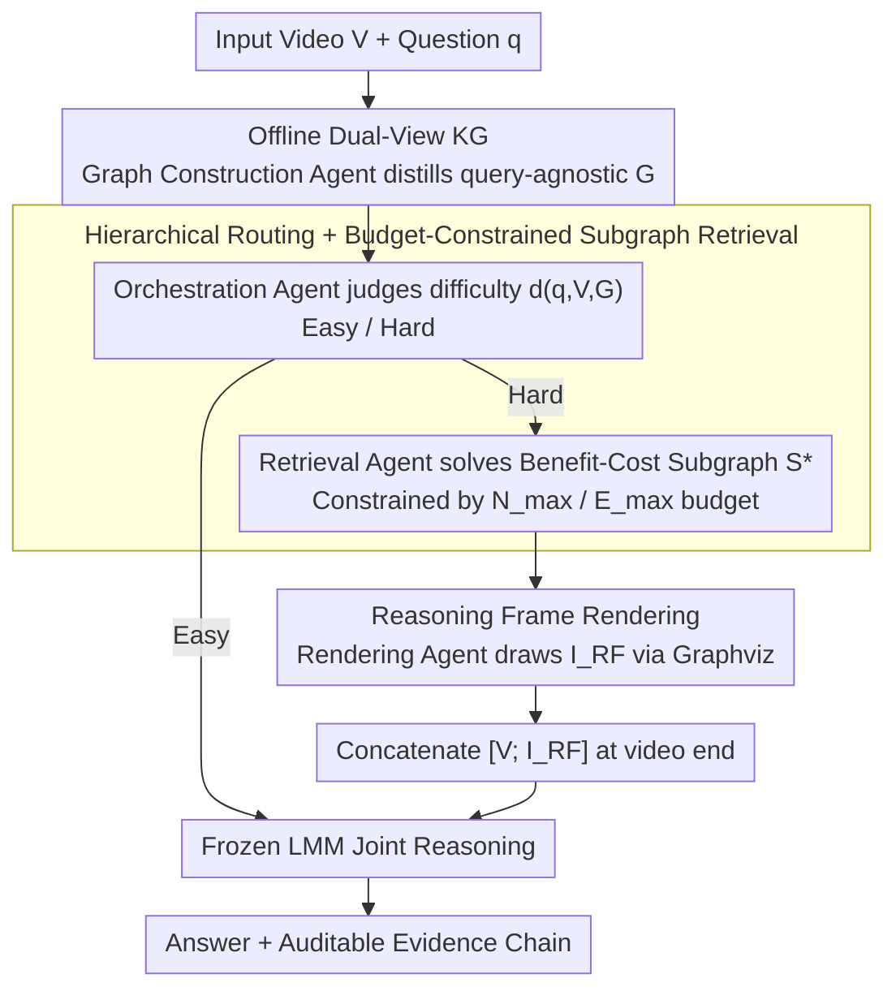

# Graph-to-Frame RAG: Visual-Space Knowledge Fusion for Training-Free and Auditable Video Reasoning

**Conference**: CVPR 2026  
**arXiv**: [2604.04372](https://arxiv.org/abs/2604.04372)  
**Code**: None  
**Area**: Multimodal VLM / Graph Learning  
**Keywords**: Video Retrieval-Augmented Generation, Knowledge Graph, Visual-Space Fusion, Multi-Agent Framework, Training-Free Video Reasoning

## TL;DR
This paper proposes the G2F-RAG paradigm, which renders retrieved structured knowledge into a single "reasoning frame" appended to the end of a video. This facilitates unified reasoning within the visual space of Large Multimodal Models (LMMs), avoiding attention dilution and cognitive load caused by text appending, achieving consistent training-free improvements across 8 video benchmarks.

## Background & Motivation

**Background**: Large Multimodal Models (LMMs) have made significant progress in video understanding. However, complex video reasoning still faces three major challenges: (1) multi-step compositional reasoning (cross-shot causality, navigation, etc.); (2) the need for external knowledge such as common sense and object utility; and (3) the requirement for small models to solve problems reliably and provide auditable evidence chains without additional training.

**Limitations of Prior Work**: Mainstream Video-RAG methods follow a "retrieve-and-append" paradigm: appending text (ASR/OCR/descriptions), retrieving candidate clips, or injecting structured graphs/event chains as text. These methods rely on an implicit assumption—that more relevant content plus longer context equals better reasoning. In practice, performance often degrades even with short videos: heterogeneous information sources share the same attention space, where continuous low-level visual signals compete with discrete high-level text for attention, leading to attention dilution and increased cognitive load.

**Key Challenge**: The issue lies not just in "what to retrieve," but more in "how to represent and fuse external knowledge." When semantics are misaligned and the load is unmanaged, retrieval harms model performance. Experiments confirm that Video-RAG scores 5.4 points lower than the baseline on MLVU, whereas G2F-RAG scores 4.6 points higher.

**Goal**: How to fuse external knowledge into video models in a modality-aligned manner to avoid cross-modal competition and context explosion? Sub-problems include: (1) offline construction of reusable video knowledge graphs; (2) online determination of whether external knowledge is needed; and (3) retrieval of the minimum sufficient subgraph and its rendering as a visual frame.

**Key Insight**: Video models are most powerful at aggregating and reasoning within the visual space. External knowledge should enter the same space through visual grammar. Research suggests the visual modality can serve as an efficient compression medium for textual information. Therefore, converting retrieved structured knowledge into visual tokens allows the model to operate in its most familiar spatio-temporal reasoning domain.

**Core Idea**: Render the retrieved knowledge subgraph as a single reasoning frame appended to the end of the video. This achieves knowledge fusion within the visual space and avoids cross-modal attention competition.

## Method

### Overall Architecture
G2F-RAG addresses the question: how to feed retrieved external knowledge to a video model without letting it compete for attention with the original visual signals? The solution is to draw the knowledge as a single frame and append it to the end of the video. The pipeline involves collaboration among four agents across offline and online stages. Offline, a Graph Construction Agent processes the video to generate a query-agnostic complete knowledge graph $\mathcal{G}$ (including entities, events, spatial relations, and external common sense), built once and reused for all queries. Online, an Orchestration Agent first determines the difficulty of the question—simple questions are answered directly by the LMM, while difficult ones proceed to RAG. A Retrieval Agent extracts the minimum sufficient subgraph $S^\star$ from $\mathcal{G}$, and a Rendering Agent paints $S^\star$ into a single reasoning frame $I_{\text{RF}}$. This is appended to the video to form $\tilde{V}=[V; I_{\text{RF}}]$, which is then fed to a frozen LMM for joint reasoning. No parameters are trained throughout the process.

### Key Designs

**1. Offline Dual-View Knowledge Graph: Build Once, Reuse Often**

Mainstream RAG performs temporary retrieval for each query, which is slow and hard to reuse. This work instead distills the entire video offline into a query-agnostic knowledge graph $\mathcal{G}$. The graph unifies two complementary views: the Event-Causal View records "what happened"—participants, actions, intentions, pre/post-conditions, and causal chains; the Scene-Functional View records "where and with what it happened"—objects and their affordances, functional areas and connectivity, and abstract conceptual knowledge. Dense cross-links bind these views, allowing reasoning to jump seamlessly between causal chains and spatial layouts. External web tools can supplement world knowledge if needed. This dual-view covers the two major requirements of complex video reasoning (cross-shot causality + spatial/functional commonsense), while the query-agnostic design ensures heavy processing is done only once.

**2. Hierarchical Routing + Budget-Constrained Minimum Subgraph Retrieval: Supplement knowledge only when necessary and sufficient**

Intuitively, "the more retrieval, the better" is flawed here—injecting knowledge for simple questions can decrease performance (disabling routing for VideoMME drops scores from 70.6% to 66.8%). Thus, an Orchestration Agent first judges difficulty $d(q,V,\mathcal{G}) \in \{\text{easy}, \text{hard}\}$ by comparing proxy utility gain $\Delta U = \hat{U}_{\text{G2F}} - \hat{U}_{\text{Base}}$ with a threshold $\tau$. Only when the gain from adding a reasoning frame exceeds $\tau$ is RAG triggered. For hard questions, the Retrieval Agent does not dump all related nodes but solves a benefit-minus-cost subgraph selection problem:

$$S^\star = \arg\max_{S \subseteq \mathcal{G}} \big[\,R(q,S) - \lambda\, C(S)\,\big], \quad \text{s.t.}\ |\mathcal{V}(S^\star)| \leq N_{\max},\ |\mathcal{E}(S^\star)| \leq E_{\max}$$

Where $R(q,S)$ represents relevance to question $q$, $C(S)$ represents subgraph complexity (converted to visual token cost), and $\lambda$ balances the two. Hard limits $N_{\max}/E_{\max}$ constrain the visual token budget. This filters out unnecessary interference for simple queries and ensures "minimal but sufficient" knowledge for hard ones.

**3. Reasoning Frame Rendering: Knowledge entry via visual grammar**

This step changes the delivery modality. The Rendering Agent uses Graphviz to draw subgraph $S^\star$ into a single reasoning frame $I_{\text{RF}}$ using minimalist visual grammar (icons + short labels) to outline key entities, relations, and causal flows. Temporal timestamps are not encoded; only structure and mechanisms are presented. Appending the frame at the end $[V; I_{\text{RF}}]$ preserves original temporal aggregation while allowing temporal attention to reach it. The prompt designates the video as the authority and the reasoning frame as auxiliary, ensuring performance remains stable even if erroneous frames are intentionally injected. Style ablation shows that "Minimal" outperforms "Text-Heavy," as the latter reintroduces context burden. This decoupling of "how to fuse" from "what to fuse" allows visual delivery to outperform text JSON (G2J-RAG) by 7.6 points on VideoMME.

### Main Results

| Model | Original VideoMME | +G2F-RAG | Original WildVideo | +G2F-RAG | Original MLVU | +G2F-RAG |
|------|-------------|----------|--------------|----------|---------|----------|
| InternVL3.5-4B | 65.4 | 70.1 (+4.7) | 45.2 | 47.1 (+1.9) | - | - |
| LLaVA-Video-7B | 63.7 | 64.5 (+0.8) | 53.4 | 57.0 (+3.6) | 69.5 | 75.5 |
| Qwen2.5-VL-7B | 65.1 | 70.6 (+5.5) | 51.3 | 55.4 (+4.1) | 68.8 | 73.4 |
| InternVL3.5-8B | 66.0 | 72.0 (+6.0) | 53.0 | 60.1 (+7.1) | - | - |

### Comparison with other RAG methods (Qwen2.5-VL-7B)

| Method | MLVU | WildVideo | VideoMME |
|------|------|-----------|---------|
| Baseline | 68.8 | 51.3 | 65.1 |
| +Video-RAG | 63.4 (-5.4) | 47.2 (-4.1) | 60.5 (-4.6) |
| +Vgent | 72.1 | 50.1 | 68.9 |
| **+G2F-RAG** | **73.4 (+4.6)** | **55.4 (+4.1)** | **70.6 (+5.5)** |

### Ablation Study (Qwen2.5-VL-7B)

| Dimension | Variant | MLVU | VideoMME |
|---------|------|------|---------|
| Representation | G2J-RAG (Text JSON) | 66.2 | 63.0 |
| | **G2F-RAG (Visual Frame)** | **73.4** | **70.6** |
| Frame Position | Mid-1 | 67.9 | 64.0 |
| | End-4 | 69.0 | 66.0 |
| | **End-1** | **73.4** | **70.6** |
| Routing | Off (Always RAG) | 69.9 | 66.8 |
| | **On + Fallback** | **73.4** | **70.6** |

### Key Findings
- **Visual Frame vs. Text JSON**: Given the same subgraph, visual frame delivery (G2F-RAG) outperforms text JSON (G2J-RAG) by 7.6 points on VideoMME, proving "how to fuse" is more critical than "what to fuse."
- **Negative Impact of Video-RAG**: Appending retrieved text consistently degrades performance across all benchmarks, indicating that heterogeneous information fusion is a primary source of error.
- **Greater Benefits for Small Models**: Models in the 4B/7B range see gains of 3-7 points, as visual space fusion sidesteps cross-modal competition and is orthogonal to model capacity.
- **Importance of Intent and Affordance**: Removing these fields drops MLVU from 73.4 to 70.2, showing they capture useful prerequisite information.
- **Robustness**: Performance hardly drops when adversarial reasoning frames are injected, as the prompt maintains the original video as the primary authority.

## Highlights & Insights
- The insight that "knowledge delivery method is more important than knowledge content" is profound—visual frames outperform text JSON by a large margin using the same data. This challenges the "retrieval quality is everything" assumption in the RAG field.
- The training-free design allows the method to be plug-and-play for any LMM backbone (InternVL, LLaVA-Video, Qwen-VL) with consistent gains across scales.
- Minimalist single-frame design is counter-intuitively more effective than multi-frame injection, highlighting that compressing information to its bare essentials works best.

## Limitations & Future Work
- Offline graph construction relies on GPT-4o, which is costly and depends on closed-source models.
- The accuracy of routing affects performance; misclassification can lead to RAG-induced drops on easy questions or failures on hard ones. Currently, prompt-based routing lacks robustness guarantees.
- Graphviz rendering may lack readability for extremely complex subgraphs.
- The method hasn't been validated on ultra-long videos (>1 hour), where subgraph retrieval accuracy might become a bottleneck.

## Related Work & Insights
- **vs. Video-RAG**: Video-RAG appends text and consistently reduces performance; G2F-RAG improves it through visual-space fusion.
- **vs. Vgent**: While Vgent uses structured retrieval to mitigate overload, it still appends text. G2F-RAG's visual conversion yields better results (57.0 vs. 51.6 on WildVideo).
- **vs. Traditional KG-RAG**: Traditional methods inject text-based subgraphs. This work is the first to visualize the graph as a video frame, leveraging the visual processing strengths of LMMs.

## Rating
- Novelty: ⭐⭐⭐⭐⭐ First to fuse retrieved knowledge as visual frames for video reasoning.
- Experimental Thoroughness: ⭐⭐⭐⭐⭐ Comprehensive benchmarks, backbones, and detailed ablations.
- Writing Quality: ⭐⭐⭐⭐⭐ Precise analysis of attention mechanisms and clear logic.
- Value: ⭐⭐⭐⭐⭐ Proposes a new RAG paradigm with broad implications for multimodal reasoning.

<!-- RELATED:START -->

## Related Papers

- [\[CVPR 2025\] Knowledge Bridger: Towards Training-Free Missing Modality Completion](../../CVPR2025/graph_learning/knowledge_bridger_towards_training-free_missing_modality_completion.md)
- [\[CVPR 2025\] Unbiased Video Scene Graph Generation via Visual and Semantic Dual Debiasing](../../CVPR2025/graph_learning/unbiased_video_scene_graph_generation_via_visual_and_semantic_dual_debiasing.md)
- [\[CVPR 2026\] M3KG-RAG: Multi-hop Multimodal Knowledge Graph-enhanced Retrieval-Augmented Generation](m3kg_rag_multi_hop_multimodal_knowledge_graph_enhanced_retrieval_augmented_genera.md)
- [\[AAAI 2026\] Human Cognition Inspired RAG with Knowledge Graph for Complex Problem Solving](../../AAAI2026/graph_learning/human_cognition_inspired_rag_with_knowledge_graph_for_complex_problem_solving.md)
- [\[NeurIPS 2025\] DuetGraph: Coarse-to-Fine Knowledge Graph Reasoning with Dual-Pathway Global-Local Fusion](../../NeurIPS2025/graph_learning/duetgraph_coarse-to-fine_knowledge_graph_reasoning_with_dual-pathway_global-loca.md)

<!-- RELATED:END -->
