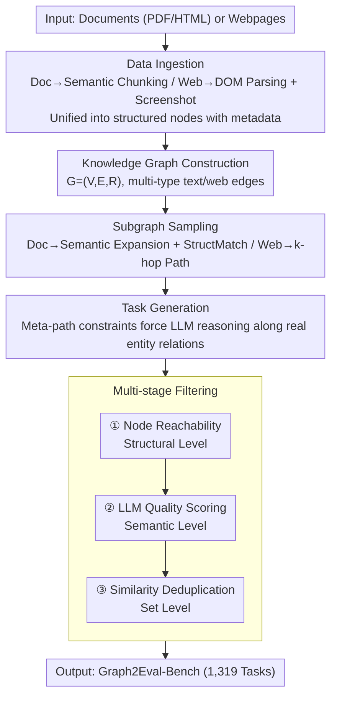

# Graph2Eval: Automatic Multimodal Task Generation for Agents via Knowledge Graphs

**Conference**: CVPR 2026  
**arXiv**: [2510.00507](https://arxiv.org/abs/2510.00507)  
**Code**: [github.com/YurunChen/Graph2Eval](https://github.com/YurunChen/Graph2Eval)  
**Area**: Human-AI Understanding / Agent Evaluation  
**Keywords**: Knowledge Graph, Automatic Task Generation, Agent Evaluation, Document Understanding, Web Understanding, Benchmark Construction

## TL;DR
This paper introduces Graph2Eval, a knowledge-graph-driven framework for the automatic generation of agent evaluation tasks. By constructing structured knowledge graphs from documents/webpages, performing subgraph sampling, LLM conditional generation, and multi-stage filtering, it automatically produces multimodal agent tasks with significantly improved semantic consistency (+20%) and solvability (+17%), resulting in the Graph2Eval-Bench containing 1,319 tasks.

## Background & Motivation
The evaluation of multimodal agents (document understanding agents, web browsing agents) relies heavily on manually annotated static benchmarks, which suffer from three major drawbacks:

**Scale Bottleneck**: Manual task construction is costly and slow, failing to keep pace with the rapid iteration of agent capabilities.

**Insufficient Coverage**: Static benchmarks cover limited task types and difficulty levels, making them prone to "leaderboard gaming" and overfitting.

**Poor Timeliness**: Real-world documents and webpages are constantly updated; the ground truth of fixed benchmarks can quickly become obsolete.

**Limitations of Prior Work**:
- **Pure LLM Synthesis** (Self-Instruct, Evol-Instruct): Directly prompting LLMs to generate QA pairs from text snippets lacks explicit modeling of entity relationships. This often leads to questions referencing non-existent entity combinations (**semantic inconsistency**) or requiring information across unreachable paths (**unsolvability**).
- **Template Filling**: Methods based on predefined templates generate tasks with fixed formats and poor diversity.
- **Random Sampling**: Randomly extracting snippets for QA generation lacks structural awareness, often producing trivial or unreasonable tasks.

**Core Idea**: Utilize a knowledge graph as an intermediate structured representation. First, extract entities and relations from documents/webpages to build a KG $G=(V, E, R)$. Then, obtain semantically coherent context through subgraph sampling. Finally, constrain the LLM to generate tasks based on the subgraph. The KG structure ensures the reachability of entity relations (solvability) and semantic integrity (consistency).

## Core Problem
How to automatically generate diverse, solvable, and semantically consistent multimodal agent evaluation tasks? Key challenges include: (1) extracting structured knowledge from heterogeneous documents/webpages; (2) sampling subgraphs suitable as task material; (3) ensuring task quality (avoiding hallucinations and ensuring completion).

## Method

### Overall Architecture
Graph2Eval addresses the automated mass production of reliable multimodal agent evaluation tasks without human intervention. The process converts a document/webpage into a knowledge graph, "crops" coherent subgraphs as material, and directs the LLM to write tasks along existing entity relations, followed by a three-stage filter. The framework relies on "graph structure" instead of LLM free-form generation to suppress hallucinations and unsolvability at the source. The pipeline consists of five steps: data ingestion and structural chunking, KG construction $G=(V, E, R)$, subgraph sampling, conditional task generation, and multi-stage filtering.

### Key Designs

**1. Data Ingestion: Unifying Heterogeneous Data into Graphable Nodes**

Documents and webpages differ in structure. For documents, the system performs semantic chunking (paragraphs, headings, tables, captions) and calculates embeddings while preserving metadata (page numbers, hierarchy). For webpages, it parses the DOM tree to extract interactive elements (forms, buttons, links) along with screenshots. Both pipelines converge into a unified representation of "structured nodes with metadata."

**2. Knowledge Graph Construction: Capturing Multi-granular Semantic Connections**

The graph $G=(V, E, R)$ defines nodes $V$ (paragraph, heading, hyperlink, etc.). Edges are categorized by modality: text edges include sequential relations (order), semantic relations (embedding similarity), and reference relations (citations/hyperlinks); web edges include navigation (links), interaction (button $\leftrightarrow$ form), and layout (DOM hierarchy). These multi-type edges encode different semantic granularities to support varying task difficulties.

**3. Subgraph Sampling: Modality-Specific Semantic and Path Expansion**

To extract task material, the document mode uses cosine similarity plus StructMatch. Starting from a seed node, it expands via embedding similarity while utilizing StructMatch to evaluate structural diversity (the ratio of different node/edge types). The web mode uses seed-driven $k$-hop expansion, moving from an interactive element along navigation/interaction edges ($k=2-3$) to capture the operational path an agent must follow.

**4. Task Generation: Anchoring Reasoning via Meta-paths**

The sampled subgraph is serialized into a structured prompt. Meta-paths (e.g., `heading → paragraph → table_cell`) are introduced to guide the LLM. The LLM must generate complex QA requiring multi-step reasoning along these paths. This ensures every reasoning step corresponds to a real entity relationship in the KG, preventing hallucinations regarding non-existent entities or unreachable paths.

**5. Multi-stage Filtering: Structural, Semantic, and Set-level Verification**

The pipeline employs a three-tier filter. Stage 1 (Structural): Verifies if all entities in the answer are reachable from the task starting point in the KG. Stage 2 (Semantic): An LLM scores tasks (1–5) based on clarity, difficulty, and correctness; scores below 3 are discarded. Stage 3 (Set-level): Embedding similarity is used to deduplicate highly similar tasks, retaining only the highest quality one to ensure diversity.

### Mechanism Example
Consider a PDF paper with an "Experimental Setup" section and a results table. Ingestion chunks it into "4. Experiments" (heading), descriptive paragraphs, and table cells. Building the KG connects these via sequential and semantic edges, forming the path `heading → paragraph → table_cell`. Sampling extracts this chain. The LLM then generates: "Based on the experimental setup description, find the accuracy when batch size = 64." Structural checks confirm the result cell is reachable from the heading, and quality scoring ensures validity.

### Loss & Training
- **No Training Required**: Graph2Eval is a pure inference-time pipeline.
- KG construction utilizes off-the-shelf embedding models (e.g., `text-embedding-3-small`).
- Task generation and scoring are performed by GPT-4o and GPT-4-turbo, respectively.
- Generation time averages 34.87s per document task and 95.51s per web task.

## Key Experimental Results

### Graph2Eval-Bench Statistics

| Category | Count | Avg. Steps | Node Types Involved |
|------|------|-----------|-------------|
| Document Tasks | 1002 | 2.8 | paragraph, table, heading, image |
| Web Tasks | 317 | 4.2 | form, button, link, dropdown |
| **Total** | **1319** | 3.1 | — |

### Comparison of Task Generation Methods

| Method | Semantic Consistency ↑ | Solvability ↑ | Diversity ↑ | Hallucination Rate ↓ |
|------|-------------|---------|---------|---------|
| Self-Instruct | 0.62 | 0.58 | 0.71 | 18.3% |
| Evol-Instruct | 0.67 | 0.63 | 0.68 | 15.1% |
| Template-based | 0.78 | 0.82 | 0.41 | 5.2% |
| **Ours** | **0.84** | **0.80** | **0.76** | **4.7%** |

Ours shows a +20% gain in semantic consistency and +17% gain in solvability compared to Evol-Instruct.

### Agent Performance on Graph2Eval-Bench

| Agent | Doc Task Acc | Web Task Success | Overall |
|-------|--------------|--------------|------|
| GPT-4o | 61.3% | 42.7% | 56.8% |
| Claude-3.5 | 58.9% | 39.2% | 54.1% |
| Gemini-1.5 | 55.2% | 36.8% | 50.5% |
| Open-source best | 41.7% | 28.3% | 38.4% |

The benchmark provides high discriminative power; even GPT-4o scores only 56.8%.

### Key Findings
- **KG Structure is Core**: Removing the KG and using raw text blocks causes semantic consistency to drop by 22% and solvability by 19%.
- **Meta-path Effectiveness**: Tasks using meta-paths average more reasoning steps (3.4 vs 2.1) and higher accuracy (+8%).
- **Filtering is Essential**: Without filtering, ~31% of tasks are problematic; the three-tier system reduces this to 4.7%.
- **Web Tasks are Harder**: Agent performance on web tasks is 15-20% lower than on document tasks, indicating multi-step interaction is a major bottleneck.

## Highlights & Insights
- Using the **KG as a "Skeleton for Task Generation"** is an ingenious design, transforming unstructured problems into graph connectivity problems.
- The unified framework for document and web modes demonstrates high generalizability across modalities.
- The multi-stage filter is both practical and efficient, using structural checks to prune candidates before applying expensive LLM scoring.

## Limitations & Future Work
- KG quality relies on embedding models; specialized domains (medical, legal) may require domain-specific embeddings.
- Data imbalance persists between web tasks (317) and document tasks (1,002).
- Reliance on GPT-4 level LLMs for generation/scoring introduces cost and model bias.
- Dynamic webpages are not yet considered; generated tasks may become obsolete as sites update.
- Solvability checks only verify structural reachability, not environmental constraints (e.g., JS-blocked controls).

## Related Work & Insights
- Complements manual benchmarks like OSWorld/WebArena by providing rapid, automated task generation for new sites.
- Compared to DocBench, Graph2Eval's KG approach generates more sophisticated cross-paragraph reasoning tasks.
- The KG-driven QA approach is applicable to RAG evaluation for generating multi-hop reasoning questions.

## Rating
- Novelty: ⭐⭐⭐⭐
- Experimental Thoroughness: ⭐⭐⭐⭐
- Writing Quality: ⭐⭐⭐⭐
- Value: ⭐⭐⭐⭐⭐

<!-- RELATED:START -->

## Related Papers

- [\[CVPR 2026\] M3KG-RAG: Multi-hop Multimodal Knowledge Graph-enhanced Retrieval-Augmented Generation](m3kg_rag_multi_hop_multimodal_knowledge_graph_enhanced_retrieval_augmented_genera.md)
- [\[ACL 2026\] MegaRAG: Multimodal Knowledge Graph-Based Retrieval Augmented Generation](../../ACL2026/graph_learning/megarag_multimodal_knowledge_graph-based_retrieval_augmented_generation.md)
- [\[ACL 2025\] Can LLMs Evaluate Complex Attribution in QA? Automatic Benchmarking using Knowledge Graphs](../../ACL2025/graph_learning/paper_2401_14640.md)
- [\[CVPR 2026\] Mario: Multimodal Graph Reasoning with Large Language Models](mario_multimodal_graph_reasoning_with_large_language_models.md)
- [\[ACL 2026\] STEM: Structure-Tracing Evidence Mining for Knowledge Graphs-Driven Retrieval-Augmented Generation](../../ACL2026/graph_learning/stem_structure-tracing_evidence_mining_for_knowledge_graphs-driven_retrieval-aug.md)

<!-- RELATED:END -->
