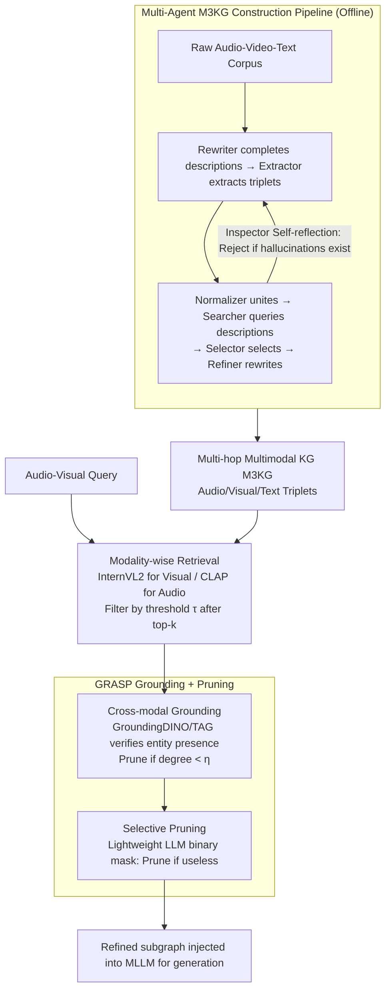

# M3KG-RAG: Multi-hop Multimodal Knowledge Graph-enhanced Retrieval-Augmented Generation

**Conference**: CVPR 2026  
**arXiv**: [2512.20136](https://arxiv.org/abs/2512.20136)  
**Code**: [Project Page](https://kuai-lab.github.io/cvpr2026m3kgrag/)  
**Area**: Graph Learning  
**Keywords**: Multimodal Knowledge Graph, Retrieval-Augmented Generation, Audio-Visual Reasoning, Graph Pruning, Multi-hop Reasoning

## TL;DR

M3KG-RAG is proposed, which constructs a Multi-hop Multimodal Knowledge Graph (M3KG) via a lightweight multi-agent pipeline and designs the GRASP mechanism for entity grounding and selective pruning. It retains only query-relevant and answer-assisting knowledge, significantly enhancing the audio-visual reasoning capabilities of MLLMs.

## Background & Motivation

Current multimodal RAG faces two major bottlenecks: 1) Existing MMKGs primarily cover image-text modalities with limited audio-visual coverage and mostly consist of single-hop graphs, lacking multi-hop connections for temporal/causal dependencies. 2) Similarity-based retrieval in shared embedding spaces suffers from modality gaps and cannot filter out off-topic or redundant knowledge, potentially injecting noise even when relevant context is retrieved.

The core innovations of M3KG-RAG include: constructing a multi-hop KG across audio-visual modalities + modality-wise retrieval to bypass modality gaps + GRASP to precisely preserve subgraphs useful for answering.

## Method

### Overall Architecture

M3KG-RAG aims to enable MLLMs to utilize structured external knowledge for audio-visual questioning without being distracted by irrelevant information. It first compresses original audio-video-text corpora into a **multi-hop, cross-modal knowledge graph M3KG** (triplets with temporal/causal connections between audio, visual, and textual entities) offline using a multi-agent pipeline. During online inference, it performs **modality-wise retrieval** for a given query to find candidate subgraphs (circumventing cross-modal embedding gaps). Then, **GRASP** is employed to "ground and prune" the candidate triplets, retaining only those relevant to the query and helpful for the answer. This refined subgraph is finally fed into the MLLM to generate the answer. The three designs address "how to build the graph," "how to find subgraphs," and "how to remove noise."

### Key Designs

**1. Multi-agent M3KG Construction Pipeline: Distilling Corpora into Multi-hop Cross-modal Graphs via Lightweight LLMs**

Most existing MMKGs cover only image-text and are single-hop, lacking temporal/causal links between audio and visual modalities. M3KG-RAG decomposes graph construction into a sequence of specialized agents: the Rewriter completes raw captions into information-rich descriptions; the Extractor extracts `(subject, relation, object)` triplets; the Normalizer unifies entity names referring to the same object; the Searcher retrieves authoritative descriptions from knowledge bases; the Selector chooses the best description for the current context; and the Refiner rewrites the description to match the original corpus style. This pipeline can be executed with lightweight LLMs like Qwen3-8B on a single H100. Crucially, an Inspector is used for a **self-reflection loop**: it checks if generated descriptions align with original content and rejects hallucinations, ensuring graph quality despite using smaller models.

**2. Modality-Wise Retrieval: Avoiding Modality Gaps by Separating Retrieval Spaces**

Directly projecting all modalities into a shared embedding space often fails due to the modality gap—video queries frequently fail to match textual knowledge. This method replaces it with **modality-wise retrieval**: video queries use InternVL2 to find nearest neighbors among visual items in the graph, while audio queries use CLAP for audio items. After retrieving top-$k$ neighbors in FAISS, items are filtered by a distance threshold $\tau$. Once a specific modality node is hit, the system "lifts" it to the triplet level through graph connections to obtain candidate subgraphs. This ensures similarity comparisons occur within the same modality, avoiding cross-modal distortion.

**3. GRASP (Grounded Retrieval And Selective Pruning): Entity Grounding Following by Utility-based Pruning**

Similarity retrieval only captures "roughly relevant" semantics; retrieved triplets often contain off-topic or redundant knowledge. GRASP tightens the candidate set with two-step fine-grained filtering. First is **cross-modal grounding**: for visual triplets, GroundingDINO provides detection confidence for entities across sampled video frames, using the max value across frames as the visual presence degree. Triplets with a total presence degree (subject + object) below threshold $\eta_v$ are pruned. For audio triplets, a TAG model converts triplets to sentences to score their presence in the query audio, pruning those below $\eta_a$. Grounding ensures the "knowledge actually exists in the audio-visual content." Second is **selective pruning**: surviving triplets and the query are given to a lightweight LLM to output a binary mask, judging whether each triplet is useful for answering. This multi-layered approach ensures the final evidence is relevant, present, and useful.

### An End-to-End Example

Consider the query: "What is the animal barking in the video, and what sound is it making?"

1.  **Modality-Wise Retrieval**: Video frames hit the visual node "dog" via InternVL2; the audio track hits the "barking" node via CLAP. Graph traversal retrieves ~20 candidate triplets (including `(dog, emits, bark)`, `(dog, is a, mammal)`, and off-topic ones like `(car, in, background)`).
2.  **GRASP Grounding**: GroundingDINO detects entities—the "dog" has high confidence ($\geq \eta_v$), while "pedestrian" (not clearly present) falls below the threshold and is removed. The TAG model confirms the presence of "barking," filtering out "engine noise." Candidates are reduced to ~8.
3.  **GRASP Pruning**: A lightweight LLM applies binary masks, keeping `(dog, emits, bark)` and `(barking, is a, animal sound)` as direct support, while pruning `(dog, is a, mammal)` as redundant for this specific question. 3 triplets remains.
4.  **Graph-Enhanced Generation**: These 3 triplets are injected into the MLLM prompt, enabling the model to accurately answer "It is a dog, and it is barking."

### Loss & Training

This is a training-free pipeline. M3KG is constructed offline for evaluation benchmarks, requiring only a single H100 GPU. Online inference involves only retrieval, grounding, pruning, and generation without weight updates. Only the distance threshold $\tau$ and grounding threshold $\eta$ require per-dataset tuning.

## Key Experimental Results

### Main Results (Model-as-Judge Scoring)

| MLLM | Method | Audio QA | Video QA | AV QA |
|------|------|----------|----------|-------|
| Qwen2.5-Omni | None | 49.00 | 42.21 | 32.42 |
| Qwen2.5-Omni | VAT-KG | 51.30 | 43.50 | 35.44 |
| Qwen2.5-Omni | M3KG-RAG | 60.77 | 44.35 | 44.67 |

### Win-rate Comparison (vs. VAT-KG)

| Benchmark | VAT-KG Win-rate | M3KG-RAG Win-rate |
|------|-----------|-------------|
| AudioCaps-QA | 25.6% | 74.4% |
| VCGPT | 47.6% | 52.4% |
| VALOR | 41.8% | 58.2% |

### Key Findings

- Text-only KG with simple RAG often leads to performance degradation (e.g., Wikidata performed worse than no retrieval in several settings).
- Single-hop MMKGs (like VAT-KG) provide limited improvement; multi-hop structures are critical.
- Even GPT-4o benefits from M3KG-RAG, indicating external knowledge remains valuable for large-scale models.
- Each component of GRASP (grounding and pruning) contributes to the overall gain.

## Highlights & Insights

- An end-to-end multimodal KG construction and retrieval framework covering audio, visual, and text.
- The "grounding → pruning" two-step filtering in GRASP is intuitive and effective.
- High-quality knowledge graphs can be built using only lightweight Qwen3-8B models, keeping costs manageable.

## Limitations & Future Work

- Thresholds $\tau$ (retrieval) and $\eta$ (grounding) require manual tuning per dataset.
- KG construction depends on the training set; generalization to new domains requires rebuilding.
- Grounding models (GroundingDINO/TAG) may introduce their own errors.
- Currently only evaluated on open-ended QA, not covering other multimodal tasks.

## Related Work & Insights

- **vs. VAT-KG**: Uses a single-hop conceptual graph and simple retrieval; M3KG-RAG employs multi-hop graphs and precise GRASP filtering.
- **vs. GraphRAG/LightRAG**: These are text-only GraphRAG systems; M3KG-RAG extends the paradigm to audio-visual modalities.

## Rating

- Novelty: ⭐⭐⭐⭐ Combination of multi-hop multimodal KG and GRASP is innovative.
- Experimental Thoroughness: ⭐⭐⭐⭐ Three benchmarks, multiple MLLMs, and dual evaluation (win-rate and MJ).
- Writing Quality: ⭐⭐⭐⭐ Clear framework diagrams and detailed pipeline descriptions.
- Value: ⭐⭐⭐⭐ Provides a practical knowledge graph enhancement solution for multimodal RAG.

<!-- RELATED:START -->

## Related Papers

- [\[ACL 2026\] MegaRAG: Multimodal Knowledge Graph-Based Retrieval Augmented Generation](../../ACL2026/graph_learning/megarag_multimodal_knowledge_graph-based_retrieval_augmented_generation.md)
- [\[NeurIPS 2025\] GFM-RAG: Graph Foundation Model for Retrieval Augmented Generation](../../NeurIPS2025/graph_learning/gfm-rag_graph_foundation_model_for_retrieval_augmented_generation.md)
- [\[CVPR 2026\] Graph2Eval: Automatic Multimodal Task Generation for Agents via Knowledge Graphs](graph2eval_automatic_multimodal_task_generation_for_agents_via_knowledge_graphs.md)
- [\[ACL 2026\] STEM: Structure-Tracing Evidence Mining for Knowledge Graphs-Driven Retrieval-Augmented Generation](../../ACL2026/graph_learning/stem_structure-tracing_evidence_mining_for_knowledge_graphs-driven_retrieval-aug.md)
- [\[ACL 2026\] LegalGraphRAG: Multi-Agent Graph Retrieval-Augmented Generation for Reliable Legal Reasoning](../../ACL2026/graph_learning/legalgraphrag_multi-agent_graph_retrieval-augmented_generation_for_reliable_lega.md)

<!-- RELATED:END -->
